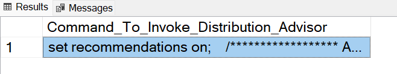
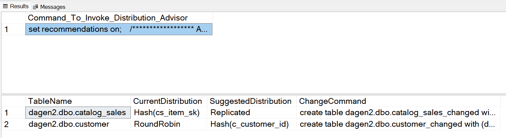

# Distribution Advisor in Azure Synapse SQL

In Azure Synapse SQL, each table is distributed using the strategy chosen by the customer (Round Robin, Hash Distributed, Replicated). Chosen distribution strategy affects query performance substantially.

Distribution Advisor (DA)  in Synapse SQL analyzes customer queries and recommends the best distribution strategies for tables to improve query performance. Queries to be considered by the advisor can be provided by the customer or pulled from historic queries available in DMV. 


## Prerequisites

- Run the following to ensure that you are on version 10.0.15669 or higher.
```sql 
SELECT @@version 
``` 
- Ensure that statistics are available and up-to-date before running the advisor. For more details, [Manage table statistics](develop-tables-statistics.md), [CREATE STATISTICS](/sql/t-sql/statements/create-statistics-transact-sql?view=azure-sqldw-latest&preserve-view=true), and [UPDATE STATISTICS](/sql/t-sql/statements/update-statistics-transact-sql?view=azure-sqldw-latest&preserve-view=true) articles for more details on statistics.

## Create Distribution Advisor Stored Procedures

To run the advisor easily, please run [this script](https://github.com/microsoft/Azure_Synapse_Toolbox/blob/master/DistributionAdvisor/CreateDistributionAdvisor_T62.sql) to create two stored procedures:

| Command                       | Description                                                                                           |
|-------------------------------|-------------------------------------------------------------------------------------------------------|
| dbo.write_dist_recommendation | Defines queries that DA will analyze on. A maximum of 100 queries can come from user selection or from past workloads in [sys.dm_pdw_exec_requests](https://docs.microsoft.com/en-us/sql/relational-databases/system-dynamic-management-views/sys-dm-pdw-exec-requests-transact-sql). |   
| dbo.read_dist_recommendation  | Runs the advisor and generates recommendations.                                                       |  

## Run the advisor on past workload in DMV

Run the following commands: 
```sql
EXEC dbo.write_dist_recommendation <Number of Queries max 100>, NULL
go
EXEC dbo.read_dist_recommendation;
go
```

- To see which queries were analyzed by DA, run [this script](https://github.com/microsoft/Azure_Synapse_Toolbox/blob/master/DistributionAdvisor/e2e_queries_used_for_recommendations.sql).

## Run the advisor on selected queries

Run the following command after placing queries of interest in single quotes: 
```sql
EXEC dbo.write_dist_recommendation 0, 'select count (*) from t1; select * from t1 join t2 on t1.a1 = t2.a1;'
go
EXEC dbo.read_dist_recommendation;
go
```
The first parameter in dbo.write_dist_recommendation should be set to 0 and the second parameter is a semi-colon separated list of up to 100 queries that DA will analyze.

## View recommendations

dbo.read_dist_recommendation will return recommendations in the following format when execution is completed:

| **Column name** |	**Description** |
|--------------- | --------------- |
|Table_name	|	The table that DA analyzed. One line per table regardless of change in recommendation.|
|Current_Distribution	|	Current table distribution strategy.|
|Recommended_Distribution	|	Recommended distribution. This can be the same as Current_Distribution if there is no change recommended.|
|Distribution_Change_Command	|	CTAS command to implement the recommendation.|

## Implement the advice

- Run the CTAS command provided by Distribution Advisor to create new tables with the recommended distribution strategy.
- Modify queries to run on new tables.
- Execute queries on old and new tables to compare for performance improvements.

## Troubleshooting

### Stale state from a previous run of the advisor

##### Symptom:

You see this error message upon running the advisor.


#####Mitigation:

- Verify that you are using single quotes '' to run the advisor on select queries.
- Start a new session in SSMS and run the advisor.

###Errors during running the advisor
	
##### Symptom:
	
The ‘result’ pane shows CommandToInvokeAdvisorString below but does not show the RecommendationOutput below.

You see this: 
 

	
But not this:  


	
##### Mitigation:

Check the output of CommandToInvokeAdvisorString above. Remove queries that may not be valid anymore which may have been added here from either the hand-selected queries or from the DMV by editing where clause here:  [Queries Considered by DA](https://github.com/microsoft/Azure_Synapse_Toolbox/blob/master/DistributionAdvisor/e2e_queries_used_for_recommendations.sql)

### Error during post-processing of recommendation output
	
##### Symptom:

You see the following error message.


	
##### Mitigation:
Ensure that you have the most up to date version of the stored procedure


## Next steps
If you need information not provided in this article, search the [Microsoft Q&A question page for Azure Synapse](/answers/topics/azure-synapse-analytics.html) is a place for you to pose questions to other users and to the Azure Synapse Analytics Product Group.  

We actively monitor this forum to ensure that your questions are answered either by another user or one of us.  If you prefer to ask your questions on Stack Overflow, we also have an [Azure Synapse Analytics Stack Overflow Forum](https://stackoverflow.com/questions/tagged/azure-synapse).

For feature requests, use the [Azure Synapse Analytics Feedback](https://feedback.azure.com/forums/307516-sql-data-warehouse) page.  Adding your requests or up-voting other requests helps us to focus on the most in-demand features.

