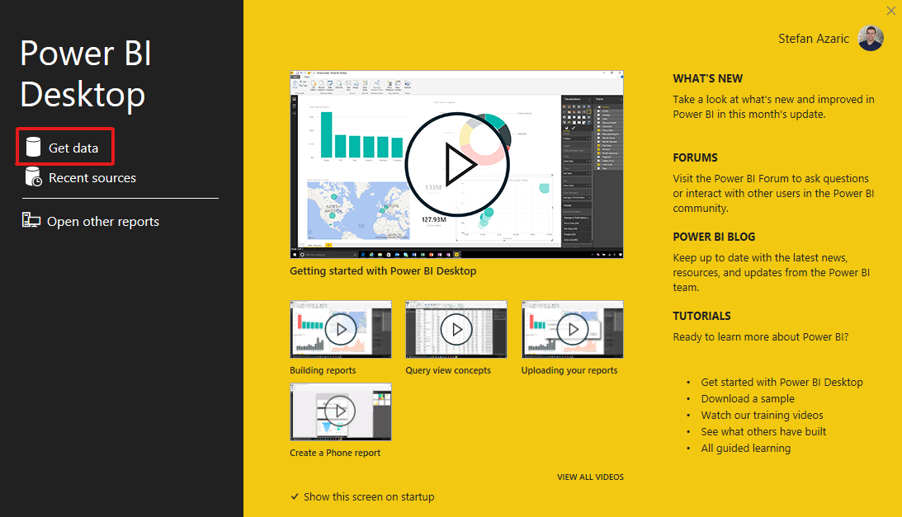
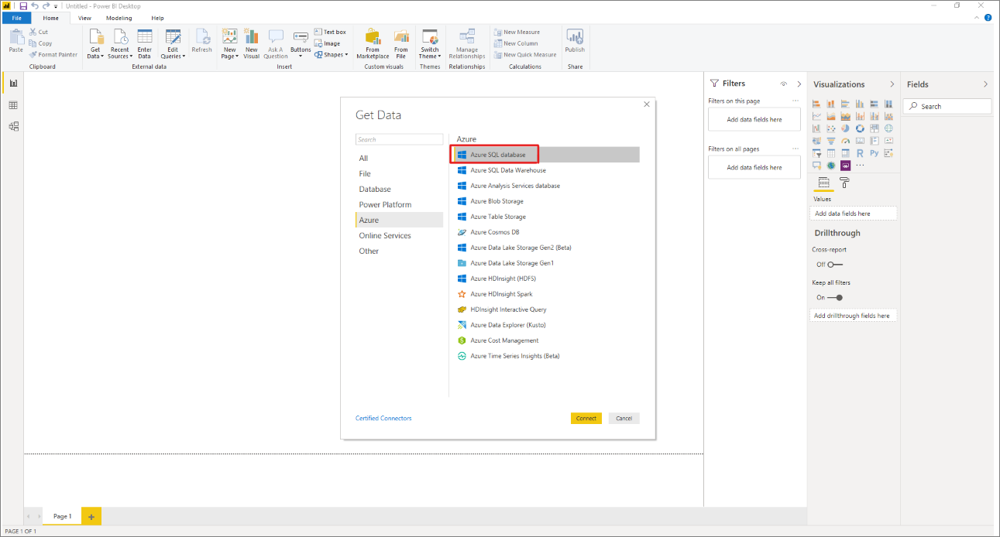
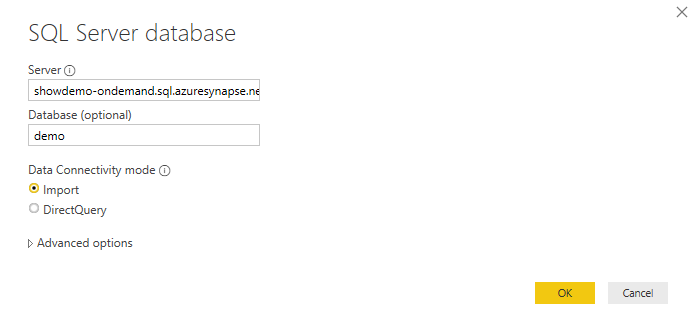

# Connect to serverless SQL pool with Power BI Professional

> [!div class="op_single_selector"]
>
> - [Azure Data Studio](get-started-azure-data-studio.md)
> - [Power BI](get-started-power-bi-professional.md)
> - [Visual Studio](../sql/get-started-visual-studio.md)
> - [sqlcmd](../sql/get-started-connect-sqlcmd.md)
> - [SSMS](get-started-ssms.md)

In this tutorial, we will go through the steps for connecting Power BI desktop to serverless SQL pool.

## Prerequisites

You need the following tools to issue queries:

- SQL client of your choice:

  - Azure Data Studio
  - SQL Server Management Studio

- Power BI desktop installed

Parameters:

| Parameter                                 | Description                                                   |
| ----------------------------------------- | ------------------------------------------------------------- |
| Serverless SQL pool service endpoint address    | Will be used as server name                                   |
| Serverless SQL pool service endpoint region     | Will be used to determine what storage will we use in samples |
| Username and password for endpoint access | Will be used to access endpoint                               |
| Database you'll use to create views       | This database will be used as starting point in samples       |

## First-time setup

There are two steps prior to using samples:

1. Create database for your views
2. Create credentials to be used by serverless SQL pool to access files in storage

### Create database

For this getting started article, you should create your own database to utilize as a demo. A database is needed for views creation. You'll use this database in some of the sample queries within this documentation.

> [!NOTE]
> Databases are used only for viewing metadata, not for actual data.
>
> Write down the database name you're using, you'll need it later on.

```sql
DROP DATABASE IF EXISTS demo;
```

### Create credentials

We need to create credentials before you can run queries. This credential will be used by serverless SQL pool service to access files in storage.

> [!NOTE]
> You need to create credentials for storage account access. Although serverless SQL pool can access storage from different regions, having storage and Azure Synapse workspace in the same region will provide a better performance experience.

**Code snippet on how to create credentials for Census data containers**, run:

```sql
IF EXISTS (SELECT * FROM sys.credentials WHERE name = 'https://azureopendatastorage.blob.core.windows.net/censusdatacontainer')
DROP CREDENTIAL [https://azureopendatastorage.blob.core.windows.net/censusdatacontainer];
GO

-- Create credentials for Census Data container which resides in a azure open data storage account
-- There is no secret. We are using public storage account which doesn't need secret
CREATE CREDENTIAL [https://azureopendatastorage.blob.core.windows.net/censusdatacontainer]  
WITH IDENTITY='SHARED ACCESS SIGNATURE',  
SECRET = '';
GO
```

## Create a Power BI desktop report

Open the Power BI desktop application and select the **Get data** option.



### Step 1: Select data source

Select **Azure** in the menu and then **Azure SQL Database**.


### Step 2: Select database

Write the URL for the database and the name of the database where the view resides.


## Next steps

Advance to [Query storage files](get-started-azure-data-studio.md) to learn how to connect to serverless SQL pool using Azure Data Studio.