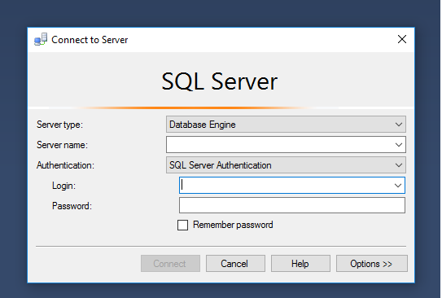
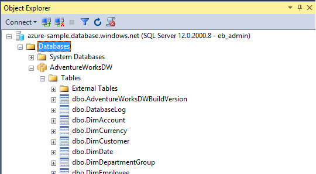
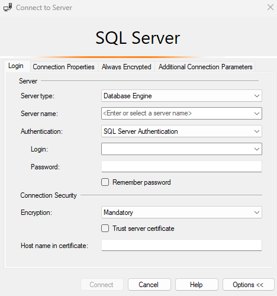
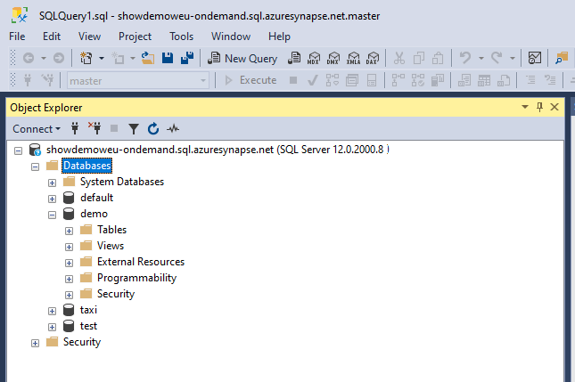
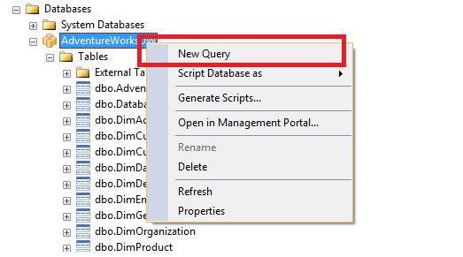
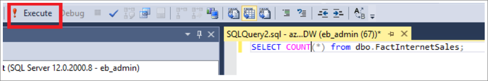
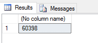
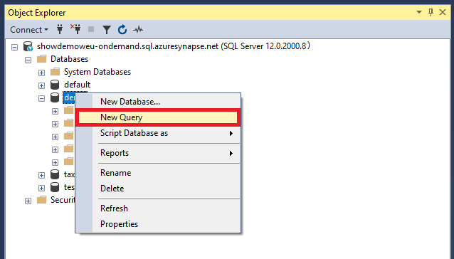
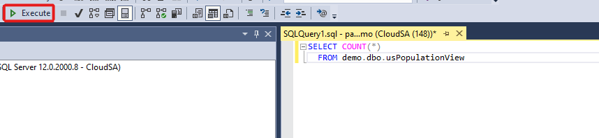
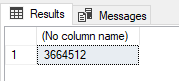

# Connect to Synapse SQL with SQL Server Management Studio (SSMS)
> [!div class="op_single_selector"]
> * [Azure Data Studio](get-started-azure-data-studio.md)
> * [Power BI](get-started-power-bi-professional.md)
> * [Visual Studio](../sql-data-warehouse/sql-data-warehouse-query-visual-studio.md?toc=/azure/synapse-analytics/toc.json&bc=/azure/synapse-analytics/breadcrumb/toc.json)
> * [sqlcmd](../sql/get-started-connect-sqlcmd.md)
> * [SSMS](get-started-ssms.md)
> 
> 

You can use [SQL Server Management Studio (SSMS)](/sql/ssms/download-sql-server-management-studio-ssms) to connect to and query Synapse SQL in Azure Synapse Analytics through either SQL on-demand (preview) or SQL pool resources. 

### Supported tools for SQL on-demand (preview)

[Azure Data Studio](/sql/azure-data-studio/download-azure-data-studio) is fully supported starting from version 1.18.0. SSMS is partially supported starting from version 18.5, you can use it to connect and query only.

> [!NOTE]
> If AAD login has connection open for more than 1 hour at time of query execution, any query that relies on AAD will fail. This includes querying storage using AAD pass-through and statements that interact with AAD (like CREATE EXTERNAL PROVIDER). This affects every tool that keeps connection open, like in query editor in SSMS and ADS. Tools that open new connection to execute query are not affected, like Synapse Studio.
> You can restart SSMS or connect and disconnect in ADS to mitigate this issue. 
.
## Prerequisites

Before you begin, make sure you have the following prerequisites:  

* [SQL Server Management Studio (SSMS)](/sql/ssms/download-sql-server-management-studio-ssms). 
* For SQL pool, you need an existing data warehouse. To create one, see [Create a SQL pool](../quickstart-create-sql-pool-portal.md). For SQL on-demand, one is already provisioned in your workspace at creation time. 
* The fully qualified SQL Server name. To find this, see [Connect to Synapse SQL](connect-overview.md).

## Connect

### SQL pool

To connect to Synapse SQL using SQL pool, follow these steps: 

1. Open SQL Server Management Studio (SSMS). 
1. In the **Connect to Server** dialog box, fill in the fields and then select **Connect**: 
  
    
   
   * **Server name**: Enter the **server name** previously identified.
   * **Authentication**:  Choose an authentication type, such as **SQL Server Authentication** or **Active Directory Integrated Authentication**.
   * **User Name** and **Password**: Enter your user name and password if SQL Server Authentication was selected above.

1. Expand your Azure SQL Server in **Object Explorer**. You can view the databases associated with the server, such as the sample AdventureWorksDW database. You can expand the database to see the tables:
   
    


### SQL on-demand (preview)

To connect to Synapse SQL using SQL on-demand, follow these steps: 

1. Open SQL Server Management Studio (SSMS).
1. In the **Connect to Server** dialog box, fill in the fields and then select **Connect**: 
   
    
   
   * **Server name**: Enter the **server name** previously identified.
   * **Authentication**: Choose an authentication type, such as **SQL Server Authentication** or **Active Directory Integrated Authentication**:
   * **User Name** and **Password**: Enter your user name and password if SQL Server Authentication was selected above.
   * Click **Connect**.

4. To explore, expand your Azure SQL server. You can view the databases associated with the server. Expand *demo* to see the content in your sample database.
   
    


## Run a sample query

### SQL pool

Now that a database connection has been established, you can query the data.

1. Right-click your database in SQL Server Object Explorer.
2. Select **New Query**. A new query window opens.
   
    
3. Copy this T-SQL query into the query window:
   
    ```sql
    SELECT COUNT(*) FROM dbo.FactInternetSales;
    ```
4. Run the query. To do this, click `Execute` or use the following shortcut: `F5`.
   
    
5. Look at the query results. In this example, the FactInternetSales table has 60398 rows.
   
    

### SQL on-demand

Now that you've established a database connection, you can query the data.

1. Right-click your database in SQL Server Object Explorer.
2. Select **New Query**. A new query window opens.
   
    
3. Copy the following T-SQL query into the query window:
   
    ```sql
    SELECT COUNT(*) FROM demo.dbo.usPopulationView
    ```
4. Run the query. To do this, click `Execute` or use the following shortcut: `F5`.
   
    
5. Look at the query results. In this example, the usPopulationView view has 3664512 rows.
   
    

## Next steps
Now that you can connect and query, try [visualizing the data with Power BI](get-started-power-bi-professional.md).

To configure your environment for Azure Active Directory authentication, see [Authenticate to Synapse SQL](../sql-data-warehouse/sql-data-warehouse-authentication.md?toc=/azure/synapse-analytics/toc.json&bc=/azure/synapse-analytics/breadcrumb/toc.json).

