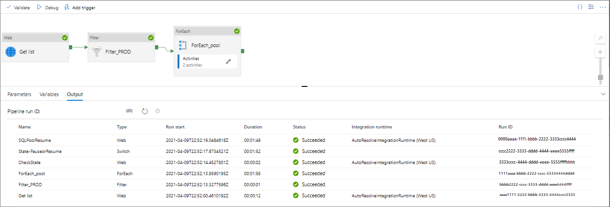

# Pause and Resume dedicated SQL pools using Synapse Pipelines

Pause and resume for dedicated SQL pools can be automated using Synapse Pipeline in Azure Synapse Analytics. Pause and resume are used to save costs for a dedicated SQL pool. This solution can easily be included in an existing data orchestration process. 

The following steps will guide you through setting up automated pause and resume.

1. Paremeter setup in your pipeline
1. Identify the list of dedicated SQL pools in your Synapse workspace
1. Remove any irrelevant databases from this list (e.g. master)
1. Loop over each dedicated SQL pool and:
    1. Check the state of the dedicated SQL pool
    1. Depending upon its status, initiate pause or resume

This requires a simple pipeline in Synapse:


Depending upon the nature of your environment, the whole process described here may not apply, and you may just want to pick and choose the appropriate step. Typically the process described here would be used to pause or resume all instances in a development, test or PoC environment where the number of instances could vary over time. For a live environment you are more likely to schedule pause/resume on a instance by instance basis so will only need  so will .

All of the steps above utilize the REST APIs for Synapse and Azure SQL:

[Dedicated SQL pool operations](/rest/api/synapse/sqlpools)
 
[Azure SQL Database REST API](/rest/api/sql)

Synapse Pipelines allows for the automation of pause and resume, but you can execute these commands on-demand via the tools or application of your choice.

## Prerequisites

- You will need an [Azure Synapse workspace](../get-started-create-workspace.md)

## Parameter setup in your pipeline

The examples below are parameter driven, which will allow you to create a generic pipeline that you can use across multiple subscriptions, resource groups, SQL servers and/or dedicated SQL pools. These are setup in your Synapse Pipeline under parameters:


## Identify the list of dedicated SQL pools in your workspace

This requires a Web Activity that calls the dedicated SQL pools - List By Server REST API request:


This is a simple Get request using the following call:

```
GET https://management.azure.com/subscriptions/{subscription-id}/resourceGroups/{resource-group-name}/providers/Microsoft.Synapse/workspaces/{server-name}/sqlPools?api-version=2019-06-01-preview
```

Which in the example above I have parameterised using the @concat string function:

```
@concat('https://management.azure.com/subscriptions/',pipeline().parameters.Subscription,'/resourceGroups/',pipeline().parameters.ResourceGroup,'/providers/Microsoft.Synapse/workspaces/',pipeline().parameters.ServerName,'/sqlPools?api-version=2019-06-01-preview')
```

The output is a JSON string that contains a list of the database instances in the SQL server named above. This is passed to the next activity.


## Filter the list to remove any irrelevant databases

This requires a Filer Activity that filters based on the values passed from the DBList1 Activity.


In this example, we are simply extracting the records from the array that are not named master. Other conditions could be applied as required, such as filtering on the sku/name of Synapse Workspace to ensure only valid Synapse SQL pools are identified.

Here the command under Items is:

```
@activity('Get List Databases').output.value
```

where GET List Databases is the name of the preceding Web activity

The command under Condition is:

```
@not(startswith(item().name,'master'))
```

The remaining records in the array are then passed to the next activity.

## Loop over each record/SQL Pool

Create a ForEach activity to loop over each SQL Pool where the full pipeline with the above activities are being run.


Alternatively, if you are simply running this for a single SQL Pool, complete Step 0 and follow the next steps.

### Check the state of the database

This requires a Web Activity, similar to Step1. This activity calls the [Check database state REST API for Azure Synapse][](../sql-data-warehouse/sql-data-warehouse-manage-compute-rest-api.md#check-database-state).


This again uses a simple Get request using the following call:

```dotnetcli
GET https://management.azure.com/subscriptions/{subscription-id}/resourceGroups/{resource-group-name}/providers/Microsoft.Synapse/workspaces/{server-name}/sqlPools/{database-name}?api-version=2019-06-01-preview HTTP/1.1
```

Which in the example above I have parameterised using the @concat string function:

```dotnetcli
@concat('https://management.azure.com/subscriptions/',pipeline().parameters.Subscription,'/resourceGroups/',pipeline().parameters.ResourceGroup,'/providers/Microsoft.Synapse/workspaces/',pipeline().parameters.ServerName,'/sqlPools/',item().name,'?api-version=2019-06-01-preview')
```

In this case we are using item().name – the name of the SQL pool from Step 1 – that that was passed to this activity from the ForEach loop. If you are using in a pipeline to control a single database, you can embed the name of your Synapse SQL pool here, or use a parameter from the pipeline (e.g. pipeline().parameters.DatabaseName using the example in Step 0)

The output is a JSON string that contains details of the SQL pool, including its status (in properties.status). This is passed to the next activity.

### Evaluate the status and then initiate the Pause or Restart

Create an If Condition activity and use this to evaluate the status from the previous step.


An If Condition activity requires a Boolean output, so in this example we are using the starts with function that returns true or false:

```
@startswith(activity('CheckState').output.properties.status,'Paused')
```

where CheckState is the name of the preceding Web activity.

This is simply doing a check of the status – if it is paused it invokes the true activity (Restart) within the If Condition, if not it invokes the false activity (Pause).

Within the appropriate activity branch, add the final step.

### Dedicated SQL pool pause or resume

The final step (and this may be the only relevant step for some requirements), is to initiate the Pause or Restart of your Synapse SQL pool. This, like steps 1 and 3a, is a simple Web activity, calling the [Pause or Resume compute REST API for Azure Synapse](../sql-data-warehouse/sql-data-warehouse-manage-compute-rest-api.md#pause-compute)


The example here is to resume a SQL pool, invoking a POST request using the following call:

```
POST https://management.azure.com/subscriptions/{subscription-id}/resourceGroups/{resource-group-name}/providers/Microsoft.Synapse/workspaces/{server-name}/sqlPools/{database-name}/resume?api-version=2019-06-01-preview HTTP/1.1
```

Which in the example above I have parameterised using the @concat string function:

```
@concat('https://management.azure.com/subscriptions/',pipeline().parameters.Subscription,'/resourceGroups/',pipeline().parameters.ResourceGroup,'/providers/Microsoft.Synapse/workspaces/',pipeline().parameters.ServerName,'/sqlPools/',activity('CheckState').output.name,'/resume?api-version=2019-06-01-preview')
```

In this case we are using activity('CheckState').output.name (the name of the dedicated SQL pool from Step 3a) that that was passed to this activity through the IF Condition loop. If you are using this a single activity against a single database, you could embed the name of your dedicated SQL pool here, or use a parameter from the pipeline (e.g. pipeline().parameters.DatabaseName using the example in Step 0).

## Pipeline Run Output

When the full pipeline described above is run, this is the output you will receive. Note that when I ran the pipeline for the results below, the scope (using the Pipeline Parameter named "ResourceGroup") was set to a single resource group that had one Synapse Workspace that was Paused, so it initiated a Restart.




## Important Authentication notes

For all of the Web Activities / REST API Web calls, you need to ensure that Synapse Pipeline is authenticated against dedicated SQL pool. [Managed Identity](../../data-factory/control-flow-web-activity.md#managed-identity) is required to run these REST API calls. 


## Next steps

Further details on Managed Identity for Azure Synapse, and how Managed Identity is added to your dedicated SQL Pool can be found here:

[Azure Synapse workspace managed identity](../security/synapse-workspace-managed-identity.md)

[Grant permissions to workspace managed identity](../security/how-to-grant-workspace-managed-identity-permissions.md)

[SQL access control for Synapse pipeline runs](../security/how-to-set-up-access-control#step-73-sql-access-control-for-synapse-pipeline-runs)

