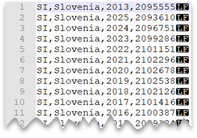
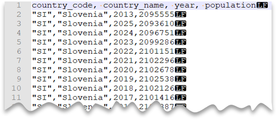
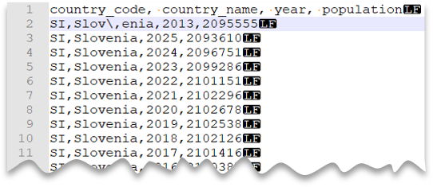
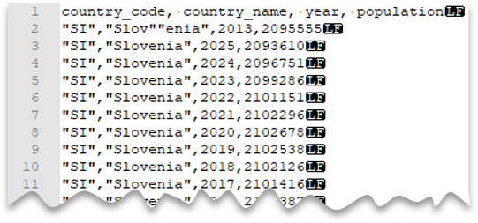
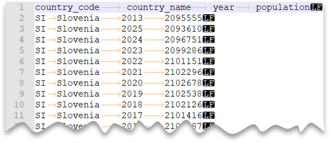

# Query CSV files

In this article, you'll learn how to query a single CSV file using serverless SQL pool in Azure Synapse Analytics. CSV files may have different formats: 

- With and without a header row
- Comma and tab-delimited values
- Windows and Unix style line endings
- Non-quoted and quoted values, and escaping characters

All of the above variations will be covered below.

## Quickstart example

`OPENROWSET` function enables you to read the content of CSV file by providing the URL to your file.

### Read a csv file

The easiest way to see to the content of your `CSV` file is to provide file URL to `OPENROWSET` function, specify csv `FORMAT`, and 2.0 `PARSER_VERSION`. If the file is publicly available or if your Microsoft Entra identity can access this file, you should be able to see the content of the file using the query like the one shown in the following example:

```sql
select top 10 *
from openrowset(
    bulk 'https://pandemicdatalake.blob.core.windows.net/public/curated/covid-19/ecdc_cases/latest/ecdc_cases.csv',
    format = 'csv',
    parser_version = '2.0',
    firstrow = 2 ) as rows
```

Option `firstrow` is used to skip the first row in the CSV file that represents header in this case. Make sure that you can access this file. If your file is protected with SAS key or custom identity, your would need to setup [server level credential for sql login](develop-storage-files-storage-access-control.md?tabs=shared-access-signature#server-level-credential).

> [!IMPORTANT]
> If your CSV file contains UTF-8 characters, make sure that you are using a UTF-8 database collation (for example `Latin1_General_100_CI_AS_SC_UTF8`).
> A mismatch between text encoding in the file and the collation might cause unexpected conversion errors.
> You can easily change default collation of the current database using the following T-SQL statement:
>   `alter database current collate Latin1_General_100_CI_AI_SC_UTF8`

### Data source usage

Previous example uses full path to the file. As an alternative, you can create an external data source with the location that points to the root folder of the storage:

```sql
create external data source covid
with ( location = 'https://pandemicdatalake.blob.core.windows.net/public/curated/covid-19/ecdc_cases' );
```

Once you create a data source, you can use that data source and the relative path to the file in `OPENROWSET` function:

```sql
select top 10 *
from openrowset(
        bulk 'latest/ecdc_cases.csv',
        data_source = 'covid',
        format = 'csv',
        parser_version ='2.0',
        firstrow = 2
    ) as rows
```

If a data source is protected with SAS key or custom identity you can configure [data source with database scoped credential](develop-storage-files-storage-access-control.md?tabs=shared-access-signature#database-scoped-credential).

### Explicitly specify schema

`OPENROWSET` enables you to explicitly specify what columns you want to read from the file using `WITH` clause:

```sql
select top 10 *
from openrowset(
        bulk 'latest/ecdc_cases.csv',
        data_source = 'covid',
        format = 'csv',
        parser_version ='2.0',
        firstrow = 2
    ) with (
        date_rep date 1,
        cases int 5,
        geo_id varchar(6) 8
    ) as rows
```

The numbers after a data type in the `WITH` clause represent column index in the CSV file.

> [!IMPORTANT]
> If your CSV file contains UTF-8 characters, make sure that you are explicilty specifying some UTF-8 collation (for example `Latin1_General_100_CI_AS_SC_UTF8`) for all columns in `WITH` clause or set some UTF-8 collation at database level.
> Mismatch between text encoding in the file and collation might cause unexpected conversion errors.
> You can easily change default collation of the current database using the following T-SQL statement:
>   `alter database current collate Latin1_General_100_CI_AI_SC_UTF8`
> You can easily set collation on the colum types using the following definition:
>    `geo_id varchar(6) collate Latin1_General_100_CI_AI_SC_UTF8 8`

In the following sections you can see how to query various types of CSV files.

## Prerequisites

Your first step is to **create a database** where the tables will be created. Then initialize the objects by executing [setup script](https://github.com/Azure-Samples/Synapse/blob/master/SQL/Samples/LdwSample/SampleDB.sql) on that database. This setup script will create the data sources, database scoped credentials, and external file formats that are used in these samples.

## Windows style new line

The following query shows how to read a CSV file without a header row, with a Windows-style new line, and comma-delimited columns.

File preview:


```sql
SELECT *
FROM OPENROWSET(
        BULK 'csv/population/population.csv',
        DATA_SOURCE = 'SqlOnDemandDemo',
        FORMAT = 'CSV', PARSER_VERSION = '2.0',
        FIELDTERMINATOR =',',
        ROWTERMINATOR = '\n'
    )
WITH (
    [country_code] VARCHAR (5) COLLATE Latin1_General_BIN2,
    [country_name] VARCHAR (100) COLLATE Latin1_General_BIN2,
    [year] smallint,
    [population] bigint
) AS [r]
WHERE
    country_name = 'Luxembourg'
    AND year = 2017;
```

## Unix-style new line

The following query shows how to read a file without a header row, with a Unix-style new line, and comma-delimited columns. Note the different location of the file as compared to the other examples.

File preview:



```sql
SELECT *
FROM OPENROWSET(
        BULK 'csv/population-unix/population.csv',
        DATA_SOURCE = 'SqlOnDemandDemo',
        FORMAT = 'CSV', PARSER_VERSION = '2.0',
        FIELDTERMINATOR =',',
        ROWTERMINATOR = '0x0a'
    )
WITH (
    [country_code] VARCHAR (5) COLLATE Latin1_General_BIN2,
    [country_name] VARCHAR (100) COLLATE Latin1_General_BIN2,
    [year] smallint,
    [population] bigint
) AS [r]
WHERE
    country_name = 'Luxembourg'
    AND year = 2017;
```

## Header row

The following query shows how to a read file with a header row, with a Unix-style new line, and comma-delimited columns. Note the different location of the file as compared to the other examples.

File preview:


```sql
SELECT *
FROM OPENROWSET(
    BULK 'csv/population-unix-hdr/population.csv',
    DATA_SOURCE = 'SqlOnDemandDemo',
    FORMAT = 'CSV', PARSER_VERSION = '2.0',
    FIELDTERMINATOR =',',
    HEADER_ROW = TRUE
    ) AS [r]
```

Option `HEADER_ROW = TRUE` will result in reading column names from the header row in file. It is great for exploration purposes when you are not familiar with file content. For best performance see [Use appropriate data types section in Best practices](best-practices-serverless-sql-pool.md#use-appropriate-data-types). Also, you can read more about [OPENROWSET syntax here](develop-openrowset.md#syntax).

## Custom quote character

The following query shows how to read a file with a header row, with a Unix-style new line, comma-delimited columns, and quoted values. Note the different location of the file as compared to the other examples.

File preview:



```sql
SELECT *
FROM OPENROWSET(
        BULK 'csv/population-unix-hdr-quoted/population.csv',
        DATA_SOURCE = 'SqlOnDemandDemo',
        FORMAT = 'CSV', PARSER_VERSION = '2.0',
        FIELDTERMINATOR =',',
        ROWTERMINATOR = '0x0a',
        FIRSTROW = 2,
        FIELDQUOTE = '"'
    )
    WITH (
        [country_code] VARCHAR (5) COLLATE Latin1_General_BIN2,
        [country_name] VARCHAR (100) COLLATE Latin1_General_BIN2,
        [year] smallint,
        [population] bigint
    ) AS [r]
WHERE
    country_name = 'Luxembourg'
    AND year = 2017;
```

> [!NOTE]
> This query would return the same results if you omitted the FIELDQUOTE parameter since the default value for FIELDQUOTE is a double-quote.

## Escape characters

The following query shows how to read a file with a header row, with a Unix-style new line, comma-delimited columns, and an escape char used for the field delimiter (comma) within values. Note the different location of the file as compared to the other examples.

File preview:



```sql
SELECT *
FROM OPENROWSET(
        BULK 'csv/population-unix-hdr-escape/population.csv',
        DATA_SOURCE = 'SqlOnDemandDemo',
        FORMAT = 'CSV', PARSER_VERSION = '2.0',
        FIELDTERMINATOR =',',
        ROWTERMINATOR = '0x0a',
        FIRSTROW = 2,
        ESCAPECHAR = '\\'
    )
    WITH (
        [country_code] VARCHAR (5) COLLATE Latin1_General_BIN2,
        [country_name] VARCHAR (100) COLLATE Latin1_General_BIN2,
        [year] smallint,
        [population] bigint
    ) AS [r]
WHERE
    country_name = 'Slovenia';
```

> [!NOTE]
> This query would fail if ESCAPECHAR is not specified since the comma in "Slov,enia" would be treated as field delimiter instead of part of the country/region name. "Slov,enia" would be treated as two columns. Therefore, the particular row would have one column more than the other rows, and one column more than you defined in the WITH clause.

### Escape quoting characters

The following query shows how to read a file with a header row, with a Unix-style new line, comma-delimited columns, and an escaped double quote char within values. Note the different location of the file as compared to the other examples.

File preview:



```sql
SELECT *
FROM OPENROWSET(
        BULK 'csv/population-unix-hdr-escape-quoted/population.csv',
        DATA_SOURCE = 'SqlOnDemandDemo',
        FORMAT = 'CSV', PARSER_VERSION = '2.0',
        FIELDTERMINATOR =',',
        ROWTERMINATOR = '0x0a',
        FIRSTROW = 2
    )
    WITH (
        [country_code] VARCHAR (5) COLLATE Latin1_General_BIN2,
        [country_name] VARCHAR (100) COLLATE Latin1_General_BIN2,
        [year] smallint,
        [population] bigint
    ) AS [r]
WHERE
    country_name = 'Slovenia';
```

> [!NOTE]
> The quoting character must be escaped with another quoting character. Quoting character can appear within column value only if value is encapsulated with quoting characters.

## Tab-delimited files

The following query shows how to read a file with a header row, with a Unix-style new line, and tab-delimited columns. Note the different location of the file as compared to the other examples.

File preview:



```sql
SELECT *
FROM OPENROWSET(
        BULK 'csv/population-unix-hdr-tsv/population.csv',
        DATA_SOURCE = 'SqlOnDemandDemo',
        FORMAT = 'CSV', PARSER_VERSION = '2.0',
        FIELDTERMINATOR ='\t',
        ROWTERMINATOR = '0x0a',
        FIRSTROW = 2
    )
    WITH (
        [country_code] VARCHAR (5) COLLATE Latin1_General_BIN2,
        [country_name] VARCHAR (100) COLLATE Latin1_General_BIN2,
        [year] smallint,
        [population] bigint
    ) AS [r]
WHERE
    country_name = 'Luxembourg'
    AND year = 2017
```

## Return a subset of columns

So far, you've specified the CSV file schema using WITH and listing all columns. You can only specify columns you actually need in your query by using an ordinal number for each column needed. You'll also omit columns of no interest.

The following query returns the number of distinct country/region names in a file, specifying only the columns that are needed:

> [!NOTE]
> Take a look at the WITH clause in the query below and note that there is "2" (without quotes) at the end of row where you define the *[country_name]* column. It means that the *[country_name]* column is the second column in the file. The query will ignore all columns in the file except the second one.

```sql
SELECT
    COUNT(DISTINCT country_name) AS countries
FROM OPENROWSET(
        BULK 'csv/population/population.csv',
        DATA_SOURCE = 'SqlOnDemandDemo',
        FORMAT = 'CSV', PARSER_VERSION = '2.0',
        FIELDTERMINATOR =',',
        ROWTERMINATOR = '\n'
    )
WITH (
    --[country_code] VARCHAR (5),
    [country_name] VARCHAR (100) 2
    --[year] smallint,
    --[population] bigint
) AS [r]
```

## Querying appendable files

The CSV files that are used in the query should not be changed while the query is running. In the long-running query, SQL pool may retry reads, read parts of the files, or even read the file multiple times. Changes of the file content would cause wrong results. Therefore, SQL pool fails the query if detects that modification time of any file is changed during the query execution.

In some scenarios you might want to read the files that are constantly appended. To avoid the query failures due to constantly appended files, you can allow the `OPENROWSET` function to ignore potentially inconsistent reads using the `ROWSET_OPTIONS` setting.

```sql
select top 10 *
from openrowset(
    bulk 'https://pandemicdatalake.blob.core.windows.net/public/curated/covid-19/ecdc_cases/latest/ecdc_cases.csv',
    format = 'csv',
    parser_version = '2.0',
    firstrow = 2,
    ROWSET_OPTIONS = '{"READ_OPTIONS":["ALLOW_INCONSISTENT_READS"]}') as rows
```

The `ALLOW_INCONSISTENT_READS` read option will disable the file modification time check during the query lifecycle and read whatever is available in the file. In the appendable files, the existing content is not updated, and only new rows are added. Therefore, the probability of wrong results is minimized compared to the updateable files. This option might enable you to read the frequently appended files without handling the errors. Im most of the scenarios, SQL pool will just ignore some rows that are appended to the files during the query execution.

## Next steps

The next articles will show you how to:

- [Querying Parquet files](query-parquet-files.md)
- [Querying folders and multiple files](query-folders-multiple-csv-files.md)
