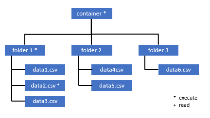
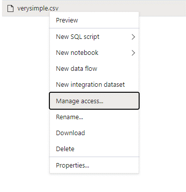
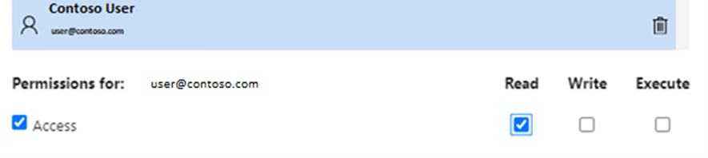

# Self-help for serverless SQL pool

This article contains information about how to troubleshoot most frequent problems with serverless SQL pool in Azure Synapse Analytics.

## Synapse studio

### Serverless SQL pool is grayed out in Synapse Studio

If Synapse Studio can't establish connection to serverless SQL pool, you'll notice that serverless SQL pool is grayed out or shows status "Offline". Usually, this problem occurs when one of the following cases happens:

1) Your network prevents communication to Azure Synapse backend. Most frequent case is that port 1443 is blocked. To get the serverless SQL pool to work, unblock this port. Other problems could prevent serverless SQL pool to work as well, [visit full troubleshooting guide for more information](../troubleshoot/troubleshoot-synapse-studio.md).
2) You don't have permissions to log into serverless SQL pool. To gain access, one of the Azure Synapse workspace administrators should add you to workspace administrator or SQL administrator role. [Visit full guide on access control for more information](../security/synapse-workspace-access-control-overview.md).

### Query fails with error: Websocket connection was closed unexpectedly.

If your query fails with the error message: 'Websocket connection was closed unexpectedly', it means that your browser connection to Synapse Studio was interrupted, for example because of a network issue. 

To resolve this issue, rerun this query. If this message occurs often in your environment, advise help from your network administrator, check firewall settings, and [visit this troubleshooting guide for more information](../troubleshoot/troubleshoot-synapse-studio.md). 

If the issue still continues, create a [support ticket](../../azure-portal/supportability/how-to-create-azure-support-request.md) through the Azure portal and try [Azure Data Studio](https://docs.microsoft.com/sql/azure-data-studio/download-azure-data-studio) or [SQL Server Management Studio](https://docs.microsoft.com/sql/ssms/download-sql-server-management-studio-ssms) for the same queries instead of Synapse Studio for further investigation.

## Query execution

### Query fails because file cannot be opened

If your query fails with the error 'File cannot be opened because it does not exist or it is used by another process' and you're sure both file exist and it's not used by another process it means serverless SQL pool can't access the file. This problem usually happens because your Azure Active Directory identity doesn't have rights to access the file. By default, serverless SQL pool is trying to access the file using your Azure Active Directory identity. To resolve this issue, you need to have proper rights to access the file. Easiest way is to grant yourself 'Storage Blob Data Contributor' role on the storage account you're trying to query. 
- [Visit full guide on Azure Active Directory access control for storage for more information](../../storage/common/storage-auth-aad-rbac-portal.md). 
- [Visit Control storage account access for serverless SQL pool in Azure Synapse Analytics](develop-storage-files-storage-access-control.md)

#### Alternative to Storage Blob Data Contributor role

Instead of granting Storage Blob Data Contributor, you can also grant more granular permissions on a subset of files. 

* All users that need access to some data in this container also needs to have the EXECUTE permission on all parent folders up to the root (the container). 
Learn more about [how to set ACLs in Azure Data Lake Storage Gen2](../../storage/blobs/data-lake-storage-explorer-acl.md). 

> [!NOTE]
> Execute permission on the container level needs to be set within the Azure Data Lake Gen2.
> Permissions on the folder can be set within Synapse. 


If you would like to query data2.csv in this example, the following permissions are needed: 
   - execute permission on container
   - execute permission on folder1 
   - read permission on data2.csv



* Log into Synapse with an admin user that has full permissions on the data you want to access.

* In the data pane, right-click on the file and select MANAGE ACCESS.



* Choose at least “read” permission, type in the users UPN or Object ID, for example user@contoso.com and click Add

* Grant read permission for this user.


> [!NOTE]
> For guest users, this needs to be done directly with the Azure Data Lake Service as it can not be done directly through Synapse. 

### Query fails because it cannot be executed due to current resource constraints 

If your query fails with the error message 'This query can't be executed due to current resource constraints', it means that serverless SQL pool isn't able to execute it at this moment due to resource constraints: 

- Make sure data types of reasonable sizes are used. Also, specify schema for Parquet files for string columns as they'll be VARCHAR(8000) by default. 

- If your query targets CSV files, consider [creating statistics](develop-tables-statistics.md#statistics-in-serverless-sql-pool). 

- Visit [performance best practices for serverless SQL pool](./best-practices-serverless-sql-pool.md) to optimize query.  

### Query fails with error while handling an external file. 

If your query fails with the error message 'error handling external file: Max errors count reached', it means that there is a mismatch of a specified column type and the data that needs to be loaded. 
To get more information about the error and which rows and columns to look at, change the parser version from ‘2.0’ to ‘1.0’. 

#### Example
If you would like to query the file ‘names.csv’ with this query 1, Synapse SQL Serverless will return with such error. 

names.csv
```csv
Id,first name, 
1,Adam
2,Bob
3,Charles
4,David
5,Eva
```

Query 1:
```sql
SELECT
    TOP 100 *
FROM
    OPENROWSET(
        BULK '[FILE-PATH OF CSV FILE]',
        FORMAT = 'CSV',
        PARSER_VERSION='2.0',
       FIELDTERMINATOR =';',
       FIRSTROW = 2
    ) 
    WITH (
    [ID] SMALLINT, 
    [Text] VARCHAR (1) COLLATE Latin1_General_BIN2 
)

    AS [result]
```
causes:

```Error handling external file: ‘Max error count reached’. File/External table name: [filepath].```

As soon as parser version is changed from version 2.0 to version 1.0, the error messages help to identify the problem. The new error message is now instead: 

```Bulk load data conversion error (truncation) for row 1, column 2 (Text) in data file [filepath]```

Truncation tells us that our column type is too small to fit our data. The longest first name in this ‘names.csv’ file has seven characters. Therefore, the according data type to be used should be at least VARCHAR(7). 
The error is caused by this line of code: 

```sql 
    [Text] VARCHAR (1) COLLATE Latin1_General_BIN2
```
Changing the query accordingly resolves the error: After debugging, change the parser version to 2.0 again to achieve maximum performance. Read more about when to use which parser version [here](develop-openrowset.md). 

```sql 
SELECT
    TOP 100 *
FROM
    OPENROWSET(
        BULK '[FILE-PATH OF CSV FILE]',
        FORMAT = 'CSV',
        PARSER_VERSION='2.0',
        FIELDTERMINATOR =';',
        FIRSTROW = 2
    ) 
    WITH (
    [ID] SMALLINT, 
    [Text] VARCHAR (7) COLLATE Latin1_General_BIN2 
)

    AS [result]
```

### Query fails with conversion error
If your query fails with the error message 
'bulk load data conversion error (type mismatches or invalid character for the specified codepage) for row n, column m [columnname] in the data file [filepath]', it means that your data types did not match the actual data for row number n and column m. 

For instance, if you expect only integers in your data but in row n there might be a string, this is the error message you will get. 
To resolve this problem, inspect the file and the according data types you did choose. Also check if your row delimiter and field terminator settings are correct. The following example shows how inspecting can be done using VARCHAR as column type. 
Read more on field terminators, row delimiters and escape quoting characters [here](query-single-csv-file.md). 

#### Example 
If you would like to query the file ‘names.csv’ with this query 1, Synapse SQL Serverless will return with such error. 

names.csv
```csv
Id, first name, 
1,Adam
2,Bob
3,Charles
4,David
five,Eva
```

Query 1:
```sql 
SELECT
    TOP 100 *
FROM
    OPENROWSET(
        BULK '[FILE-PATH OF CSV FILE]',
        FORMAT = 'CSV',
        PARSER_VERSION='1.0',
       FIELDTERMINATOR =',',
       FIRSTROW = 2
    ) 
    WITH (
    [ID] SMALLINT, 
    [Firstname] VARCHAR (25) COLLATE Latin1_General_BIN2 
)

    AS [result]
```

causes this error: 
```Bulk load data conversion error (type mismatch or invalid character for the specified codepage) for row 6, column 1 (ID) in data file [filepath]```

It is necessary to browse the data and make an informed decision to handle this problem. 
To look at the data that causes this problem, the data type needs to be changed first. Instead of querying column “ID” with the data type “SMALLINT”, VARCHAR(100) is now used to analyze this issue. 
Using this slightly changed Query 2, the data can now be processed and shows the list of names. 

Query 2: 
```sql
SELECT
    TOP 100 *
FROM
    OPENROWSET(
        BULK '[FILE-PATH OF CSV FILE]',
        FORMAT = 'CSV',
        PARSER_VERSION='1.0',
       FIELDTERMINATOR =',',
       FIRSTROW = 2
    ) 
    WITH (
    [ID] VARCHAR(100), 
    [Firstname] VARCHAR (25) COLLATE Latin1_General_BIN2 
)

    AS [result]
```

names.csv
```csv
Id, first name, 
1,Adam
2,Bob
3,Charles
4,David
five,Eva
```

It looks like the data has unexpected values for ID in the fifth row. 
In such circumstances, it is important to align with the business owner of the data to agree on how corrupt data like this can be avoided. If prevention is not possible at application level and dealing with all kinds of data types for ID needs to be done, reasonable sized VARCHAR might be the only option here.

> [!Tip]
> Try to make VARCHAR() as short as possible. Avoid VARCHAR(MAX) if possible as this can impair performance. 

### The result table does not look like expected. Result columns are empty or unexpected loaded. 

If your query does not fail but you find that your result table is not loaded as expected, it is likely that row delimiter or field terminator have been chosen wrong. 
To resolve this problem, it is needed to have another look at the data and change those settings. As a result table is shown, debugging this query is easy like in upcoming example. 

#### Example
If you would like to query the file ‘names.csv’ with this Query 1, Synapse SQL Serverless will return with result table that looks odd. 

names.csv
```csv
Id,first name, 
1,Adam
2,Bob
3,Charles
4,David
5,Eva
```

```sql
SELECT
    TOP 100 *
FROM
    OPENROWSET(
        BULK '[FILE-PATH OF CSV FILE]',
        FORMAT = 'CSV',
        PARSER_VERSION='1.0',
       FIELDTERMINATOR =';',
       FIRSTROW = 2
    ) 
    WITH (
    [ID] VARCHAR(100), 
    [Firstname] VARCHAR (25) COLLATE Latin1_General_BIN2 
)

    AS [result]
```

causes this result table

| ID            |   firstname   | 
| ------------- |-------------  | 
| 1,Adam        | NULL | 
| 2,Bob         | NULL | 
| 3,Charles     | NULL | 
| 4,David       | NULL | 
| 5,Eva         | NULL | 

There seems to be no value in our column “firstname”. Instead, all values did end up being in column “ID”. Those values are separated by comma. 
The problem was caused by this line of code as it is necessary to choose the comma instead of the semicolon symbol as field terminator:

```sql
FIELDTERMINATOR =';',
```

Changing this single character solves the problem:

```sql
FIELDTERMINATOR =',',
```

The result table created by query 2 looks now as expected. 

Query 2:
```sql
SELECT
    TOP 100 *
FROM
    OPENROWSET(
        BULK '[FILE-PATH OF CSV FILE]',
        FORMAT = 'CSV',
        PARSER_VERSION='1.0',
       FIELDTERMINATOR =',',
       FIRSTROW = 2
    ) 
    WITH (
    [ID] VARCHAR(100), 
    [Firstname] VARCHAR (25) COLLATE Latin1_General_BIN2 
)

    AS [result]
``` 

returns

| ID            |   firstname   | 
| ------------- |-------------  | 
| 1        | Adam | 
| 2         | Bob | 
| 3     | Charles | 
| 4       | David | 
| 5         | Eva | 


### Query fails with error: Column [column-name] of type [type-name] is  not compatible with external data type [external-data-type-name] 

If your query fails with the error message 'Column [column-name] of type [type-name] is not compatible with external data type […]', it is likely that tried to map a PARQUET data type to the wrong SQL data type. 
For instance, if your parquet file has a column price with float numbers (like 12.89) and you tried to map it to INT, this is the error message you will get. 

To resolve this, inspect the file and the according data types you did choose. This [mapping table](develop-openrowset.md#type-mapping-for-parquet) helps to choose a SQL data type. 
Best practice hint: Specify mapping only for columns that would otherwise resolve into VARCHAR data type. 
Avoiding VARCHAR when possible, leads to better performance in queries. 

#### Example
If you would like to query the file 'taxi-data.parquet' with this Query 1, Synapse SQL Serverless will return with such error.

taxi-data.parquet:

|PassengerCount |SumTripDistance|AvgTripDistance |
|---------------|---------------|----------------|
| 1 | 2635668.66000064 | 6.72731710678951 |
| 2 | 172174.330000005 | 2.97915543404919 |
| 3 | 296384.390000011 | 2.8991352022851  |
| 4 | 12544348.58999806| 6.30581582240281 |
| 5 | 13091570.2799993 | 111.065989028627 |

Query 1:
```sql
SELECT
    *
FROM
    OPENROWSET(
        BULK '<filepath>taxi-data.parquet',
        FORMAT='PARQUET'
    )  WITh
        (
        PassengerCount INT, 
        SumTripDistance INT, 
        AVGTripDistance FLOAT
        )

    AS [result]
```
causes this error: 

```Column 'SumTripDistance' of type 'INT' is not compatible with external data type 'Parquet physical type: DOUBLE', please try with 'FLOAT'. File/External table name: '<filepath>taxi-data.parquet'.```

This error message tells us that data types are not compatible and already comes with the suggestion to use the FLOAT instead of INT. 
The error is hence caused by this line of code: 

```sql
SumTripDistance INT, 
```

Using this slightly changed Query 2, the data can now be processed and shows all three columns. 

Query 2: 
```sql
SELECT
    *
FROM
    OPENROWSET(
        BULK '<filepath>taxi-data.parquet',
        FORMAT='PARQUET'
    )  WITh
        (
        PassengerCount INT, 
        SumTripDistance FLOAT, 
        AVGTripDistance FLOAT
        )

    AS [result]
```

## Configuration

### Query fails with: Please create a master key in the database or open the master key in the session before performing this operation.

If your query fails with the error message 'Please create a master key in the database or open the master key in the session before performing this operation.', it means that your user database has no access to a master key in the moment. 

Most likely, you just created a new user database and did not create a master key yet. 

To resolve this, create a master key with the following query:

```sql
CREATE MASTER KEY [ ENCRYPTION BY PASSWORD ='password' ];
```

> [!NOTE]
> Replace 'password' with a different secret here. 

### CREATE STATEMENT is not supported in master database

If your query fails with the error message:

> 'Failed to execute query. Error: CREATE EXTERNAL TABLE/DATA SOURCE/DATABASE SCOPED CREDENTIAL/FILE FORMAT is not supported in master database.' 

it means that master database in serverless SQL pool does not support creation of:
  - External tables
  - External data sources
  - Database scoped credentials
  - External file formats

Solution:

  1. Create a user database:

```sql
CREATE DATABASE <DATABASE_NAME>
```

  2. Execute create statement in the context of <DATABASE_NAME>, which failed earlier for master database. 
  
  Example for creation of External file format:
    
```sql
USE <DATABASE_NAME>
CREATE EXTERNAL FILE FORMAT [SynapseParquetFormat] 
WITH ( FORMAT_TYPE = PARQUET)
```

### Operation [[operation name]] is not allowed for a replicated database.
   
If you are trying to create some SQL objects, users, or change permissions in a database, you might get the errors like 'Operation CREATE USER is not allowed for a replicated database'. This error is returned when you try to create some objects in a database that is [shared with Spark pool](../metadata/database.md). The databases that are replicated from Apache Spark pools are read-only. You cannot create new objects into replicated database using T-SQL.

Create a separate database and reference the synchronized [tables](../metadata/table.md) using 3-part names and cross-database queries.

## Delta Lake

Delta Lake support is currently in public preview in serverless SQL pools. There are some known issues that you might see during the preview.
- Make sure that you are referencing root Delta Lake folder in the [OPENROWSET](https://docs.microsoft.com/azure/synapse-analytics/sql/develop-openrowset) function or external table location.
  - Root folder must have a sub-folder named `_delta_log`. The query will fail if there is no `_delta_log` folder. If you don't see that folder, then you are referencing plain Parquet files that must be [converted to Delta Lake](../spark/apache-spark-delta-lake-overview.md?pivots=programming-language-python#convert-parquet-to-delta) using Apache Spark pools.
  - Do not specify wildcards to describe the partition schema. Delta Lake query will automatically identify the Delta Lake partitions. 
- You cannot use schema inference in the [OPENROWSET](https://docs.microsoft.com/azure/synapse-analytics/sql/develop-openrowset) function if you have nested/complex types in the files. Make sure that you explicitly specify the schema in `WITH` clause.
- Delta Lake tables created in the Apache Spark pools are not synchronized in serverless SQL pool. You cannot query Apache Spark pools Delta Lake tables using T-SQL language.
- External tables do not support partitioning. Use [partitioned views](create-use-views.md#partitioned-views) on Delta Lake folder to leverage the partition elimination.
- Serverless SQL pools do not support time travel queries or updating Delta Lake files. You can use serverless SQL pool to query the latest version of Delta Lake. Use Apache Spark pools in Azure Synapse Analytics [to update Delta Lake](../spark/apache-spark-delta-lake-overview.md?pivots=programming-language-python#update-table-data) or [read historical data](../spark/apache-spark-delta-lake-overview.md?pivots=programming-language-python#read-older-versions-of-data-using-time-travel).
- Serverless SQL pools do not support Delta Lake data sets with the partitions containing `null` or empty values. Update `null` or empty values in your data sets if you need to read them withe the serverless SQL pools.
- Delta Lake support is not available in dedicated SQL pools. Make sure that you are using serverless pools to query Delta Lake files.

You can propose ideas and enhancements on [Azure Synapse feedback site](https://feedback.azure.com/forums/307516-azure-synapse-analytics?category_id=171048).

## Next steps

Review the following articles to learn more about how to use serverless SQL pool:

- [Query single CSV file](query-single-csv-file.md)

- [Query folders and multiple CSV files](query-folders-multiple-csv-files.md)

- [Query specific files](query-specific-files.md)

- [Query Parquet files](query-parquet-files.md)

- [Query Parquet nested types](query-parquet-nested-types.md)

- [Query JSON files](query-json-files.md)

- [Create and using views](create-use-views.md)

- [Create and using external tables](create-use-external-tables.md)

- [Store query results to storage](create-external-table-as-select.md)
