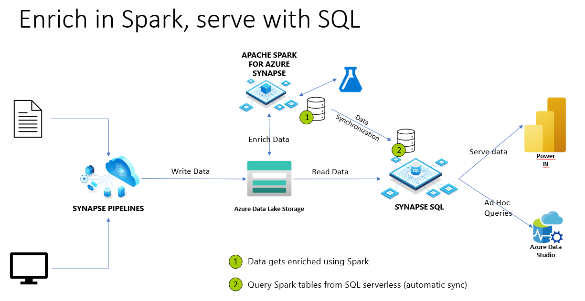

# How to setup access control on synchronized objects in serverless SQL pool

In Azure Synapse Analytics Spark [databases](../metadata/database.md) and [tables](../metadata/table.md) are shared with serverless SQL pool. [Lake databases](../database-designer/concepts-lake-database.md), [Parquet](query-parquet-files.md) and [CSV](query-single-csv-file.md) backed tables that are created with Spark are automatically available in serverless SQL pool. This allows using serverless SQL pool to explore and query data prepared by using Spark pools. 



Once these databases and tables are synchronized from Spark to serverless SQL pool these external tables in serverless SQL pool can be used to access the same data. However, objects in serverless SQL pool are read-only due to keeping consistency with the Spark pools objects. This introduces the limitation that only users with Synapse SQL Administrator or Synapse Administrator roles can access these objects in serverless SQL pool. If a non-admin user tries to execute a query on the synchronized database/table they will receive error like:
`External table '<table>' is not accessible because content of directory cannot be listed.`
despite them having access to data on the underlying storage account(s).

Since synchronized databases in serverless SQL pool are read-only, they can’t be modified, therefore creating a user, or giving additional permissions will fail if attempted. To read synchronized databases one must have privileged server-level permissions (like sysadmin).
This limitation is also present on external tables in serverless SQL pool when using [Synapse Link for Dataverse](/powerapps/maker/data-platform/export-to-data-lake) and lake databases tables.

## Problem

A user who needs to read data and create reports usually cases should not have full administrator access (like Synapse Administrator or Synapse SQL Administrator roles, neither sysadmin).  This user is usually data analyst who just needs to read and analyze data using the existing tables, and not to create new objects.

A user with minimal permission should be able to do two things:
-	Connect to a database that is replicated from Spark
-	Select data via external tables and access the underlying ADLS data.

## Solution

Below will be present a solution that will allow non-admin users to have server-level permissions to connect to any database and view data from all schema-level objects, such as tables or views. Data access security can be managed on the storage layer. 

```sql
-- Creating AAD login (same can be achieved for Azure AD app)
    CREATE LOGIN [login@contoso.com] FROM EXTERNAL PROVIDER;
    go;
    
    GRANT CONNECT ANY DATABASE to [login@contoso.com];
    GRANT SELECT ALL USER SECURABLES to [login@contoso.com];
    GO;
```
`CONNECT ANY DATABASE` permission will allow a user to access connection to any database, but it does not grant any permission in any database beyond connect. When `SELECT ALL USER SECURABLES` permission is granted, a login can view data from all schema-level objects, such as external tables and views (any schema except sys and INFORMATION_SCHEMA). This permission has effect in all databases that the user can connect to. Read more about [GRANT SERVER permissions](/sql/t-sql/statements/grant-server-permissions-transact-sql?view=sql-server-ver15#remarks&preserve-view=true).

After creating a login and granting permissions users can run queries on top of the synchronized external tables. This mitigation can also be applied to AAD security groups.

Additional security on the objects can be managed through specific schemas and lock access to a specific schema. The workaround requires additional DDL. For this scenario, new serverless database needs to be created and in there to create schemas and views that will point to the Spark tables data on ADLS.

Access to the data on storage account can be managed via [ACLs](/azure/storage/blobs/data-lake-storage-access-control) or regular [Storage Blob Data Owner/Reader/Contributor roles](/azure/storage/blobs/data-lake-storage-access-control-model) for AAD users/groups. For Service Principals (AAD apps) make sure you use ACLs setup and give R (Read) on every file/folder that the app needs to read and X(Execute) permission on every folder up to the root (including root/container).

> [!NOTE]
> - If you want to forbid using OPENROWSET on top of the data, you can use `DENY ADMINISTER BULK OPERATIONS to [login@contoso.com];` For more information, visit [DENY Server permissions](/sql/t-sql/statements/deny-server-permissions-transact-sql?view=sql-server-ver15#remarks&preserve-view=true).
> - If you want to forbid using specific schemas, you can use `DENY SELECT ON SCHEMA::[schema_name] TO [login@contoso.com];` For more information, visit [DENY Schema Permissions](/sql/t-sql/statements/deny-schema-permissions-transact-sql?view=sql-server-ver15&preserve-view=true).