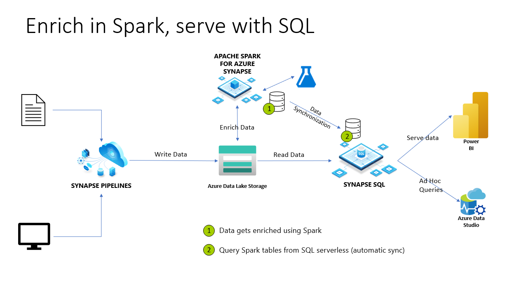

# How to set up access control on synchronized objects in serverless SQL pool

In Azure Synapse Analytics, Spark [databases](../metadata/database.md) and [tables](../metadata/table.md) are shared with serverless SQL pool. [Lake databases](../database-designer/concepts-lake-database.md), [Parquet](query-parquet-files.md), and [CSV](query-single-csv-file.md) backed tables created with Spark are automatically available in serverless SQL pool. This feature allows using serverless SQL pool to explore and query data prepared by using Spark pools.
On below diagram, you can see a high-level architecture overview to utilize this feature. First, Azure Synapse Pipelines are moving data from on-premises (or other) storage to Azure Data Lake Storage. Spark can now enrich the data, and create databases, and tables that are getting synchronized to serverless Synapse SQL. Later, user can execute ad-hoc queries on top of the enriched data or serve it to Power BI for example. 



## Full administrator access(sysadmin)
Once these databases and tables are synchronized from Spark to serverless SQL pool, these external tables in serverless SQL pool can be used to access the same data. However, objects in serverless SQL pool are read-only because of keeping consistency with the Spark pools objects. The limitation makes only users with Synapse SQL Administrator or Synapse Administrator roles can access these objects in serverless SQL pool. If a non-admin user tries to execute a query on the synchronized database/table, they'll receive error like:
`External table '<table>' is not accessible because content of directory cannot be listed.`
despite them having access to data on the underlying storage account(s).

Since synchronized databases in serverless SQL pool are read-only, they can't be modified. Creating a user, or giving other permissions will fail if attempted. To read synchronized databases, one must have privileged server-level permissions (like sysadmin).
This limitation is also present on external tables in serverless SQL pool when using [Azure Synapse Link for Dataverse](/powerapps/maker/data-platform/export-to-data-lake) and lake databases tables.

## Non-admin access to synchronized databases

A user who needs to read data and create reports usually doesn't have full administrator access (sysadmin). This user is usually data analyst who just needs to read and analyze data using the existing tables. They don't need to create new objects.

A user with minimal permission should be able to:
-    Connect to a database that is replicated from Spark
-    Select data via external tables and access the underlying ADLS data.

After executing the code script below, it will allow non-admin users to have server-level permissions to connect to any database. It will also allow users to view data from all schema-level objects, such as tables or views. Data access security can be managed on the storage layer. 

```sql
-- Creating Azure AD login (same can be achieved for Azure AD app)
    CREATE LOGIN [login@contoso.com] FROM EXTERNAL PROVIDER;
    go;
    
    GRANT CONNECT ANY DATABASE to [login@contoso.com];
    GRANT SELECT ALL USER SECURABLES to [login@contoso.com];
    GO;
```
> [!NOTE]
> These statements should be executed on master database, as these are all server-level permissions.

After creating a login and granting permissions, users can run queries on top of the synchronized external tables. This mitigation can also be applied to Azure AD security groups.

More security on the objects can be managed through specific schemas and lock access to a specific schema. The workaround requires extra DDL. For this scenario, you can create new serverless database, schemas, and views that will point to the Spark tables data on ADLS.

Access to the data on storage account can be managed via [ACL](../../storage/blobs/data-lake-storage-access-control.md) or regular [Storage Blob Data Owner/Reader/Contributor roles](../../storage/blobs/data-lake-storage-access-control-model.md) for Azure AD users/groups. For Service Principals (Azure AD apps), make sure you use ACL setup.

> [!NOTE]
> - If you want to forbid using OPENROWSET on top of the data, you can use `DENY ADMINISTER BULK OPERATIONS to [login@contoso.com];` For more information, visit [DENY Server permissions](/sql/t-sql/statements/deny-server-permissions-transact-sql?view=sql-server-ver15#remarks&preserve-view=true).
> - If you want to forbid using specific schemas, you can use `DENY SELECT ON SCHEMA::[schema_name] TO [login@contoso.com];` For more information, visit [DENY Schema Permissions](/sql/t-sql/statements/deny-schema-permissions-transact-sql?view=sql-server-ver15&preserve-view=true).

## Next steps

For more information, see [SQL Authentication](sql-authentication.md).
