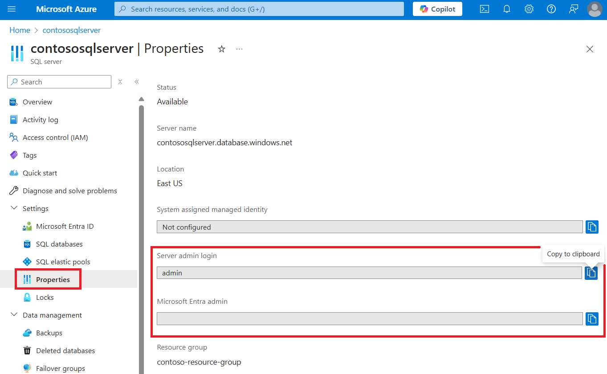
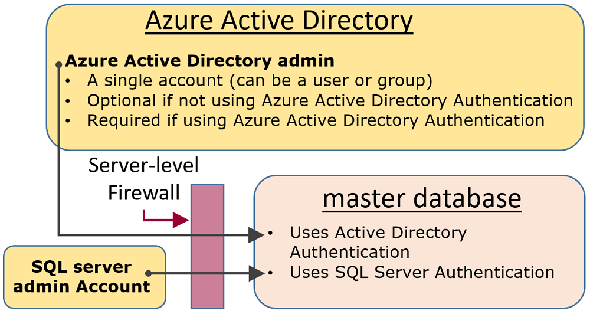

# SQL Authentication in Azure Synapse Analytics

Azure Synapse Analytics has two SQL form-factors that enable you to control your resource consumption. This article explains how the two form-factors control the user authentication.

To authorize to Synapse SQL, you can use two authorization types:

- Microsoft Entra authorization
- SQL authorization

SQL authorization enables legacy applications to connect to Azure Synapse SQL in a familiar way. However, Microsoft Entra authentication allows you to centrally manage access to Azure Synapse resources, such as SQL pools. Azure Synapse Analytics supports disabling local authentication, such as SQL authentication, both during and after workspace creation. Once disabled, local authentication can be enabled at any time by authorized users. For more information on Microsoft Entra-only authentication, see [Disabling local authentication in Azure Synapse Analytics](active-directory-authentication.md).

## Administrative accounts

There are two administrative accounts (**SQL admin username** and **SQL Active Directory admin**) that act as administrators. To identify these administrator accounts for your SQL pools open the Azure portal, and navigate to the Properties tab of your Synapse workspace.



- **SQL admin username**

  When you create an Azure Synapse Analytics, you must name a **Server admin login**. SQL server creates that account as a login in the `master` database. This account connects using SQL Server authentication (user name and password). Only one of these accounts can exist.

- **SQL Active Directory admin**

  One Microsoft Entra account, either an individual or security group account, can also be configured as an administrator. It's optional to configure a Microsoft Entra administrator, but a Microsoft Entra administrator **must** be configured if you want to use Microsoft Entra accounts to connect to Synapse SQL. 

   - The Microsoft Entra admin account controls access to dedicated SQL pools, while Synapse RBAC roles can be used to control access to serverless pools, for example, with the **Synapse Administrator** and **Synapse SQL Administrator** role. 

The **SQL admin username** and **SQL Active Directory admin** accounts have the following characteristics:

- Are the only accounts that can automatically connect to any SQL Database on the server. (To connect to a user database, other accounts must either be the owner of the database, or have a user account in the user database.)
- These accounts enter user databases as the `dbo` user and they have all the permissions in the user databases. (The owner of a user database also enters the database as the `dbo` user.)
- Don't enter the `master` database as the `dbo` user, and have limited permissions in the `master` database.
- Are **not** members of the standard SQL Server `sysadmin` fixed server role, which is not available in SQL Database.  
- Can create, alter, and drop databases, logins, users in the `master` database, and server-level IP firewall rules.
- Can add and remove members to the `dbmanager` and `loginmanager` roles.
- Can view the `sys.sql_logins` system table.

>[!Note]
>If a user is configured as an Active Directory admin and Synapse Administrator, and then removed from the Active Directory admin role, then the user will lose access to the dedicated SQL pools in Synapse. They must be removed and then added to the Synapse Administrator role to regain access to dedicated SQL pools.

## [Serverless SQL pool](#tab/serverless)

To manage the users having access to serverless SQL pool, you can use the instructions below.

To create a login to serverless SQL pool, use the following syntax:

```sql
CREATE LOGIN Mary WITH PASSWORD = '<strong_password>';
-- or
CREATE LOGIN [Mary@domainname.net] FROM EXTERNAL PROVIDER;
```

When the login exists, you can create users in the individual databases within the serverless SQL pool endpoint and grant required permissions to these users. To create a user, you can use the following syntax:

```sql
CREATE USER Mary FROM LOGIN Mary;
-- or
CREATE USER Mary FROM LOGIN Mary@domainname.net;
-- or
CREATE USER [mike@contoso.com] FROM EXTERNAL PROVIDER;
```

Once login and user are created, you can use the regular SQL Server syntax to grant rights.

## [Dedicated SQL pool](#tab/provisioned)

### Administrator access path

When the workspace-level firewall is properly configured, the **SQL admin username** and the **SQL Active Directory admin** can connect using client tools such as SQL Server Management Studio or SQL Server Data Tools. Only the latest tools provide all the features and capabilities. 

The following diagram shows a typical configuration for the two administrator accounts:
 


When using an open port in the server-level firewall, administrators can connect to any SQL Database.

### Database creators

One of these administrative roles is the **dbmanager** role. Members of this role can create new databases. To use this role, you create a user in the `master` database and then add the user to the **dbmanager** database role. 

To create a database, the user must be a user based on a SQL Server login in the `master` database or contained database user based on a Microsoft Entra user.

1. Using an administrator account, connect to the `master` database.
2. Create a SQL Server authentication login, using the [CREATE LOGIN](/sql/t-sql/statements/create-login-transact-sql?view=azure-sqldw-latest&preserve-view=true) statement. Sample statement:

   ```sql
   CREATE LOGIN Mary WITH PASSWORD = '<strong_password>';
   ```

   > [!NOTE]
   > Use a strong password when creating a login or contained database user. For more information, see [Strong Passwords](/sql/relational-databases/security/strong-passwords?view=azure-sqldw-latest&preserve-view=true).

   To improve performance, logins (server-level principals) are temporarily cached at the database level. To refresh the authentication cache, see [DBCC FLUSHAUTHCACHE](/sql/t-sql/database-console-commands/dbcc-flushauthcache-transact-sql?view=azure-sqldw-latest&preserve-view=true).

3. Create a databases user by using the [CREATE USER](/sql/t-sql/statements/create-user-transact-sql?view=azure-sqldw-latest&preserve-view=true) statement. The user can be a Microsoft Entra authentication contained database user (if you've configured your environment for Microsoft Entra authentication), or a SQL Server authentication contained database user, or a SQL Server authentication user based on a SQL Server authentication login (created in the previous step.) 

   Sample statements:

   Create a user with Microsoft Entra ID:
   ```sql
   CREATE USER [mike@contoso.com] FROM EXTERNAL PROVIDER; 
   ```
   
   Create a SQL Database contained database user:
   ```sql
   CREATE USER Ann WITH PASSWORD = '<strong_password>';
   ```
   
   Create a SQL Server user based on a SQL Server authentication login:
   ```sql
   CREATE USER Mary FROM LOGIN Mary;
   ```

4. Add the new user, to the **dbmanager** database role in `master` using the [sp_addrolemember](/sql/relational-databases/system-stored-procedures/sp-addrolemember-transact-sql?view=azure-sqldw-latest&preserve-view=true) procedure (note that [ALTER ROLE](/sql/t-sql/statements/alter-role-transact-sql?view=azure-sqldw-latest&preserve-view=true) statement is not supported in SQL provisioned). Sample statements:

   ```sql
   EXEC sp_addrolemember 'dbmanager', 'Mary'; 
   EXEC sp_addrolemember 'dbmanager', 'mike@contoso.com]'; 
   ```

   > [!NOTE]
   > The **dbmanager** is a database role in `master` database so you can only add a database user to the **dbmanager** role. You cannot add a server-level login to database-level role.

5. If necessary, configure a firewall rule to allow the new user to connect. (The new user might be covered by an existing firewall rule.)

Now the user can connect to the `master` database and can create new databases. The account creating the database becomes the owner of the database.

### Login managers

The other administrative role is the login manager role. Members of this role can create new logins in the `master` database. If you wish, you can complete the same steps (create a login and user, and add a user to the **loginmanager** role) to enable a user to create new logins in the master. Usually logins aren't necessary as Microsoft recommends using contained database users, which authenticate at the database-level instead of using users based on logins. For more information, see [Contained Database Users - Making Your Database Portable](/sql/relational-databases/security/contained-database-users-making-your-database-portable?view=azure-sqldw-latest&preserve-view=true).

---

## Non-administrator users

Generally, non-administrator accounts don't need access to the `master` database. Create contained database users at the database level using the [CREATE USER (Transact-SQL)](/sql/t-sql/statements/create-user-transact-sql) statement. 

The user can be a Microsoft Entra authentication contained database user (if you have configured your environment for Microsoft Entra authentication), or a SQL Server authentication contained database user, or a SQL Server authentication user based on a SQL Server authentication login (created in the previous step.)  

To create users, connect to the database, and execute statements similar to the following examples:

```sql
CREATE USER Mary FROM LOGIN Mary;
CREATE USER [mike@contoso.com] FROM EXTERNAL PROVIDER;
```

Initially, only one of the administrators or the owner of the database can create users. To authorize additional users to create new users, grant that selected user the `ALTER ANY USER` permission, by using a statement such as:

```sql
GRANT ALTER ANY USER TO Mary;
```

To give additional users full control of the database, make them a member of the **db_owner** fixed database role.

In Azure SQL Database or synapse serverless, use the `ALTER ROLE` statement.

```sql
ALTER ROLE db_owner ADD MEMBER Mary;
```

In dedicated SQL pool use [EXEC sp_addrolemember](/sql/relational-databases/system-stored-procedures/sp-addrolemember-transact-sql?view=azure-sqldw-latest&preserve-view=true).

```sql
EXEC sp_addrolemember 'db_owner', 'Mary';
```

> [!NOTE]
> One common reason to create a database user based on a server login is for users that need access to multiple databases. Since contained database users are individual entities, each database maintains its own user and its own password. This can cause overhead as the user must then remember each password for each database, and it can become untenable when having to change multiple passwords for many databases. 

## Groups and roles

Efficient access management uses permissions assigned to groups and roles instead of individual users.

- When using Microsoft Entra authentication, put Microsoft Entra users into a Microsoft Entra group. Create a contained database user for the group. Place one or more database users into a [database role](/sql/relational-databases/security/authentication-access/database-level-roles?view=azure-sqldw-latest&preserve-view=true) and then assign [permissions](/sql/relational-databases/security/permissions-database-engine?view=azure-sqldw-latest&preserve-view=true) to the database role.

- When using SQL Server authentication, create contained database users in the database. Place one or more database users into a [database role](/sql/relational-databases/security/authentication-access/database-level-roles?view=azure-sqldw-latest&preserve-view=true) and then assign [permissions](/sql/relational-databases/security/permissions-database-engine?view=azure-sqldw-latest&preserve-view=true) to the database role.

The database roles can be the built-in roles such as **db_owner**, **db_ddladmin**, **db_datawriter**, **db_datareader**, **db_denydatawriter**, and **db_denydatareader**. **db_owner** is commonly used to grant full permission to only a few users. The other fixed database roles are useful for getting a simple database in development quickly, but are not recommended for most production databases. 

For example, the **db_datareader** fixed database role grants read access to every table in the database, which is usually more than is strictly necessary. 

It's far better to use the [CREATE ROLE](/sql/t-sql/statements/create-role-transact-sql) statement to create your own user-defined database roles and carefully grant each role the least permissions necessary for the business need. When a user is a member of multiple roles, they aggregate the permissions of them all.

## Permissions

There are over 100 permissions that can be individually granted or denied in SQL Database. Many of these permissions are nested. For example, the `UPDATE` permission on a schema includes the `UPDATE` permission on each table within that schema. As in most permission systems, the denial of a permission overrides a grant. 

Because of the nested nature and the number of permissions, it can take careful study to design an appropriate permission system to properly protect your database. 

Start with the list of permissions at [Permissions (Database Engine)](/sql/relational-databases/security/permissions-database-engine) and review the [poster size graphic of database engine permissions](/sql/relational-databases/security/media/database-engine-permissions.png).

### Considerations and restrictions

When managing logins and users in SQL Database, consider the following points:

- You must be connected to the `master` database when executing the `CREATE/ALTER/DROP DATABASE` statements.
- The database user corresponding to the **Server admin** login can't be altered or dropped.
- **Server admin** will be disabled if Microsoft Entra-only authentication is enabled.
- US-English is the default language of the **Server admin** login.
- Only the administrators (**Server admin** login or Microsoft Entra administrator) and the members of the **dbmanager** database role in the `master` database have permission to execute the `CREATE DATABASE` and `DROP DATABASE` statements.
- You must be connected to the `master` database when executing the `CREATE/ALTER/DROP LOGIN` statements. However, using logins is discouraged. Use contained database users instead. For more information, see [Contained Database Users - Making Your Database Portable](/sql/relational-databases/security/contained-database-users-making-your-database-portable).
- To connect to a user database, you must provide the name of the database in the connection string.
- Only the server-level principal login and the members of the **loginmanager** database role in the `master` database have permission to execute the `CREATE LOGIN`, `ALTER LOGIN`, and `DROP LOGIN` statements.
- When executing the `CREATE/ALTER/DROP LOGIN` and `CREATE/ALTER/DROP DATABASE` statements in an ADO.NET application, using parameterized commands isn't allowed. For more information, see [Commands and Parameters](/dotnet/framework/data/adonet/commands-and-parameters).
- When executing the `CREATE USER` statement with the `FOR/FROM LOGIN` option, it must be the only statement in a Transact-SQL batch.
- When executing the `ALTER USER` statement with the `WITH LOGIN` option, it must be the only statement in a Transact-SQL batch.
- `CREATE/ALTER/DROP LOGIN` and `CREATE/ALTER/DROP USER` statements are not supported when Microsoft Entra-only authentication is enabled for the Azure Synapse workspace.
- To `CREATE/ALTER/DROP` a user requires the `ALTER ANY USER` permission on the database.
- When the owner of a database role tries to add or remove another database user to or from that database role, the following error may occur: **User or role 'Name' does not exist in this database.** This error occurs because the user isn't visible to the owner. To resolve this issue, grant the role owner the `VIEW DEFINITION` permission on the user. 

## Next steps

For more information, see [Contained Database Users - Making Your Database Portable](/sql/relational-databases/security/contained-database-users-making-your-database-portable).
