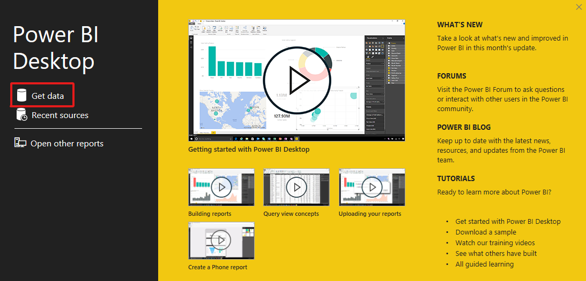
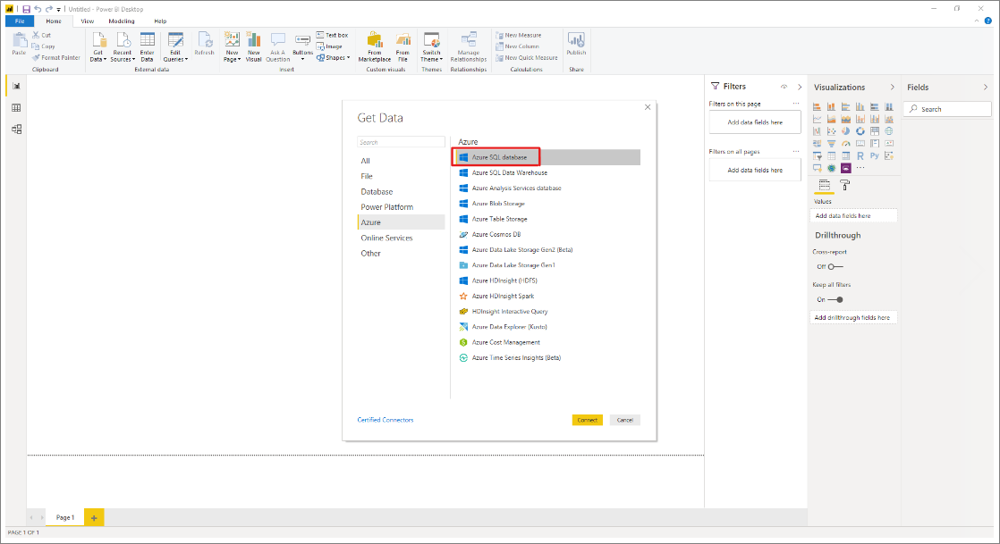
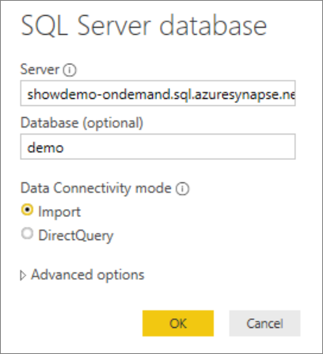
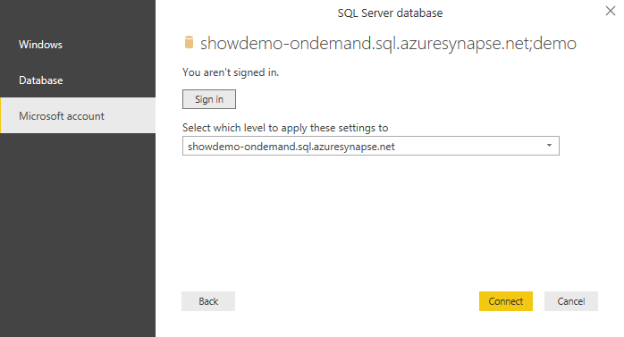
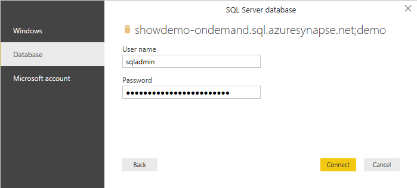
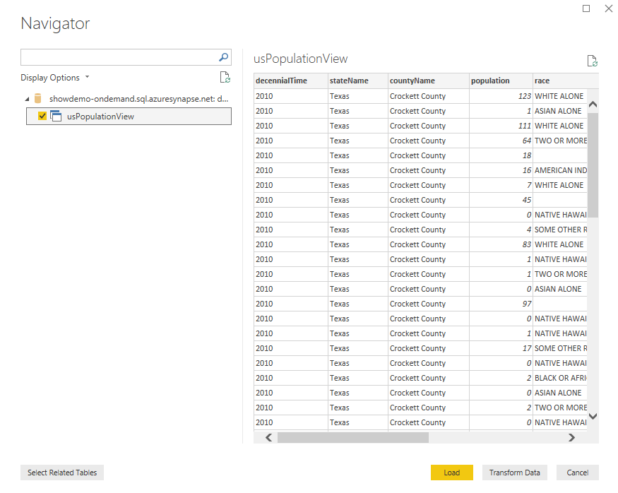
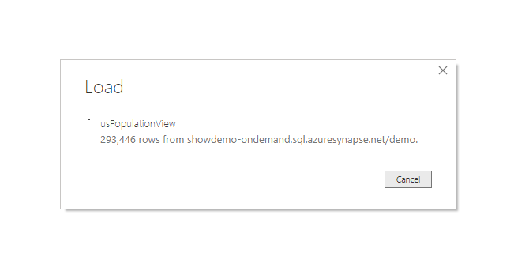
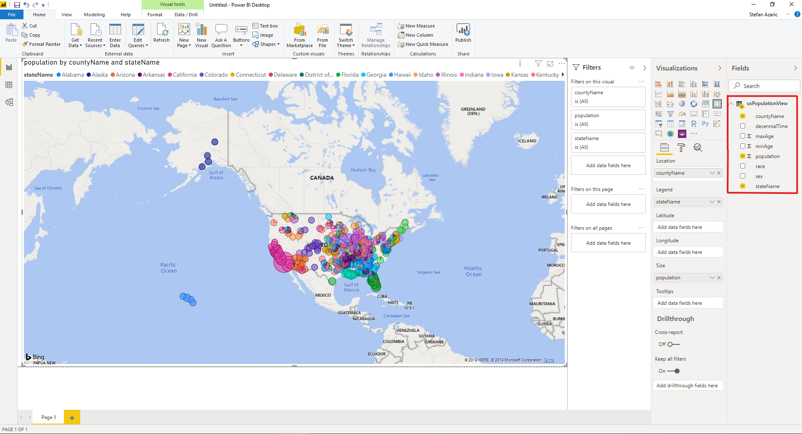

# Tutorial: Connect SQL on-demand (preview) to Power BI Desktop & create report

In this tutorial, you learn how to:

> [!div class="checklist"]
>
> - Create demo database
> - Create view used for report
> - Connect to Power BI Desktop
> - Create report based on view

## Prerequisites

To complete this tutorial, you need the following software:

- A SQL query tool, such as [Azure Data Studio](/sql/azure-data-studio/download-azure-data-studio), or [SQL Server Management Studio (SSMS)](/sql/ssms/download-sql-server-management-studio-ssms).
- [Power BI Desktop](https://powerbi.microsoft.com/downloads/).

Values for the following parameters:

| Parameter                                 | Description                                                   |
| ----------------------------------------- | ------------------------------------------------------------- |
| SQL on-demand service endpoint address    | Used as server name                                   |
| SQL on-demand service endpoint region     | Used to determine the storage used in the samples |
| Username and password for endpoint access | Used to access endpoint                               |
| Database you will use to create views     | The database used as starting point in the samples       |

## 1 - Create database

For the demo environment, create your own demo database. You use this database to view metadata, not to store actual data.

Create the demo database (and drop an existing database if necessary) by running the following Transact-SQL (T-SQL) script:

```sql
-- Drop database if it exists
IF EXISTS (SELECT * FROM sys.sysdatabases WHERE name = 'Demo')
BEGIN
    DROP DATABASE Demo
END;
GO

-- Create new database
CREATE DATABASE [Demo];
GO
```

## 2 - Create credential

A credential is necessary for the SQL on-demand service to access files in storage. Create the credential for a storage account that is located in the same region as your endpoint. Although SQL on-demand can access storage accounts from different regions, having the storage and endpoint in the same region provides better performance.

Create the credential by running the following Transact-SQL (T-SQL) script:

```sql
IF EXISTS (SELECT * FROM sys.credentials WHERE name = 'https://azureopendatastorage.blob.core.windows.net/censusdatacontainer')
DROP CREDENTIAL [https://azureopendatastorage.blob.core.windows.net/censusdatacontainer];
GO

-- Create credentials for Census Data container which resides in a azure open data storage account
-- There is no secret. We are using public storage account which doesn't need a secret.
CREATE CREDENTIAL [https://azureopendatastorage.blob.core.windows.net/censusdatacontainer]
WITH IDENTITY='SHARED ACCESS SIGNATURE',
SECRET = '';
GO
```

## 3 - Prepare view

Create the view based on the external demo data for Power BI to consume by running the following Transact-SQL (T-SQL) script:

Create the view `usPopulationView` inside the database `Demo` with the following query:

```sql
DROP VIEW IF EXISTS usPopulationView;
GO

CREATE VIEW usPopulationView AS
SELECT
    *
FROM
    OPENROWSET(
        BULK 'https://azureopendatastorage.blob.core.windows.net/censusdatacontainer/release/us_population_county/year=20*/*.parquet',
        FORMAT='PARQUET'
    ) AS uspv;
```

The demo data contains the following data sets:

US population by gender and race for each US county sourced from 2000 and 2010 Decennial Census in parquet format.

| Folder path                                                  | Description                                                  |
| ------------------------------------------------------------ | ------------------------------------------------------------ |
| /release/                                                    | Parent folder for data in demo storage account               |
| /release/us_population_county/                               | US population data files in Parquet format, partitioned by year using Hive/Hadoop partitioning scheme. |

## 4 - Create Power BI report

Create the report for Power BI Desktop using the following steps:

1. Open the Power BI Desktop application and select **Get data**.

   

2. Select **Azure** > **Azure SQL Database**. 

   

3. Type the name of the server where the database is located in the **Server** field, and then type `Demo` in the database name. Select the **Import** option and then select **OK**. 

   

4. Select preferred authentication method:

    - Example for AAD 
  
    

    - Example for SQL Login - Type your User name and password.

    


5. Select the view `usPopulationView`, and then select **Load**. 

   

6. Wait for the operation to complete, and then a pop-up will appear stating `There are pending changes in your queries that haven't been applied`. Select **Apply changes**. 

   

7. Wait for the **Apply query changes** dialog box to disappear, which may take a few minutes. 

   

8. Once the load completes, select the following columns in this order to create the report:
   - countyName
   - population
   - stateName

   

## Clean up resources

Once you're done using this report, delete the resources with the following steps:

1. Delete the credential for the storage account

   ```sql
   DROP CREDENTIAL [https://azureopendatastorage.blob.core.windows.net/censusdatacontainer];
   ```

2. Delete the view

   ```sql
   DROP VIEW usPopulationView;
   ```

3. Drop the database

   ```sql
   DROP DATABASE Demo;
   ```

## Next steps

Advance to the [Query storage files](develop-storage-files-overview.md) to learn how to query storage files using Synapse SQL.
