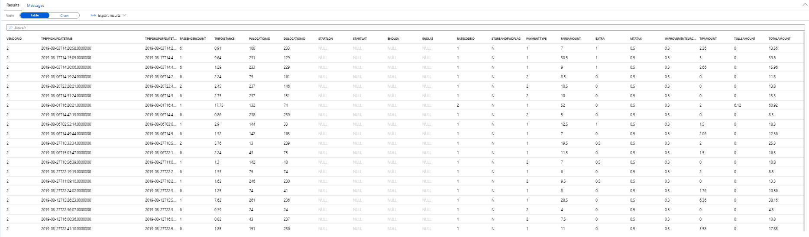
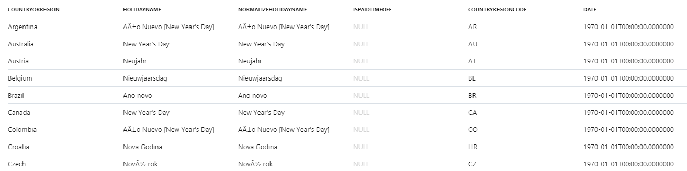
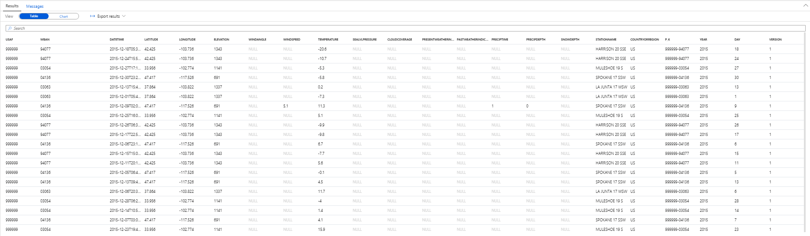
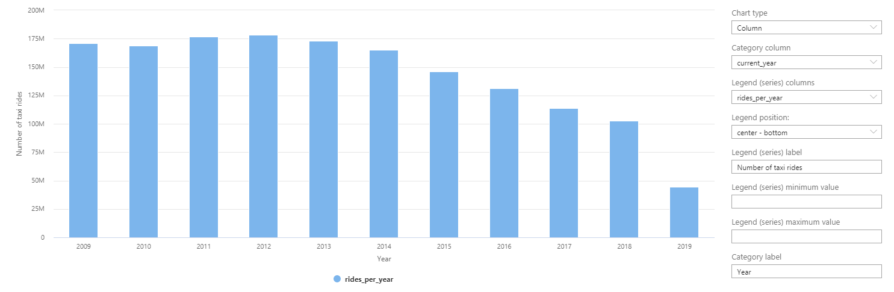
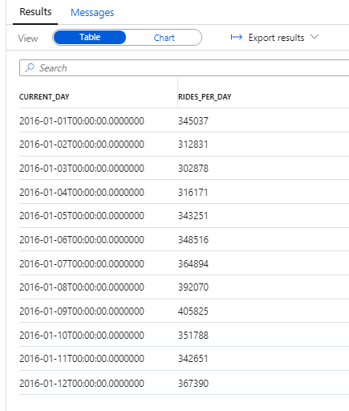
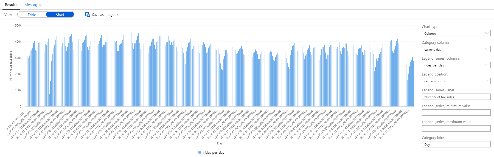
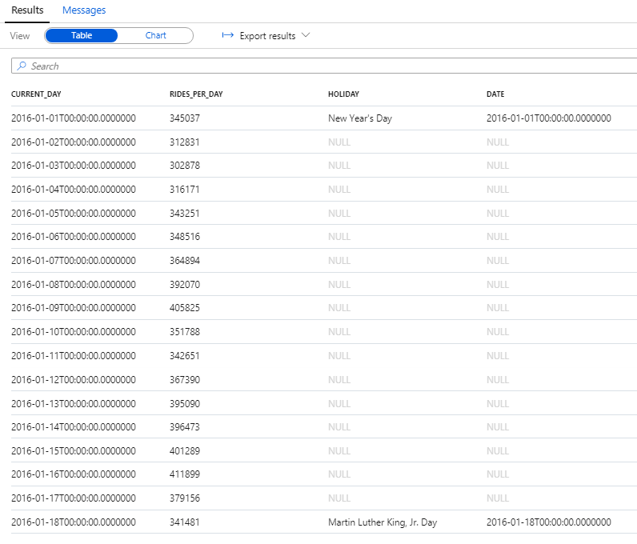
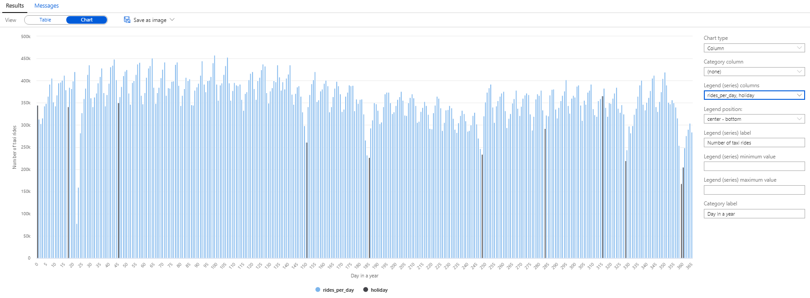
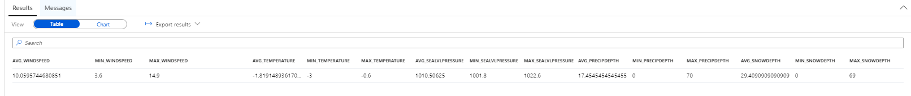

# Use SQL on-demand (preview) to analyze Azure Open Datasets and visualize the results in Azure Synapse Studio (preview)

In this tutorial, you learn how to perform exploratory data analysis by combining different Azure Open Datasets using SQL on-demand and then visualizing the results in Azure Synapse Studio.

In particular, you analyze the [New York City (NYC) Taxi dataset](https://azure.microsoft.com/services/open-datasets/catalog/nyc-taxi-limousine-commission-yellow-taxi-trip-records/) that includes:

- Pickup and drop-off dates and times.
- Pickup and drop-off locations. 
- Trip distances.
- Itemized fares.
- Rate types.
- Payment types. 
- Driver-reported passenger counts.

## Automatic schema inference

Since data is stored in the Parquet file format, automatic schema inference is available. You can easily query the data without a need to list the data types of all columns in the files. You also can use the virtual column mechanism and the filepath function to filter out a certain subset of files.

Let's first get familiar with the NYC Taxi data by running the following query:

```sql
SELECT TOP 100 * FROM
    OPENROWSET(
        BULK 'https://azureopendatastorage.blob.core.windows.net/nyctlc/yellow/puYear=*/puMonth=*/*.parquet',
        FORMAT='PARQUET'
    ) AS [nyc]
```

The following snippet shows the result for the NYC Taxi data:



Similarly, you can query the Public Holidays dataset by using the following query:

```sql
SELECT TOP 100 * FROM
    OPENROWSET(
        BULK 'https://azureopendatastorage.blob.core.windows.net/holidaydatacontainer/Processed/*.parquet',
        FORMAT='PARQUET'
    ) AS [holidays]
```

The following snippet shows the result for the Public Holidays dataset:



Lastly, you can also query the Weather Data dataset by using the following query:

```sql
SELECT
    TOP 100 *
FROM  
    OPENROWSET(
        BULK 'https://azureopendatastorage.blob.core.windows.net/isdweatherdatacontainer/ISDWeather/year=*/month=*/*.parquet',
        FORMAT='PARQUET'
    ) AS [weather]
```

The following snippet shows the result for the Weather Data dataset:



You can learn more about the meaning of the individual columns in the descriptions of the [NYC Taxi](https://azure.microsoft.com/services/open-datasets/catalog/nyc-taxi-limousine-commission-yellow-taxi-trip-records/), [Public Holidays](https://azure.microsoft.com/services/open-datasets/catalog/public-holidays/), and [Weather Data](https://azure.microsoft.com/services/open-datasets/catalog/noaa-integrated-surface-data/) datasets.

## Time series, seasonality, and outlier analysis

You can easily summarize the yearly number of taxi rides by using the following query:

```sql
SELECT
    YEAR(tpepPickupDateTime) AS current_year,
    COUNT(*) AS rides_per_year
FROM
    OPENROWSET(
        BULK 'https://azureopendatastorage.blob.core.windows.net/nyctlc/yellow/puYear=*/puMonth=*/*.parquet',
        FORMAT='PARQUET'
    ) AS [nyc]
WHERE nyc.filepath(1) >= '2009' AND nyc.filepath(1) <= '2019'
GROUP BY YEAR(tpepPickupDateTime)
ORDER BY 1 ASC
```

The following snippet shows the result for the yearly number of taxi rides:


The data can be visualized in Synapse Studio by switching from the **Table** to the **Chart** view. You can choose among different chart types, such as **Area**, **Bar**, **Column**, **Line**, **Pie**, and **Scatter**. In this case, plot the **Column** chart with the **Category** column set to **current_year**:



From this visualization, a trend of a decreasing number of rides over years can be clearly seen. Presumably, this decrease is due to the recent increased popularity of ride-sharing companies.

> [!NOTE]
> At the time of writing this tutorial, data for 2019 is incomplete. As a result, there's a huge drop in the number of rides for that year.

Next, let's focus the analysis on a single year, for example, 2016. The following query returns the daily number of rides during that year:

```sql
SELECT
    CAST([tpepPickupDateTime] AS DATE) AS [current_day],
    COUNT(*) as rides_per_day
FROM
    OPENROWSET(
        BULK 'https://azureopendatastorage.blob.core.windows.net/nyctlc/yellow/puYear=*/puMonth=*/*.parquet',
        FORMAT='PARQUET'
    ) AS [nyc]
WHERE nyc.filepath(1) = '2016'
GROUP BY CAST([tpepPickupDateTime] AS DATE)
ORDER BY 1 ASC
```

The following snippet shows the result for this query:



Again, you can easily visualize data by plotting the **Column** chart with the **Category** column set to **current_day** and the **Legend (series)** column set to **rides_per_day**.



From the plot chart, you can see that there's a weekly pattern, with Saturdays as the peak day. During summer months, there are fewer taxi rides because of vacations. There are also some significant drops in the number of taxi rides without a clear pattern of when and why they occur.

Next, let's see if the drops correlate with public holidays by joining the NYC Taxi rides dataset with the Public Holidays dataset:

```sql
WITH taxi_rides AS
(
    SELECT
        CAST([tpepPickupDateTime] AS DATE) AS [current_day],
        COUNT(*) as rides_per_day
    FROM  
        OPENROWSET(
            BULK 'https://azureopendatastorage.blob.core.windows.net/nyctlc/yellow/puYear=*/puMonth=*/*.parquet',
            FORMAT='PARQUET'
        ) AS [nyc]
    WHERE nyc.filepath(1) = '2016'
    GROUP BY CAST([tpepPickupDateTime] AS DATE)
),
public_holidays AS
(
    SELECT
        holidayname as holiday,
        date
    FROM
        OPENROWSET(
            BULK 'https://azureopendatastorage.blob.core.windows.net/holidaydatacontainer/Processed/*.parquet',
            FORMAT='PARQUET'
        ) AS [holidays]
    WHERE countryorregion = 'United States' AND YEAR(date) = 2016
)
SELECT
*
FROM taxi_rides t
LEFT OUTER JOIN public_holidays p on t.current_day = p.date
ORDER BY current_day ASC
```



This time, we want to highlight the number of taxi rides during public holidays. For that purpose, we choose **none** for the **Category** column and **rides_per_day** and **holiday** as the **Legend (series)** columns.



From the plot chart, you can see that during public holidays the number of taxi rides is lower. There's still one unexplained large drop on January 23. Let's check the weather in NYC on that day by querying the Weather Data dataset:

```sql
SELECT
    AVG(windspeed) AS avg_windspeed,
    MIN(windspeed) AS min_windspeed,
    MAX(windspeed) AS max_windspeed,
    AVG(temperature) AS avg_temperature,
    MIN(temperature) AS min_temperature,
    MAX(temperature) AS max_temperature,
    AVG(sealvlpressure) AS avg_sealvlpressure,
    MIN(sealvlpressure) AS min_sealvlpressure,
    MAX(sealvlpressure) AS max_sealvlpressure,
    AVG(precipdepth) AS avg_precipdepth,
    MIN(precipdepth) AS min_precipdepth,
    MAX(precipdepth) AS max_precipdepth,
    AVG(snowdepth) AS avg_snowdepth,
    MIN(snowdepth) AS min_snowdepth,
    MAX(snowdepth) AS max_snowdepth
FROM
    OPENROWSET(
        BULK 'https://azureopendatastorage.blob.core.windows.net/isdweatherdatacontainer/ISDWeather/year=*/month=*/*.parquet',
        FORMAT='PARQUET'
    ) AS [weather]
WHERE countryorregion = 'US' AND CAST([datetime] AS DATE) = '2016-01-23' AND stationname = 'JOHN F KENNEDY INTERNATIONAL AIRPORT'
```



The results of the query indicate that the drop in the number of taxi rides occurred because:

- There was a blizzard on that day in NYC with heavy snow (~30 cm).
- It was cold (temperature was below zero degrees Celsius).
- It was windy (~10 m/s).

This tutorial has shown how a data analyst can quickly perform exploratory data analysis, easily combine different datasets by using SQL on-demand, and visualize the results by using Azure Synapse Studio.

## Next steps

To learn how to connect SQL on-demand to Power BI Desktop and create reports, see [Connect SQL on-demand to Power BI Desktop and create reports](tutorial-connect-power-bi-desktop.md).
 
