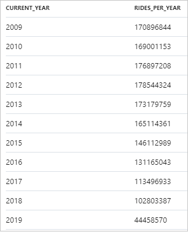
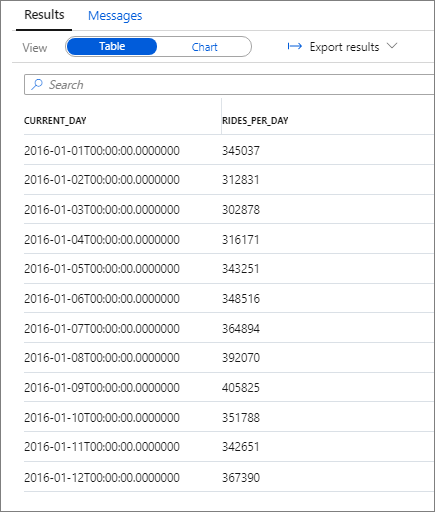
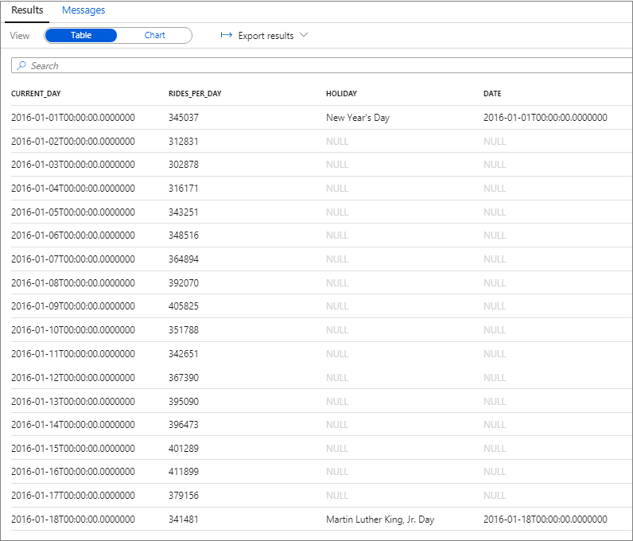
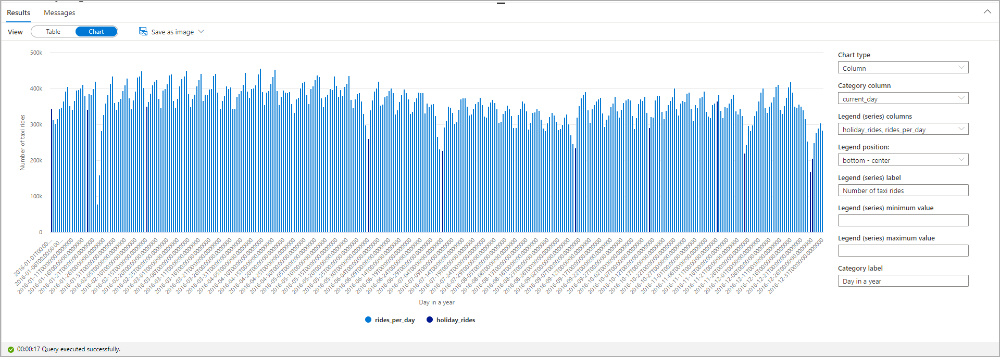

# Tutorial: Explore and Analyze data lakes with serverless SQL pool

In this tutorial, you learn how to perform exploratory data analysis. You combine different Azure Open Datasets using serverless SQL pool. You then visualize the results in Synapse Studio for Azure Synapse Analytics.

The `OPENROWSET(BULK...)` function allows you to access files in Azure Storage. `[OPENROWSET](develop-openrowset.md)` reads content of a remote data source, such as a file, and returns the content as a set of rows.

## Automatic schema inference

Since data is stored in the Parquet file format, automatic schema inference is available. You can query the data without listing the data types of all columns in the files. You also can use the virtual column mechanism and the `filepath` function to filter out a certain subset of files.

> [!NOTE]
> The default collation is `SQL_Latin1_General_CP1_CI_ASIf`. For a non-default collation, take into account case sensitivity.
>
> If you create a database with case sensitive collation when you specify columns, make sure to use correct name of the column.
>
> A column name `tpepPickupDateTime` would be correct while `tpeppickupdatetime` wouldn't work in a non-default collation.

This tutorial uses a dataset about [New York City (NYC) Taxi](https://azure.microsoft.com/services/open-datasets/catalog/nyc-taxi-limousine-commission-yellow-taxi-trip-records/):

- Pick-up and drop-off dates and times
- Pick-up and drop-off locations
- Trip distances
- Itemized fares
- Rate types
- Payment types
- Driver-reported passenger counts

To get familiar with the NYC Taxi data, run the following query:

```sql
SELECT TOP 100 * FROM
    OPENROWSET(
        BULK 'https://azureopendatastorage.blob.core.windows.net/nyctlc/yellow/puYear=*/puMonth=*/*.parquet',
        FORMAT='PARQUET'
    ) AS [nyc]
```

Similarly, you can query the Public Holidays dataset by using the following query:

```sql
SELECT TOP 100 * FROM
    OPENROWSET(
        BULK 'https://azureopendatastorage.blob.core.windows.net/holidaydatacontainer/Processed/*.parquet',
        FORMAT='PARQUET'
    ) AS [holidays]
```

You can also query the Weather Data dataset by using the following query:

```sql
SELECT
    TOP 100 *
FROM  
    OPENROWSET(
        BULK 'https://azureopendatastorage.blob.core.windows.net/isdweatherdatacontainer/ISDWeather/year=*/month=*/*.parquet',
        FORMAT='PARQUET'
    ) AS [weather]
```

You can learn more about the meaning of the individual columns in the descriptions of the data sets:

- [NYC Taxi](https://azure.microsoft.com/services/open-datasets/catalog/nyc-taxi-limousine-commission-yellow-taxi-trip-records/)
- [Public Holidays](https://azure.microsoft.com/services/open-datasets/catalog/public-holidays/)
- [Weather Data](https://azure.microsoft.com/services/open-datasets/catalog/noaa-integrated-surface-data/)

## Time series, seasonality, and outlier analysis

You can summarize the yearly number of taxi rides by using the following query:

```sql
SELECT
    YEAR(tpepPickupDateTime) AS current_year,
    COUNT(*) AS rides_per_year
FROM
    OPENROWSET(
        BULK 'https://azureopendatastorage.blob.core.windows.net/nyctlc/yellow/puYear=*/puMonth=*/*.parquet',
        FORMAT='PARQUET'
    ) AS [nyc]
WHERE nyc.filepath(1) >= '2009' AND nyc.filepath(1) <= '2019'
GROUP BY YEAR(tpepPickupDateTime)
ORDER BY 1 ASC
```

The following snippet shows the result for the yearly number of taxi rides:



The data can be visualized in Synapse Studio by switching from the **Table** to the **Chart** view. You can choose among different chart types, such as **Area**, **Bar**, **Column**, **Line**, **Pie**, and **Scatter**. In this case, plot the **Column** chart with the **Category** column set to **current_year**:


From this visualization, you can see a trend of decreasing ride numbers over the years. Presumably, this decrease is due to the recent increased popularity of ride-sharing companies.

> [!NOTE]
> At the time of writing this tutorial, data for 2019 is incomplete. As a result, there's a huge drop in the number of rides for that year.

You can focus the analysis on a single year, for example, 2016. The following query returns the daily number of rides during that year:

```sql
SELECT
    CAST([tpepPickupDateTime] AS DATE) AS [current_day],
    COUNT(*) as rides_per_day
FROM
    OPENROWSET(
        BULK 'https://azureopendatastorage.blob.core.windows.net/nyctlc/yellow/puYear=*/puMonth=*/*.parquet',
        FORMAT='PARQUET'
    ) AS [nyc]
WHERE nyc.filepath(1) = '2016'
GROUP BY CAST([tpepPickupDateTime] AS DATE)
ORDER BY 1 ASC
```

The following snippet shows the result for this query:



Again, you can visualize data by plotting the **Column** chart with the **Category** column set to **current_day** and the **Legend (series)** column set to **rides_per_day**.


From the plot chart, you can see there's a weekly pattern, with Saturdays as the peak day. During Summer months, there are fewer taxi rides because of vacations. Also, notice some significant drops in the number of taxi rides without a clear pattern of when and why they occur.

Next, see if the drop in rides correlates with public holidays. Check if there's a correlation by joining the NYC Taxi rides dataset with the Public Holidays dataset:

```sql
WITH taxi_rides AS (
SELECT
    CAST([tpepPickupDateTime] AS DATE) AS [current_day],
    COUNT(*) as rides_per_day
FROM
    OPENROWSET(
        BULK 'https://azureopendatastorage.blob.core.windows.net/nyctlc/yellow/puYear=*/puMonth=*/*.parquet',
        FORMAT='PARQUET'
    ) AS [nyc]
WHERE nyc.filepath(1) = '2016'
GROUP BY CAST([tpepPickupDateTime] AS DATE)
),
public_holidays AS (
SELECT
    holidayname as holiday,
    date
FROM
    OPENROWSET(
        BULK 'https://azureopendatastorage.blob.core.windows.net/holidaydatacontainer/Processed/*.parquet',
        FORMAT='PARQUET'
    ) AS [holidays]
WHERE countryorregion = 'United States' AND YEAR(date) = 2016
),
joined_data AS (
SELECT
    *
FROM taxi_rides t
LEFT OUTER JOIN public_holidays p on t.current_day = p.date
)

SELECT 
    *,
    holiday_rides = 
    CASE   
      WHEN holiday is null THEN 0   
      WHEN holiday is not null THEN rides_per_day
    END   
FROM joined_data
ORDER BY current_day ASC
```



Highlight the number of taxi rides during public holidays. For that purpose, choose **current_day** for the **Category** column and **rides_per_day** and **holiday_rides** as the **Legend (series)** columns.



From the plot chart, you can see that during public holidays the number of taxi rides is lower. There's still one unexplained large drop on January 23. Let's check the weather in NYC on that day by querying the Weather Data dataset:

```sql
SELECT
    AVG(windspeed) AS avg_windspeed,
    MIN(windspeed) AS min_windspeed,
    MAX(windspeed) AS max_windspeed,
    AVG(temperature) AS avg_temperature,
    MIN(temperature) AS min_temperature,
    MAX(temperature) AS max_temperature,
    AVG(sealvlpressure) AS avg_sealvlpressure,
    MIN(sealvlpressure) AS min_sealvlpressure,
    MAX(sealvlpressure) AS max_sealvlpressure,
    AVG(precipdepth) AS avg_precipdepth,
    MIN(precipdepth) AS min_precipdepth,
    MAX(precipdepth) AS max_precipdepth,
    AVG(snowdepth) AS avg_snowdepth,
    MIN(snowdepth) AS min_snowdepth,
    MAX(snowdepth) AS max_snowdepth
FROM
    OPENROWSET(
        BULK 'https://azureopendatastorage.blob.core.windows.net/isdweatherdatacontainer/ISDWeather/year=*/month=*/*.parquet',
        FORMAT='PARQUET'
    ) AS [weather]
WHERE countryorregion = 'US' AND CAST([datetime] AS DATE) = '2016-01-23' AND stationname = 'JOHN F KENNEDY INTERNATIONAL AIRPORT'
```


The results of the query indicate that the drop in the number of taxi rides occurred because:

- There was a blizzard on that day in NYC with heavy snow (~30 cm).
- It was cold (temperature was below zero degrees Celsius).
- It was windy (~10 m/s).

This tutorial has shown how a data analyst can quickly perform exploratory data analysis. You can combine different datasets by using serverless SQL pool and visualize the results by using Azure Synapse Studio.

## Next steps

To learn how to connect serverless SQL pool to Power BI Desktop and create reports, see [Connect serverless SQL pool to Power BI Desktop and create reports](tutorial-connect-power-bi-desktop.md).

To learn how to use External tables in serverless SQL pool see [Use external tables with Synapse SQL](develop-tables-external-tables.md?tabs=sql-pool)
