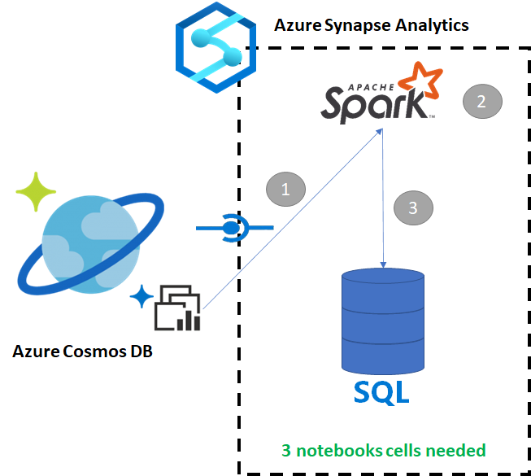
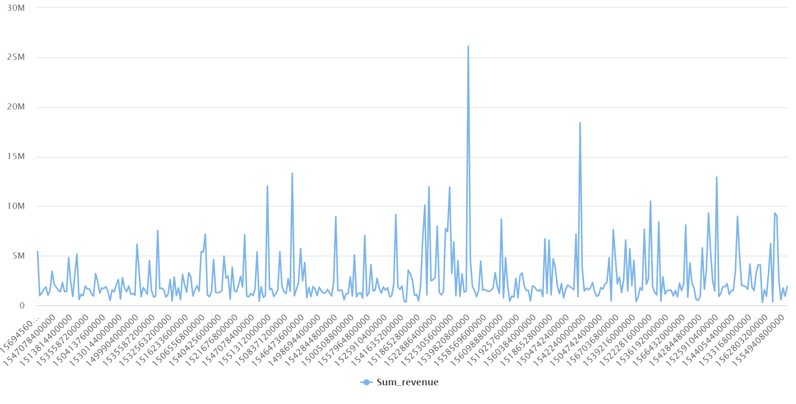

# Copy data from Azure Cosmos DB into a SQL pool using Apache Spark

Azure Synapse Link for Azure Cosmos DB enables users to run near real-time analytics over operational data in Azure Cosmos DB. However, there are times when some data needs to be aggregated and enriched to serve data warehouse users. Curating and exporting Synapse Link data can be done with just a few cells in a notebook.

## Prerequisites
* [Provision a Synapse workspace](../quickstart-create-workspace.md) with:
    * [Spark pool](../quickstart-create-apache-spark-pool-studio.md)
    * [SQL pool](../quickstart-create-sql-pool-studio.md)
* [Provision a Cosmos DB account with a HTAP container with data](../../cosmos-db/configure-synapse-link.md)
* [Connect the Azure Cosmos DB HTAP container to the workspace](./how-to-connect-synapse-link-cosmos-db.md)
* [Have the right setup to import data into a SQL pool from Spark](../spark/synapse-spark-sql-pool-import-export.md)

## Steps
In this tutorial, you will connect to the analytical store so there is no impact on the transactional store (it will not consume any Request Units). We will go through the following steps:
1. Read the Cosmos DB HTAP container into a Spark dataframe
2. Aggregate the results in a new dataframe
3. Ingest the data into a SQL pool

[](../media/synapse-link-spark-to-sql/synapse-spark-to-sql.png#lightbox)

## Data
In that example, we use an HTAP container called **RetailSales**. It is part of a linked service called **ConnectedData**, and has the following schema:
* _rid: string (nullable = true)
* _ts: long (nullable = true)
* logQuantity: double (nullable = true)
* productCode: string (nullable = true)
* quantity: long (nullable = true)
* price: long (nullable = true)
* id: string (nullable = true)
* advertising: long (nullable = true)
* storeId: long (nullable = true)
* weekStarting: long (nullable = true)
* _etag: string (nullable = true)

We will aggregate the sales (*quantity*, *revenue* (price x quantity) by *productCode* and *weekStarting* for reporting purposes. Finally, we will export that data into a SQL pool table called **dbo.productsales**.

## Configure a Spark Notebook
Create a Spark notebook with Scala as Spark (Scala) as the main language. We use the notebook's default setting for the session.

## Read the data in Spark
Read the Cosmos DB HTAP container with Spark into a dataframe in the first cell.

```java
val df_olap = spark.read.format("cosmos.olap").
    option("spark.synapse.linkedService", "ConnectedData").
    option("spark.cosmos.container", "RetailSales").
    load()
```

## Aggregate the results in a new dataframe

In the second cell, we run the transformation and aggregates needed for the new dataframe before loading it into a SQL pool database.

```java
// Select relevant columns and create revenue
val df_olap_step1 = df_olap.select("productCode","weekStarting","quantity","price").withColumn("revenue",col("quantity")*col("price"))
//Aggregate revenue, quantity sold and avg. price by week and product ID
val df_olap_aggr = df_olap_step1.groupBy("productCode","weekStarting").agg(sum("quantity") as "Sum_quantity",sum("revenue") as "Sum_revenue").
    withColumn("AvgPrice",col("Sum_revenue")/col("Sum_quantity"))
```

## Load the results into a SQL pool

In the third cell, we load the data into a SQL pool. It will automatically create a temporary external table, external data source, and external file format that will be deleted once the job is done.

```java
df_olap_aggr.write.sqlanalytics("arnaudpool.dbo.productsales", Constants.INTERNAL)
```

## Query the results with SQL

You can query the result using a simple SQL query such as the following SQL script:
```sql
SELECT  [productCode]
,[weekStarting]
,[Sum_quantity]
,[Sum_revenue]
,[AvgPrice]
 FROM [dbo].[productsales]
```

Your query will present the following results in a chart mode:
[](../media/synapse-link-spark-to-sql/sql-script-spark-sql.png#lightbox)

## Next steps
* [Query Azure Cosmos DB Analytical Store with Apache Spark](./how-to-query-analytical-store-spark.md)