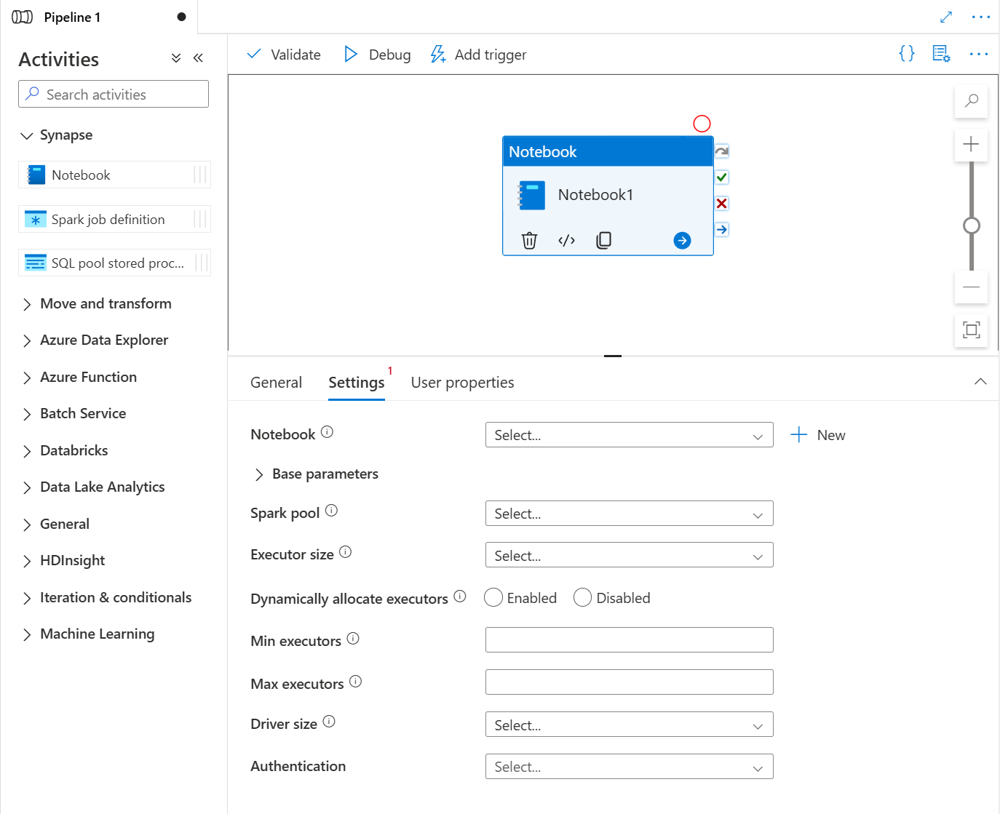
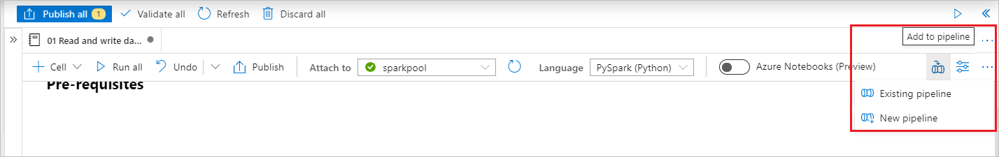
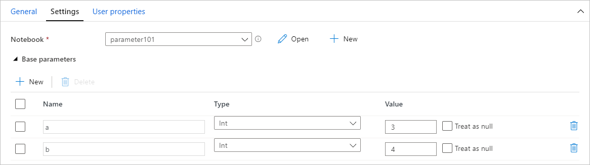
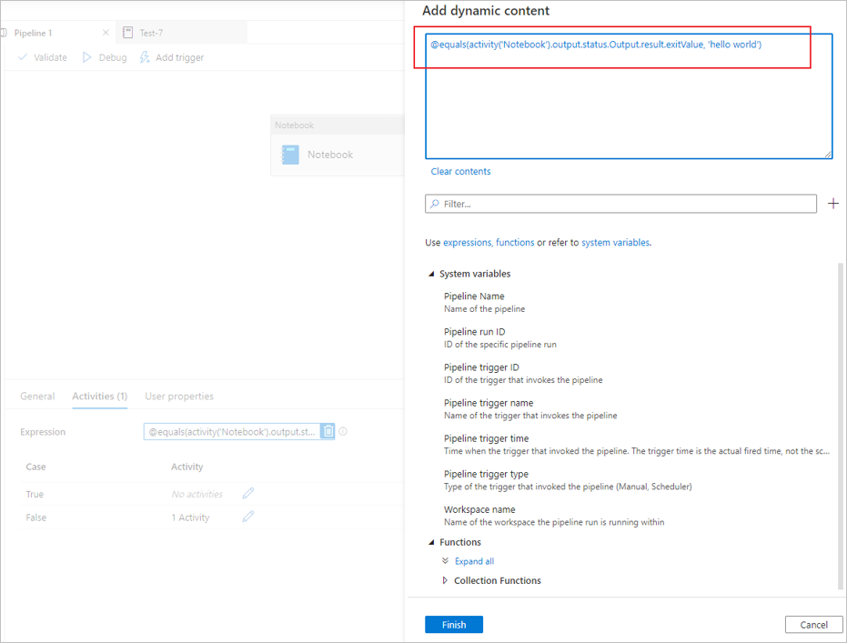
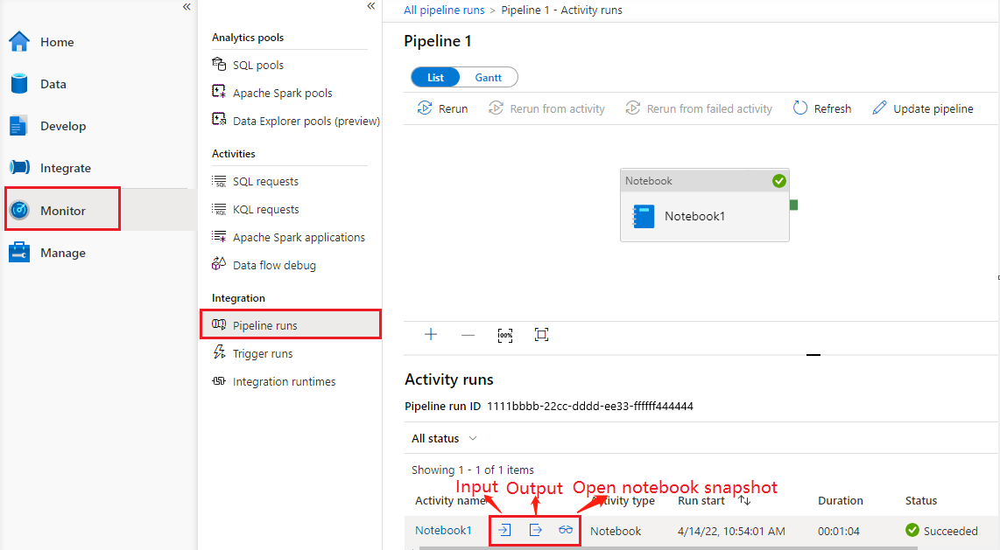
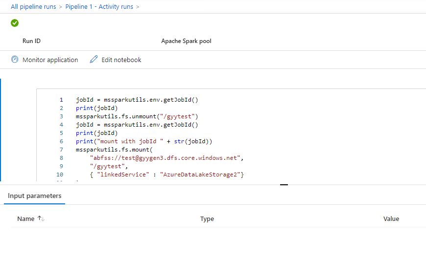

# Transform data by running a Synapse notebook

[!INCLUDE[appliesto-adf-xxx-md](../data-factory/includes/appliesto-xxx-asa-md.md)]

The Azure Synapse notebook activity in a [Synapse pipeline](../data-factory/concepts-pipelines-activities.md) runs a Synapse notebook in your Azure Synapse workspace. This article builds on the [data transformation activities](../data-factory/transform-data.md) article, which presents a general overview of data transformation and the supported transformation activities. 

## Create a Synapse notebook activity

You can create a Synapse notebook activity directly from the Synapse pipeline canvas or from the notebook editor. The Synapse notebook activity runs on the Spark pool that gets chosen in the Synapse notebook. 

### Add a Synapse notebook activity from pipeline canvas

Drag and drop **Synapse notebook** under **Activities** onto the Synapse pipeline canvas. Select on the Synapse notebook activity box and config the notebook content for current activity in the **settings**. You can select an existing notebook from the current workspace or add a new one. 

If you select an existing notebook from the current workspace, you can click the **Open** button to directly open the notebook's page.

(Optional) You can also reconfigure Spark pool\Executor size\Dynamically allocate executors\Min executors\Max executors\Driver size in settings. It should be noted that the settings reconfigured here will replace the settings of the configure session in Notebook. If nothing is set in the settings of the current notebook activity, it will run with the settings of the configure session in that notebook.

> [!div class="mx-imgBorder"]
> 


|  Property   | Description   |  Required   |
| ----- | ----- | ----- |  
|Spark pool| Reference to the Spark pool. You can select Apache Spark pool from the list. If this setting is empty, it will run in the spark pool of the notebook itself.| No |
|Executor size| Number of cores and memory to be used for executors allocated in the specified Apache Spark pool for the session.| No |
|Dynamically allocate executors| This setting maps to the dynamic allocation property in Spark configuration for Spark Application executors allocation.| No |
|Min executors| Min number of executors to be allocated in the specified Spark pool for the job.| No |
|Max executors| Max number of executors to be allocated in the specified Spark pool for the job.| No |
|Driver size| Number of cores and memory to be used for driver given in the specified Apache Spark pool for the job.| No |

> [!NOTE]
> The execution of parallel Spark Notebooks in Azure Synapse pipelines be queued and executed in a FIFO manner, jobs order in the queue is according to the time sequence, the expire time of a job in the queue is 3 days, please notice that queue for notebook only work in synapse pipeline.


### Add a notebook to Synapse pipeline

Select the **Add to pipeline** button on the upper right corner to add a notebook to an existing pipeline or create a new pipeline.



## Passing parameters

### Designate a parameters cell

To parameterize your notebook, select the ellipses (...) to access the **more commands** at the cell toolbar. Then select **Toggle parameter cell** to designate the cell as the parameters cell.

[](./media/synapse-notebook-activity/azure-notebook-toggle-parameter-cell.png#lightbox)

Azure Data Factory looks for the parameters cell and uses the values as defaults for the parameters passed in at execution time. The execution engine will add a new cell beneath the parameters cell with input parameters to overwrite the default values. 


### Assign parameters values from a pipeline

Once you've created a notebook with parameters, you can execute it from a pipeline with the Synapse notebook activity. After you add the activity to your pipeline canvas, you'll be able to set the parameters values under **Base parameters** section on the **Settings** tab. 

[](./media/synapse-notebook-activity/assign-parameter.png#lightbox)

When assigning parameter values, you can use the [pipeline expression language](../data-factory/control-flow-expression-language-functions.md) or [system variables](../data-factory/control-flow-system-variables.md).


## Read Synapse notebook cell output value

You can read the notebook cell output value in the next activities by following the steps below:
1. Call [mssparkutils.notebook.exit](./spark/microsoft-spark-utilities.md#exit-a-notebook) API in your Synapse notebook activity to return the value that you want to show in activity output, for example:  

    ```python
    mssparkutils.notebook.exit("hello world") 
    ```
    
    Saving the notebook content and retrigger the pipeline, the notebook activity output will contain the exitValue that can be consumed for the following activities in step 2. 

2.	Read exitValue property from notebook activity output. 
Here is a sample expression that is used to check whether the exitValue fetched from the notebook activity output equals “hello world”: 

    [](./media/synapse-notebook-activity/synapse-read-exit-value.png#lightbox)


## Run another Synapse notebook 

You can reference other notebooks in a Synapse notebook activity via calling [%run magic](./spark/apache-spark-development-using-notebooks.md#notebook-reference) or [mssparkutils notebook utilities](./spark/microsoft-spark-utilities.md#notebook-utilities). Both support nesting function calls. The key differences of these two methods that you should consider based on your scenario are:

- [%run magic](./spark/apache-spark-development-using-notebooks.md#notebook-reference) copies all cells from the referenced notebook to the %run cell and shares the variable context. When notebook1 references notebook2 via `%run notebook2` and notebook2 calls a [mssparkutils.notebook.exit](./spark/microsoft-spark-utilities.md#exit-a-notebook) function, the cell execution in notebook1 will be stopped. We recommend you use %run magic when you want to "include" a notebook file.
- [mssparkutils notebook utilities](./spark/microsoft-spark-utilities.md#notebook-utilities) calls the referenced notebook as a method or a function. The variable context isn't shared. When notebook1 references notebook2 via `mssparkutils.notebook.run("notebook2")` and notebook2 calls a [mssparkutils.notebook.exit](./spark/microsoft-spark-utilities.md#exit-a-notebook) function, the cell execution in notebook1 will continue. We recommend you use mssparkutils notebook utilities when you want to  "import" a notebook.

## See notebook activity run history

Go to **Pipeline runs** under the **Monitor** tab, you'll see the pipeline you have triggered. Open the pipeline that contains notebook activity to see the run history. 

You can see the latest notebook run snapshot including both cells input and output by selecting the **open notebook** button. 



Open notebook snapshot:



You can see the notebook activity input or output by selecting the **input** or **Output** button. If your pipeline failed with a user error, select the **output** to check the **result** field to see the detailed user error traceback.


## Synapse notebook activity definition

Here's the sample JSON definition of a Synapse notebook activity:

```json
{
    "name": "parameter_test",
    "type": "SynapseNotebook",
    "dependsOn": [],
    "policy": {
        "timeout": "7.00:00:00",
        "retry": 0,
        "retryIntervalInSeconds": 30,
        "secureOutput": false,
        "secureInput": false
    },
    "userProperties": [],
    "typeProperties": {
        "notebook": {
            "referenceName": "parameter_test",
            "type": "NotebookReference"
        },
        "parameters": {
            "input": {
                "value": {
                    "value": "@pipeline().parameters.input",
                    "type": "Expression"
                }
            }
        }
    }
}

```


## Synapse notebook activity output

Here's the sample JSON of a Synapse notebook activity output:

```json
{
{
    "status": {
        "Status": 1,
        "Output": {
            "status": <livySessionInfo>
            },
            "result": {
                "runId": "<GUID>",
                "runStatus": "Succeed",
                "message": "Notebook execution is in Succeeded state",
                "lastCheckedOn": "2021-03-23T00:40:10.6033333Z",
                "errors": {
                    "ename": "",
                    "evalue": ""
                },
                "sessionId": 4,
                "sparkpool": "sparkpool",
                "snapshotUrl": "https://myworkspace.dev.azuresynapse.net/notebooksnapshot/{guid}",
                "exitCode": "abc" // return value from user notebook via mssparkutils.notebook.exit("abc")
            }
        },
        "Error": null,
        "ExecutionDetails": {}
    },

    "effectiveIntegrationRuntime": "DefaultIntegrationRuntime (West US 2)",
    "executionDuration": 234,
    "durationInQueue": {
        "integrationRuntimeQueue": 0
    },
    "billingReference": {
        "activityType": "ExternalActivity",
        "billableDuration": [
            {
                "meterType": "AzureIR",
                "duration": 0.06666666666666667,
                "unit": "Hours"
            }
        ]
    }
}

```
## Known issues
If the notebook name is parametrized in the Pipeline Notebook activity, then the notebook version in unpublished status can't be referenced in the debug runs.
