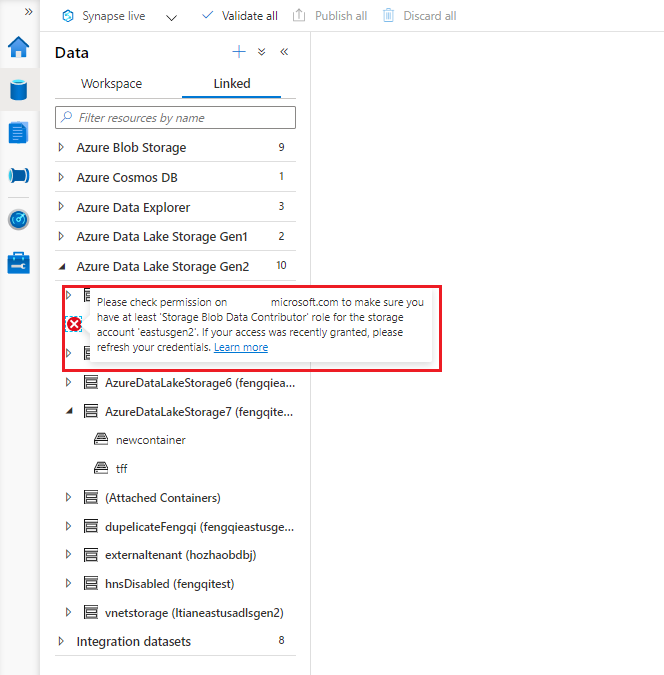
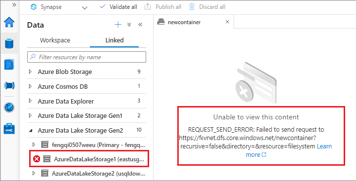

# Troubleshoot connectivity between Azure Synapse Studio and storage

In Azure Synapse Studio (preview), you can explore the resource in the linked or default storage with your account. This guide will help you solve certain connectivity issues when you're trying to access the resource in the storage even though your account already has the permission to access the resource.

## Connectivity issue between Azure Synapse Studio and storage

### Case #1: storage account lack of certain permission

If your storage account is lack of certain permission, you aren't able to expand the storage structure through "Data" --> "Linked" in Synapse Studio. See the issue symptom screenshot below. 

The detailed error message may vary, but the general meaning of the error message is like: "This request is not authorized to perform this operation.".

**SOLUTION**: To assign your account to proper role, see [Use the Azure portal to assign an Azure role for access to blob and queue data](https://docs.microsoft.com/en-us/azure/storage/common/storage-auth-aad-rbac-portal)

### Case #2: Failed to send the request to storage server

When clicking the arrow to expand the storage structure in "Data" --> "Linked" in Synapse Studio, you may meet the "REQUEST_SEND_ERROR" issue in the left panel, See the issue symptom screenshot below:

There might be several possible reasons behind this issue:

#### 1. The storage resource is behind a vNet and a storage private endpoint needs to configure

**SOLUTION**: in this case, you need to configure the storage private endpoint for your storage account. For how to configure the storage private endpoint for vNet, see [Use the Azure portal to assign an Azure role for access to blob and queue data](../security/how-to-connect-to-workspace-from-restricted-network.md).

You can use the command of "nslookup \<storage-account-name\>.dfs.core.windows.net" to check the connectivity after the storage private endpoint is configured. It should return some strings like: "\<storage-account-name\>.privatelink.dfs.core.windows.net".

#### 2. The storage resource is not behind a vNet but the Blob service (Azure AD) endpoint is not accessible due to firewall configured

**SOLUTION**: in this case, you need to go to portal tab of "**Connectivity check**" under your storage account page to check the "**Blob service (Azure AD)**" connectivity status. If it is not accessible, follow the promoted guide to check the "**Firewalls and virtual networks**" configuration under your storage account page. For more information about the storage firewalls, see [Configure Azure Storage firewalls and virtual networks](https://docs.microsoft.com/en-us/azure/storage/common/storage-network-security).

#### 3. Known issues 

* The storage resource you are accessing is Azure Data Lake Storage Gen2 and is behind the firewall and vNet (with storage private endpoint configured) at the same time.
* The container resource you are accessing has been deleted or doesn't exist.

## Next steps
If the previous steps don't help to resolve your issue, [create a support ticket](../../sql-data-warehouse/sql-data-warehouse-get-started-create-support-ticket.md).
