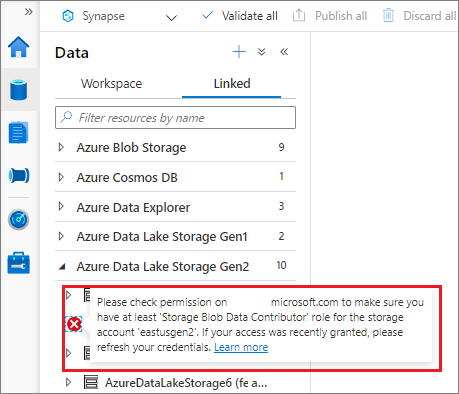
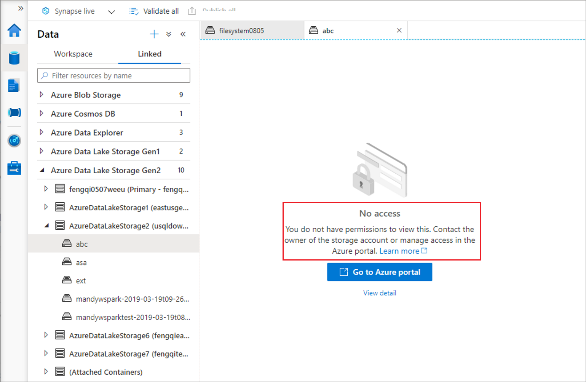
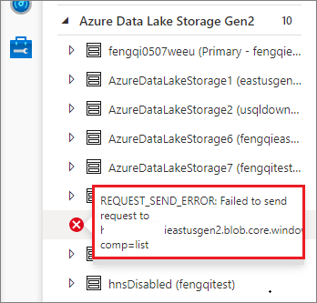
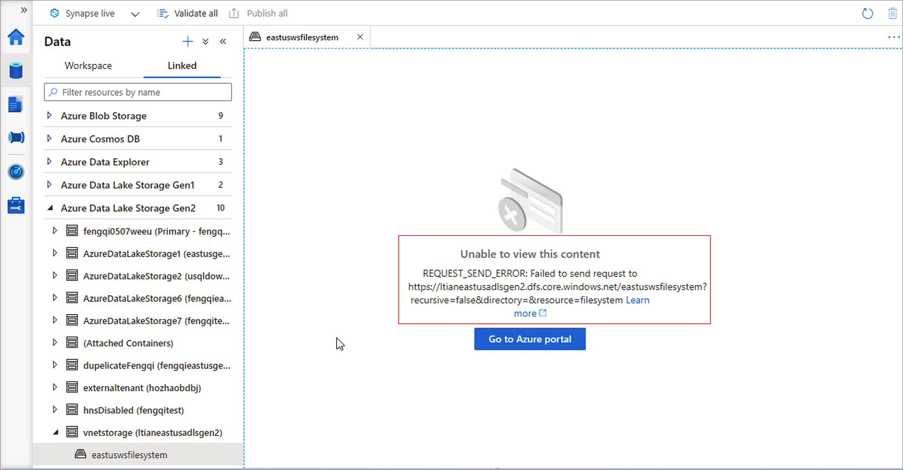

# Troubleshoot connectivity between Azure Synapse Analytics Synapse Studio and storage

In Synapse Studio, you can explore data resources located in your linked storage. This guide will help you solve connectivity issues when you're trying to access your data resources. 

## Case #1: Storage account lacks proper permissions

If your storage account lacks the proper permissions, you aren't able to expand the storage structure through "Data" --> "Linked" in Synapse Studio. See the issue symptom screenshot below. 

The detailed error message may vary, but the general meaning of the error message is: "This request is not authorized to perform this operation.".

In the linked storage node:  

In the storage container node:  

**SOLUTION**: To assign your account to the proper role, see [Use the Azure portal to assign an Azure role for access to blob and queue data](../../storage/blobs/assign-azure-role-data-access.md)

## Case #2: Failed to send the request to storage server

When selecting the arrow to expand the storage structure in "Data" --> "Linked" in Synapse Studio, you may see the "REQUEST_SEND_ERROR" issue in the left panel. See the issue symptom screenshot below:

In the linked storage node:  

In the storage container node:  

There might be several possible reasons behind this issue:

### The storage resource is behind a vNet and a storage private endpoint needs to configure

**SOLUTION**: In this case, you need to configure the storage private endpoint for your storage account. For how to configure the storage private endpoint for vNet, see [Use the Azure portal to assign an Azure role for access to blob and queue data](../security/how-to-connect-to-workspace-from-restricted-network.md).

You can use the command "nslookup \<storage-account-name\>.dfs.core.windows.net" to check the connectivity after the storage private endpoint is configured. It should return a string similar to: "\<storage-account-name\>.privatelink.dfs.core.windows.net".

### The storage resource is not behind a vNet but the Blob service (Microsoft Entra ID) endpoint is not accessible due to firewall configured

**SOLUTION**: In this case, you need to open your storage account in the Azure portal. In the left navigation scroll down to **Support + troubleshooting** and select **Connectivity check** to check the **Blob service (Microsoft Entra ID)** connectivity status. If it is not accessible, follow the promoted guide to check the **Firewalls and virtual networks** configuration under your storage account page. For more information about storage firewalls, see [Configure Azure Storage firewalls and virtual networks](../../storage/common/storage-network-security.md).

### Other issues to check 

* The storage resource you are accessing is Azure Data Lake Storage Gen2 and is behind a firewall and vNet (with storage private endpoint configured) at the same time.
* The container resource you are accessing has been deleted or doesn't exist.
* Crossing-tenant: the workspace tenant that user used to login is not same with the tenant of the storage account. 

## Next steps
If the previous steps don't help to resolve your issue, [create a support ticket](../sql-data-warehouse/sql-data-warehouse-get-started-create-support-ticket.md).
