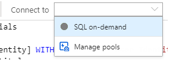
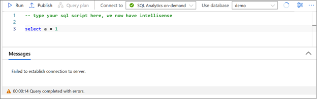
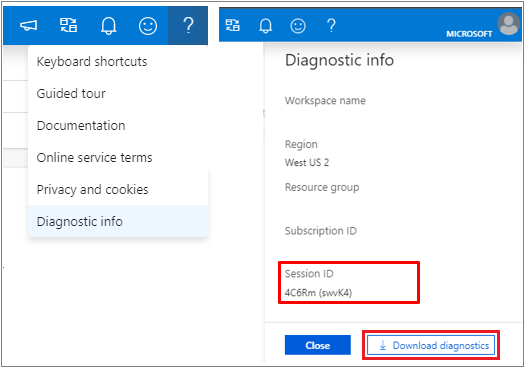
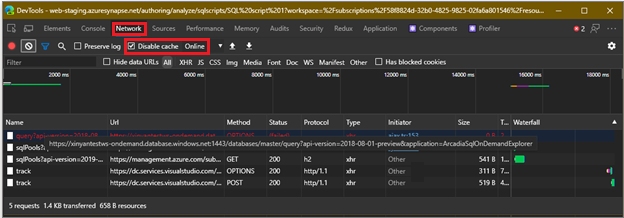
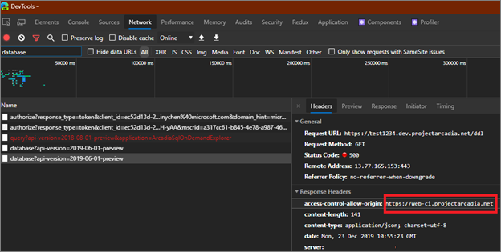
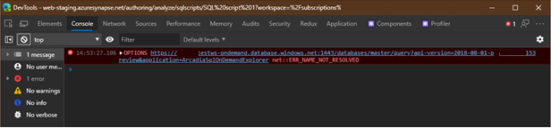
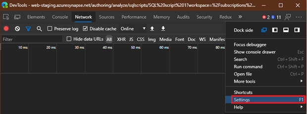
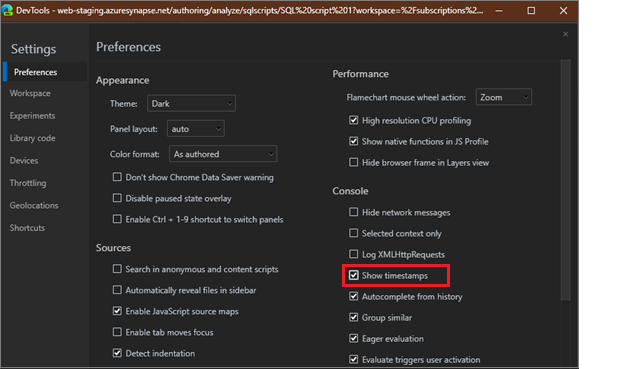

# Synapse Studio troubleshooting

This trouble-shooting guide provides instruction on what information to provide when opening a support ticket on network connectivity issues. With the proper information, we can possibly resolve the issue more quickly.

## Serverless SQL pool service connectivity issue

### Symptom 1

"Serverless SQL pool" option is grayed out in the "Connect to" dropdown.



### Symptom 2

Running the query with "serverless SQL pool" gives you the "Failed to establish connection to server" error message.


 

### Troubleshooting steps

> [!NOTE] 
>    The following troubleshooting steps are for Chromium Edge and Chrome. You may use other browsers (such as FireFox) with the same troubleshooting steps, but the "Developer Tool" window may have different layout from the screenshots in this TSG. If possible, DO NOT use classical Edge for troubleshooting, as it may show inaccurate information in certain situation.

Open the "Diagnostic Info" panel, select the "Download Diagnostic" button. Keep the downloaded information for error reporting. You can instead, copy the "Session ID" and attach it when opening the support ticket.



To begin troubleshooting, retry the operation you performed in Synapse Studio.

- For symptom 1, select the "Refresh" button to the right of the "Use database" dropdown in the "SQL script" tab and check whether you can see "serverless SQL pool".
- For symptom 2, try running the query again to see if it executes successfully.

If the problem still exists, press F12 in your browser to open "Developer Tools" (DevTools).

In the "Developer Tools" window, switch to the "Network" panel. Select the  "Clear" button on the toolbar in "Network" panel if necessary.
Make sure "Disable cache" in "Network" panel is checked.

Retry the operation you performed in Azure Synapse Studio. You may see new items shown in the "Network" list in "Developer Tools". Note your current system time to provide in the support ticket.



Find the item whose Url column matches the following pattern:

`https://[*A*]-ondemand.database.windows.net:1443/databases/[*B*]/query?api-version=2018-08-01-preview&application=ArcadiaSqlOnDemandExplorer`

Where [*A*] is your workspace name, and "-ondemand" could be "-sqlod" and where [*B*] should be a database name, such as "master". There should be at most two items with the same URL value but different method values; OPTIONS and POST. Check whether these two items have "200" or "20x" under the status column, where "x" could be any single digit.

If either one of them has something other than "20x" and:

- Status starts with "(failed)", either widen the "Status" column or hover your pointer over the status text to see the complete text. Include the text and/or screenshot when opening the support ticket.

    

    - If you see ERR_NAME_NOT_RESOLVED and you created your workspace within 10 minutes, wait for 10 minutes and retry to see whether the problem still exists.
    - If you see ERR_INTERNET_DISCONNECTED or ERR_NETWORK_CHANGED, it may indicate your PC network connection is having issues. Check your network connection and retry the operation.
    - If you see ERR_CONNECTION_RESET, ERR_SSL_PROTOCOL_ERROR or other error codes containing "SSL", it may indicate your local SSL configuration is having issues, or your network administrator has blocked access to the serverless SQL pool server. Open a support ticket and attach the error code in the description.
    - If you see ERR_NETWORK_ACCESS_DENIED, you may need to check with the administrator on whether your local firewall policy has blocked access to either *.database.windows.net domain, or remote port 1443.
    - Optionally, try the same operation immediately on a different machine and/or network environment to rule out a network configuration issue on your PC.

- Status is "40x", "50x", or other numbers, select on the item(s) to see the details. You should see the item details to the right. Find the "Response Header" section; then check whether an item named "access-control-allow-origin" exists. If so, check whether it has one of the following values:

    - `*` (single asterisk)
    - https://web.azuresynapse.net/ (or other value that the text in your browser address bar starts with)

If the response header contains one of the above values, it means we should have already collected the failure information. You can open a support ticket if needed, and optionally attach the screenshot of the item details.

If you can't see the header, or the header does not have one of the values listed above, attach a screenshot of the item details when you open the ticket.

 

 
If the steps above do not solve your issue, you may need to open a support ticket. When submitting your support ticket, include the "Session ID" or "Diagnostic Info" downloaded at the beginning of this guide.

When reporting the issue, you may optionally take a screenshot of your "Console" tab in the "Developer Tools" and attach it to the support ticket. Scroll the content and take more than one screenshot if necessary to capture the entire message.



If you're attaching screenshots, provide the time (or an estimated time range) of when you took the screenshots. It will help us when looking into the problem.

Certain browsers support showing timestamps in the "Console" tab. For Chromium Edge/Chrome, open the "Settings" dialog in "Developer Tools", and check "Show timestamps" in "Preferences" tab.





## Notebook websocket connection issue

### Symptom
Error message shows: your notebook connection has closed unexpectedly. To re-establish the connection, run the notebook again. Diagnostic information: websocket_close_error (correlation id) 


### Root cause: 
Notebook execution depends on establishing a WebSocket connection to the following URL 
``` 
wss://{workspace}.dev.azuresynapse.net/jupyterApi/versions/1/sparkPools/{spark-pool}/api/kernels/{kernel-id}/channels 
``` 

+ **{workspace}** is the name of Synapse workspace, 
+ **{spark-pool}** is the name of Spark pool you are currently working on, 
+ **{kernel-id}** is a GUID used for distinguishing notebook sessions. 

When setting up WebSocket connection, Synapse Studio will include an access token (JWT bearer token) in the Sec-WebSocket-Protocol header of the WebSocket request. 

Sometimes, WebSocket request might be blocked, or JWT token in the request header might be redacted in your network environment. This will cause Synapse Notebook unable to establish the connection to our server and run your notebook. 

### Action: 

If possible, please try to switch your network environment, such as inside/outside corpnet, or access Synapse Notebook on another workstation. 

+ If you can run notebook on the same workstation but in a different network environment, please work with your network administrator to find out whether the WebSocket connection has been blocked. 

+ If you can run notebook on a different workstation but in the same network environment, please ensure you didn’t install any browser plugin that may block the WebSocket request. 

Otherwise, please contact your network administrator and ensure the outbound WebSocket requests with the following URL pattern is allowed and their request header is not redacted: 

``` 
wss://{workspace}.dev.azuresynapse.net/{path} 
``` 
+ **{workspace}** is the Synapse workspace name; 

+ **{path}** indicates any sub-path (i.e., slash character is included) in URI. 

This URL pattern is looser than the one shown in “Root Cause” section because it allows for us adding new WebSocket-dependent features to Synapse without any potential connectivity issue in the future. 


## Next steps
If the previous steps don't help to resolve your issue [Create a support ticket](../sql-data-warehouse/sql-data-warehouse-get-started-create-support-ticket.md?bc=%2fazure%2fsynapse-analytics%2fbreadcrumb%2ftoc.json&toc=%2fazure%2fsynapse-analytics%2ftoc.json)
