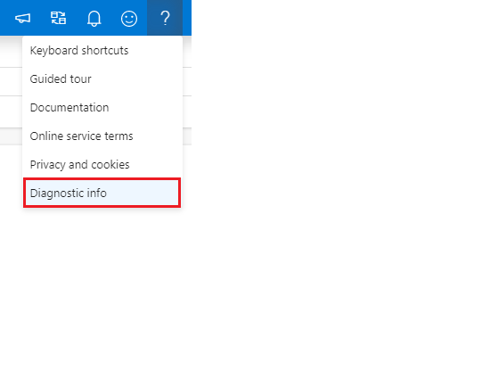

# Azure Synapse Studio troubleshooting

This trouble-shooting guide helps you to provide more information when opening a support ticket on network connectivity issues, so we may be able to resolve the issue more quickly.

## SQL on-demand service connectivity issue

### Symptom 1

You cannot see “SQL on-demand” option in the “Connect to” dropdown.

> [!div class="mx-imgBorder"]
> 

### Symptom 2

Running the query with “SQL on-demand” gives you the “Failed to establish connection to server” error message.

## Troubleshooting steps

> [!NOTE] 
>•	The following troubleshooting steps are for Chromium Edge and Chrome. You may use other browsers (such as FireFox) with the same troubleshooting steps, but the “Devloper Tool” window may have different layout from the screenshots in this TSG.
>•	If possible, DO NOT use classical Edge for troubleshooting, as it may show inaccurate information in certain situation.

Open “Diagnostic Info” panel, click “Download Diagnostic” button and keep it for error reporting. Alternatively, you may copy “Session ID” and attach it when opening the support ticket.

To begin with, retry the operation you have performed in Synapse Studio.
•	For Symptom 1, click “Refresh” button to the right of “Use database” dropdown in “SQL script” tab and check whether you can see “SQL on-demand”.
•	For Symptom 2, try running the query again and see whether you can execute the query successfully.
If the problem still exists, Press F12 in your browser to open “Developer Tools” (DevTools).
In “Developer Tools” window, switch to “Network” panel. Click “Clear” button on the toolbar in “Network” panel if necessary.
Make sure “Disable cache” in “Network” panel is checked.
Retry the operation you have performed in Synapse Studio, and you may see new items shown in the “Network” list in “Developer Tools”. Keep record of your current system time and provide it in the support ticket.

Introductory paragraph.
<!---Required:
The introductory paragraph helps customers quickly determine whether an article is relevant.
Describe in customer-friendly terms what the service is and does, and why the customer should care. Keep it short for the intro.
You can go into more detail later in the article. Many services add artwork or videos below the introduction.
--->

<!---Avoid notes, tips, and important boxes. Readers tend to skip over them. Better to put that info directly into the article text.--->

<!---Screenshots and videos can add another way to show and tell the overview story. But don’t overdo them. Make sure that they offer value for the overview.
If users access your product/service via a web browser, the first screenshot should always include the full browser window in Chrome or Safari. This is to show users that the portal is browser-based - OS and browser agnostic.

--->

## <article body>
<!---
After the intro, you can develop your overview by discussing the features that answer the "Why should I care" question with a bit more depth.
Be sure to call out any basic requirements and dependencies, as well as limitations or overhead.
Don't catalog every feature, and some may only need to be mentioned as available, without any discussion.
--->

## <Top task>
<!---Suggested:
An effective way to structure you overview article is to create an H2 for the top customer tasks identified in milestone one of the [APEX content model](contribute-get-started-mvc.md) and describe how the product/service helps customers with that task.
Create a new H2 for each task you list.

--->

## Next steps

<!---Some context for the following links goes here--->
<!--- [link to next logical step for the customer](quickstart-view-occupancy.md)--->

<!--- Required:
In Overview articles, provide at least one next step and no more than three.
Next steps in overview articles will often link to a quickstart.
Use regular links; do not use a blue box link. What you link to will depend on what is really a next step for the customer.
Do not use a "More info section" or a "Resources section" or a "See also section".

--->