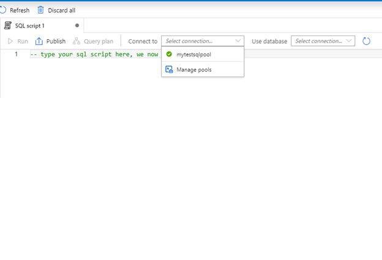
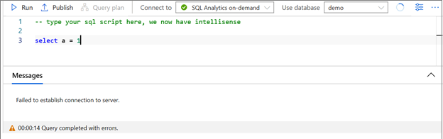
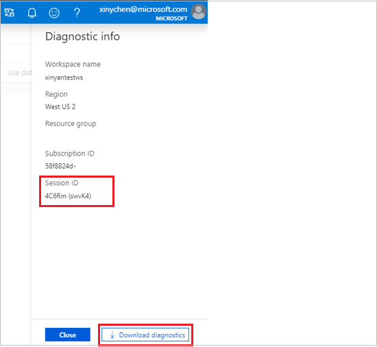
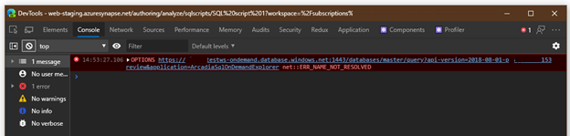
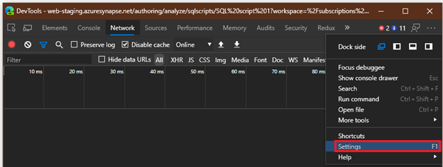

# Azure Synapse Studio troubleshooting

This trouble-shooting guide helps you to provide more information when opening a support ticket on network connectivity issues, so we may be able to resolve the issue more quickly.

## SQL on-demand service connectivity issue

### Symptom 1

You cannot see “SQL on-demand” option in the “Connect to” dropdown.

### Symptom 2

Running the query with “SQL on-demand” gives you the “Failed to establish connection to server” error message.

## Troubleshooting steps

> [!NOTE] 
>	The following troubleshooting steps are for Chromium Edge and Chrome. You may use other browsers (such as FireFox) with the same troubleshooting steps, but the “Developer Tool” window may have different layout from the screenshots in this TSG. If possible, DO NOT use classical Edge for troubleshooting, as it may show inaccurate information in certain situation.

Open “Diagnostic Info” panel, click “Download Diagnostic” button and keep it for error reporting. Alternatively, you may copy “Session ID” and attach it when opening the support ticket.

To begin with, retry the operation you have performed in Synapse Studio.

- For Symptom 1, click “Refresh” button to the right of “Use database” dropdown in “SQL script” tab and check whether you can see “SQL on-demand”.
- For Symptom 2, try running the query again and see whether you can execute the query successfully.

If the problem still exists, Press F12 in your browser to open “Developer Tools” (DevTools).
In “Developer Tools” window, switch to “Network” panel. Click “Clear” button on the toolbar in “Network” panel if necessary.
Make sure “Disable cache” in “Network” panel is checked.
Retry the operation you have performed in Synapse Studio, and you may see new items shown in the “Network” list in “Developer Tools”. Keep record of your current system time and provide it in the support ticket.

Find the item whose Url column matches the following pattern:

`https://[*A*]-ondemand.database.windows.net:1443/databases/[*B*]/query?api-version=2018-08-01-preview&application=ArcadiaSqlOnDemandExplorer`

Where [*A*] should be your workspace name, and “-ondemand” could be “-sqlod”. [*B*] should be a database name, such as “master”. There should be at most two items with the same Url value but different Method values; one is OPTIONS, the other is POST. Check whether these two items have “200” or “20x” under Status column, where “x” could be any single digit.
If either one of them has something other than “20x” under “Status” column:

- if Status starts with “(failed)”, either widen the “Status” column or hover your pointer to the status text to see the complete text. Please include such text and/or screenshot when opening the support ticket.

    

    - If you see ERR_NAME_NOT_RESOLVED and you have just created workspace within 10 minutes ago, you may wait for 10 minutes and retry the whole TSG procedure to see whether the problem still exists.
    - If you see ERR_INTERNET_DISCONNECTED or ERR_NETWORK_CHANGED, it may indicate your PC network connection is having issue. You may check your network connection and retry the operation.
    - If you see ERR_CONNECTION_RESET, ERR_SSL_PROTOCOL_ERROR or other error codes containing “SSL”, it may indicate your local SSL configuration is having issue, or your network administrator is blocking access to the SQL On-demand server. You may open the support ticket to us and please attach the error code in the description.
    - If you see ERR_NETWORK_ACCESS_DENIED, you may need to check with the administrator on whether your local firewall policy has blocked access to either *.database.windows.net domain, or remote port 1443.
    - Optionally, you may try the same operation immediately on a different machine and/or network environment and see if the problem still exists. This helps to rule out the case of the network configuration issue on your PC.

- If Status is “40x”, “50x”, or other numbers, click on the item(s) to see the details. You should now see the item details to the right-hand-side. Find the “Response Header” section; then check whether an item named “access-control-allow-origin” exists. If so, check whether it has one of the following values:
    - `*` (single asterisk)
    - https://web.azuresynapse.net/ (or other value that the text in your browser “Address” bar starts with)

If you can see such header, it means we should have already collected such failure information. You may go on opening the support ticket if needed, and optionally attach the screenshot of the item details.

If you cannot see such header, or the header does have one of the values listed above, please attach a screenshot of the item details when you open the ticket.

If the steps above do not solve your issue, you may need to open a support ticket with your “Session ID” copied or “Diagnostic Info” downloaded at the beginning of this TSG.

When reporting the issue, you may optionally take a screenshot of your “Console” tab in the “Developer Tools” and attach it to the support ticket. Please scroll the content to the end if there is a scroll bar.

If you are attaching any screenshots, please also provide the time (or an estimated time range) when you took the screenshots. It will help us looking into the problem.

Certain browsers support showing timestamps in the “Console” tab. For Chromium Edge / Chrome, you may open “Settings” dialog in “Developer Tools”, and check “Show timestamps” in “Preferences” tab.

## Next steps
<!---[Create a support ticket]()
--->