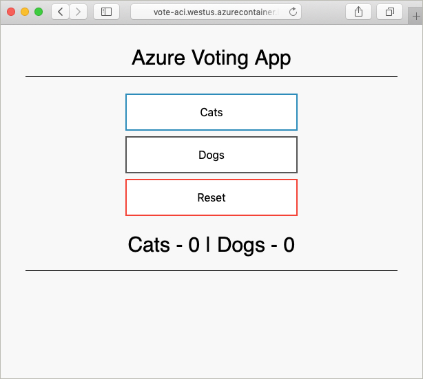

# Create a Terraform configuration for Azure

In this example, you gain experience in creating a Terraform configuration and deploying this configuration to Azure. When completed, you will have deployed an Azure Cosmos DB instance, an Azure Container Instance, and an application that works across these two resources. This document assumes that all work is completed in Azure Cloud Shell, which has Terraform tooling pre-installed. If you would like to work through the example on your own system, Terraform can be installed using the instructions found [here](../virtual-machines/linux/terraform-install-configure.md).

## Create first configuration

In this section, you will create the configuration for an Azure Cosmos DB instance.

Select **try it now** to open up Azure cloud shell. Once open, enter in `code .` to open the cloud shell code editor.

```azurecli-interactive
code .
```

Copy and paste in the following Terraform configuration.

This configuration models an Azure resource group, a random integer, and an Azure Cosmos DB instance. The random integer is used in Cosmos DB instance name. Several Cosmos DB settings are also configured. For a complete list of Cosmos DB Terraform configurations, see the [Cosmos DB Terraform reference](https://www.terraform.io/docs/providers/azurerm/r/cosmosdb_account.html).

Save the file as `main.tf` when done. This operation can be done using the ellipses in the upper right-hand portion of the code editor.

```azurecli-interactive
resource "azurerm_resource_group" "vote-resource-group" {
  name     = "vote-resource-group"
  location = "westus"
}

resource "random_integer" "ri" {
  min = 10000
  max = 99999
}

resource "azurerm_cosmosdb_account" "vote-cosmos-db" {
  name                = "tfex-cosmos-db-${random_integer.ri.result}"
  location            = "${azurerm_resource_group.vote-resource-group.location}"
  resource_group_name = "${azurerm_resource_group.vote-resource-group.name}"
  offer_type          = "Standard"
  kind                = "GlobalDocumentDB"

  consistency_policy {
    consistency_level       = "BoundedStaleness"
    max_interval_in_seconds = 10
    max_staleness_prefix    = 200
  }

  geo_location {
    location          = "westus"
    failover_priority = 0
  }
}
```

The [terraform init](https://www.terraform.io/docs/commands/init.html) command initializes the working directory. Run `terraform init` in the cloud shell terminal to prepare for the deployment of the new configuration.

```azurecli-interactive
terraform init
```

The [terraform plan](https://www.terraform.io/docs/commands/plan.html) command can be used to validate that the configuration is properly formatted and to visualize what resources will be created, updated, or destroyed. The results can be stored in a file and used at a later time to apply the configuration.

Run `terraform plan` to test the new Terraform configuration.

```azurecli-interactive
terraform plan --out plan.out
```

Apply the configuration using [terraform apply](https://www.terraform.io/docs/commands/apply.html) and specifying the name of the plan file. This command deploys the resources in your Azure subscription.

```azurecli-interactive
terraform apply plan.out
```

Once done, you can see that the resource group has been created and an Azure Cosmos DB instance placed in the resource group.

## Update configuration

Update the configuration to include an Azure Container Instance. The container runs an application that reads and writes data to the Cosmos DB.

Copy the following configuration to the bottom of the `main.tf` file. Save the file when done.

Two environment variables are set, `COSMOS_DB_ENDPOINT` and `COSMOS_DB_MASTERKEY`. These variables hold the location and key for accessing the database. The values for these variables are obtained from the database instance created in the last step. This process is known as interpolation. To learn more about Terraform interpolation, see [Interpolation Syntax](https://www.terraform.io/docs/configuration/interpolation.html).


The configuration also includes an output block, which returns the fully qualified domain name (FQDN) of the container instance.

```azurecli-interactive
resource "azurerm_container_group" "vote-aci" {
  name                = "vote-aci"
  location            = "${azurerm_resource_group.vote-resource-group.location}"
  resource_group_name = "${azurerm_resource_group.vote-resource-group.name}"
  ip_address_type     = "public"
  dns_name_label      = "vote-aci"
  os_type             = "linux"

  container {
    name   = "vote-aci"
    image  = "microsoft/azure-vote-front:cosmosdb"
    cpu    = "0.5"
    memory = "1.5"
    ports {
      port     = 80
      protocol = "TCP"
    }

    secure_environment_variables {
      "COSMOS_DB_ENDPOINT"  = "${azurerm_cosmosdb_account.vote-cosmos-db.endpoint}"
      "COSMOS_DB_MASTERKEY" = "${azurerm_cosmosdb_account.vote-cosmos-db.primary_master_key}"
      "TITLE"               = "Azure Voting App"
      "VOTE1VALUE"          = "Cats"
      "VOTE2VALUE"          = "Dogs"
    }
  }
}

output "dns" {
  value = "${azurerm_container_group.vote-aci.fqdn}"
}
```

Run `terraform plan` to create the updated plan and visualize the changes to be made. You should see that an Azure Container Instance resource has been added to the configuration.

```azurecli-interactive
terraform plan --out plan.out
```

Finally, run `terraform apply` to apply the configuration.

```azurecli-interactive
terraform apply plan.out
```

Once completed, take note of the container instance FQDN.

## Test application

Navigate to the FQDN of the container instance. If everything was correctly configured, you should see the following application.



## Clean up resources

When done, the Azure resources and resource group can be removed using the [terraform destroy](https://www.terraform.io/docs/commands/destroy.html) command.

```azurecli-interactive
terraform destroy -auto-approve
```

## Next steps

In this example, you created, deployed, and destroyed a Terraform configuration. For more information on using Terraform in Azure, see the Azure Terraform provider documentation.

> [!div class="nextstepaction"]
> [Azure Terraform provider](https://www.terraform.io/docs/providers/azurerm/)
