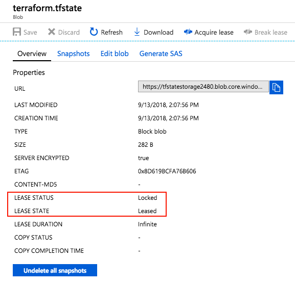

# Store Terraform state in Azure Storage

Terraform state is used to reconcile deployed resources with Terraform configurations. Using state, Terraform knows what Azure resources to add, update, or delete. By default, Terraform state is stored locally when running *Terraform apply*. This configuration is not ideal for a few reasons:

- Local state does not work well in a team or collaborative environment
- Terraform state can include sensitive information
- Storing state locally increases the chance of inadvertent deletion

Terraform includes the concept of a state backend, which is remote storage for Terraform state. When using a state backend, the state file is stored in a data store such as Azure Storage. This document details how to configure and use Azure Storage as a Terraform state backend.

## Configure storage account

Before using Azure Storage as a backend, a storage account must be created. The storage account can be created with the Azure portal, PowerShell, the Azure CLI, or Terraform itself. Use the following sample to configure the storage account with the Azure CLI.

```azurecli-interactive
#!/bin/bash

RESOURCE_GROUP_NAME=tstate
STORAGE_ACCOUNT_NAME=tstate$RANDOM
CONTAINER_NAME=tstate

# Create resource group
az group create --name $RESOURCE_GROUP_NAME --location eastus

# Create storage account
az storage account create --resource-group $RESOURCE_GROUP_NAME --name $STORAGE_ACCOUNT_NAME --sku Standard_LRS --encryption-services blob

# Get storage account key
ACCOUNT_KEY=$(az storage account keys list --resource-group $RESOURCE_GROUP_NAME --account-name $STORAGE_ACCOUNT_NAME --query [0].value -o tsv)

# Create blob container
az storage container create --name $CONTAINER_NAME --account-name $STORAGE_ACCOUNT_NAME --account-key $ACCOUNT_KEY

echo "storage_account_name: $STORAGE_ACCOUNT_NAME"
echo "container_name: $CONTAINER_NAME"
echo "access_key: $ACCOUNT_KEY"
```

Take note of the storage account name, container name, and storage access key. These values are needed when configuring the remote state.

## Configure state backend

The Terraform state backend is configured when running *Terraform init*. In order to configure the state backend, the following data is required.

- storage_account_name - The name of the Azure Storage account.
- container_name - The name of the blob container.
- key - The name of the state store file to be created.
- access_key - The storage access key.

Each of these values can be specified in the Terraform configuration file or on the command line, however it is recommended to use an environment variable for the `access_key`. Using an environment variable prevents the key from being written to disk.

Create an environment variable named `ARM_ACCESS_KEY` with the value of the Azure Storage access key.

```console
export ARM_ACCESS_KEY=<storage access key>
```

To further protect the Azure Storage account access key, store it in Azure Key Vault. The environment variable can then be set using a command similar to the following. For more information on Azure Key Vault, see the [Azure Key Vault documentation][azure-key-vault].

```console
export ARM_ACCESS_KEY=$(az keyvault secret show --name terraform-backend-key --vault-name myKeyVault --query value -o tsv)
```

To configure Terraform to use the backend, include a *backend* configuration with a type of *azurerm* inside of the Terraform configuration. Add the *storage_account_name*, *container_name*, and *key* values to the configuration block.

The following example configures a Terraform backend and creates an Azure resource group. Replace the values with values from your environment.

```json
terraform {
  backend "azurerm" {
    storage_account_name  = "tstate09762"
    container_name        = "tstate"
    key                   = "terraform.tfstate"
  }
}

resource "azurerm_resource_group" "state-demo-secure" {
  name     = "state-demo"
  location = "eastus"
}
```

Now, initialize the configuration with *Terraform init* and then run the configuration with *Terraform apply*. When completed, you can find the state file in the Azure Storage Blob.

## State locking

When using an Azure Storage Blob for state storage, the blob is automatically locked before any operation that writes state. This configuration prevents multiple concurrent state operations, which can cause corruption. For more information, see [State Locking][terraform-state-lock] on the Terraform documentation.

The lock can be seen when examining the blob through the Azure portal or other Azure management tooling.



## Encryption at rest

By default, data stored in an Azure Blob is encrypted before being persisted to the storage infrastructure. When Terraform needs state, it is retrieved from the backend and stored in memory on your development system. In this configuration, state is secured in Azure Storage and not written to your local disk.

For more information on Azure Storage encryption, see [Azure Storage Service Encryption for data at rest][azure-storage-encryption].

## Next steps

Learn more about Terraform backend configuration at the [Terraform backend documentation][terraform-backend].

<!-- LINKS - internal -->
[azure-key-vault]: ../key-vault/quick-create-cli.md
[azure-storage-encryption]: ../storage/common/storage-service-encryption.md

<!-- LINKS - external -->
[terraform-azurerm]: https://www.terraform.io/docs/backends/types/azurerm.html
[terraform-backend]: https://www.terraform.io/docs/backends/
[terraform-state-lock]: https://www.terraform.io/docs/state/locking.html
