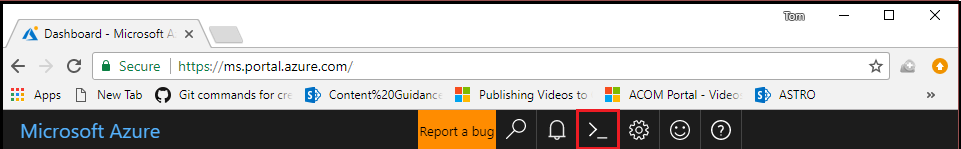
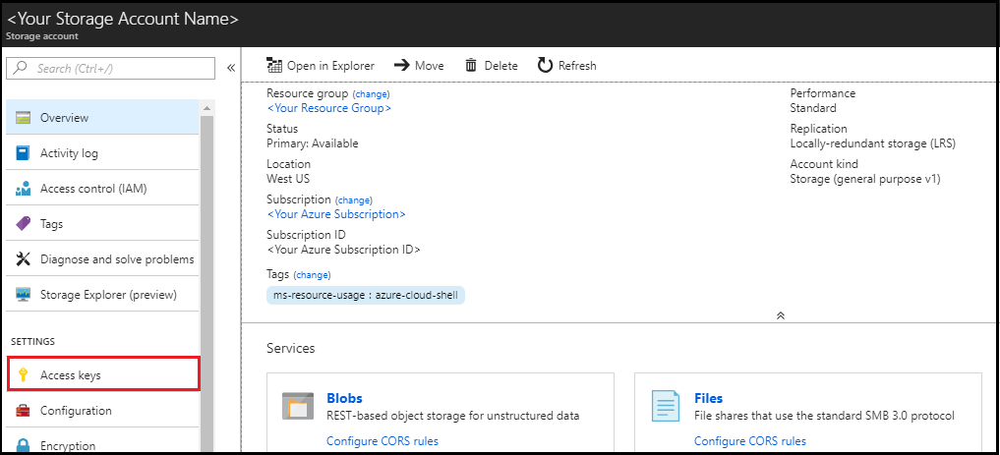
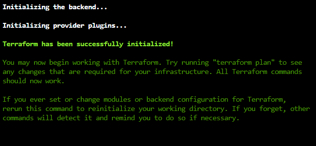
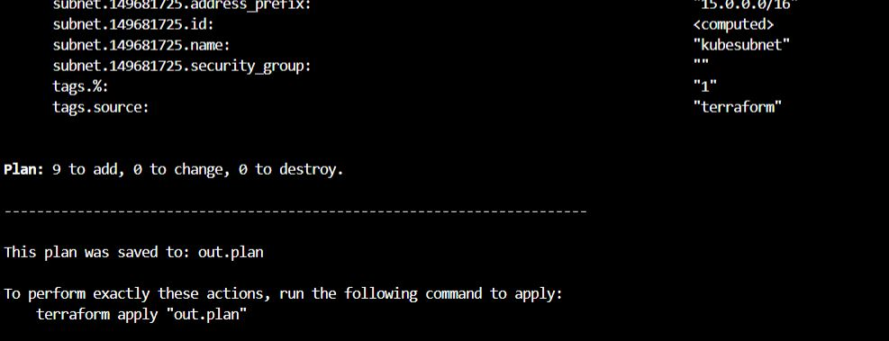
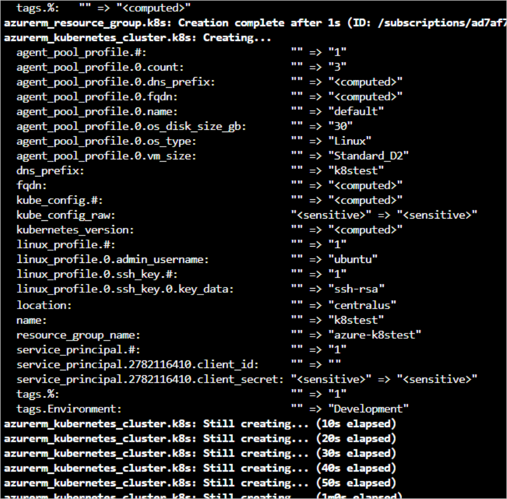
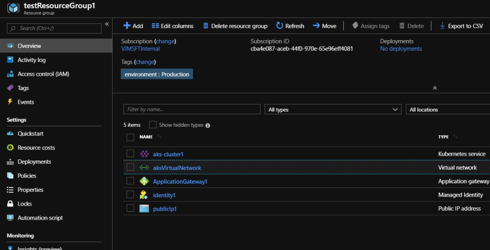

# Create a Kubernetes cluster with Application Gateway ingress controller using Azure Kubernetes Service and Terraform
[Azure Kubernetes Service (AKS)](/azure/aks/) manages your hosted Kubernetes environment. AKS makes it quick and easy to deploy and manage containerized applications without container orchestration expertise. It also eliminates the burden of ongoing operations and maintenance by provisioning, upgrading, and scaling resources on demand, without taking your applications offline.

An ingress controller is a piece of software that provides reverse proxy, configurable traffic routing, and TLS termination for Kubernetes services. Kubernetes ingress resources are used to configure the ingress rules and routes for individual Kubernetes services. Using an ingress controller and ingress rules, a single IP address can be used to route traffic to multiple services in a Kubernetes cluster. All the above functionalities are provided by Azure [Application Gateway](/azure/Application-Gateway/), which makes it an ideal Ingress controller for Kubernetes on Azure. 

In this tutorial, you learn how to perform the following tasks in creating a [Kubernetes](https://www.redhat.com/en/topics/containers/what-is-kubernetes) cluster using AKS with Application Gateway as Ingress Controller:

> [!div class="checklist"]
> * Use HCL (HashiCorp Language) to define a Kubernetes cluster
> * Use Terraform to create Application Gateway resource
> * Use Terraform and AKS to create a Kubernetes cluster
> * Use the kubectl tool to test the availability of a Kubernetes cluster

## Prerequisites

- **Azure subscription**: If you don't have an Azure subscription, create a [free account](https://azure.microsoft.com/free/?ref=microsoft.com&utm_source=microsoft.com&utm_medium=docs&utm_campaign=visualstudio) before you begin.

- **Configure Terraform**: Follow the directions in the article, [Terraform and configure access to Azure](/azure/virtual-machines/linux/terraform-install-configure)

- **Azure service principal**: Follow the directions in the section of the **Create the service principal** section in the article, [Create an Azure service principal with Azure CLI](/cli/azure/create-an-azure-service-principal-azure-cli?view=azure-cli-latest). Take note of the values for the appId, displayName, and password.
  - Note the Object ID of the Service Principal by running the following command

    ```bash
    az ad sp list --display-name <displayName>
    ```

## Create the directory structure
The first step is to create the directory that holds your Terraform configuration files for the exercise.

1. Browse to the [Azure portal](https://portal.azure.com).

1. Open [Azure Cloud Shell](/azure/cloud-shell/overview). If you didn't select an environment previously, select **Bash** as your environment.

    

1. Change directories to the `clouddrive` directory.

    ```bash
    cd clouddrive
    ```

1. Create a directory named `terraform-aks-k8s`.

    ```bash
    mkdir terraform-aks-appgw-ingress
    ```

1. Change directories to the new directory:

    ```bash
    cd terraform-aks-appgw-ingress
    ```

## Declare the Azure provider
Create the Terraform configuration file that declares the Azure provider.

1. In Cloud Shell, create a file named `main.tf`.

    ```bash
    vi main.tf
    ```

1. Enter insert mode by selecting the I key.

1. Paste the following code into the editor:

    ```JSON
    provider "azurerm" {
        version = "~>1.18"
    }

    terraform {
        backend "azurerm" {}
    }
    ```

1. Exit insert mode by selecting the **Esc** key.

1. Save the file and exit the vi editor by entering the following command:

    ```bash
    :wq
    ```
   ## Define input variables
   Create the Terraform configuration file that lists all the variables required for this deployment
1. In Cloud Shell, create a file named `variables.tf`
    ```bash
    vi variables.tf
    ```
1. Enter insert mode by selecting the I key.

2. Paste the following code into the editor:
    
    ```JSON
    variable "resource_group_name" {
      description = "Name of the resource group already created."
    }
    
    variable "location" {
      description = "Location of the cluster."
    }
    
    variable "aks_service_principal_app_id" {
      description = "Application ID/Client ID  of the service principal. Used by AKS to manage AKS related resources on Azure like vms, subnets."
    }
    
    variable "aks_service_principal_client_secret" {
      description = "Secret of the service principal. Used by AKS to manage Azure."
    }
    
    variable "aks_service_principal_object_id" {
      description = "Object ID of the service principal."
    }
    
    variable "virtual_network_name" {
      description = "Virtual network name"
      default     = "aksVirtualNetwork"
    }
    
    variable "virtual_network_address_prefix" {
      description = "Containers DNS server IP address."
      default     = "15.0.0.0/8"
    }
    
    variable "aks_subnet_name" {
      description = "AKS Subnet Name."
      default     = "kubesubnet"
    }
    
    variable "aks_subnet_address_prefix" {
      description = "Containers DNS server IP address."
      default     = "15.0.0.0/16"
    }
    
    variable "app_gateway_subnet_address_prefix" {
      description = "Containers DNS server IP address."
      default     = "15.1.0.0/16"
    }
    
    variable "app_gateway_name" {
      description = "Name of the Application Gateway."
      default = "ApplicationGateway1"
    }
    
    variable "app_gateway_sku" {
      description = "Name of the Application Gateway SKU."
      default = "Standard_v2"
    }
    
    
    variable "app_gateway_tier" {
      description = "Tier of the Application Gateway SKU."
      default = "Standard_v2"
    }
    
    
    variable "aks_name" {
      description = "Name of the AKS cluster."
      default     = "aks-cluster1"
    }
    variable "aks_dns_prefix" {
      description = "Optional DNS prefix to use with hosted Kubernetes API server FQDN."
      default     = "aks"
    }
    
    
    variable "aks_agent_os_disk_size" {
      description = "Disk size (in GB) to provision for each of the agent pool nodes. This value ranges from 0 to 1023. Specifying 0 will apply the default disk size for that agentVMSize."
      default     = 40
    }
    
    variable "aks_agent_count" {
      description = "The number of agent nodes for the cluster."
      default     = 3
    }
    
    variable "aks_agent_vm_size" {
      description = "The size of the Virtual Machine."
      default     = "Standard_D3_v2"
    }
    
    variable "kubernetes_version" {
      description = "The version of Kubernetes."
      default     = "1.11.5"
    }
    
    variable "aks_service_cidr" {
      description = "A CIDR notation IP range from which to assign service cluster IPs."
      default     = "10.0.0.0/16"
    }
    
    variable "aks_dns_service_ip" {
      description = "Containers DNS server IP address."
      default     = "10.0.0.10"
    }
    
    variable "aks_docker_bridge_cidr" {
      description = "A CIDR notation IP for Docker bridge."
      default     = "172.17.0.1/16"
    }
    
    variable "aks_enable_rbac" {
      description = "Enable RBAC on the AKS cluster. Defaults to false."
      default     = "false"
    }
    
    variable "vm_user_name" {
      description = "User name for the VM"
      default     = "vmuser1"
    }
    
    variable "public_ssh_key_path" {
      description = "Public key path for SSH."
      default     = "~/.ssh/id_rsa.pub"
    }
    
    variable "tags" {
      type = "map"
    
      default = {
        source = "terraform"
      }
    }
    ```

## Define the resources 
Create Terraform configuration file that creates all the resources. 

1. In Cloud Shell, create a file named `resources.tf`.

    ```bash
    vi resources.tf
    ```

1. Enter insert mode by selecting the I key.

1. Paste the following code blocks  into the editor:

    a. Create a locals block for computed variables to reuse

    ```JSON
    # # Locals block for hardcoded names. 
    locals {
        backend_address_pool_name      = "${azurerm_virtual_network.test.name}-beap"
        frontend_port_name             = "${azurerm_virtual_network.test.name}-feport"
        frontend_ip_configuration_name = "${azurerm_virtual_network.test.name}-feip"
        http_setting_name              = "${azurerm_virtual_network.test.name}-be-htst"
        listener_name                  = "${azurerm_virtual_network.test.name}-httplstn"
        request_routing_rule_name      = "${azurerm_virtual_network.test.name}-rqrt"
        app_gateway_subnet_name = "appgwsubnet"
    }
    ```
    b. Create a data source for Resource group, new User identity
    ```JSON
    data "azurerm_resource_group" "rg" {
      name = "${var.resource_group_name}"
    }
    
    # User Assigned Idntities 
    resource "azurerm_user_assigned_identity" "testIdentity" {
      resource_group_name = "${data.azurerm_resource_group.rg.name}"
      location            = "${data.azurerm_resource_group.rg.location}"
    
      name = "identity1"
    
      tags = "${var.tags}"
    }
    ```
    c. Create base networking resources
   ```JSON
    resource "azurerm_virtual_network" "test" {
      name                = "${var.virtual_network_name}"
      location            = "${data.azurerm_resource_group.rg.location}"
      resource_group_name = "${data.azurerm_resource_group.rg.name}"
      address_space       = ["${var.virtual_network_address_prefix}"]
    
      subnet {
        name           = "${var.aks_subnet_name}"
        address_prefix = "${var.aks_subnet_address_prefix}" 
      }
    
      subnet {
        name           = "appgwsubnet"
        address_prefix = "${var.app_gateway_subnet_address_prefix}"
      }
    
      tags = "${var.tags}"
    }
    
    data "azurerm_subnet" "kubesubnet" {
      name                 = "${var.aks_subnet_name}"
      virtual_network_name = "${azurerm_virtual_network.test.name}"
      resource_group_name  = "${data.azurerm_resource_group.rg.name}"
    }
    
    data "azurerm_subnet" "appgwsubnet" {
      name                 = "appgwsubnet"
      virtual_network_name = "${azurerm_virtual_network.test.name}"
      resource_group_name  = "${data.azurerm_resource_group.rg.name}"
    }
    
    # Public Ip 
    resource "azurerm_public_ip" "test" {
      name                         = "publicIp1"
      location                     = "${data.azurerm_resource_group.rg.location}"
      resource_group_name          = "${data.azurerm_resource_group.rg.name}"
      public_ip_address_allocation = "static"
      sku                          = "Standard"
    
      tags = "${var.tags}"
    }
    ```
    d. Create Application Gateway resource
    ```JSON
    resource "azurerm_application_gateway" "network" {
      name                = "${var.app_gateway_name}"
      resource_group_name = "${data.azurerm_resource_group.rg.name}"
      location            = "${data.azurerm_resource_group.rg.location}"
    
      sku {
        name     = "${var.app_gateway_sku}"
        tier     = "Standard_v2"
        capacity = 2
      }
    
      gateway_ip_configuration {
        name      = "appGatewayIpConfig"
        subnet_id = "${data.azurerm_subnet.appgwsubnet.id}"
      }
    
      frontend_port {
        name = "${local.frontend_port_name}"
        port = 80
      }
    
      frontend_port {
        name = "httpsPort"
        port = 443
      }
    
      frontend_ip_configuration {
        name                 = "${local.frontend_ip_configuration_name}"
        public_ip_address_id = "${azurerm_public_ip.test.id}"
      }
    
      backend_address_pool {
        name = "${local.backend_address_pool_name}"
      }
    
      backend_http_settings {
        name                  = "${local.http_setting_name}"
        cookie_based_affinity = "Disabled"
        port                  = 80
        protocol              = "Http"
        request_timeout       = 1
      }
    
      http_listener {
        name                           = "${local.listener_name}"
        frontend_ip_configuration_name = "${local.frontend_ip_configuration_name}"
        frontend_port_name             = "${local.frontend_port_name}"
        protocol                       = "Http"
      }
    
      request_routing_rule {
        name                       = "${local.request_routing_rule_name}"
        rule_type                  = "Basic"
        http_listener_name         = "${local.listener_name}"
        backend_address_pool_name  = "${local.backend_address_pool_name}"
        backend_http_settings_name = "${local.http_setting_name}"
      }
    
      tags = "${var.tags}"
    
      depends_on = ["azurerm_virtual_network.test", "azurerm_public_ip.test"]
    }
    ```
    e. Create role assignments
    ```JSON
    resource "azurerm_role_assignment" "ra1" {
      scope                = "${data.azurerm_subnet.kubesubnet.id}"
      role_definition_name = "Network Contributor"
      principal_id         = "${var.aks_service_principal_object_id }"
    
      depends_on = ["azurerm_virtual_network.test"]
    }
    
    resource "azurerm_role_assignment" "ra2" {
      scope                = "${azurerm_user_assigned_identity.testIdentity.id}"
      role_definition_name = "Managed Identity Operator"
      principal_id         = "${var.aks_service_principal_object_id}"
      depends_on           = ["azurerm_user_assigned_identity.testIdentity"]
    }
    
    resource "azurerm_role_assignment" "ra3" {
      scope                = "${azurerm_application_gateway.network.id}"
      role_definition_name = "Contributor"
      principal_id         = "${azurerm_user_assigned_identity.testIdentity.principal_id}"
      depends_on           = ["azurerm_user_assigned_identity.testIdentity", "azurerm_application_gateway.network"]
    }
    
    resource "azurerm_role_assignment" "ra4" {
      scope                = "${data.azurerm_resource_group.rg.id}"
      role_definition_name = "Reader"
      principal_id         = "${azurerm_user_assigned_identity.testIdentity.principal_id}"
      depends_on           = ["azurerm_user_assigned_identity.testIdentity", "azurerm_application_gateway.network"]
    }
    ```
    f. Create the Kubernetes cluster
    ```JSON
    resource "azurerm_kubernetes_cluster" "k8s" {
      name       = "${var.aks_name}"
      location   = "${data.azurerm_resource_group.rg.location}"
      dns_prefix = "${var.aks_dns_prefix}"
    
      resource_group_name = "${data.azurerm_resource_group.rg.name}"
    
      linux_profile {
        admin_username = "${var.vm_user_name}"
    
        ssh_key {
          key_data = "${file(var.public_ssh_key_path)}"
        }
      }
    
      addon_profile {
        http_application_routing {
          enabled = false
        }
      }
    
      agent_pool_profile {
        name            = "agentpool"
        count           = "${var.aks_agent_count}"
        vm_size         = "${var.aks_agent_vm_size}"
        os_type         = "Linux"
        os_disk_size_gb = "${var.aks_agent_os_disk_size}"
        vnet_subnet_id  = "${data.azurerm_subnet.kubesubnet.id}"
      }
    
      service_principal {
        client_id     = "${var.aks_service_principal_app_id}"
        client_secret = "${var.aks_service_principal_client_secret}"
      }
    
      network_profile {
        network_plugin     = "azure"
        dns_service_ip     = "${var.aks_dns_service_ip}"
        docker_bridge_cidr = "${var.aks_docker_bridge_cidr}"
        service_cidr       = "${var.aks_service_cidr}"
      }
    
      depends_on = ["azurerm_virtual_network.test", "azurerm_application_gateway.network"]
      tags       = "${var.tags}"
    }
    
    ```

    The preceding code sets the name of the cluster, location, and the resource_group_name. In addition, the dns_prefix value - that forms part of the fully qualified domain name (FQDN) used to access the cluster - is set.

    The **linux_profile** record allows you to configure the settings that enable signing into the worker nodes using SSH.

    With AKS, you pay only for the worker nodes. The **agent_pool_profile** record configures the details for these worker nodes. The **agent_pool_profile record** includes the number of worker nodes to create and the type of worker nodes. If you need to scale up or scale down the cluster in the future, you modify the **count** value in this record.

1. Exit insert mode by selecting the **Esc** key.

1. Save the file and exit the vi editor by entering the following command:

    ```bash
    :wq
    ```


## Create a Terraform output file
[Terraform outputs](https://www.terraform.io/docs/configuration/outputs.html) allow you to define values that will be highlighted to the user when Terraform applies a plan, and can be queried using the `terraform output` command. In this section, you create an output file that allows access to the cluster with [kubectl](https://kubernetes.io/docs/reference/kubectl/overview/).

1. In Cloud Shell, create a file named `output.tf`.

    ```bash
    vi output.tf
    ```

1. Enter insert mode by selecting the I key.

1. Paste the following code into the editor:

    ```JSON
    output "client_key" {
        value = "${azurerm_kubernetes_cluster.k8s.kube_config.0.client_key}"
    }

    output "client_certificate" {
        value = "${azurerm_kubernetes_cluster.k8s.kube_config.0.client_certificate}"
    }

    output "cluster_ca_certificate" {
        value = "${azurerm_kubernetes_cluster.k8s.kube_config.0.cluster_ca_certificate}"
    }

    output "cluster_username" {
        value = "${azurerm_kubernetes_cluster.k8s.kube_config.0.username}"
    }

    output "cluster_password" {
        value = "${azurerm_kubernetes_cluster.k8s.kube_config.0.password}"
    }

    output "kube_config" {
        value = "${azurerm_kubernetes_cluster.k8s.kube_config_raw}"
    }

    output "host" {
        value = "${azurerm_kubernetes_cluster.k8s.kube_config.0.host}"
    }
    ```

1. Exit insert mode by selecting the **Esc** key.

1. Save the file and exit the vi editor by entering the following command:

    ```bash
    :wq
    ```

## Set up Azure storage to store Terraform state
Terraform tracks state locally via the `terraform.tfstate` file. This pattern works well in a single-person environment. However, in a more practical multi-person environment, you need to track state on the server using [Azure storage](/azure/storage/). In this section, you retrieve the necessary storage account information (account name and account key), and create a storage container into which the Terraform state information will be stored.

1. In the Azure portal, select **All services** in the left menu.

1. Select **Storage accounts**.

1. On the **Storage accounts** tab, select the name of the storage account into which Terraform is to store state. For example, you can use the storage account created when you opened Cloud Shell the first time.  The storage account name created by Cloud Shell typically starts with `cs` followed by a random string of numbers and letters. **Note down the name of the storage account you select, as we need it later.**

1. On the storage account tab, select **Access keys**.

    

1. Make note of the **key1** **key** value. (Selecting the icon to the right of the key copies the value to the clipboard.)

    

1. In Cloud Shell, create a container in your Azure storage account (replace the &lt;YourAzureStorageAccountName> and &lt;YourAzureStorageAccountAccessKey> placeholders with the appropriate values for your Azure storage account).

    ```bash
    az storage container create -n tfstate --account-name <YourAzureStorageAccountName> --account-key <YourAzureStorageAccountKey>
    ```

## Create the Kubernetes cluster
In this section, you see how to use the `terraform init` command to create the resources defined the configuration files you created in the previous sections.

1. In Cloud Shell, initialize Terraform (replace the &lt;YourAzureStorageAccountName> and &lt;YourAzureStorageAccountAccessKey> placeholders with the appropriate values for your Azure storage account).

    ```bash
    terraform init -backend-config="storage_account_name=<YourAzureStorageAccountName>" -backend-config="container_name=tfstate" -backend-config="access_key=<YourStorageAccountAccessKey>" -backend-config="key=codelab.microsoft.tfstate" 
    ```
    
    The `terraform init` command displays the success of initializing the backend and provider plugin:

    

1. Create a variables file to provide input values
    In Cloud Shell, create a file named `main.tf`.

    ```bash
    vi terraform.tfvars
    ```

1. Enter insert mode by selecting the I key.

1. Paste the following variables created earlier into the editor:

    ```JSON
      resource_group_name = <Name of the Resource Group already created>

      location = <Location of the Resource Group>
        
      aks_service_principal_app_id = <Service Principal AppId>
        
      aks_service_principal_client_secret = <Service Principal Client Secret>
        
      aks_service_principal_object_id = <Service Principal Object Id>
        
    ```

1. Exit insert mode by selecting the **Esc** key.

1. Save the file and exit the vi editor by entering the following command:

    ```bash
    :wq
    ```

1. Run the `terraform plan` command to create the Terraform plan that defines the infrastructure elements. 

    ```bash
    terraform plan -out out.plan
    ```

    The `terraform plan` command displays the resources that will be created when you run the `terraform apply` command:

    

1. Run the `terraform apply` command to apply the plan to create the Kubernetes cluster. The process to create a Kubernetes cluster can take several minutes, resulting in the Cloud Shell session timing out. If the Cloud Shell session times out, you can follow the steps in the section "Recover from a Cloud Shell timeout" to enable you to complete the tutorial.

    ```bash
    terraform apply out.plan
    ```

    The `terraform apply` command displays the results of creating the resources defined in your configuration files:

    

1. In the Azure portal, select **Resource Groups** in the left menu to see the resources created for your new Kubernetes cluster in the selected resource group.

    

## Recover from a Cloud Shell timeout
If the Cloud Shell session times out, you can use the following steps to recover:

1. Start a Cloud Shell session.

1. Change to the directory containing your Terraform configuration files.

    ```bash
    cd /clouddrive/terraform-aks-k8s
    ```

1. Run the following command:

    ```bash
    export KUBECONFIG=./azurek8s
    ```
    
## Test the Kubernetes cluster
The Kubernetes tools can be used to verify the newly created cluster.

1. Get the Kubernetes configuration from the Terraform state and store it in a file that kubectl can read.

    ```bash
    echo "$(terraform output kube_config)" > ./azurek8s
    ```

1. Set an environment variable so that kubectl picks up the correct config.

    ```bash
    export KUBECONFIG=./azurek8s
    ```

1. Verify the health of the cluster.

    ```bash
    kubectl get nodes
    ```

    You should see the details of your worker nodes, and they should all have a status **Ready**, as shown in the following image:

    


## Next steps
In this article, you learned how to use Terraform and AKS to create a Kubernetes cluster. Here are some additional resources to help you learn more about Terraform on Azure.
 
 > [!div class="nextstepaction"] 
 > [Terraform Hub in Microsoft.com](https://docs.microsoft.com/azure/terraform/)
 
