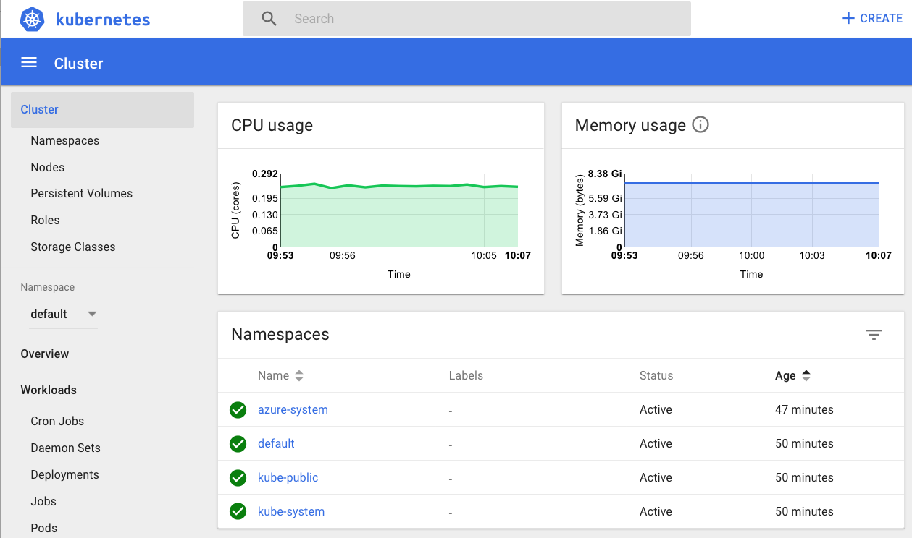

# Create a Kubernetes cluster with Azure Container Services and Terraform
[Azure Container Services (AKS)](/azure/aks/) manages your hosted Kubernetes environment, making it quick and easy to deploy and manage containerized applications without container orchestration expertise. It also eliminates the burden of ongoing operations and maintenance by provisioning, upgrading, and scaling resources on demand, without taking your applications offline.

In this tutorial, you learn how to use the [Terraform](http://terraform.io) to perform the following tasks:

> [!div class="checklist"]
> * Use the HashiCorp Language (HCL) to define a Kubernetes cluster
> * Learn about the azurerm_kubernetes_cluster resource type
> * Test a Kubernetes cluster
> * Deploy pods with the Kubernetes Terraform provider

## Prerequisites

- **Azure subscription**: If you don't have an Azure subscription, create a [free account](https://azure.microsoft.com/free/?ref=microsoft.com&utm_source=microsoft.com&utm_medium=docs&utm_campaign=visualstudio) before you begin.

- **Install Terraform**: Follow the directions in the article, [Terraform and configure access to Azure](/azure/virtual-machines/linux/terraform-install-configure)

- **Azure service principal**: Follow the directions in the section of the **Create the service principal** section in the article, [Create an Azure service principal with Azure CLI 2.0](/cli/azure/create-an-azure-service-principal-azure-cli?view=azure-cli-latest#create-the-service-principal). Take note of the values for the appId, displayName, password, and tenant.

## Create the directory structure
The first step is to create the directory that holds your Terraform configuration files for the exercise.

1. Browse to the [Azure portal](http://portal.azure.com).

1. Open [Azure Cloud Shell](/azure/cloud-shell/overview). If you didn't select an environment previously, select **Bash** as your environment.

    

1. Change directories to the `clouddrive` directory.

    ```bash
    cd clouddrive
    ```

1. Create a directory named `terraform-aks-k8s`.

    ```bash
    mkdir terraform-aks-k8s
    ```

1. Change directories to the new directory:

    ```bash
    cd terraform-aks-k8s
    ```

## Declare the Azure provider
Create the Terraform configuration file that declares the Azure provider.

1. In Cloud Shell, create a file named `main.tf`.

    ```bash
    vi main.tf
    ```

1. Enter insert mode by selecting the I key.

1. Paste the following code into the editor:

    ```JSON
    provider "azurerm" {
    version = "=1.5.0"
    }
    ```

1. Exit insert mode by selecting the **Esc** key.

1. Save the file and exit the vi editor by entering the following command:

    ```bash
    :wq
    ```

## Define a Kubernetes cluster
Create the Terraform configuration file that declares the resources for the Kubernetes cluster.

1. In Cloud Shell, create a file named `k8s.tf`.

    ```bash
    vi k8s.tf
    ```

1. Enter insert mode by selecting the I key.

1. Paste the following code into the editor:

    ```JSON
    resource "azurerm_resource_group" "k8s" {
    name     = "${var.resource_group_name}"
    location = "${var.location}"
    }

    resource "azurerm_kubernetes_cluster" "k8s" {
    name                = "${var.cluster_name}"
    location            = "${azurerm_resource_group.k8s.location}"
    resource_group_name = "${azurerm_resource_group.k8s.name}"
    dns_prefix          = "${var.dns_prefix}"

    linux_profile {
        admin_username = "ubuntu"

        ssh_key {
        key_data = "${file("${var.ssh_public_key}")}"
        }
    }

    agent_pool_profile {
        name            = "default"
        count           = "${var.agent_count}"
        vm_size         = "Standard_D2"
        os_type         = "Linux"
        os_disk_size_gb = 30
    }

    service_principal {
        client_id     = "${var.client_id}"
        client_secret = "${var.client_secret}"
    }

    tags {
        Environment = "Development"
    }
    }
    ```

    The preceding code sets the name of the cluster, location, and the resource_group_name. In addition, the dns_prefix value - that forms part of the fully qualified domain name (FQDN) used to access the cluster - is set.

    The linux_profile record allows you to configure the settings which enable signing into the worker nodes using SSH.

    With AKS, you pay only for the worker nodes. The agent_pool_profile record configures the details for these worker nodes. The agent_pool_profile record includes the number of worker nodes to create and the type of worker nodes. If you need to scale up or scale down the cluster in the future, you modify the **count** value in this record.

1. Exit insert mode by selecting the **Esc** key.

1. Save the file and exit the vi editor by entering the following command:

    ```bash
    :wq
    ```

## Declare the variables

1. In Cloud Shell, create a file named `variables.tf`.

    ```bash
    vi variables.tf
    ```

1. Enter insert mode by selecting the I key.

1. Paste the following code into the editor:

    ```JSON
    variable "client_id" {}
    variable "client_secret" {}

    variable "agent_count" {
    default = 3
    }

    variable "ssh_public_key" {
    default = "~/.ssh/id_rsa.pub"
    }

    variable "dns_prefix" {
    default = "k8stest"
    }

    variable cluster_name {
    default = "k8stest"
    }

    variable resource_group_name {
    default = "nic-k8stest"
    }

    variable location {
    default = "Central US"
    }
    ```

1. Exit insert mode by selecting the **Esc** key.

1. Save the file and exit the vi editor by entering the following command:

    ```bash
    :wq
    ```

## Create a Terraform output file
[Terraform outputs](https://www.terraform.io/docs/configuration/outputs.html) allow you to define values that will be highlighted to the user when Terraform applies a plan, and can be queried using the output command. In this section, you create an output file that allows access to the cluster with [kubectl](https://kubernetes.io/docs/reference/kubectl/overview/).

1. In Cloud Shell, create a file named `output.tf`.

    ```bash
    vi output.tf
    ```

1. Enter insert mode by selecting the I key.

1. Paste the following code into the editor:

    ```JSON
    output "client_key" {
    value = "${azurerm_kubernetes_cluster.k8s.kube_config.0.client_key}"
    }

    output "client_certificate" {
    value = "${azurerm_kubernetes_cluster.k8s.kube_config.0.client_certificate}"
    }

    output "cluster_ca_certificate" {
    value = "${azurerm_kubernetes_cluster.k8s.kube_config.0.cluster_ca_certificate}"
    }

    output "cluster_username" {
    value = "${azurerm_kubernetes_cluster.k8s.kube_config.0.username}"
    }

    output "cluster_password" {
    value = "${azurerm_kubernetes_cluster.k8s.kube_config.0.password}"
    }

    output "kube_config" {
    value = "${azurerm_kubernetes_cluster.k8s.kube_config_raw}"
    }

    output "host" {
    value = "${azurerm_kubernetes_cluster.k8s.kube_config.0.host}"
    }
    ```

1. Exit insert mode by selecting the **Esc** key.

1. Save the file and exit the vi editor by entering the following command:

    ```bash
    :wq
    ```

## Create the Kubernetes cluster

1. In Cloud Shell, initialize Terraform (replace the &lt;YourAzureStorageAccount> placeholder with the Azure storage name you want to use):

    ```bash
    terraform init \
    -backend-config "storage_account_name=<YourAzureStorageAccount>" \
    -backend-config="container_name=tfstate"
    ```

1. Create the Terraform plan that defines the infrastructure elements. The command will request two values: **var.client_id** and **var.client_secret**. For the **var.client_id** variable, enter the **appId** value associated with your service principal. For the **var.client_secret** variable, enter the **password** value associated with your service principal.

    ```bash
    terraform plan -out out.plan
    ```

1. If the output from the **terraform plan** command is as expected, apply the plan to create the Kubernetes cluster. This process can take several minutes.

    ```bash
    terraform apply out.plan
    ```

1. Once the `terraform apply` command finishes, the **All resources** tab displays your new resources.

    

## Test the Kubernetes cluster
In this section, you use the Kubernetes dashboard can be used to test the newly created cluster. 

1. Get the Kubernetes configuration from the Terraform state and store it in a file that kubectl can read.

    ```bash
    echo "$(terraform output kube_config)" > ~/.kube/azurek8s
    ```

1. Set an environment variable so that kubectl picks up the correct config.

    ```bash
    export KUBECONFIG=~/.kube/azurek8s
    ```

1. Verify the health of the cluster.

    ```bash
    kubectl get nodes
    ```

    You should see the details of your worker nodes, and they should all have a status **Ready**, as shown in the following image:

    

1. Run the kubectl proxy to be access the dashboard.

    ```bash
    kubectl proxy
    ```

    The **kubectl proxy** command returns an IP address as shown in the following image:

    

1. Display the Kubernetes dashboard.

    ```bash
    open 'http://localhost:8001/api/v1/namespaces/kube-system/services/kubernetes-dashboard/proxy/#!/overview?namespace=default'
    ```

    


## Deploy pods with the Kubernetes Terraform provider
[Kubernetes pods](https://kubernetes.io/docs/concepts/workloads/pods/pod/#what-is-a-pod) are the smallest deployable units of computing that can be created and managed in Kubernetes. In this section, you learn how to declare the Kubernetes provider and use it to deploy pods.

1. In Cloud Shell, modify the `main.tf` file by adding the Kubernetes provider declaration as follows:

    ```JSON
    provider "kubernetes" {
    host                   = "${azurerm_kubernetes_cluster.main.kube_config.0.host}"
    username               = "${azurerm_kubernetes_cluster.main.kube_config.0.username}"
    password               = "${azurerm_kubernetes_cluster.main.kube_config.0.password}"
    client_certificate     = "${base64decode(azurerm_kubernetes_cluster.main.kube_config.0.client_certificate)}"
    client_key             = "${base64decode(azurerm_kubernetes_cluster.main.kube_config.0.client_key)}"
    cluster_ca_certificate = "${base64decode(azurerm_kubernetes_cluster.main.kube_config.0.cluster_ca_certificate)}"
    }
    ```

1. Adding the Kubernetes provider configuration allows you to leverage its resources - such as the **kubernetes_pod** resource to create a cluster and provision pods and services with a single call to `terraform apply`. Create a file named `pods.tf`.

    ```bash
    vi pods.tf
    ```

1. Enter insert mode by selecting the I key.

1. Paste the following code into the editor:

    ```JSON
    resource "kubernetes_pod" "test" {
    metadata {
        name = "terraform-example"
    }

    spec {
        container {
        image = "nginx:1.7.9"
        name  = "example"
        }
    }
    }
    ```

1. Exit insert mode by selecting the **Esc** key.

1. Save the file and exit the vi editor by entering the following command:

    ```bash
    :wq
    ```

## Next steps
In this article, you learned how to use Terraform to create an Azure virtual machine scale set. Here are some additional resources to help you learn more about Terraform on Azure: 

 [Terraform Hub in Microsoft.com](https://docs.microsoft.com/azure/terraform/)  
 [Terraform Azure provider documentation](http://aka.ms/terraform)  
 [Terraform Azure provider source](http://aka.ms/tfgit)  
 [Terraform Azure modules](http://aka.ms/tfmodules)