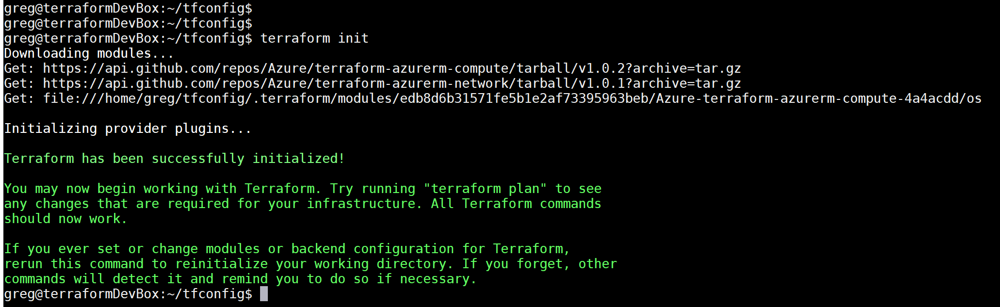
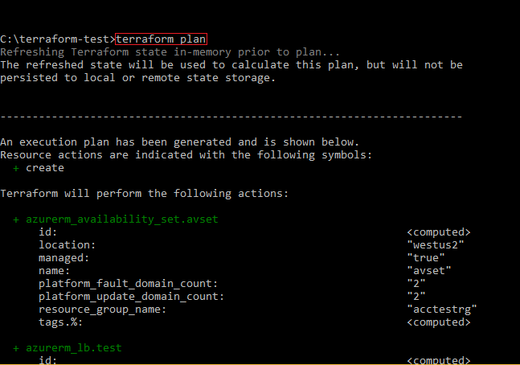
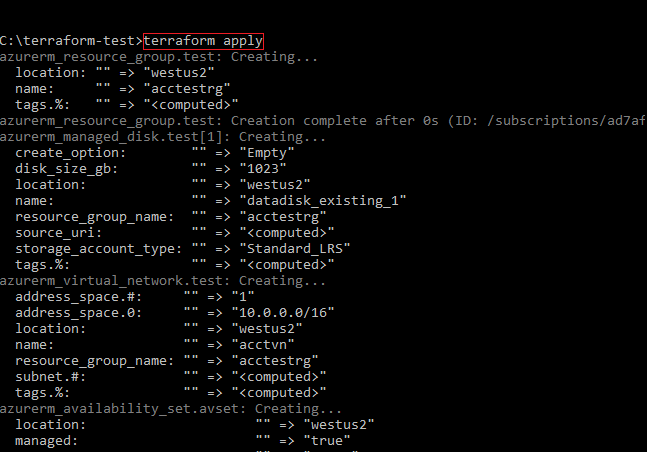

# Create a VM cluster with Terraform using the Module Registry

This article walks you through creating a small VM cluster with the Terraform [Azure compute module](https://registry.terraform.io/modules/Azure/compute/azurerm/1.0.2). In this tutorial you learn how to: 

> [!div class="checklist"]
> * Set up authentication with Azure
> * Create the Terraform template
> * Visualize the changes with plan
> * Apply the configuration to create the VM cluster

For more information on Terraform, see the [Terraform documentation](https://www.terraform.io/docs/index.html).

## Set up authentication with Azure

> [!TIP]
> If you [use Terraform environment variables](/azure/virtual-machines/linux/terraform-install-configure) or run this tutorial in the [Azure Cloud Shell](/azure/cloud-shell/overview), skip this step.

 Review [Install Terraform and configure access to Azure](/azure/virtual-machines/linux/terraform-install-configure) to create an Azure service principal. Use this service principal to populate a new file `azureProviderAndCreds.tf` in an empty directory with the following code:

```tf
variable subscription_id {}
variable tenant_id {}
variable client_id {}
variable client_secret {}

provider "azurerm" {
    subscription_id = "xxxxxxx-xxxx-xxxx-xxxx-xxxxxxxxxxxx"
    tenant_id = "xxxxxxx-xxxx-xxxx-xxxx-xxxxxxxxxxxx"
    client_id = "xxxxxxx-xxxx-xxxx-xxxx-xxxxxxxxxxxx"
    client_secret = "xxxxxxx-xxxx-xxxx-xxxx-xxxxxxxxxxxx"
}
```

## Create the template

Create a new Terraform template named `main.tf` with the following code:

```tf
module mycompute {
    source = "Azure/compute/azurerm"
    resource_group_name = "myResourceGroup"
    location = "East US 2"
    admin_password = "ComplxP@assw0rd!"
    vm_os_simple = "WindowsServer"
    remote_port = "3389"
    nb_instances = 2
    public_ip_dns = ["unique_dns_name"]
    vnet_subnet_id = "${module.network.vnet_subnets[0]}"
}

module "network" {
    source = "Azure/network/azurerm"
    location = "East US 2"
    resource_group_name = "myResourceGroup"
}

output "vm_public_name" {
    value = "${module.mycompute.public_ip_dns_name}"
}

output "vm_public_ip" {
    value = "${module.mycompute.public_ip_address}"
}

output "vm_private_ips" {
    value = "${module.mycompute.network_interface_private_ip}"
}
```

Run `terraform init` in your configuration directory. Using a Terraform version of at least 0.10.6 shows the following output:



## Visualize the changes with plan

Run `terraform plan` to preview the virtual machine infrastructure created by the template.




## Create the virtual machines with apply

Run `terraform apply` to provision the VMs on Azure.



## Next steps

- Browse the list of [Azure Terraform modules](https://registry.terraform.io/modules/Azure)
- Create a [virtual machine scale set with Terraform](terraform-create-vm-scaleset-network-disks-hcl.md)
