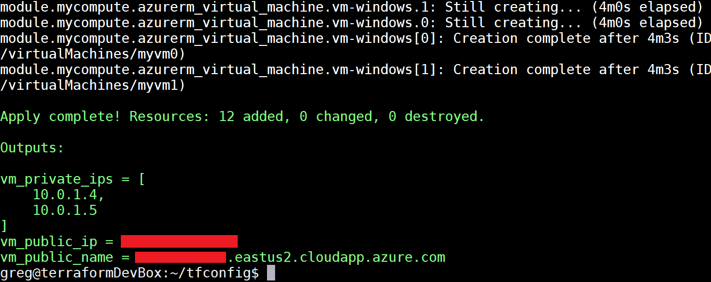

# Create a VM cluster with Terraform and HCL

This tutorial demonstrates creating a small compute cluster using the [Hashicorp Configuration Language](https://www.terraform.io/docs/configuration/syntax.html) (HCL). The configuration creates a load balancer, two Linux VMs in an [availability set](/azure/virtual-machines/windows/manage-availability#configure-multiple-virtual-machines-in-an-availability-set-for-redundancy), and all necessary networking resources.

In this tutorial you will:

> [!div class="checklist"]
> * Configure Azure authentication
> * Create the Terraform template
> * Visualize the changes with plan
> * Apply the configuration to create the cluster

## 1. Configure Azure authentication

> [!NOTE]
> If you [use Terraform environment variables](/azure/virtual-machines/linux/terraform-install-configure#set-environment-variables), or run this tutorial in the [Azure Cloud Shell](terraform-cloud-shell.md), skip this step.

1. Create an [Azure service principal](/azure/virtual-machines/linux/terraform-install-configure.md/#set-up-terraform-access-to-azure) making a note of the values for the subscription ID, tenant ID, client ID, and client secret.

2. Create a new file named `azureProviderAndCreds.tf` in an empty directory.

3. Copy following code into the newly created `azureProviderAndCreds.tf` file. Make sure to replace the placeholders below with the values for the subscription ID, tenant ID, client ID, and client secret:

```tf
variable subscription_id {}
variable tenant_id {}
variable client_id {}
variable client_secret {}

provider "azurerm" {
    subscription_id = "xxxxxxx-xxxx-xxxx-xxxx-xxxxxxxxxxxx"
    tenant_id = "xxxxxxx-xxxx-xxxx-xxxx-xxxxxxxxxxxx"
    client_id = "xxxxxxx-xxxx-xxxx-xxxx-xxxxxxxxxxxx"
    client_secret = "xxxxxxx-xxxx-xxxx-xxxx-xxxxxxxxxxxx"
}
```

## 2. Create the template

Create a new Terraform template named `main.tf` with the following code: 

```tf
resource "azurerm_resource_group" "test" {
  name     = "acctestrg"
  location = "West US 2"
}

resource "azurerm_virtual_network" "test" {
  name                = "acctvn"
  address_space       = ["10.0.0.0/16"]
  location            = "${azurerm_resource_group.test.location}"
  resource_group_name = "${azurerm_resource_group.test.name}"
}

resource "azurerm_subnet" "test" {
  name                 = "acctsub"
  resource_group_name  = "${azurerm_resource_group.test.name}"
  virtual_network_name = "${azurerm_virtual_network.test.name}"
  address_prefix       = "10.0.2.0/24"
}

resource "azurerm_public_ip" "test" {
  name                         = "publicIPForLB"
  location                     = "${azurerm_resource_group.test.location}"
  resource_group_name          = "${azurerm_resource_group.test.name}"
  public_ip_address_allocation = "static"
}

resource "azurerm_lb" "test" {
  name                = "loadBalancer"
  location            = "${azurerm_resource_group.test.location}"
  resource_group_name = "${azurerm_resource_group.test.name}"

  frontend_ip_configuration {
    name                 = "publicIPAddress"
    public_ip_address_id = "${azurerm_public_ip.test.id}"
  }
}

resource "azurerm_lb_backend_address_pool" "test" {
  resource_group_name = "${azurerm_resource_group.test.name}"
  loadbalancer_id     = "${azurerm_lb.test.id}"
  name                = "BackEndAddressPool"
}

resource "azurerm_network_interface" "test" {
  count               = 2
  name                = "acctni${count.index}"
  location            = "${azurerm_resource_group.test.location}"
  resource_group_name = "${azurerm_resource_group.test.name}"

  ip_configuration {
    name                          = "testConfiguration"
    subnet_id                     = "${azurerm_subnet.test.id}"
    private_ip_address_allocation = "dynamic"
    load_balancer_backend_address_pools_ids = ["${azurerm_lb_backend_address_pool.test.id}"]
  }
}

resource "azurerm_managed_disk" "test" {
  count                = 2
  name                 = "datadisk_existing_${count.index}"
  location             = "${azurerm_resource_group.test.location}"
  resource_group_name  = "${azurerm_resource_group.test.name}"
  storage_account_type = "Standard_LRS"
  create_option        = "Empty"
  disk_size_gb         = "1023"
}

resource "azurerm_availability_set" "avset" {
  name                         = "avset"
  location                     = "${azurerm_resource_group.test.location}"
  resource_group_name          = "${azurerm_resource_group.test.name}"
  platform_fault_domain_count  = 2
  platform_update_domain_count = 2
  managed                      = true
}

resource "azurerm_virtual_machine" "test" {
  count                 = 2
  name                  = "acctvm${count.index}"
  location              = "${azurerm_resource_group.test.location}"
  availability_set_id   = "${azurerm_availability_set.avset.id}"
  resource_group_name   = "${azurerm_resource_group.test.name}"
  network_interface_ids = ["${element(azurerm_network_interface.test.*.id, count.index)}"]
  vm_size               = "Standard_DS1_v2"

  # Uncomment this line to delete the OS disk automatically when deleting the VM
  # delete_os_disk_on_termination = true

  # Uncomment this line to delete the data disks automatically when deleting the VM
  # delete_data_disks_on_termination = true

  storage_image_reference {
    publisher = "Canonical"
    offer     = "UbuntuServer"
    sku       = "16.04-LTS"
    version   = "latest"
  }

  storage_os_disk {
    name              = "myosdisk${count.index}"
    caching           = "ReadWrite"
    create_option     = "FromImage"
    managed_disk_type = "Standard_LRS"
  }

  # Optional data disks
  storage_data_disk {
    name              = "datadisk_new_${count.index}"
    managed_disk_type = "Standard_LRS"
    create_option     = "Empty"
    lun               = 0
    disk_size_gb      = "1023"
  }

  storage_data_disk {
    name            = "${element(azurerm_managed_disk.test.*.name, count.index)}"
    managed_disk_id = "${element(azurerm_managed_disk.test.*.id, count.index)}"
    create_option   = "Attach"
    lun             = 1
    disk_size_gb    = "${element(azurerm_managed_disk.test.*.disk_size_gb, count.index)}"
  }

  os_profile {
    computer_name  = "hostname"
    admin_username = "testadmin"
    admin_password = "Password1234!"
  }

  os_profile_linux_config {
    disable_password_authentication = false
  }

  tags {
    environment = "staging"
  }
}
```

## 3. Visualize the changes with plan

Run `terraform plan` to preview the virtual machine infrastructure created by the template.


## 4. Create the virtual machines with apply

Run `terraform apply` to provision the VM cluster on Azure.



## Next steps

- Browse the list of [Azure Terraform modules](https://registry.terraform.io/modules/Azure)
- Create a [virtual machine scale set with Terraform](terraform-create-vm-scaleset-network-disks-hcl.md)