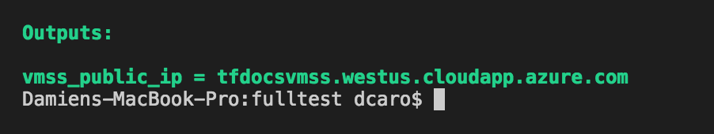
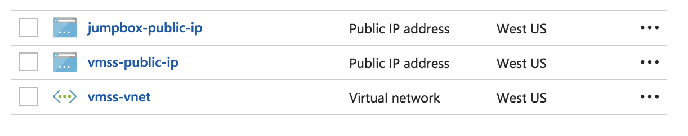

# Use Terraform to plan and create a networked Azure VM scale set with managed storage

In this article, you use [Terraform](https://www.terraform.io/) to create and deploy an [Azure virtual machine scaleset](/azure/virtual-machine-scale-sets/virtual-machine-scale-sets-overview) with managed disks using the [Hashicorp Configuration Language](https://www.terraform.io/docs/configuration/syntax.html) (HCL).  

In this tutorial, you learn how to:

> [!div class="checklist"]
> * Set up your Terraform deployment
> * Use variables and outputs for Terraform deployment 
> * Create and deploy network infrastructure
> * Create and deploy a virtual machine scale set and attach it to the network
> * Create and deploy a jumpbox to connect to the VMs via SSH

If you don't have an Azure subscription, create a [free account](https://azure.microsoft.com/free/?WT.mc_id=A261C142F) before you begin.

## Before you begin

- [Install Terraform and configure access to Azure](/azure/virtual-machines/linux/terraform-install-configure)
- [Create an SSH key pair](/azure/virtual-machines/linux/mac-create-ssh-keys) if you don't already have one.

## Create the file structure

Create three new files in an empty directory with the following names:

- `variables.tf`
  This file holds the values of the variables used in the template.
- `output.tf`
  This file describes the settings that will be displayed after deployment.
- `vmss.tf`
  This code for the virtual machine scale set infrastructure.

## Create the variables and output definitions

In this step, you define variables that customize the resources created by Terraform.

Edit the `variables.tf` file, copy the following code, then save the changes.

```tf 
variable "location" {
  description = "The location where resources will be created"
  default     = "West US"
}

variable "resource_group_name" {
  description = "The name of the resource group in which the resources will be created"
  default     = "myResourceGroup"
}
```

Edit the `output.tf` file and copy the following code to expose the fully qualified domain name for the virtual machines. 

```hcl 
output "vmss_public_ip" {
    value = "${azurerm_public_ip.vmss.fqdn}"
}
```

## Define the network infrastructure in a template

In this step, you create the following network infrastructure in a new Azure resource group: 

  - One VNET with the address space of 10.0.0.0/16 
  - One subnet with the address space of 10.0.2.0/24
  - Two public IP addresses. One used by the virtual machine scale set load balancer, the other used to connect to the SSH jumpbox.


Edit and copy the following code in the `vmss.tf` file: 

```tf
resource "azurerm_resource_group" "vmss" {
  name     = "${var.resource_group_name}"
  location = "${var.location}"

  tags {
    environment = "codelab"
  }
}

resource "azurerm_virtual_network" "vmss" {
  name                = "vmss-vnet"
  address_space       = ["10.0.0.0/16"]
  location            = "${var.location}"
  resource_group_name = "${azurerm_resource_group.vmss.name}"

  tags {
    environment = "codelab"
  }
}

resource "azurerm_subnet" "vmss" {
  name                 = "vmss-subnet"
  resource_group_name  = "${azurerm_resource_group.vmss.name}"
  virtual_network_name = "${azurerm_virtual_network.vmss.name}"
  address_prefix       = "10.0.2.0/24"
}

resource "azurerm_public_ip" "vmss" {
  name                         = "vmss-public-ip"
  location                     = "${var.location}"
  resource_group_name          = "${azurerm_resource_group.vmss.name}"
  public_ip_address_allocation = "static"
  domain_name_label            = "${azurerm_resource_group.vmss.name}"

  tags {
    environment = "codelab"
  }
}

``` 

> [!NOTE]
> It is a good idea to tag the resources being deployed in Azure to facilitate their identification in the future.

## Create the network infrastructure

Initialize the Terraform environment by running the following command in the directory where you created the `.tf` files:

```bash
terraform init 
```

Then run the following command to deploy the infrastructure in Azure.

```bash
terraform apply
```

Verify that the FQDN of the public IP address corresponds to your configuration:



The resource group should have the following resources: 



## Edit the infrastructure to add the virtual machine scale set

In this step, you add the following resources to the template:

- One Azure load balancer and rules to serve the application and attach it to the public IP address configured earlier.
- Azure backend address pool and assign it to the loadbalancer 
- A health probe port used by the application and configured on the loadbalancer 
- A virtual machine scale set sitting behind the load balancer, running on the vnet deployed earlier
- [Nginx](http://nginx.org/) on the nodes of the virtual machine scale using a custom script extension.

Add the following code to the end of the `vmss.tf` file.

```tf
resource "azurerm_lb" "vmss" {
  name                = "vmss-lb"
  location            = "${var.location}"
  resource_group_name = "${azurerm_resource_group.vmss.name}"

  frontend_ip_configuration {
    name                 = "PublicIPAddress"
    public_ip_address_id = "${azurerm_public_ip.vmss.id}"
  }

  tags {
    environment = "codelab"
  }
}

resource "azurerm_lb_backend_address_pool" "bpepool" {
  resource_group_name = "${azurerm_resource_group.vmss.name}"
  loadbalancer_id     = "${azurerm_lb.vmss.id}"
  name                = "BackEndAddressPool"
}

resource "azurerm_lb_probe" "vmss" {
  resource_group_name = "${azurerm_resource_group.vmss.name}"
  loadbalancer_id     = "${azurerm_lb.vmss.id}"
  name                = "ssh-running-probe"
  port                = "${var.application_port}"
}

resource "azurerm_lb_rule" "lbnatrule" {
    resource_group_name            = "${azurerm_resource_group.vmss.name}"
    loadbalancer_id                = "${azurerm_lb.vmss.id}"
    name                           = "http"
    protocol                       = "Tcp"
    frontend_port                  = "${var.application_port}"
    backend_port                   = "${var.application_port}"
    backend_address_pool_id        = "${azurerm_lb_backend_address_pool.bpepool.id}"
    frontend_ip_configuration_name = "PublicIPAddress"
    probe_id                       = "${azurerm_lb_probe.vmss.id}"
}

resource "azurerm_virtual_machine_scale_set" "vmss" {
  name                = "vmscaleset"
  location            = "${var.location}"
  resource_group_name = "${azurerm_resource_group.vmss.name}"
  upgrade_policy_mode = "Manual"

  sku {
    name     = "Standard_DS1_v2"
    tier     = "Standard"
    capacity = 2
  }

  storage_profile_image_reference {
    publisher = "Canonical"
    offer     = "UbuntuServer"
    sku       = "16.04-LTS"
    version   = "latest"
  }

  storage_profile_os_disk {
    name              = ""
    caching           = "ReadWrite"
    create_option     = "FromImage"
    managed_disk_type = "Standard_LRS"
  }

  storage_profile_data_disk {
    lun          = 0
    caching        = "ReadWrite"
    create_option  = "Empty"
    disk_size_gb   = 10
  }

  os_profile {
    computer_name_prefix = "vmlab"
    admin_username       = "azureuser"
    admin_password       = "Passwword1234"
  }

  os_profile_linux_config {
    disable_password_authentication = true

    ssh_keys {
      path     = "/home/azureuser/.ssh/authorized_keys"
      key_data = "${file("~/.ssh/id_rsa.pub")}"
    }
  }

  network_profile {
    name    = "terraformnetworkprofile"
    primary = true

    ip_configuration {
      name                                   = "IPConfiguration"
      subnet_id                              = "${azurerm_subnet.vmss.id}"
      load_balancer_backend_address_pool_ids = ["${azurerm_lb_backend_address_pool.bpepool.id}"]
    }
  }

  extension { 
    name = "vmssextension"
    publisher = "Microsoft.OSTCExtensions"
    type = "CustomScriptForLinux"
    type_handler_version = "1.2"
    settings = <<SETTINGS
    {
        "commandToExecute": "sudo apt-get -y install nginx"
    }
    SETTINGS
  }

  tags {
    environment = "codelab"
  }
}
```

Customize the deployment by adding the following code to `variables.tf`:

```tf 
variable "application_port" {
    description = "The port that you want to expose to the external load balancer"
    default     = 80
}

variable "admin_password" {
    description = "Default password for admin"
    default = "Passwwoord11223344"
}
``` 


## Deploy the virtual machine scale set in Azure

Run the following command to visualize the virtual machine scale set deployment:

```bash
terraform plan
```

The output of the command should look like the following.


Then deploy the additional resources in Azure: 

```bash
terraform apply 
```

The content of the resource group should look like:


Open a browser and connect to the FQDN that was returned by the command. 

## Add an SSH jumpbox to the existing network 

In this step, you configure the following resources:
- A network interface connected to the same subnet as the virtual machine scale set.
- A virtual machine connected with this network interface. This 'jumpbox' is remotely accessible. Once connected, you can SSH to any of the virtual machines in the scale set.


Add the following code to the end of the `vmss.tf` file:

```hcl 
resource "azurerm_public_ip" "jumpbox" {
  name                         = "jumpbox-public-ip"
  location                     = "${var.location}"
  resource_group_name          = "${azurerm_resource_group.vmss.name}"
  public_ip_address_allocation = "static"
  domain_name_label            = "${azurerm_resource_group.vmss.name}-ssh"

  tags {
    environment = "codelab"
  }
}

resource "azurerm_network_interface" "jumpbox" {
  name                = "jumpbox-nic"
  location            = "${var.location}"
  resource_group_name = "${azurerm_resource_group.vmss.name}"

  ip_configuration {
    name                          = "IPConfiguration"
    subnet_id                     = "${azurerm_subnet.vmss.id}"
    private_ip_address_allocation = "dynamic"
    public_ip_address_id          = "${azurerm_public_ip.jumpbox.id}"
  }

  tags {
    environment = "codelab"
  }
}

resource "azurerm_virtual_machine" "jumpbox" {
  name                  = "jumpbox"
  location              = "${var.location}"
  resource_group_name   = "${azurerm_resource_group.vmss.name}"
  network_interface_ids = ["${azurerm_network_interface.jumpbox.id}"]
  vm_size               = "Standard_DS1_v2"

  storage_image_reference {
    publisher = "Canonical"
    offer     = "UbuntuServer"
    sku       = "16.04-LTS"
    version   = "latest"
  }

  storage_os_disk {
    name              = "jumpbox-osdisk"
    caching           = "ReadWrite"
    create_option     = "FromImage"
    managed_disk_type = "Standard_LRS"
  }

  os_profile {
    computer_name  = "jumpbox"
    admin_username = "azureuser"
    admin_password = "Password1234!"
  }

  os_profile_linux_config {
    disable_password_authentication = true

    ssh_keys {
      path     = "/home/azureuser/.ssh/authorized_keys"
      key_data = "${file("~/.ssh/id_rsa.pub")}"
    }
  }

  tags {
    environment = "codelab"
  }
}
```

Edit `outputs.tf`  and add the following code to display the hostname of the jumpbox when the deployment is complete:

```
output "jumpbox_public_ip" {
    value = "${azurerm_public_ip.jumpbox.fqdn}"
}
```

## Deploy the jumpbox

Deploy the jumpbox.

```bash
terraform apply 
```

Once the deployment has completed, the content of the resource group looks like:


> [!NOTE]
> Login with a password is disabled on the jumpbox and the virtual machine scale set that you deployed. Log in with SSH to access the VMs.

## Clean up the environment

The following commands delete the resources created in this tutorial:

```bash
terraform destroy
```

Type `yes` when asked to confirm for the deletion of the resources. The destruction process takes few minutes to complete.

## Next Steps

In this tutorial, you deployed a virtual machine scale set  on Azure using Terraform. You learned how to:

> [!div class="checklist"]
> * Initialize Terraform deployment
> * Use variables and outputs for Terraform deployment 
> * Create and deploy a network infrastructure
> * Create and deploy a virtual machine scale set and attach it to an existing environment
> * Create and deploy a jumpbox to connect to the VMs via SSH 
