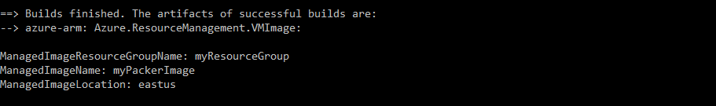
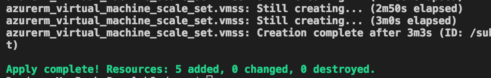
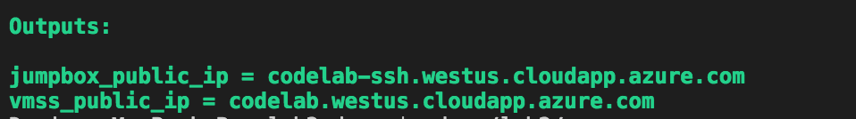

# Use Terraform to create an Azure virtual machine scale set from a Packer custom image

In this tutorial, you use [Terraform](https://www.terraform.io/) to create and deploy an [Azure virtual machine scale set](/azure/virtual-machine-scale-sets/virtual-machine-scale-sets-overview) created with a custom image produced using [Packer](https://www.packer.io/intro/index.html) with managed disks using the [HashiCorp Configuration Language](https://www.terraform.io/docs/configuration/syntax.html) (HCL).  

In this tutorial, you learn how to:

> [!div class="checklist"]
> * Set up your Terraform deployment
> * Use variables and outputs for Terraform deployment 
> * Create and deploy a network infrastructure
> * Create a custom virtual machine image using Packer
> * Create and deploy a virtual machine scale set using the custom image
> * Create and deploy a jumpbox 

If you don't have an Azure subscription, create a [free account](https://azure.microsoft.com/free/?WT.mc_id=A261C142F) before you begin.

## Before you begin
> * [Install Terraform and configure access to Azure](https://docs.microsoft.com/azure/virtual-machines/linux/terraform-install-configure)
> * [Create an SSH key pair](https://docs.microsoft.com/azure/virtual-machines/linux/mac-create-ssh-keys) if you don't already have one
> * [Install Packer](https://www.packer.io/docs/install/index.html) If you don't already have Packer installed on your local machine


## Create the file structure

Create three new files in an empty directory with the following names:

- ```variables.tf``` 
  This file holds the values of the variables used in the template.
- ```output.tf``` 
  This file describes the settings that display after deployment.
- ```vmss.tf``` 
  This file contains the code of the infrastructure that you are deploying.

##  Create the variables 

In this step, you define variables that customize the resources created by Terraform.

Edit the `variables.tf` file, copy the following code, then save the changes.

```tf 
variable "location" {
  description = "The location where resources are created"
  default     = "East US"
}

variable "resource_group_name" {
  description = "The name of the resource group in which the resources are created"
  default     = ""
}

```

> [!NOTE]
> The default value of the resource_group_name variable is unset, define your own value.

Save the file.

When you deploy your Terraform template, you want to get the fully qualified domain name that is used to access the application. Use the ```output``` resource type of Terraform, and get the ```fqdn``` property of the resource. 

Edit the `output.tf` file, and copy the following code to expose the fully qualified domain name for the virtual machines. 

```hcl 
output "vmss_public_ip" {
    value = "${azurerm_public_ip.vmss.fqdn}"
}
```

## Define the network infrastructure in a template 

In this step, you create the following network infrastructure in a new Azure resource group: 
  - One VNET with the address space of 10.0.0.0/16 
  - One subnet with the address space of 10.0.2.0/24
  - Two public IP addresses. One used by the virtual machine scale set load balancer; the other used to connect to the SSH jumpbox

You also need a resource group where all the resources are created. 

Edit and copy the following code in the ```vmss.tf``` file: 

```tf 

resource "azurerm_resource_group" "vmss" {
  name     = "${var.resource_group_name}"
  location = "${var.location}"

  tags {
    environment = "codelab"
  }
}

resource "azurerm_virtual_network" "vmss" {
  name                = "vmss-vnet"
  address_space       = ["10.0.0.0/16"]
  location            = "${var.location}"
  resource_group_name = "${azurerm_resource_group.vmss.name}"

  tags {
    environment = "codelab"
  }
}

resource "azurerm_subnet" "vmss" {
  name                 = "vmss-subnet"
  resource_group_name  = "${azurerm_resource_group.vmss.name}"
  virtual_network_name = "${azurerm_virtual_network.vmss.name}"
  address_prefix       = "10.0.2.0/24"
}

resource "azurerm_public_ip" "vmss" {
  name                         = "vmss-public-ip"
  location                     = "${var.location}"
  resource_group_name          = "${azurerm_resource_group.vmss.name}"
  public_ip_address_allocation = "static"
  domain_name_label            = "${azurerm_resource_group.vmss.name}"

  tags {
    environment = "codelab"
  }
}

``` 

> [!NOTE]
> We recommended tagging the resources being deployed in Azure to facilitate their identification in the future.

## Create the network infrastructure

Initialize the Terraform environment by running the following command in the directory where you created the `.tf` files:

```bash
terraform init 
```
 
The provider plugins download  from the Terraform registry into the ```.terraform``` folder in the directory where you ran the command.

Run the following command to deploy the infrastructure in Azure.

```bash
terraform apply
```

Verify that the fully qualified domain name of the public IP address corresponds to your configuration.


The resource group contains the following resources:


## Create an Azure image using Packer
Create a custom Linux image using the steps outlined in the tutorial, [How to use Packer to create Linux virtual machine images in Azure](https://docs.microsoft.com/azure/virtual-machines/linux/build-image-with-packer).
 
Follow the tutorial to create a deprovisioned Ubuntu image with NGINX installed.



> [!NOTE]
> For purposes of this tutorial, in the Packer image, a command is run to installs nginx. You can also run your own script while creating.

## Edit the infrastructure to add the virtual machine scale set

In this step, you create the following resources on the network that was previously deployed:
- Azure load balancer to serve the application and attach it to the public IP address that was deployed in step 4
- One Azure load balancer and rules to serve the application and attach it to the public IP address configured earlier.
- Azure backend address pool and assign it to the load balancer 
- A health probe port used by the application and configured on the load balancer 
- A virtual machine scale set sitting behind the load balancer, running on the vnet deployed earlier
- [Nginx](http://nginx.org/) on the nodes of the virtual machine scale installed from custom image


Add the following code to the end of the `vmss.tf` file.

```tf


resource "azurerm_lb" "vmss" {
  name                = "vmss-lb"
  location            = "${var.location}"
  resource_group_name = "${azurerm_resource_group.vmss.name}"

  frontend_ip_configuration {
    name                 = "PublicIPAddress"
    public_ip_address_id = "${azurerm_public_ip.vmss.id}"
  }

  tags {
    environment = "codelab"
  }
}

resource "azurerm_lb_backend_address_pool" "bpepool" {
  resource_group_name = "${azurerm_resource_group.vmss.name}"
  loadbalancer_id     = "${azurerm_lb.vmss.id}"
  name                = "BackEndAddressPool"
}

resource "azurerm_lb_probe" "vmss" {
  resource_group_name = "${azurerm_resource_group.vmss.name}"
  loadbalancer_id     = "${azurerm_lb.vmss.id}"
  name                = "ssh-running-probe"
  port                = "${var.application_port}"
}

resource "azurerm_lb_rule" "lbnatrule" {
  resource_group_name            = "${azurerm_resource_group.vmss.name}"
  loadbalancer_id                = "${azurerm_lb.vmss.id}"
  name                           = "http"
  protocol                       = "Tcp"
  frontend_port                  = "${var.application_port}"
  backend_port                   = "${var.application_port}"
  backend_address_pool_id        = "${azurerm_lb_backend_address_pool.bpepool.id}"
  frontend_ip_configuration_name = "PublicIPAddress"
  probe_id                       = "${azurerm_lb_probe.vmss.id}"
}

data "azurerm_resource_group" "image" {
  name = "myResourceGroup"
}

data "azurerm_image" "image" {
  name                = "myPackerImage"
  resource_group_name = "${data.azurerm_resource_group.image.name}"
}

resource "azurerm_virtual_machine_scale_set" "vmss" {
  name                = "vmscaleset"
  location            = "${var.location}"
  resource_group_name = "${azurerm_resource_group.vmss.name}"
  upgrade_policy_mode = "Manual"

  sku {
    name     = "Standard_DS1_v2"
    tier     = "Standard"
    capacity = 2
  }

  storage_profile_image_reference {
    id="${data.azurerm_image.image.id}"
  }

  storage_profile_os_disk {
    name              = ""
    caching           = "ReadWrite"
    create_option     = "FromImage"
    managed_disk_type = "Standard_LRS"
  }

  storage_profile_data_disk {
    lun          = 0
    caching        = "ReadWrite"
    create_option  = "Empty"
    disk_size_gb   = 10
  }

  os_profile {
    computer_name_prefix = "vmlab"
    admin_username       = "azureuser"
    admin_password       = "Passwword1234"
  }

  os_profile_linux_config {
    disable_password_authentication = true

    ssh_keys {
      path     = "/home/azureuser/.ssh/authorized_keys"
      key_data = "${file("~/.ssh/id_rsa.pub")}"
    }
  }

  network_profile {
    name    = "terraformnetworkprofile"
    primary = true

    ip_configuration {
      name                                   = "IPConfiguration"
      subnet_id                              = "${azurerm_subnet.vmss.id}"
      load_balancer_backend_address_pool_ids = ["${azurerm_lb_backend_address_pool.bpepool.id}"]
    }
  }
  
  tags {
    environment = "codelab"
  }
}

```

Customize the deployment by adding the following code to `variables.tf`:

```tf 
variable "application_port" {
    description = "The port that you want to expose to the external load balancer"
    default     = 80
}

variable "admin_password" {
    description = "Default password for admin"
    default = "Passwwoord11223344"
}
``` 


## Deploy the virtual machine scale set in Azure

Run the following command to visualize the virtual machine scale set deployment:

```bash
terraform plan
```

The output of the command looks like the following image:


Deploy the additional resources in Azure: 

```bash
terraform apply 
```

The content of the resource group looks like the following image:



Open a browser and connect to the fully qualified domain name that was returned by the command. 


## Add a jumpbox to the existing network 

This optional step enables SSH access to the instances of the virtual machine scale set by using a jumpbox.

Add the following resources to your existing deployment:
- A network interface connected to the same subnet than the virtual machine scale set
- A virtual machine with this network interface

Add the following code to the end of the `vmss.tf` file:

```hcl 
resource "azurerm_public_ip" "jumpbox" {
  name                         = "jumpbox-public-ip"
  location                     = "${var.location}"
  resource_group_name          = "${azurerm_resource_group.vmss.name}"
  public_ip_address_allocation = "static"
  domain_name_label            = "${azurerm_resource_group.vmss.name}-ssh"

  tags {
    environment = "codelab"
  }
}

resource "azurerm_network_interface" "jumpbox" {
  name                = "jumpbox-nic"
  location            = "${var.location}"
  resource_group_name = "${azurerm_resource_group.vmss.name}"

  ip_configuration {
    name                          = "IPConfiguration"
    subnet_id                     = "${azurerm_subnet.vmss.id}"
    private_ip_address_allocation = "dynamic"
    public_ip_address_id          = "${azurerm_public_ip.jumpbox.id}"
  }

  tags {
    environment = "codelab"
  }
}

resource "azurerm_virtual_machine" "jumpbox" {
  name                  = "jumpbox"
  location              = "${var.location}"
  resource_group_name   = "${azurerm_resource_group.vmss.name}"
  network_interface_ids = ["${azurerm_network_interface.jumpbox.id}"]
  vm_size               = "Standard_DS1_v2"

  storage_image_reference {
    publisher = "Canonical"
    offer     = "UbuntuServer"
    sku       = "16.04-LTS"
    version   = "latest"
  }

  storage_os_disk {
    name              = "jumpbox-osdisk"
    caching           = "ReadWrite"
    create_option     = "FromImage"
    managed_disk_type = "Standard_LRS"
  }

  os_profile {
    computer_name  = "jumpbox"
    admin_username = "azureuser"
    admin_password = "Password1234!"
  }

  os_profile_linux_config {
    disable_password_authentication = true

    ssh_keys {
      path     = "/home/azureuser/.ssh/authorized_keys"
      key_data = "${file("~/.ssh/id_rsa.pub")}"
    }
  }

  tags {
    environment = "codelab"
  }
}
```

Edit `outputs.tf` to add the following code that displays the hostname of the jumpbox when the deployment completes:

```
output "jumpbox_public_ip" {
    value = "${azurerm_public_ip.jumpbox.fqdn}"
}
```

## Deploy the jumpbox

Deploy the jumpbox.

```bash
terraform apply 
```

Once the deployment has completed, the content of the resource group looks like the following image:



> [!NOTE]
> Login with a password is disabled on the jumpbox and the virtual machine scale set that you deployed. Log in with SSH to access the VMs.

## Clean up the environment

The following commands delete the resources created in this tutorial:

```bash
terraform destroy
```

Type `yes` when asked to confirm for the deletion of the resources. The destruction process can take a few minutes to complete.

## Next steps

In this tutorial, you deployed a virtual machine scale set and a jumpbox on Azure using Terraform. You learned how to:

> [!div class="checklist"]
> * Initialize Terraform deployment
> * Use variables and outputs for Terraform deployment 
> * Create and deploy a network infrastructure
> * Create a custom virtual machine image using Packer
> * Create and deploy a virtual machine scale set using the custom image
> * Create and deploy a jumpbox 