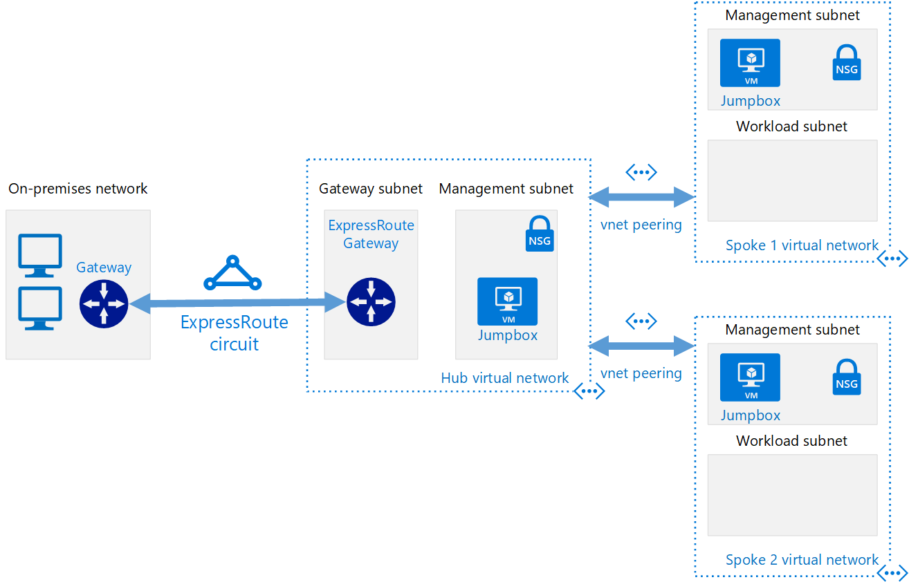

# Tutorial: Create a hub and spoke hybrid network topology with Terraform in Azure

This tutorial series shows how to use Terraform to implement in Azure a [hub and spoke network topology](/azure/architecture/reference-architectures/hybrid-networking/hub-spoke). 

A hub and spoke topology is a way to isolate workloads while sharing common services. These services include identity and security. The hub is a virtual network (VNet) that acts as a central connection point to an on-premises network. The spokes are VNets that peer with the hub. Shared services are deployed in the hub, while individual workloads are deployed inside spoke networks.

This tutorial covers the following tasks:

> [!div class="checklist"]
> * Use HCL (HashiCorp Language) to lay out hub and spoke hybrid network reference architecture resources
> * Use Terraform to create hub network appliance resources
> * Use Terraform to create hub network in Azure to act as common point 
for all resources
> * Use Terraform to create individual workloads as spoke VNets in Azure
> * Use Terraform to establish gateways and connections between on premises and Azure networks
> * Use Terraform to create VNet peerings to spoke networks

## Prerequisites

- **Azure subscription**: If you don't already have an Azure subscription, create a [free Azure account](https://azure.microsoft.com/free/?ref=microsoft.com&utm_source=microsoft.com&utm_medium=docs&utm_campaign=visualstudio) before you begin.

- **Install and configure Terraform**: To provision VMs and other infrastructure in Azure, [install and configure Terraform](/azure/virtual-machines/linux/terraform-install-configure)

## Hub and spoke topology architecture

In the hub and spoke topology, the hub is a VNet. The VNet acts as a central point of connectivity to your on-premises network. The spokes are VNets that peer with the hub, and can be used to isolate workloads. Traffic flows between the on-premises datacenter and the hub through an ExpressRoute or VPN gateway connection. The following image demonstrates the components in a hub and spoke topology:



## Benefits of the hub and spoke topology

A hub and spoke network topology is a way to isolate workloads while sharing common services. These services include identity and security. The hub is a VNet that acts as a central connection point to an on-premises network. The spokes are VNets that peer with the hub. Shared services are deployed in the hub, while individual workloads are deployed inside spoke networks. Here are some benefits of the hub and spoke network topology:

- **Cost savings** by centralizing services in a single location that can be shared by multiple workloads. These workloads include network virtual appliances and DNS servers.
- **Overcome subscriptions limits** by peering VNets from different subscriptions to the central hub.
- **Separation of concerns** between central IT (SecOps, InfraOps) and workloads (DevOps).

## Typical uses for the hub and spoke architecture

Some of the typical uses for a hub and spoke architecture include:

- Many customers have workloads that are deployed in different environments. These environments include development, testing, and production. Many times, these workloads need to share services such as DNS, IDS, NTP, or AD DS. These shared services can be placed in the hub VNet. That way, each environment is deployed to a spoke to maintain isolation.
- Workloads that don't require connectivity to each other, but require access to shared services.
- Enterprises that require central control over security aspects.
- Enterprises that require segregated management for the workloads in each spoke.

## Preview the demo components

As you work through each tutorial in this series, various components are defined in distinct Terraform scripts. The demo architecture created and deployed consists of the following components:

- **On-premises network**. A private local-area network running with an organization. For hub and spoke reference architecture, a VNet in Azure is used to simulate an on-premises network.

- **VPN device**. A VPN device or service provides external connectivity to the on-premises network. The VPN device may be a hardware appliance or a software solution. 

- **Hub VNet**. The hub is the central point of connectivity to your on-premises network and a place to host services. These services can be consumed by the different workloads hosted in the spoke VNets.

- **Gateway subnet**. The VNet gateways are held in the same subnet.

- **Spoke VNets**. Spokes can be used to isolate workloads in their own VNets, managed separately from other spokes. Each workload might include multiple tiers, with multiple subnets connected through Azure load balancers. 

- **VNet peering**. Two VNets can be connected using a peering connection. Peering connections are non-transitive, low latency connections between VNets. Once peered, the VNets exchange traffic by using the Azure backbone, without needing a router. In a hub and spoke network topology, VNet peering is used to connect the hub to each spoke. You can peer VNets in the same region, or different regions.

## Create the directory structure

Create the directory that holds your Terraform configuration files for the demo.

1. Browse to the [Azure portal](https://portal.azure.com).

1. Open [Azure Cloud Shell](/azure/cloud-shell/overview). If you didn't select an environment previously, select **Bash** as your environment.

    

1. Change directories to the `clouddrive` directory.

    ```bash
    cd clouddrive
    ```

1. Create a directory named `hub-spoke`.

    ```bash
    mkdir hub-spoke
    ```

1. Change directories to the new directory:

    ```bash
    cd hub-spoke
    ```

## Declare the Azure provider

Create the Terraform configuration file that declares the Azure provider.

1. In Cloud Shell, open a new file named `main.tf`.

    ```bash
    code main.tf
    ```

1. Paste the following code into the editor:

    ```JSON
    provider "azurerm" {
        version = "~>1.22"
    }
    ```

1. Save the file and exit the editor.

## Create the variables file

Create the Terraform configuration file for common variables that are used across different scripts.

1. In Cloud Shell, open a new file named `variables.tf`.

    ```bash
    code variables.tf
    ```

1. Paste the following code into the editor:

    ```JSON
    variable "location" {
      description = "Location of the network"
      default     = "centralus"
    }
    
    variable "username" {
      description = "Username for Virtual Machines"
      default     = "testadmin"
    }
    
    variable "password" {
      description = "Password for Virtual Machines"
      default     = "Password1234!"
    }
    
    variable "vmsize" {
      description = "Size of the VMs"
      default     = "Standard_DS1_v2"
    }
    ```

1. Save the file and exit the editor.

## Next steps

> [!div class="nextstepaction"] 
> [Create on-premises virtual network with Terraform in Azure](./terraform-hub-spoke-on-prem.md)
