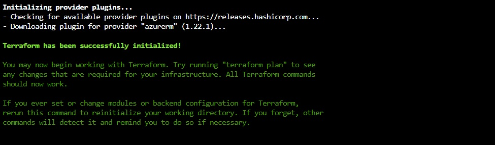
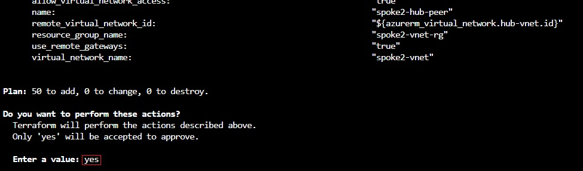

# Tutorial: Validate a hub and spoke network with Terraform in Azure

In this article, you execute the terraform files created in the previous article in this series. The result is a validation of the connectivity between the demo virtual networks.

This tutorial covers the following tasks:

> [!div class="checklist"]
> * Use HCL (HashiCorp Language) to implement the Hub VNet in hub-spoke topology
> * Use Terraform plan to verify the resources to be deployed
> * Use Terraform apply to create the resources in Azure
> * Verify the connectivity between different networks
> * Use Terraform to destroy all the resources

## Prerequisites

1. [Create a hub and spoke hybrid network topology with Terraform in Azure](./terraform-hub-spoke-introduction.md).
1. [Create on-premises virtual network with Terraform in Azure](./terraform-hub-spoke-on-prem.md).
1. [Create a hub virtual network with Terraform in Azure](./terraform-hub-spoke-hub-network.md).
1. [Create a hub virtual network appliance with Terraform in Azure](./terraform-hub-spoke-hub-nva.md).
1. [Create a spoke virtual networks with Terraform in Azure](./terraform-hub-spoke-spoke-network.md).

## Verify your configuration

After completing the [prerequisites](#prerequisites), verify that the appropriate config files are present.

1. Browse to the [Azure portal](https://portal.azure.com).

1. Open [Azure Cloud Shell](/azure/cloud-shell/overview). If you didn't select an environment previously, select **Bash** as your environment.

    

1. Change directories to the `clouddrive` directory.

    ```bash
    cd clouddrive
    ```

1. Change directories to the new directory:

    ```bash
    cd hub-spoke
    ```

1. Run the `ls` command to verify that the `.tf` config files created in the previous tutorials are listed:

    

## Deploy the resources

1. Initialize the Terraform provider:
    
    ```bash
    terraform init
    ```
    
    
    
1. Run the `terraform plan` command to see the effect of the deployment before execution:

    ```bash
    terraform plan
    ```
    
    

1. Deploy the solution:

    ```bash
    terraform apply
    ```
    
    Enter `yes` when prompted to confirm the deployment.

    
    
## Test the hub VNet and spoke VNets

This section shows how to test connectivity from the simulated on-premises environment to the hub VNet.

1. In the Azure portal, browse to the **onprem-vnet-rg** resource group.

1. In the **onprem-vnet-rg** tab, select the VM named **onprem-vm**.

1. Select **Connect**.

1. Next to the text **Login using VM local account**, copy the **ssh** command to the clipboard.

1. From a Linux prompt, run `ssh` to connect to the simulated on-premises environment. Use the password specified in the `on-prem.tf` parameter file.

1. Run the `ping` command to test connectivity to the jumpbox VM in the hub VNet:

   ```bash
   ping 10.0.0.68
   ```

1. Run the `ping` command to test connectivity to the jumpbox VMs in each spoke:

   ```bash
   ping 10.1.0.68
   ping 10.2.0.68
   ```

1. To exit the ssh session on the **onprem-vm** virtual machine, enter `exit` and press &lt;Enter>.

## Troubleshoot VPN issues

For information about resolving VPN errors, see the article, [Troubleshoot a hybrid VPN connection](/azure/architecture/reference-architectures/hybrid-networking/troubleshoot-vpn).

## Clean up resources

When no longer needed, delete the resources created in the tutorial series.

1. Remove the resources declared in the plan:

    ```bash
    terraform destroy
    ```

    Enter `yes` when prompted to confirm the removal of the resources.

1. Change directories to the parent directory:

    ```bash
    cd ..
    ```

1. Delete the `hub-scope` directory (including all of its files):

    ```bash
    rm -r hub-spoke
    ```

## Next steps

> [!div class="nextstepaction"] 
> [Learn more about using Terraform in Azure](/azure/terraform)