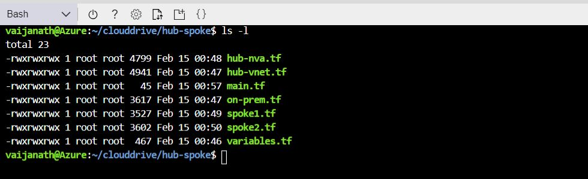
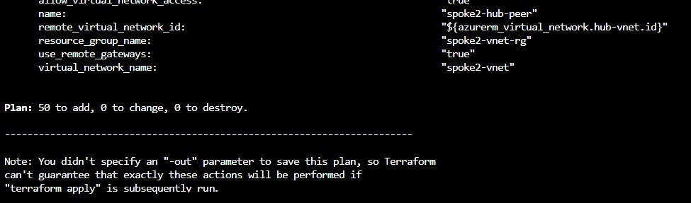
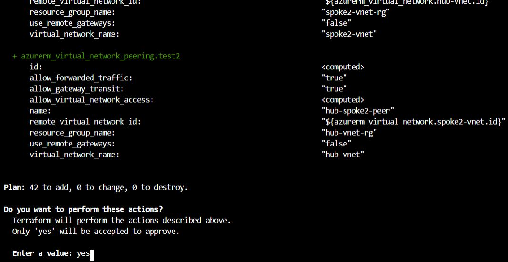

# Tutorial: Validate a hub and spoke network with Terraform in Azure

In this article, you execute the terraform files created in the previous article in this series. The result is a validation of the connectivity between the demo virtual networks.

> [!div class="checklist"]
> * Use HCL (HashiCorp Language) to implement the Hub VNet in hub-spoke topology
> * Use Terraform plan to verify the resources to be deployed
> * Use Terraform apply to create the resources in Azure
> * Verify the connectivity between different networks
> * Use Terraform to destroy all the resources

## Prerequisites

1. [Create a hub and spoke hybrid network topology with Terraform in Azure](./terraform-hub-spoke-introduction.md).
1. [Create on-premises virtual network with Terraform in Azure](./terraform-hub-spoke-on-prem.md).
1. [Create a hub virtual network with Terraform in Azure](./terraform-hub-spoke-hub-network.md).
1. [Create a hub virtual network appliance with Terraform in Azure](./terraform-hub-spoke-hub-nva.md).
1. [Create a spoke virtual networks with Terraform in Azure](./terraform-hub-spoke-spoke-network.md).

## Verify your configuration

After completing the [prerequisites][#prerequisites], verify that the appropriate config files are present.

1. Browse to the [Azure portal](http://portal.azure.com).

1. Open [Azure Cloud Shell](/azure/cloud-shell/overview). If you didn't select an environment previously, select **Bash** as your environment.

    

1. Change directories to the `clouddrive` directory.

    ```bash
    cd clouddrive
    ```

1. Change directories to the new directory:

    ```bash
    cd hub-spoke
    ```

   

## Deploying the resources

1. Initialize the Terraform provider:
    
    ```bash
    terraform init
    ```
    
    
    
1. Run the `terraform plan` command to see the effect of the deployment before execution:

    ```bash
    terraform plan
    ```
    
    

1. Deploy the solution:

    ```bash
    terraform apply
    ```
    
1. Enter `yes` when prompted to confirm the deployment.

    
    
## Test the hub VNet

This section shows how to test connectivity from the simulated on-premises environment to the hub VNet.

1. Use the Azure portal to locate the VM named `onprem-vm` in the `onprem-vnet-rg` resource group.

2. Select `Connect` and copy to the clipboard the displayed `ssh` command.

3. From a Linux prompt, run `ssh` to connect to the simulated on-premises environment. Use the password that you specified in the `on-prem.tf` parameter file.

4. Use the `ping` command to test connectivity to the jumpbox VM in the hub VNet:

   ```shell
   ping 10.0.0.68
   ```

## Test the spoke VNets

This section shows how to test connectivity from the simulated on-premises environment to the spoke VNets.

1. Use the Azure portal to locate the VM named `onprem-vm` in the `onprem-vnet-rg` resource group.

2. Select `Connect` and copy to the clipboard the displayed `ssh`.

3. From a Linux prompt, run `ssh` to connect to the simulated on-premises environment. Use the password that you specified in the `on-prem.tf` parameter file.

4. Use the `ping` command to test connectivity to the jumpbox VMs in each spoke:

   ```bash
   ping 10.1.0.68
   ping 10.2.0.68
   ```

## Next steps

> [!div class="nextstepaction"] 
> [Troubleshoot a hybrid VPN connection](/azure/architecture/reference-architectures/hybrid-networking/troubleshoot-vpn)