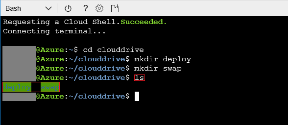
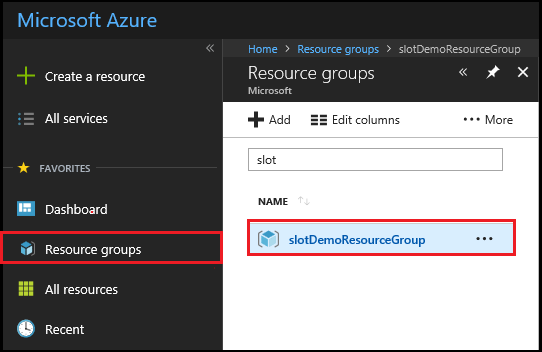
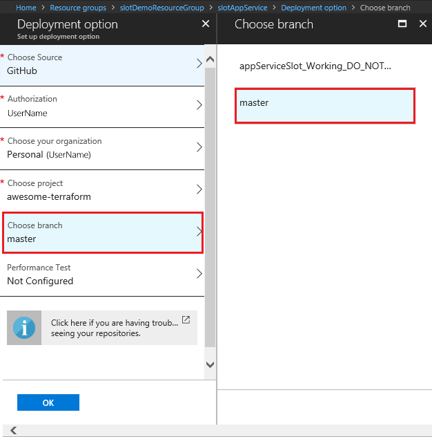

# Terraform with Azure Provider Deployment Slot Walkthrough

This tutorial illustrates how to deploy two web apps via `GitHub` on `Azure`. One app will be assigned to the `Production Slot` and the second one will be hosted in the additional [deployment slot](https://docs.microsoft.com/en-us/azure/app-service/web-sites-staged-publishing), which will be provisioned with Terraform. Finally, Terraform will be used to swap the inactive slot with the production slot.

Using the [Azure portal](https://portal.azure.com/) deploys a [Cloud Shell](https://docs.microsoft.com/en-us/azure/cloud-shell/overview), which is pre-configured with the latest version of Terraform. 

In Cloud Shell, navigate to your `clouddrive` directory and create two directories, one called `deploy` and the other called `swap` as seen in the following image.



Navigate to your deploy directory and - using `nano` - copy and paste the following HCL (HashiCorp Configuration Language) into a file name `deploy.tf`.

```HCL
# Configure the Azure Provider
provider "azurerm" { }

resource "azurerm_resource_group" "slotDemo" {
  name = "slotDemoResourceGroup"
  location = "westus2"
}

resource "azurerm_app_service_plan" "slotDemo" {
  name                = "slotAppServicePlan"
  location            = "${azurerm_resource_group.slotDemo.location}"
  resource_group_name = "${azurerm_resource_group.slotDemo.name}"
  sku {
    tier = "Standard"
    size = "S1"
  }
}

resource "azurerm_app_service" "slotDemo" {
  name                = "slotAppService"
  location            = "${azurerm_resource_group.slotDemo.location}"
  resource_group_name = "${azurerm_resource_group.slotDemo.name}"
  app_service_plan_id = "${azurerm_app_service_plan.slotDemo.id}"
}

resource "azurerm_app_service_slot" "slotDemo" {
  name                = "slotAppServiceSlotOne"
  location            = "${azurerm_resource_group.slotDemo.location}"
  resource_group_name = "${azurerm_resource_group.slotDemo.name}"
  app_service_plan_id = "${azurerm_app_service_plan.slotDemo.id}"
  app_service_name    = "${azurerm_app_service.slotDemo.name}"
}
```
Once you have created the `deploy.tf` file, you can now provision your resources to `Azure` using Terraform by typing the following commands.

```bash
terraform init
terraform plan
terraform apply
```

Once Terraform has completed provisioning the resources, you can use the **Resource Groups** tab in the Azure portal to see the resources that were provisioned by Terraform.



Select the `slotDemoResourceGroup` and this will show each of the resources that were created.


To deploy to the `deployment slots`, fork the [Fork the awesome-terraform repo](https://github.com/Azure/awesome-terraform) repository to your own personal organization by selecting **Fork** in GitHub.


Deploying Bits from GitHub to your Deployment Slots
---

1. At this point, you now have the needed bits. To deploy from GitHub via the [Azure portal](https://portal.azure.com/), locate **Resource Group**, as explained earlier. Select the **slotAppService** resource, then select `Deployment options`.

    

3. Select **GitHub**.

    

4. Once you have set up your authorization and picked your personal organization, you need to tell the Azure portal which project you want to deploy from. Select **Choose Project**, then select **awesome-terraform** from the displayed menu items.

    

5. Now that you have defined what project to deploy from, you also need to select which branch to deploy from. To do that, select **Choose branch**, select  **master** from the displayed menu items, and finally select **OK**.

    

Once you select **OK**, the Azure portal will begin building the project and deploy it to your `slotAppService` production slot. 

To set up deployment to our `slotAppServiceSlotOne`, follow the preceding steps except in **Step 1** select the `slotAppServiceSlotOne` resource and in **Step 5** select the `working` branch instead of the `master` branch.


Putting It All Together
---

At this point, you have set up our `slotAppService` and our `slotAppServiceSlotOne` to deploy our `web app` from different branches in `GitHub`. You can now preview the `web app` to validate that it was successfully deployed to the `slots` by selecting the `URL` on the resources `Overview` page, as seen in the image below.


 If everything was deployed correctly, `slotAppService` should render a Blue page with the page title of **Slot Demo App 1** and the `slotAppServiceSlotOne` should render a Green page with the page title of **Slot Demo App 2**.

 In the browser, navigate to the `slotAppService` URL. Return to the Cloud Shell session and navigate to the `swap` directory created in the previous step. In Cloud Shell, type `nano swap.tf` and press **Enter**. Paste the below HCL code into the nano text editor and save the file.

```HCL
# Configure the Azure Provider
provider "azurerm" { }

# Swap the Production Slot with the Deployment Slot
resource "azurerm_app_service_active_slot" "slotDemoActiveSlot" {
  resource_group_name   = "slotDemoResourceGroup"
  app_service_name      = "slotAppService"
  app_service_slot_name = "slotappServiceSlotOne"
}
```


You now have the Terraform code to swap the `Production slot` with the `Deployment slot`. In the cloud shell command prompt, enter the following commands.

```bash
terraform init
terraform plan
terraform apply
```

Once Terraform has finished swapping the slots go back to the browser session/tab that is rendering the `slotAppService web app` and refresh the page. You will notice that the `web app` that was in your `slotAppServiceSlotOne` deployment slot has been swapped with the `Production slot` and that the page now renders green. To bring back the original bits that were originally in the `Production slot` just run the `swap.tf` again by typing terraform apply and the original code will be swapped again from the `Deployment slot` to the `Production slot`.

## Next steps
