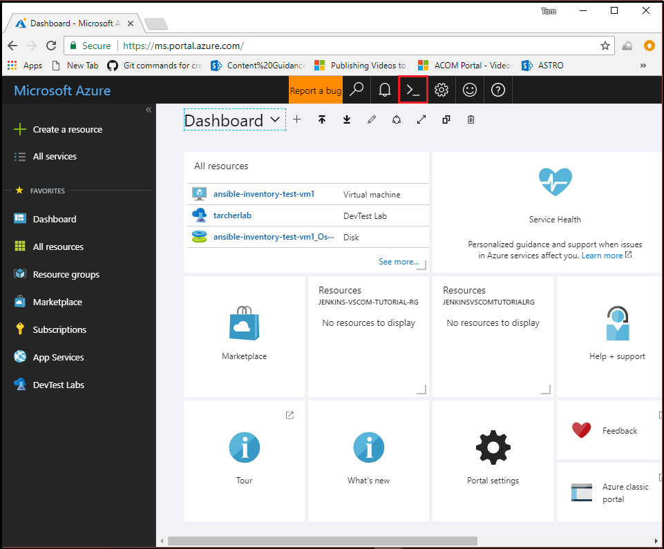
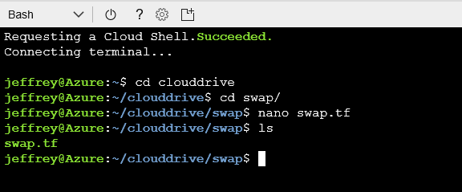

# Using Terraform to provision infrastructure with Azure deployment slots

[Azure deployment slots](/azure/app-service/web-sites-staged-publishing) allow you to swap between various versions of your app - such as production, development, and test - to minimize the impact of broken deployments. Using deployment slots, you can directly swap between slots  without any downtime. This article illustrates an example use of deployment slots by walking you through the deployment of two apps via GitHub and Azure. One app is hosted in the production slot, while the second app is hosted in the deployment slot. Terraform is then used to swap the (inactive) deployment slot with the production slot.

## Prerequisites

- **Azure subscription** - If you don't have an Azure subscription, create a [free account](https://azure.microsoft.com/free/?ref=microsoft.com&utm_source=microsoft.com&utm_medium=docs&utm_campaign=visualstudio) before you begin.

- **Azure credentials** - [Create Azure credentials and configure Ansible](/azure/virtual-machines/linux/ansible-install-configure#create-azure-credentials)

- **GitHub account** - A [GitHub](http://www.github.com) is needed to fork and use the two web apps utilized in this tutorial.

## Create and apply the Terraform plan

1. Browse to the [Azure portal](http://www.portal.azure.com)

1. Open [Azure Cloud Shell](/azure/cloud-shell/overview), and - if not done previously - select **Bash** as your environment.

    

1. Change directories to the `clouddrive` directory.

    ```bash
    cd clouddrive
    ```

1. Create a directory named `deploy`.

    ```bash
    mkdir deploy
    ```

1. Create a directory named `swap`.

    ```bash
    mkdir deploy
    ```

1. Verify that both directories have been successfully created using the `ls` bash command.

    

1. Change directories to the `deploy` directory.

    ```bash
    cd deploy
    ```

1. Using the [vi editor](https://www.debian.org/doc/manuals/debian-tutorial/ch-editor.html), create a file named `deploy.tf`, which will contain the [Terraform configuration(https://www.terraform.io/docs/configuration/index.html).

    ```bash
    vi deploy.tf
    ```

1. Enter insert mode by pressing the letter `i` key.

1. Paste the following code into the editor:

    ```HCL
    # Configure the Azure Provider
    provider "azurerm" { }

    resource "azurerm_resource_group" "slotDemo" {
    name = "slotDemoResourceGroup"
    location = "westus2"
    }

    resource "azurerm_app_service_plan" "slotDemo" {
    name                = "slotAppServicePlan"
    location            = "${azurerm_resource_group.slotDemo.location}"
    resource_group_name = "${azurerm_resource_group.slotDemo.name}"
    sku {
        tier = "Standard"
        size = "S1"
    }
    }

    resource "azurerm_app_service" "slotDemo" {
    name                = "slotAppService"
    location            = "${azurerm_resource_group.slotDemo.location}"
    resource_group_name = "${azurerm_resource_group.slotDemo.name}"
    app_service_plan_id = "${azurerm_app_service_plan.slotDemo.id}"
    }

    resource "azurerm_app_service_slot" "slotDemo" {
    name                = "slotAppServiceSlotOne"
    location            = "${azurerm_resource_group.slotDemo.location}"
    resource_group_name = "${azurerm_resource_group.slotDemo.name}"
    app_service_plan_id = "${azurerm_app_service_plan.slotDemo.id}"
    app_service_name    = "${azurerm_app_service.slotDemo.name}"
    }
    ```

1. Press the **&lt;Esc>** key to exit insert/append mode.

1. Save the file and exit the vi editor by entering the following command, followed by pressing **&lt;Enter>**:

    ```bash
    :wq
    ```

1. Once the file has been created, you can verify its contents.

    ```bash
    cat deploy.tf
    ```

1. Initialize Terraform.

    ```bash
    terraform init
    ```

1. Create the Terraform plan.

    ```bash
    terraform plan
    ```

1. Provision the resources defined in the `deploy.tf` configuration file. (Confirm the action by entering `yes` at the prompt.)

    ```bash
    terraform apply
    ```

1. Select **Resource Groups** to see the resources that were provisioned by Terraform.

    


1. Select **slotDemoResourceGroup** to display each of the created resources.

    

## Deploying from GitHub to your deployment slots

1. Browse to the [awesome-terraform repo on GitHub](https://github.com/Azure/awesome-terraform).

1. Fork the **awesome-terraform repo**.

    

1. Return to the Azure portal.

1. Select **Resource Groups**

1. Select **slotDemoResourceGroup**.

1. Select the **slotAppService** App Service resource. (Make sure to click the actual resource name, and not the checkbox next to it.)

1. Select **Deployment options**.

    

1. On the **Deployment option** tab, select **Choose Source**, and then select **GitHub**.

    

1. Select **Authorization**.

1. Select **Authorize**, and supply the credentials needed for Azure to access your GitHub account. 

1. Once Azure has validated your GitHub credentials, a message displays indicating that the authorization process has completed. Select **OK** to close the **Authorization** tab.

1. Select **Choose your organization** and select your organization.

1. Select **Choose project**.

1. On the **Choose project** tab, select the **awesome-terraform** project.

    

1. Select **Choose branch**.

1. On the **Choose branch** tab, select **master**.

    

1. On the **Deployment option** tab, select **OK**. Once you select **OK**, the Azure portal builds the **awesome-terraform** project and deploys it to the **slotAppService-slotAppServiceSlotOne** production slot.


1. To set up deployment to **slotAppServiceSlotOne**, follow steps except in **Step 1** select the `slotAppServiceSlotOne` resource and in **Step 5** select the `working` branch instead of the `master` branch.


Putting It All Together
---

At this point, you have set up `slotAppService` and `slotAppServiceSlotOne` to deploy `web app` from different branches in GitHub. You can now preview the `web app` to validate that it was successfully deployed to the `slots` by selecting the `URL` on the resources `Overview` page, as seen in the image below.


 If everything was deployed correctly, `slotAppService` should render a Blue page with the page title of **Slot Demo App 1** and the `slotAppServiceSlotOne` should render a Green page with the page title of **Slot Demo App 2**.

 In the browser, navigate to the `slotAppService` URL. Return to the Cloud Shell session and navigate to the `swap` directory created in the previous step. In Cloud Shell, type `nano swap.tf` and press **Enter**. Paste the below HCL code into the nano text editor and save the file.

```HCL
# Configure the Azure Provider
provider "azurerm" { }

# Swap the Production Slot with the Deployment Slot
resource "azurerm_app_service_active_slot" "slotDemoActiveSlot" {
  resource_group_name   = "slotDemoResourceGroup"
  app_service_name      = "slotAppService"
  app_service_slot_name = "slotappServiceSlotOne"
}
```



You now have the Terraform code to swap the `Production slot` with the `Deployment slot`. In the cloud shell command prompt, enter the following commands.

```bash
terraform init
terraform plan
terraform apply
```

Once Terraform has finished swapping the slots, return to the browser that is rendering the `slotAppService web app` and refresh the page. You will notice that the `web app` that was in your `slotAppServiceSlotOne` deployment slot has been swapped with the `Production slot` and that the page now renders green. To bring back the original bits that were originally in the `Production slot`, rerun the `swap.tf` by typing `terraform apply` and the original code will be swapped again from the `Deployment slot` to the `Production slot`.

## Next steps

- Add links here