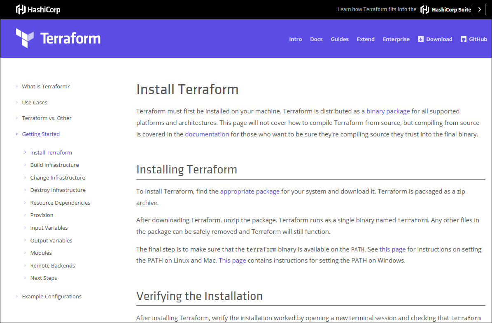

---

title: 'Azure Terraform VS Code Extension | Microsoft Docs'
description: In this article, learn how to install and use the Terraform extension in Visual Studio Code.
keywords: terraform, devops, virtual machine, azure
author: v-mavick
manager: timlt
ms.author: v-mavick
ms.date: 07/30/2018
ms.topic: article

---

# Azure Terraform VS Code extension

The Microsoft Azure Terraform Visual Studio Code (VS Code) extension is designed to increase developer productivity while authoring, testing, and using Terraform with Azure. The extension provides Terraform command support, resource graph visualization, and CloudShell integration within the VS Code IDE.

## What you do

- Install the open-source HashiCorp Terraform executable on your machine.
- Install the Terraform VS Code Extension for Azure on your local VS Code installation.

## What you learn

In this tutorial, you'll learn:

* How Terraform can automate and simplify the provisioning of Azure services.
* How to install and use the Microsoft Terraform VS Code extension for Azure services.
* How to use VS Code to write, plan, and execute Terraform plans.

## What you need

* A computer running Windows 10, Linux, or macOS 10.10+.
* [Visual Studio Code](https://www.bing.com/search?q=visual+studio+code+download&form=EDGSPH&mkt=en-us&httpsmsn=1&refig=dffc817cbc4f4cb4b132a8e702cc19a3&sp=3&ghc=1&qs=LS&pq=visual+studio+code&sk=LS1&sc=8-18&cvid=dffc817cbc4f4cb4b132a8e702cc19a3&cc=US&setlang=en-US).
* An active Azure subscription. [Activate a free 30-day trial Microsoft Azure account](https://azure.microsoft.com/en-us/free/).
* An installation of the [Terraform](https://www.terraform.io/) open-source tool on your local machine.
  
## Prepare your dev environment

### Install Git

To complete the exercises in the article, you'll need to [install Git](https://git-scm.com/).

### Install HashiCorp Terraform

- Follow the instructions on the HashiCorp [Install Terraform](https://www.terraform.io/intro/getting-started/install.html) webpage. There you'll find detailed instructions covering the downloading and installation of Terraform.

    

>[!Tip]
>Be sure to follow the instructions regarding setting your PATH system variable!

### Install Node.js

To use Terraform in the Cloud Shell, you need to [install Node.js](https://nodejs.org/) 6.0+.

>[!NOTE]
>To verify if Node.js is installed, open a terminal window and type: `node -v`

### Install GraphViz

To use the Terraform visualize function, you need to [install GraphViz](http://graphviz.org/).

>[!NOTE]
>To verify if GraphViz is installed, open a terminal window and type: `dot -V`

### Install the Azure Terraform VS Code extension:

- Launch VS Code.
- Click on the **Extensions** icon.

	

- Use the **Search Extensions in Marketplace** text box to search for the Azure Terraform extension:

	

- Click **Install**.

    >[!NOTE]
    >When you click **Install** for the Azure Terraform extension, VS Code will automatically install the Azure Account extension. Azure Account is a dependency file for the Azure Terraform extension, which it uses to perform Azure subscription authentications and Azure-related code extensions.

#### Verify the Terraform extension is installed in Visual Studio Code

- Click on the Extensions icon.
- Type `@installed` in the search text box.

    

- The Azure Terraform extension will appear in the list of installed extensions.

    

- You can now run all supported Terraform commands in your Cloud Shell environment from within VS Code!

## Exercise 1: Basic Terraform commands walk-through

In this exercise, you create and execute a basic Terraform test plan that provisions a new Azure resource group.

### Prepare a test plan file

- In VS Code, select **File > New File** from the Menu Bar.
- Navigate to the [azurerm_resource_group](https://www.terraform.io/docs/providers/azurerm/r/resource_group.html#) and copy the code in the **Example Usage** code block:
- Paste the copied code into the new file you created in VS Code.
    
    >[!NOTE]
    >You may change the **name** value of the resource group, but it must be unique to your Azure subscription.
- From the Menu Bar, select **File > Save As**.
- In the **Save As** dialog, navigate to a location of your choice and then click **New folder**. (Change the name of the new folder to something more descriptive than *New folder*.)
    >[!NOTE]
    >In this example, the folder is named TERRAFORM-TEST-PLAN.
- Make sure your new folder is highlighted (selected) and then click **Open**.
- In the **Save As** dialog, change the default name of the file to *main.tf*.
    
- Click **Save**.
- In the Menu Bar, select **File > Open Folder**. Navigate to and select the new folder you created.

### Run Terraform *init* command

- Launch Visual Studio Code.
- From the VS Code Menu Bar, select **File > Open Folder...** and locate and select your *main.tf* file.

    

- From the Menu Bar, select **View > Command Palette... > Azure Terraform: Init**.
- After a few moments, you're asked *Do you want to open Cloud Shell?* Click **OK**.

    

- The first time you launch Cloud Shell from a new folder, you're asked to set up the web application https://shell.azure.com. Click **Open**.

    

- The Welcome to Azure Cloud Shell page opens. Select Bash or PowerShell.

    

      >[!NOTE]
      >In this example, Bash (Linux) was selected.
- If you have not already set up an Azure storage account, the following screen appears. Click **Create storage**.

    

- Azure Cloud Shell launches in the shell you previously selected and displays information for the cloud drive it just created for you.

    

- You may now exit the Cloud Shell
- From the Menu Bar, select **View** > **Command Palette** > **Azure Terraform: init**.

    

### Visualize the plan

Earlier in this tutorial, you installed GraphViz. Terraform can use GraphViz to generate a visual representation of either a configuration or execution plan. The Azure Terraform VS Code extension implements this feature via the *visualize* command.

- From the **Menu Bar**, select**View > Command Palette > Azure Terraform: Visualize**.

### Run Terraform *plan* command

The Terraform *plan* command is used to check whether the execution plan for a set of changes will do what you intended.

>[!NOTE]
>Terraform *plan* does not make any changes to your real Azure resources. To actually make the changes contained in your plan, we use the Terraform *apply* command.

- From the Menu Bar, select **View** > **Command Palette** > **Azure Terraform: plan**.

    

### Run Terraform *apply* command

After you're satisfied with the results of Terraform *plan*, you can run the *apply* command.

- From the Menu Bar, select **View** > **Command Palette** > **Azure Terraform: apply**.

    

- Type *yes*.

    

### Verify your Terraform plan was executed

To see if your new Azure resource group was successfully created:

- Open the Azure portal.
- Select **Resource groups** in the left navigation pane.

    

Your new resource group should be listed in the **NAME** column.

>[!NOTE]
>You may leave your Azure Portal window open for now; we'll be useing it in the next step.

### Run Terraform *destroy* command

- From the Menu Bar, select **View** > **Command Palette** > **Azure Terraform: destroy**.

    

- Type *yes*.

    

### Verify your resource group was destroyed

To confirm that Terraform successfully destroyed your new resource group:

- Click **Refresh** on the Azure portal *Resource groups* page.
- Your resource group will no longer be listed.

    

## Exercise 2: Terraform *compute* module

In this exercise, you'll learn how to load the Terraform *compute* module into the VS Code environment.

### Clone the terraform-azurerm-compute module

- Use [this link](https://github.com/Azure/terraform-azurerm-compute) to access the Terraform Azure Rm Compute module on GitHub.
- Click **Clone or download**.

    

    >[!NOTE]
    >In this example, our folder was named *terraform-azurerm-compute*.

### Open the folder in VS Code

- Launch Visual Studio Code.
- From the **Menu Bar**, select **File > Open Folder** and navigate to and select the folder you created in the previous step.

    

### Initialize Terraform

Before you can begin using the Terraform commands from within VS Code, you download the plug-ins for two Azure providers: random and azurerm.

- In the Terminal pane of the VS Code IDE, type:
`terraform init`

- Type `az login` and follow the on-screen instructions.

### Module test: *lint*

- From the **Menu Bar**, select **View > Command Palette > Azure Terraform: Execute Test**.
- From the list of test type options, select **lint**.

    

- When asked *Do you want to open CloudShell?* click **OK** and follow the on-screen instructions.

    

>[!NOTE]
>When you execute either the **lint** or **end to end** test, Azure uses a container service to provision a test machine to perform the actual test. For this reason, your test results may typically take several minutes to be returned.

After a few moments, you'll see a listing in the Terminal pane similar to this:

### Module test: *end-to-end*

- From the **Menu Bar**, select **View > Command Palette > Azure Terraform: Execute Test**.
- From the list of test type options, select **end to end**.

    

- If asked *Do you want to open CloudShell?* click **OK** and follow the on-screen instructions.

    

>[!NOTE]
>When you execute either the **lint** or **end to end** test, Azure uses a container service to provision a test machine to perform the actual test. For this reason, your test results may typically take several minutes to be returned.

After a few moments, you'll see a listing in the Terminal pane similar to this:

## Next steps

You've seen some of the ways Terraform can simplify your provisioning of Azure services from within Visual Studio Code. Now, you may want to review some of these resources:
- The [Terraform Module Registry](https://registry.terraform.io/) lists all of the Terraform modules available for Azure and other supported providers.

For each of these modules, the following information is provided:

- A description of the module's general capabilities and its characteristics
- A usage example
- Test configurations, which show you how to build, run, and test each module on your local dev machine
- A Dockerfile to allow you to build and run a module development environment locally.
