# Install and use the Azure Terraform Visual Studio Code extension

The Microsoft Azure Terraform Visual Studio Code extension is designed to increase developer productivity while authoring, testing, and using Terraform with Azure. The extension provides Terraform command support, resource graph visualization, and CloudShell integration within Visual Studio Code.

In this article, you learn how to:
> [!div class="checklist"]
> * use Terraform to automate and simplify the provisioning of Azure services.
> * install and use the Microsoft Terraform Visual Studio Code extension for Azure services.
> * use Visual Studio Code to write, plan, and execute Terraform plans.

## Prerequisites
- **Azure subscription**: If you don't have an Azure subscription, create a [free account](https://azure.microsoft.com/free/?ref=microsoft.com&utm_source=microsoft.com&utm_medium=docs&utm_campaign=visualstudio) before you begin.

- **Terraform**: [Install and configure Terraform](/azure/virtual-machines/linux/terraform-install-configure).

- **Visual Studio Code**: Install the version of [Visual Studio Code](https://code.visualstudio.com/download) that is appropriate for your environment.

## Prepare your dev environment

### Install Git

To complete the exercises in the article, you need to [install Git](https://git-scm.com/).

### Install HashiCorp Terraform

Follow the instructions on the HashiCorp [Install Terraform](https://www.terraform.io/intro/getting-started/install.html) webpage, which covers:

- Downloading Terraform
- Installing Terraform
- Verifying Terraform is correctly installed

>[!Tip]
>Be sure to follow the instructions regarding setting your PATH system variable.

### Install Node.js

To use Terraform in the Cloud Shell, you need to [install Node.js](https://nodejs.org/) 6.0+.

>[!NOTE]
>To verify if Node.js is installed, open a terminal window and enter `node -v`.

### Install GraphViz

To use the Terraform visualize function, you need to [install GraphViz](http://graphviz.org/).

>[!NOTE]
>To verify if GraphViz is installed, open a terminal window and enter `dot -V`.

### Install the Azure Terraform Visual Studio Code extension

1. Launch Visual Studio Code.

1. Select **Extensions**.

	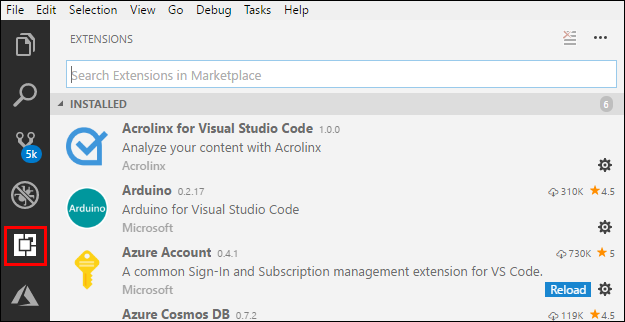

1. Use the **Search Extensions in Marketplace** text box to search for the Azure Terraform extension:

	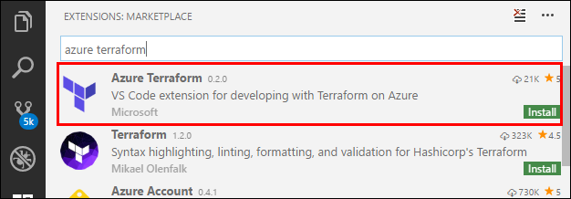

1. Select **Install**.

    >[!NOTE]
    >When you select **Install** for the Azure Terraform extension, Visual Studio Code will automatically install the Azure Account extension. Azure Account is a dependency file for the Azure Terraform extension, which it uses to perform Azure subscription authentications and Azure-related code extensions.

#### Verify the Terraform extension is installed in Visual Studio Code

1. Select **Extensions**.

1. Enter `@installed` in the search text box.

    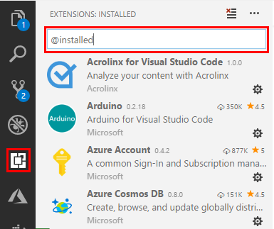

The Azure Terraform extension will appear in the list of installed extensions.

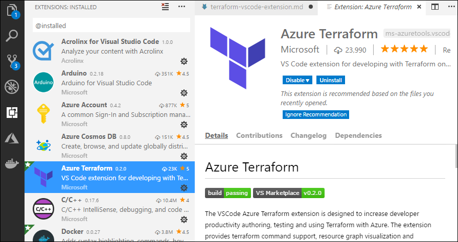

You can now run all supported Terraform commands in your Cloud Shell environment from within Visual Studio Code.

## Exercise 1: Basic Terraform commands walk-through

In this exercise, you create and execute a basic Terraform configuration file that provisions a new Azure resource group.

### Prepare a test plan file

1. In Visual Studio Code, select **File > New File** from the menu bar.

1. In your browser, navigate to the [Terraform azurerm_resource_group page](https://www.terraform.io/docs/providers/azurerm/r/resource_group.html#) and copy the code in the **Example Usage** code block:

    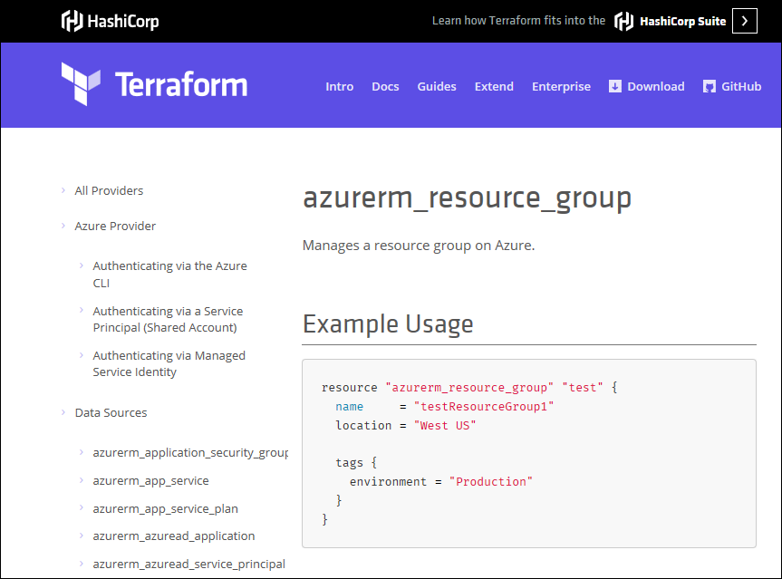

1. Paste the copied code into the new file you created in Visual Studio Code.

    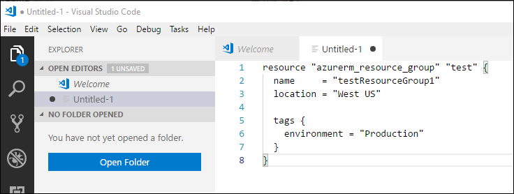

    >[!NOTE]
    >You may change the **name** value of the resource group, but it must be unique to your Azure subscription.

1. From the menu bar, select **File > Save As**.

1. In the **Save As** dialog, navigate to a location of your choice and then select **New folder**. (Change the name of the new folder to something more descriptive than *New folder*.)

    >[!NOTE]
    >In this example, the folder is named TERRAFORM-TEST-PLAN.

1. Make sure your new folder is highlighted (selected) and then select **Open**.

1. In the **Save As** dialog, change the default name of the file to *main.tf*.

    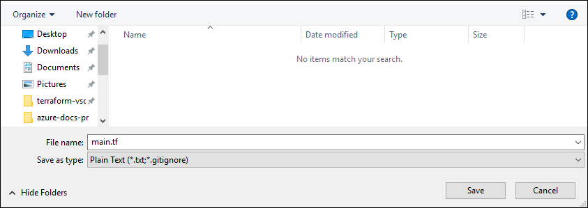

1. Select **Save**.
- In the menu bar, select **File > Open Folder**. Navigate to and select the new folder you created.

### Run Terraform *init* command

1. Launch Visual Studio Code.

1. From the Visual Studio Code menu bar, select **File > Open Folder...** and locate and select your *main.tf* file.

    

1. From the menu bar, select **View > Command Palette... > Azure Terraform: Init**.

1. When the confirmation appears, select **OK**.

    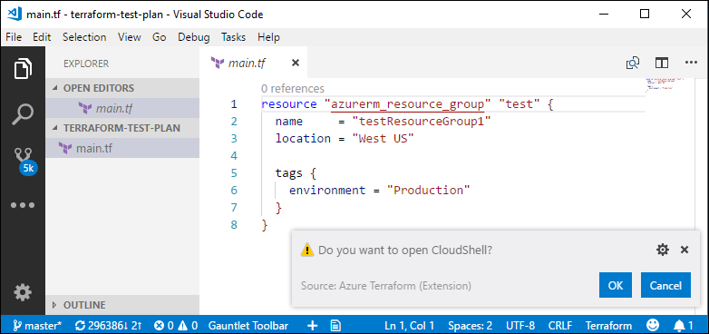

1. The first time you launch Cloud Shell from a new folder, you will be asked to set up the web application. Select **Open**.

    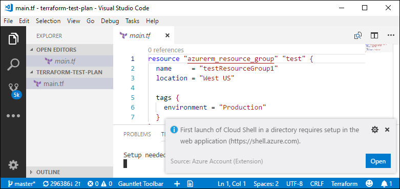

1. The Welcome to Azure Cloud Shell page opens. Select Bash or PowerShell.

    

    >[!NOTE]
    >In this example, Bash (Linux) was selected.

1. If you have not already set up an Azure storage account, the following screen appears. Select **Create storage**.

    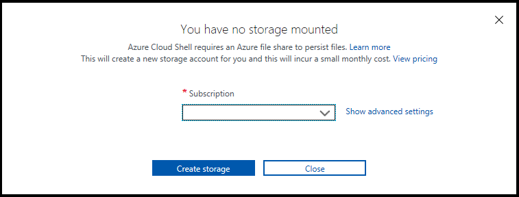

1. Azure Cloud Shell launches in the shell you previously selected and displays information for the cloud drive it just created for you.

    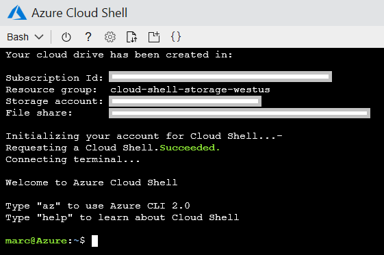

1. You may now exit the Cloud Shell

1. From the menu bar, select **View** > **Command Palette** > **Azure Terraform: init**.

    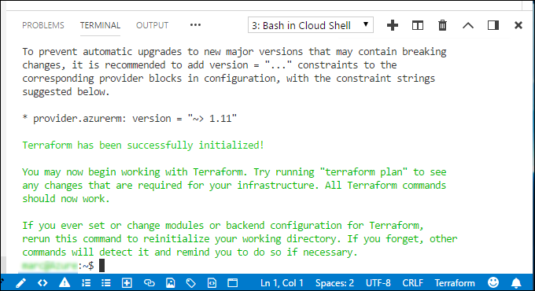

### Visualize the plan

Earlier in this tutorial, you installed GraphViz. Terraform can use GraphViz to generate a visual representation of either a configuration or execution plan. The Azure Terraform Visual Studio Code extension implements this feature via the *visualize* command.

- From the menu bar, select **View > Command Palette > Azure Terraform: Visualize**.

    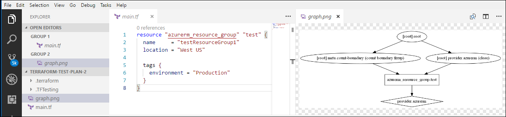

### Run Terraform *plan* command

The Terraform *plan* command is used to check whether the execution plan for a set of changes will do what you intended.

>[!NOTE]
>Terraform *plan* does not make any changes to your real Azure resources. To actually make the changes contained in your plan, we use the Terraform *apply* command.

- From the menu bar, select **View** > **Command Palette** > **Azure Terraform: plan**.

    

### Run Terraform *apply* command

After being satisfied with the results of Terraform *plan*, you can run the *apply* command.

1. From the menu bar, select **View** > **Command Palette** > **Azure Terraform: apply**.

    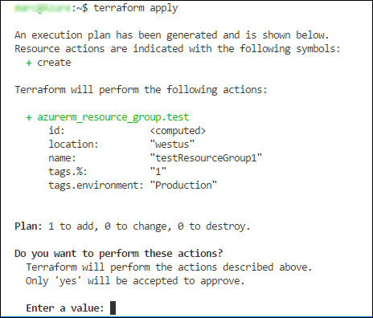

1. Enter `yes`.

    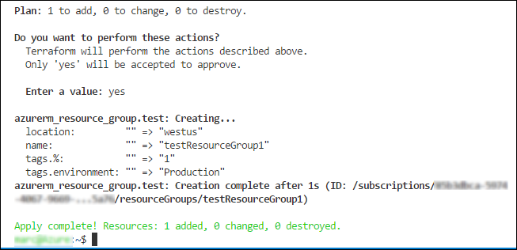

### Verify your Terraform plan was executed

To see if your new Azure resource group was successfully created:

1. Open the Azure portal.

1. Select **Resource groups** in the left navigation pane.

    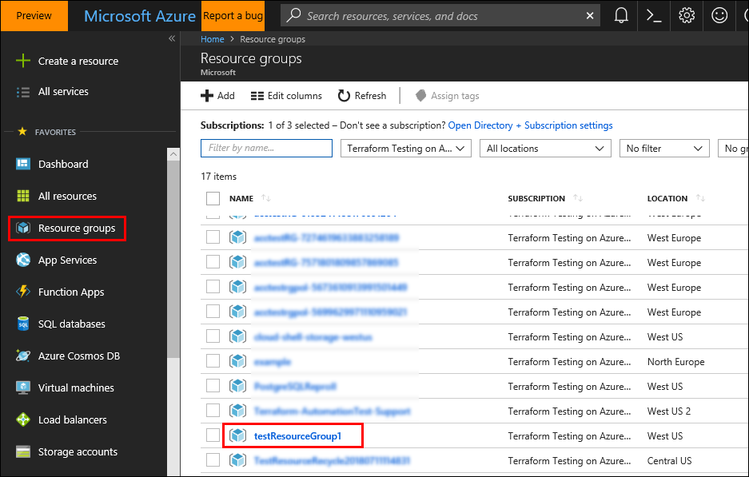

Your new resource group should be listed in the **NAME** column.

>[!NOTE]
>You may leave your Azure Portal window open for now; we will be using it in the next step.

### Run Terraform *destroy* command

1. From the menu bar, select **View** > **Command Palette** > **Azure Terraform: destroy**.

    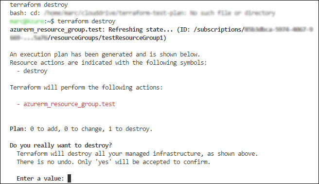

1. Enter *yes*.

    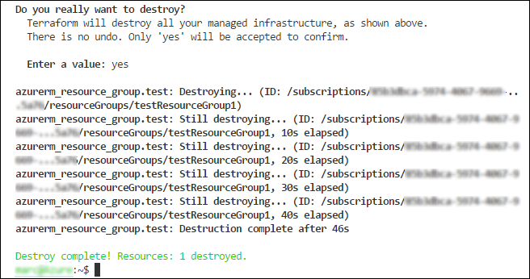

### Verify your resource group was destroyed

To confirm that Terraform successfully destroyed your new resource group:

1. Select **Refresh** on the Azure portal **Resource groups** page.

1. Your resource group will no longer be listed.

    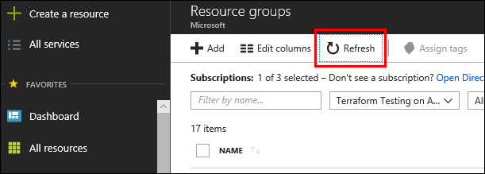

## Exercise 2: Terraform *compute* module

In this exercise, you learn how to load the Terraform *compute* module into the Visual Studio Code environment.

### Clone the terraform-azurerm-compute module

1. Use [this link](https://github.com/Azure/terraform-azurerm-compute) to access the Terraform Azure Rm Compute module on GitHub.

1. Select **Clone or download**.

    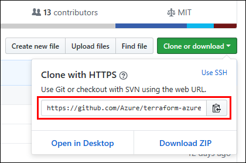

    >[!NOTE]
    >In this example, our folder was named *terraform-azurerm-compute*.

### Open the folder in Visual Studio Code

1. Launch Visual Studio Code.

1. From the menu bar, select **File > Open Folder** and navigate to and select the folder you created in the previous step.

    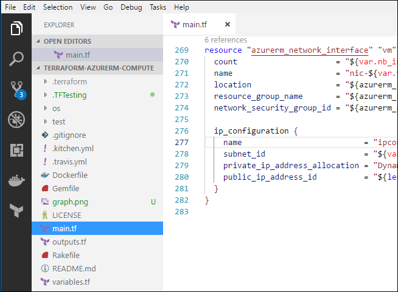

### Initialize Terraform

Before you can begin using the Terraform commands from within Visual Studio Code, you download the plug-ins for two Azure providers: random and azurerm.

1. In the Terminal pane of the Visual Studio Code IDE, enter `terraform init`.

    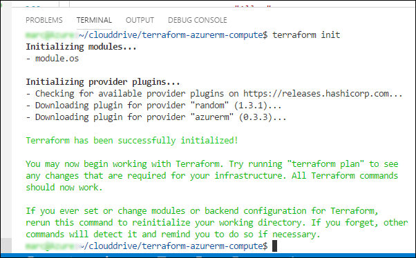

1. Enter `az login`, press **<Enter**, and follow the on-screen instructions.

### Module test: *lint*

1. From the menu bar, select **View > Command Palette > Azure Terraform: Execute Test**.

1. From the list of test-type options, select **lint**.

    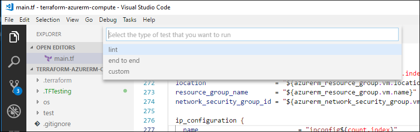

1. When the confirmation appears, select **OK**, and follow the on-screen instructions.

    

>[!NOTE]
>When you execute either the **lint** or **end to end** test, Azure uses a container service to provision a test machine to perform the actual test. For this reason, your test results may typically take several minutes to be returned.

After a few moments, you see a listing in the Terminal pane similar to this example:

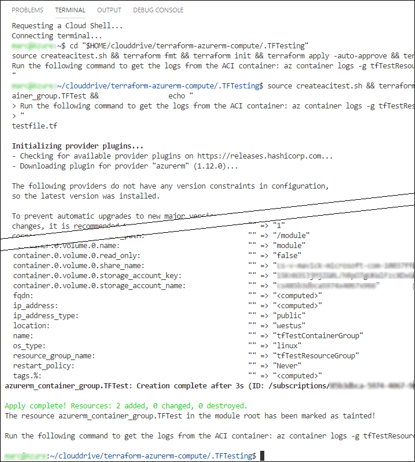

### Module test: *end-to-end*

1. From the menu bar, select **View > Command Palette > Azure Terraform: Execute Test**.

1. From the list of test type options, select **end to end**.

    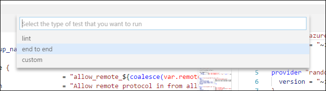

1. When the confirmation appears, select **OK**, and follow the on-screen instructions.

    

>[!NOTE]
>When you execute either the **lint** or **end to end** test, Azure uses a container service to provision a test machine to perform the actual test. For this reason, your test results may typically take several minutes to be returned.

After a few moments, you see a listing in the Terminal pane similar to this example:

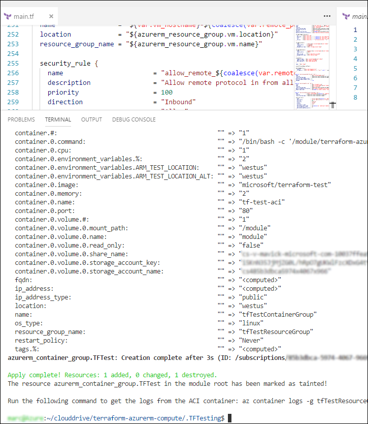

## Next steps
> [!div class="nextstepaction"]
> [List of the Terraform modules available for Azure (and other supported providers)](https://registry.terraform.io/)