---

title: 'Azure Terraform VS Code Module Generator'
description: Learn how to use Yeoman to create a Terraform base template.
services: terraform
ms.service: terraform
keywords: terraform, devops, virtual machine, azure, yeoman
author: v-mavick
manager: jeconnoc
ms.author: v-mavick
ms.topic: tutorial
ms.date: 09/12/2018

---

# Create a Terraform base template using Yeoman

[Terraform](https://docs.microsoft.com/azure/terraform/
) provides a way to easily create infrastructure on Azure. [Yeoman](http://yeoman.io/) greatly eases the job of the module developer in creating Terraform modules while providing an excellent *best practices* framework.

In this article, you learn how to use the Yeoman module generator to create a base Terraform template.

## Prerequisites

- A computer running Windows 10, Linux, or macOS 10.10+.
- **Azure subscription**: If you don't have an Azure subscription, create a [free account](https://azure.microsoft.com/free/) before you begin.
- **Visual Studio Code**: We will be using [Visual Studio Code](https://www.bing.com/search?q=visual+studio+code+download&form=EDGSPH&mkt=en-us&httpsmsn=1&refig=dffc817cbc4f4cb4b132a8e702cc19a3&sp=3&ghc=1&qs=LS&pq=visual+studio+code&sk=LS1&sc=8-18&cvid=dffc817cbc4f4cb4b132a8e702cc19a3&cc=US&setlang=en-US) to examine files created by the Yeoman generator. However, you may use any code editor of your choice.
- **Terraform**: You will need an installation of [Terraform](https://docs.microsoft.com/azure/virtual-machines/linux/terraform-install-configure ) to run the module created by Yeoman.
- **Docker**: We will be using [Docker](https://www.docker.com/get-started) to run the module created by the Yeoman generator. (If you prefer, you may use Ruby in place of Docker to run the sample module.)
- **Go programming language**: You will need an installation of [Go](https://golang.org/) because the test cases generated by Yeoman are written in Go.

>[!NOTE]
>Most of the procedures in this tutorial involve command line entries. The steps described here apply to all operating systems and command line tools. In our examples we have chosen to use PowerShell. However you may use any one of several alternatives, such as Git Bash, Windows command prompts, or Linux or macOS command line commands.

## Prepare your environment

### Install Node.js

To use Terraform in the Cloud Shell, you need to [install Node.js](https://nodejs.org/en/download/) 6.0+.

>[!NOTE]
>To verify that Node.js is installed, open a terminal window and enter `node --version`.

### Install Yeoman

From a command prompt, enter `npm install -g yo`

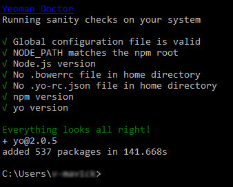

### Install the Yeoman template for Terraform module

From a command prompt, enter `npm install -g generator-az-terra-module`.

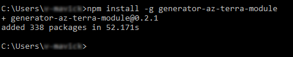

>[!NOTE]
>To verify that Yeoman is installed, from a terminal window, enter `yo --version`.

### Create an empty folder to hold the Yeoman-generated module

The Yeoman template generates files in the **current directory**. For this reason, you need to create a directory.

>[!Note]
>This empty directory is required to be put under $GOPATH/src. You will find instructions [here](https://github.com/golang/go/wiki/SettingGOPATH) to accomplish this.

From a command prompt:

1. Navigate to the parent directory that you want to contain the new, empty directory we are about to create.
1. Enter `mkdir <new-directory-name>`.

    >[!NOTE]
    >Replace <new-directory-name> with the name of your new directory. In this example, we named the new directory `GeneratorDocSample`.

    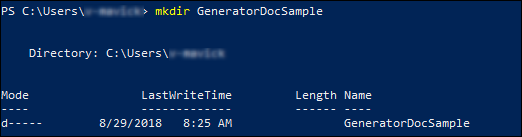

1. Navigate into the new directory by typing `cd <new directory's name>`, and then pressing **enter**.

    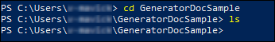

    >[!NOTE]
    >To make sure this directory is empty, enter `ls`. There should be no files listed in the resulting output of this command.

## Create a base module template

From a command prompt:

1. Enter `yo az-terra-module`.

1. Follow the on-screen instructions to provide the following information:

    - *Terraform module project Name*

        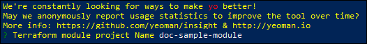       

        >[!NOTE]
        >In this example, we entered `doc-sample-module`.

    - *Would you like to include the Docker image file?*

        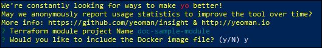 

        >[!NOTE]
        >Enter `y`. If you select **n**, the generated modue code will support running only in native mode.

3. Enter `ls` to view the resulting files that are created.

    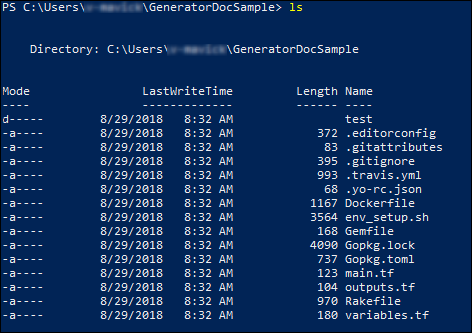

## Review the generated module code

1. Launch Visual Studio Code

1. From the menu bar, select **File > Open Folder** and select the folder you created.

    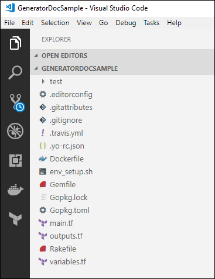

Let's take a look at some of the files that were created by the Yeoman module generator.

>[!Note]
>In this article we will be using the main.tf, variables.tf, and outputs.tf files as created by the Yeoman module generator. However, when creating your own modules, you would be editing these files to accommodate the functionality of your Terraform module. For a more in-depth discussion of these files and their usage, see [Terratest in Terraform Modules.](https://mseng.visualstudio.com/VSJava/_git/Terraform?path=%2FTerratest%20Introduction.md&version=GBmaster)

### main.tf

Defines a module called *random-shuffle*. The input is a *string_list*. The output is the count of the permutations.

### variables.tf

Defines the input and output variables used by the module.

### outputs.tf

Defines what the module outputs. Here, it is the value returned by **random_shuffle**, which is a built-in, Terraform module.

### Rakefile

Defines the build steps. These steps include:

- **build**: Validates the formatting of the main.tf file.
- **unit**: The generated module skeleton does not include code for a unit test. If you want to specify a unit test scenario, you would you add that code here.
- **e2e**: Runs an end-to-end test of the module.

### test

- Test cases are written in Go.
- All codes in test are end-to-end tests.
- End-to-end tests try to use Terraform to provision all of the items defined under **fixture** and then compare the output in the **template_output.go** code with the pre-defined expected values.
- **Gopkg.lock** and **Gopkg.toml**: Define your dependencies. 

## Test the module using Docker

>[!NOTE]
>In our example, we are running the module as a local module, and not actually touching Azure.

### Confirm Docker is installed and running

From a command prompt, enter `docker version`.

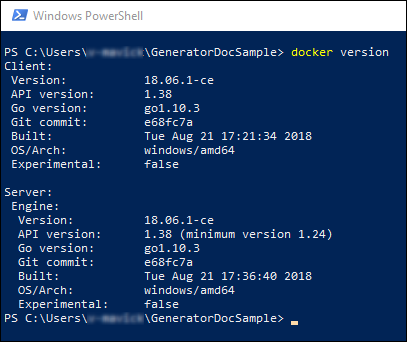

The resulting output confirms that Docker is installed.

To confirm that Docker is actually running, enter `docker info`.

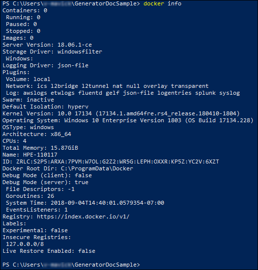

### Set up a Docker container

1. From a command prompt, enter

    `docker build --build-arg BUILD_ARM_SUBSCRIPTION_ID= --build-arg BUILD_ARM_CLIENT_ID= --build-arg BUILD_ARM_CLIENT_SECRET= --build-arg BUILD_ARM_TENANT_ID= -t terra-mod-example .`.

    The message **Successfully built** will be displayed.

    

1. From the command prompt, enter `docker image ls`.

    You will see your newly created module *terra-mod-example* listed.

    

    >[!NOTE]
    >The module's name, *terra-mod-example*, was specified in the command you entered in step 1, above.

1. Enter `docker run -it terra-mod-example /bin/sh`.

    You are now running in Docker and can list the file by entering `ls`.

    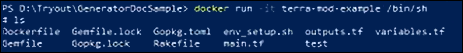

1. Enter `bundle install`.

    Wait for the **Bundle complete** message, then continue with the next step.

1. Enter `rake build`.

    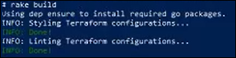

### Perform the end-to-end test

1. Enter `rake e2e`.

1. After a few moments, the **PASS** message will appear.

    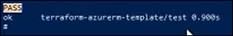

1. Enter `exit` to complete the end-to-end test.

## Next steps

> [!div class="nextstepaction"]
> [Install and use the Azure Terraform Visual Studio Code extenstion.](https://docs.microsoft.com/azure/terraform/terraform-vscode-extension)
