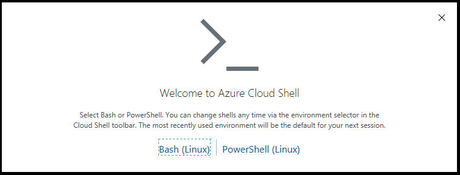

# Tutorial: Create a Terraform base template in Azure using Yeoman

In this tutorial, you'll learn how to use the combination of [Terraform](/azure/terraform/) and [Yeoman](https://yeoman.io/). Terraform is a tool for creating infrastructure on Azure. Yeoman makes it easy to create Terraform modules.

In this article, you learn how to do the following tasks:
> [!div class="checklist"]
> * Create a base Terraform template using the Yeoman module generator.
> * Test the Terraform template using two different methods.
> * Run the Terraform module using a Docker file.
> * Run the Terraform module natively in Azure Cloud Shell.

## Prerequisites

- **Azure subscription**: If you don't have an Azure subscription, create a [free account](https://azure.microsoft.com/free/) before you begin.
- **Visual Studio Code**: [Download Visual Studio Code](https://code.visualstudio.com/download) for your platform.
- **Terraform**: [Install Terraform](/azure/virtual-machines/linux/terraform-install-configure ) to run the module created by Yeoman.
- **Docker**: [Install Docker](https://www.docker.com/get-started) to run the module created by the Yeoman generator.
- **Go programming language**: [Install Go](https://golang.org/) as Yeoman-generated test cases are code using the Go language.

>[!NOTE]
>Most of the procedures in this tutorial involve the command line interface. The steps described apply to all operating systems and command line tools. For the examples, PowerShell was chosen for the local environment and Git Bash for the cloud shell environment.

## Prepare your environment

### Install Node.js

To use Terraform in the Cloud Shell, you need to [install Node.js](https://nodejs.org/en/download/) 6.0+.

>[!NOTE]
>To verify that Node.js is installed, open a terminal window and enter `node --version`.

### Install Yeoman

Run the following command:

```bash
npm install -g yo
```


### Install the Yeoman template for Terraform module

Run the following command:

```bash
npm install -g generator-az-terra-module
```


To verify that Yeoman is installed, run the following command:

```bash
yo --version
```

### Create a directory for the Yeoman-generated module

The Yeoman template generates files in the current directory. For this reason, you need to create a directory.

This empty directory is required to be put under $GOPATH/src. For more information about this path, see the article [Setting GOPATH](https://github.com/golang/go/wiki/SettingGOPATH).

1. Navigate to the parent directory from which to create a new directory.

1. Run the following command replacing the placeholder. For this example, a directory name of `GeneratorDocSample` is used.

    ```bash
    mkdir <new-directory-name>
    ```

    

1. Navigate to the new directory:

    ```bash
    cd <new-directory-name>
    ```

    

## Create a base module template

1. Run the following command:

    ```bash
    yo az-terra-module
    ```

1. Follow the on-screen instructions to provide the following information:

    - **Terraform module project Name** - A value of `doc-sample-module` is used for the example.

               


    - **Would you like to include the Docker image file?** - Enter `y`. If you select `n`, the generated module code will support running only in native mode.

         

1. List the directory contents to view the resulting files that are created:

    ```bash
    ls
    ```

    

## Review the generated module code

1. Launch Visual Studio Code

1. From the menu bar, select **File > Open Folder** and select the folder you created.

    

The following files were created by the Yeoman module generator. For more information about these files and their usage, see [Terratest in Terraform Modules.](https://mseng.visualstudio.com/VSJava/_git/Terraform?path=%2FTerratest%20Introduction.md&version=GBmaster).

- `main.tf` - Defines a module called `random-shuffle`. The input is a `string_list`. The output is the count of the permutations.
- `variables.tf` - Defines the input and output variables used by the module.
- `outputs.tf` - Defines what the module outputs. Here, it's the value returned by `random_shuffle`, which is a built-in, Terraform module.
- `Rakefile` - Defines the build steps. These steps include:
    - `build` - Validates the formatting of the main.tf file.
    - `unit` -  The generated module skeleton doesn't include code for a unit test. If you want to specify a unit test scenario, you would you add that code here.
    - `e2e` - Runs an end-to-end test of the module.
- `test`
    - Test cases are written in Go.
    - All codes in test are end-to-end tests.
    - End-to-end tests attempt to provision all of the items defined under `fixture`. The results in the `template_output.go` file are compared with the pre-defined expected values.
    - `Gopkg.lock` and `Gopkg.toml`: Defines the dependencies. 

## Test your new Terraform module using a Docker file

This section shows how to test a Terraform module using a Docker file.

>[!NOTE]
>This example runs the module locally; not on Azure.

### Confirm Docker is installed and running

From a command prompt, enter `docker version`.


The resulting output confirms that Docker is installed.

To confirm that Docker is actually running, enter `docker info`.


### Set up a Docker container

1. From a command prompt, enter

    `docker build --build-arg BUILD_ARM_SUBSCRIPTION_ID= --build-arg BUILD_ARM_CLIENT_ID= --build-arg BUILD_ARM_CLIENT_SECRET= --build-arg BUILD_ARM_TENANT_ID= -t terra-mod-example .`.

    The message **Successfully built** will be displayed.

    

1. From the command prompt, enter `docker image ls` to see your created module `terra-mod-example` listed.

    

1. Enter `docker run -it terra-mod-example /bin/sh`. After running the `docker run` command, you're in the Docker environment. At that point, you can discover the file by using the `ls` command.

    

### Build the module

1. Run the following command:

    ```bash
    bundle install
    ```

1. Run the following command:

    ```bash
    rake build
    ```

    

### Run the end-to-end test

1. Run the following command:

    ```bash
    rake e2e
    ```

1. After a few moments, the **PASS** message will appear.

    

1. Enter `exit` to complete the test and exit the Docker environment.

## Use Yeoman generator to create and test a module in Cloud Shell

In this section, the Yeoman generator is used to create and test a module in Cloud Shell. Using Cloud Shell instead of using a Docker file greatly simplifies the process. Using Cloud Shell, the following products are all pre-installed:

- Node.js
- Yeoman
- Terraform

### Start a Cloud Shell session

1. Start an Azure Cloud Shell session via either the [Azure portal](https://portal.azure.com/), [shell.azure.com](https://shell.azure.com), or the [Azure mobile app](https://azure.microsoft.com/features/azure-portal/mobile-app/).

1. **The Welcome to Azure Cloud Shell** page opens. Select **Bash (Linux)**.

    

1. If you have not already set up an Azure storage account, the following screen appears. Select **Create storage**.

    

1. Azure Cloud Shell launches in the shell you previously selected and displays information for the cloud drive it just created for you.

    

### Prepare a directory to hold your Terraform module

1. At this point, Cloud Shell will have already configured GOPATH in your environment variables for you. To see the path, enter `go env`.

1. Create the $GOPATH directory, if one doesn't already exist: Enter `mkdir ~/go`.

1. Create a directory within the $GOPATH directory. This directory is used to hold the different project directories created in this example. 

    ```bash
    mkdir ~/go/src
    ```

1. Create a directory to hold your Terraform module replacing the placeholder. For this example, a directory name of `my-module-name` is used.

    ```bash
    mkdir ~/go/src/<your-module-name>
    ```

1. Navigate to your module directory: 

    ```bash
    cd ~/go/src/<your-module-name>
    ```

### Create and test your Terraform module

1. Run the following command and follow the instructions. When asked if you want to create the Docker files, you enter `N`.

    ```bash
    yo az-terra-module
    ```

1. Run the following command to install the dependencies:

    ```bash
    bundle install
    ```

1. Run the following command to build the module:

    ```bash
    rake build
    ```

    

1. Run the following command to run the text:

    ```bash
    rake e2e
    ```

    

## Next steps

> [!div class="nextstepaction"]
> [Install and use the Azure Terraform Visual Studio Code extension](/azure/terraform/terraform-vscode-extension).