# Grant data access to an environment

[!INCLUDE [retirement](../../includes/tsi-retirement.md)]

This article discusses the two types of Azure Time Series Insights access policies.

> [!Warning]
> Access Policies grant Microsoft Entra users and/or Groups Data Plane access to your Time Series Insights Environment.
> A Microsoft Entra ID is tied to a Tenant. So if you decide to move your Subscription between Tenants, make sure to follow the procedure
> from [the section below](#procedure-for-when-the-subscription-is-moved-across-tenants).

## Sign in to Azure Time Series Insights

1. Sign in to the [Azure portal](https://portal.azure.com/).
1. Locate your Azure Time Series Insights environment by entering `Time Series Insights environments` in the **Search** box. Select `Time Series Insights environments` in the search results.
1. Select your Azure Time Series Insights environment from the list.

## Grant data access

Follow these steps to grant data access for a user principal.

1. Select **Data Access Policies**, and then select **+ Add**.

    [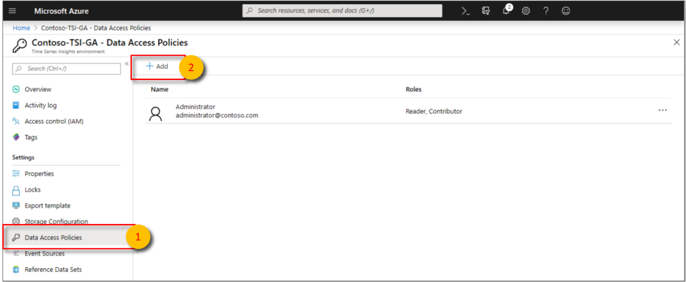](media/data-access/data-access-select-add-button.png#lightbox)

1. Choose **Select user**. Search for the user name or email address to locate the user you want to add. Select **Select** to confirm the selection.

    [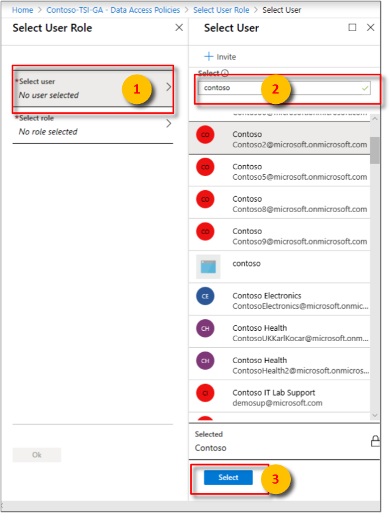](media/data-access/data-access-select-user-to-confirm.png#lightbox)

1. Choose **Select role**. Choose the appropriate access role for the user:

    * Select **Contributor** if you want to allow the user to change reference data and share saved queries and perspectives with other users of the environment.

    * Otherwise, select **Reader** to allow the user to query data in the environment and save personal, not shared, queries in the environment.

   Select **OK** to confirm the role choice.

    [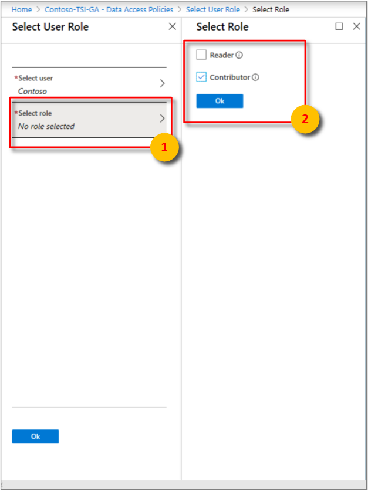](media/data-access/data-access-select-a-role.png#lightbox)

1. Select **OK** on the **Select User Role** page.

    [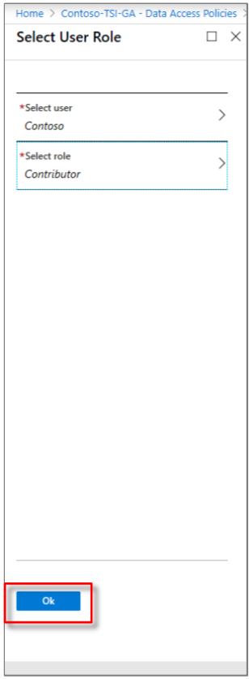](media/data-access/data-access-confirm-user-and-role.png#lightbox)

1. Confirm that the **Data Access Policies** page lists the users and the roles for each user.

    [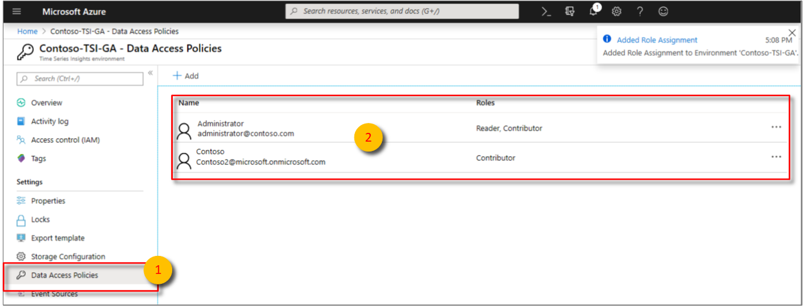](media/data-access/data-access-verify-and-confirm-assignments.png#lightbox)

## Provide guest access from another Microsoft Entra tenant

The `Guest` role isn't a management role. It's a term used for an account that's invited from one tenant to another. After the guest account is invited into the tenant's directory, it can have the same access control applied to it like any other account. You can grant management access to an Azure Time Series Insights Environment by using the Access Control (IAM) blade. Or you can grant access to the data in the environment through the Data Access Policies blade. For more information on Microsoft Entra tenant guest access, read [Add Microsoft Entra B2B collaboration users in the Azure portal](../active-directory/external-identities/add-users-administrator.md).

Follow these steps to grant guest access to an Azure Time Series Insights environment to a Microsoft Entra user from another tenant.

1. Go to Azure portal, click on  **Microsoft Entra ID**, scroll down on the **Overview** tab and then select **Guest user**.

    [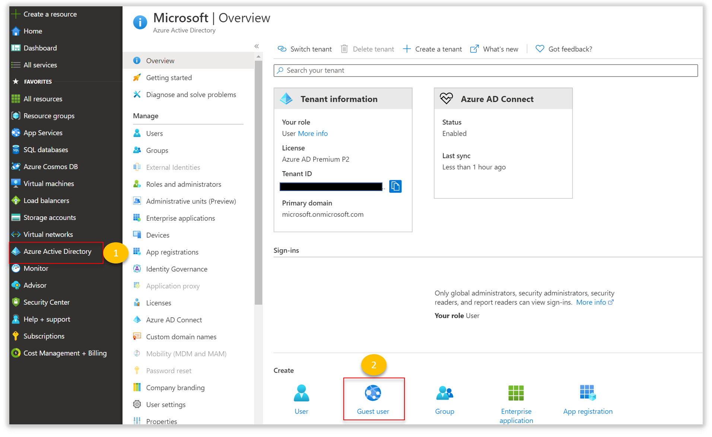](media/data-access/data-access-invite-another-aad-tenant.png#lightbox)

1. Enter the email address for the user you want to invite. This email address must be associated with Microsoft Entra ID. You can optionally include a personal message with the invitation.

    [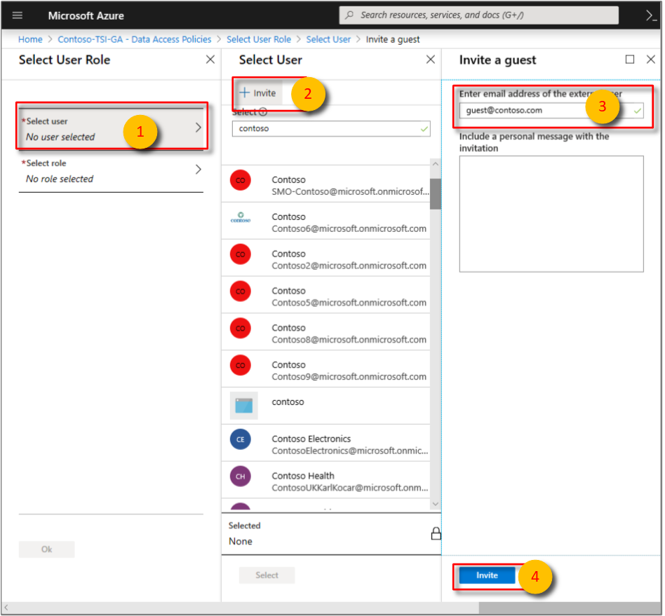](media/data-access/data-access-invite-guest-by-email.png#lightbox)

1. Look for the confirmation bubble that appears on the screen. You can also click on **Notifications** to confirm that the guest user was added.

    [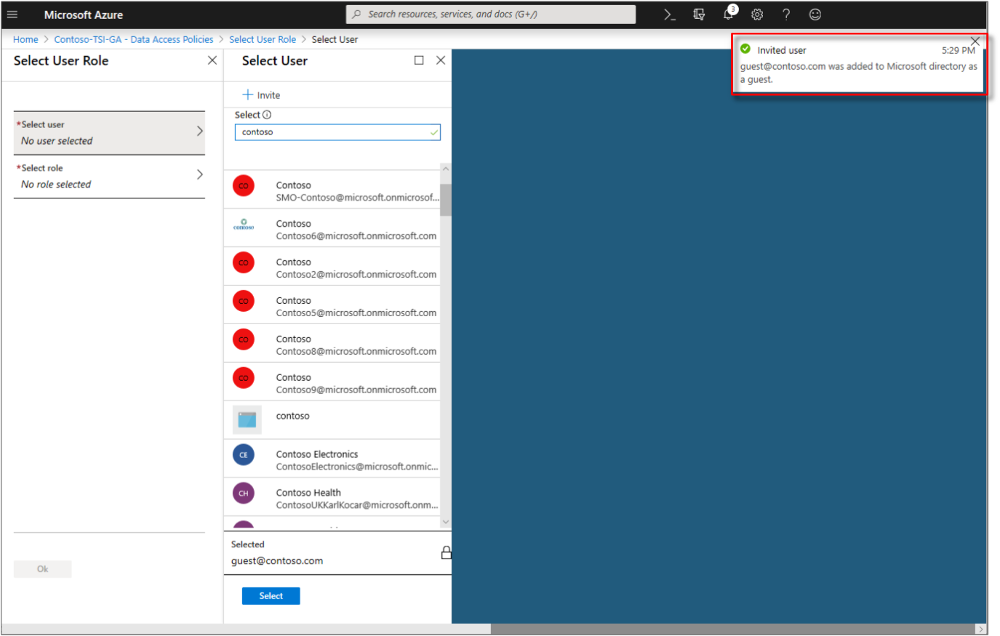](media/data-access/data-access-confirmation-bubble.png#lightbox)

1. Go back to your Time Series Insights environment to add the newly created guest user. Click on **Data Access Policies** as described under **Grant data access**. **Select user**. Search for the email address of the guest user you invited to locate the user you want to add. Then, **Select** to confirm the selection.

    [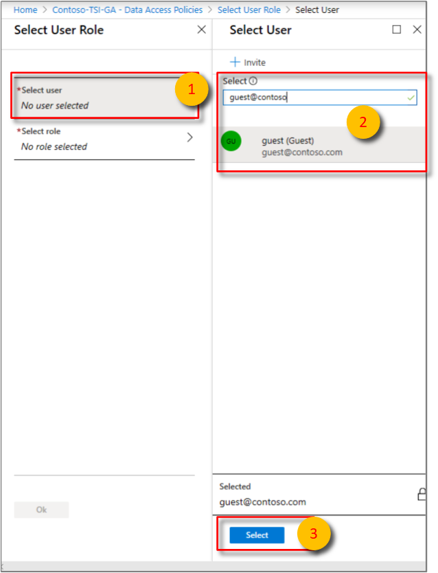](media/data-access/data-access-select-invited-person-confirmation.png#lightbox)

1. Choose **Select role**. Choose the appropriate access role for the guest user:

    * Select **Contributor** if you want to allow the user to change reference data and share saved queries and perspectives with other users of the environment.

    * Otherwise, select **Reader** to allow the user to query data in the environment and save personal, not shared, queries in the environment.

   Select **OK** to confirm the role choice.

    

1. Select **OK** on the **Select User Role** page.

1. Confirm that the **Data Access Policies** page lists the guest user and the roles for each guest user.

    [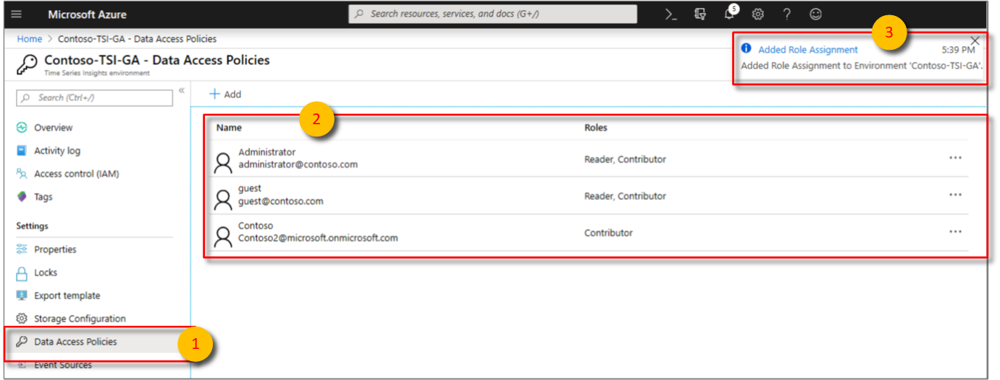](media/data-access/data-access-confirm-invited-users-and-roles.png#lightbox)

1. Now, the guest user will receive an invitation email at the email address specified above. The guest user will select **Get Started** to confirm their acceptance and connect to Azure Cloud.

    [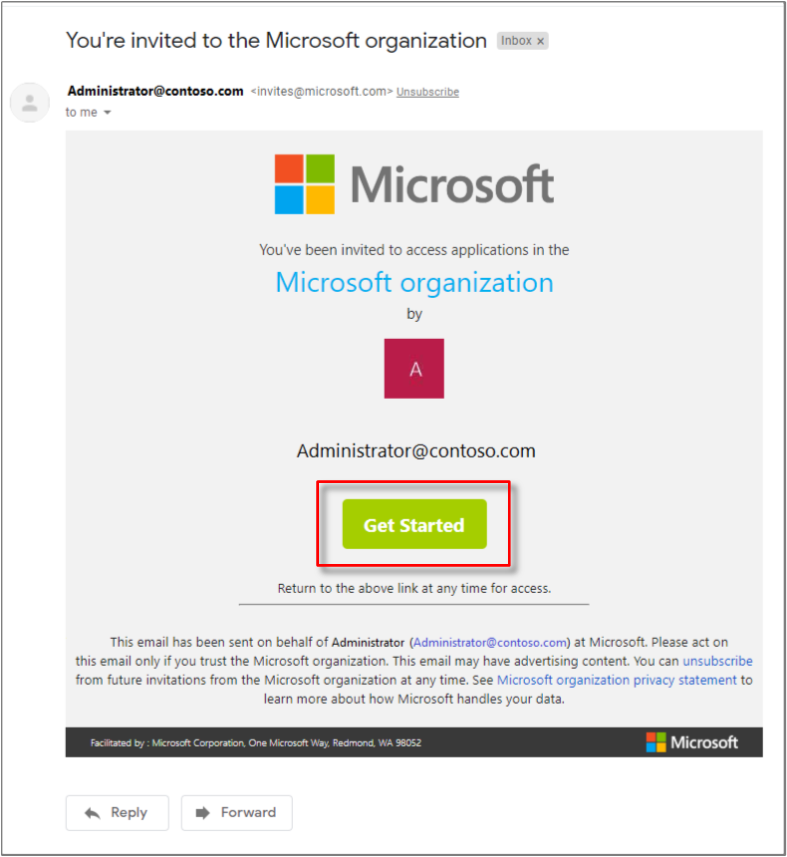](media/data-access/data-access-email-invitation.png#lightbox)

1. After selecting **Get Started**, the guest user will be presented with a permissions box associated with the administrator's organization. Upon granting permission by selecting **Accept**, they will be signed in.

    [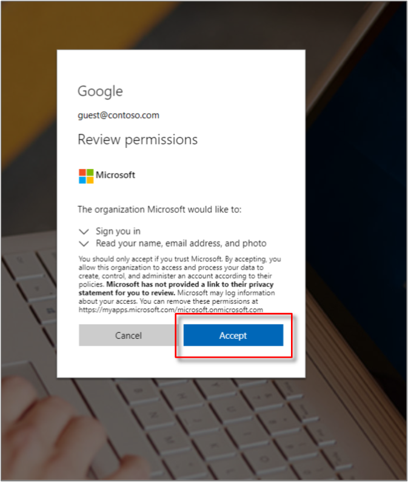](media/data-access/data-access-grant-permission-sign-in.png#lightbox)

1. The administrator [shares the environment URL](time-series-insights-parameterized-urls.md) with their guest.

1. After the guest user is signed in to the email address you used to invite them, and they accept the invitation, they will be directed to Azure portal.

1. The guest can now access the shared environment using the environment URL provided by the administrator. They can enter that URL into their web browser for immediate access.

1. The administrator's tenant will be displayed to the guest user after selecting their profile icon in the upper-right corner of the Time Series explorer.

    [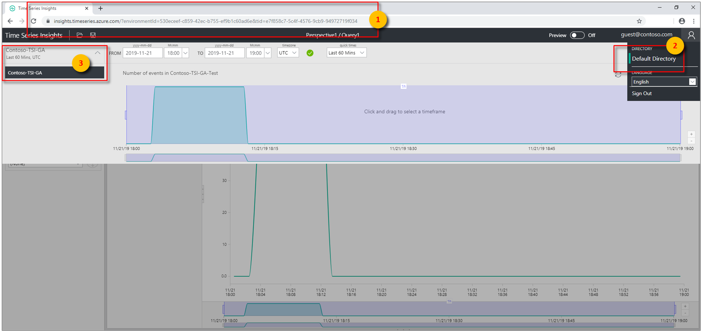](media/data-access/data-access-select-tenant-and-instance.png#lightbox)

    After the guest user selects the administrator's tenant, they will have the ability to select the shared Azure Time Series Insights environment.

    They now have all the capabilities associated with the role that you provided them with in **step 5**.

    [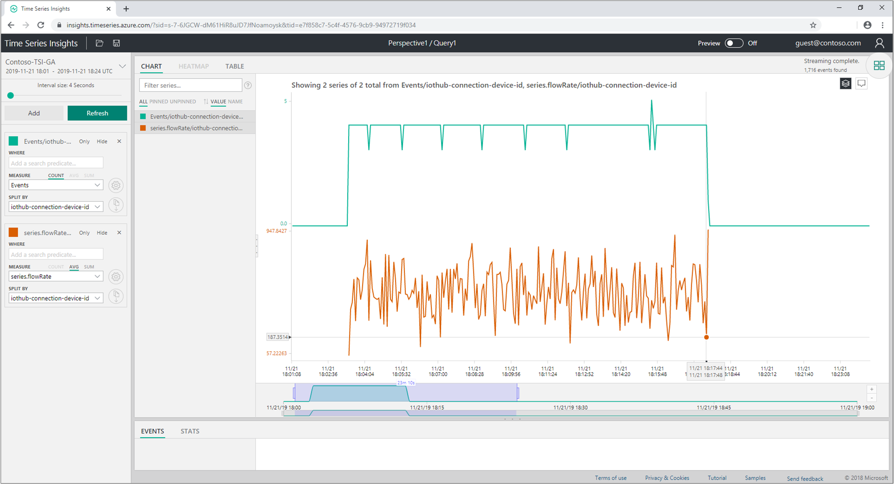](media/data-access/data-access-all-capabilities.png#lightbox)

## Procedure for when the Subscription is moved across Tenants

Time Series Insights Data Access Policies are backed by Microsoft Entra ID, which are tied to an Azure Tenant where the Subscription lives in.

The Microsoft Entra Objects that you grant Data Access Policies to and the Time Series Insights Environment itself should live under the same Tenant. If not, these objects will not have access to the Environment.

If you plan to move the Subscription the Environment lives in to a different Tenant, you must ensure that the Data Access Policies are updated to reflect the Microsoft Entra Objects under the new Tenant.

To make this process smooth, follow the steps below.

### Before moving a Subscription to another Tenant

- Make sure you keep a list of the current Data Access Policies assignments from the Environment while it's still in the source Tenant.
- Make sure the users, groups or apps you still want to have access to the Environment after the Subscription are migrated to the Active Directory in the target Tenant.
- Make sure you will have - or you're engaged with someone who will have - at least Contributor access to the Subscription after it's moved, so the Data Access Policies can be re-applied in the Environment in the target Tenant.

### After moving a Subscription to another Tenant

Having Contributor access to the Subscription in the target Tenant, you can

- Remove all the Data Access Policies that were migrated with the Environment, since they belong to the source Tenant.
- Re-grant Access Policies to the Environment using the steps above, now pointing to the Microsoft Entra objects in the target Tenant.

## Next steps

* Read [Authentication and Authorization](time-series-insights-authentication-and-authorization.md) for Microsoft Entra app registration steps.

* View [your environment in the Azure Time Series Insights Explorer](./concepts-ux-panels.md).
