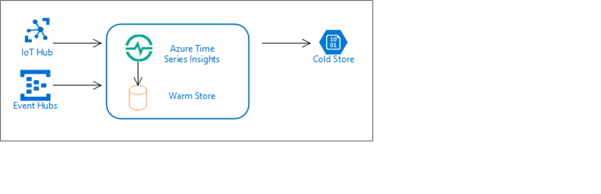

# Azure Time Series Insights Gen2 data ingestion overview

[!INCLUDE [retirement](../../includes/tsi-retirement.md)]

Your Azure Time Series Insights Gen2 environment contains an *ingestion engine* to collect, process, and store streaming time series data. As data arrives into your event source(s), Azure Time Series Insights Gen2 will consume and store your data in near real time.

## Ingestion topics

The following articles cover data processing in depth, including best practices to follow:

* Read about [event sources](./concepts-streaming-ingestion-event-sources.md) and guidance on selecting an event source timestamp.

* Review the supported [data types](./concepts-supported-data-types.md)

* Understand how the ingestion engine will apply a set of [rules](./concepts-json-flattening-escaping-rules.md) to your JSON properties to create your storage account columns.

* Review your environment [throughput limitations](./concepts-streaming-ingress-throughput-limits.md) to plan for your scale needs.

## Next steps

* Continue on to learn more about [event sources](./concepts-streaming-ingestion-event-sources.md) for your Azure Time Series Insights Gen2 environment.
