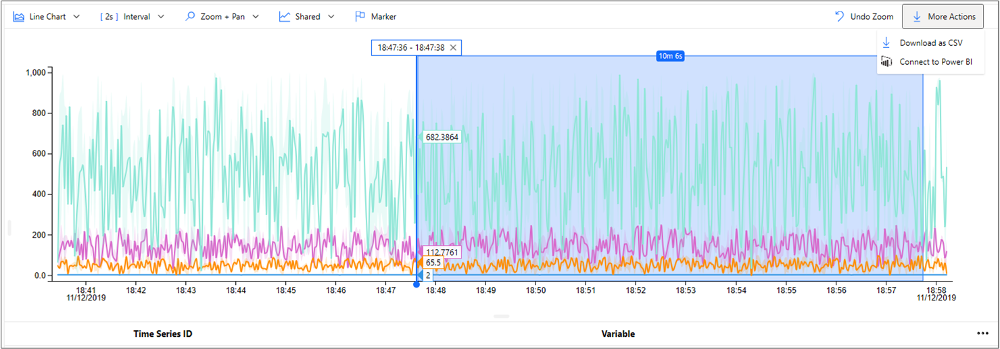
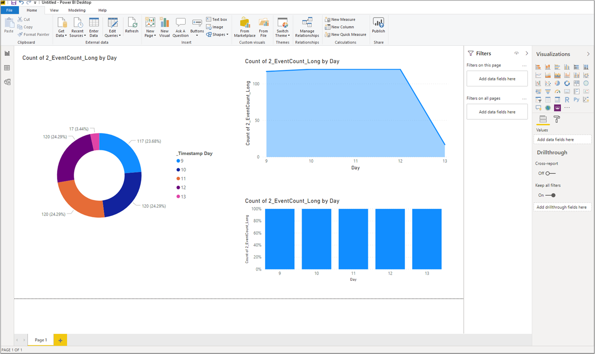

# Connect Time Series Insights to Power BI  

Are you looking for a solution to help correlate your time-series data, create vivid visualizations, and share insights across your organization?

Azure Time Series Insights now seamlessly integrates with [Power BI](https://powerbi.microsoft.com/), providing you with more powerful visualization and dashboarding capabilities over your streaming data and allows you to share insights and results across your organization.

## Video

### Learn more about integrating Azure Time Series Insights with Power BI. 

> [!VIDEO https://channel9.msdn.com/Shows/Internet-of-Things-Show/Power-BI-integration-with-TSI/player]

## Summary

   

By connecting your data to Power BI, you can now:

* Perform correlations with other data sources supported by Power BI and access a host of different data visualization options. 
* Create Power BI dashboards and reports using your Time Series Insight data, and share them with your organization. 
* Unlock data interop scenarios in a simple, easy-to-use manner, and get to insights faster than ever.
* Modify Time Series Insights data within Power BI using the powerful Advanced Editor.

## Native connector

Connecting your data takes less than a minute. By quickly exporting your view from Time Series Insight Explorer to Power BI, anyone in your organization can intuitively access and visually transform data.

Configuration options include choosing between **Raw** and **Aggregate-level** data and selecting a desired time range. 

Once data has been connected, all of Power BI's rich visualization and charting tools are available to further enhance your information sharing capabilities. 

   

Read [How to connect Time Series Insights to Power BI](./how-to-connect-power-bi.md) for step-by-step specifics.

## Flexible workflow
 
Use the connector from anywhere in your workflow:

* If you are in Time Series Insights Explorer, you can quickly export your view to Power BI. 
* If you are already in Power BI, augment your existing visualization scenarios using Time Series Insights query data.

For advanced querying and editing functionality within Power BI, use Power BI’s Advanced Editor.

## Next steps

* Read [How to connect Time Series Insights to Power BI](./how-to-connect-power-bi.md).

* Learn more about [Power BI](https://docs.microsoft.com/power-bi/).

* Download [Power BI desktop](https://powerbi.microsoft.com/desktop/) and begin to connect your data.