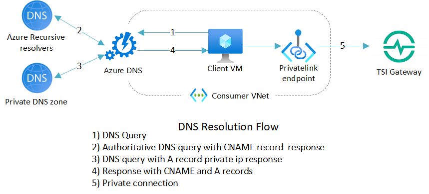
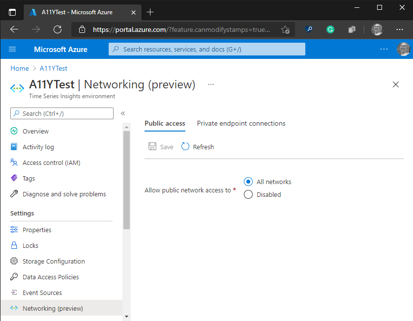

# Private network access with Azure Private Link (preview) 

[!INCLUDE [retirement](../../includes/tsi-retirement.md)]

[Azure Private Link](../private-link/private-link-overview.md) is a service that enables you to access Azure resources (like [Azure Event Hubs](../event-hubs/event-hubs-about.md), [Azure Storage](../storage/common/storage-introduction.md), and [Azure Cosmos DB](../cosmos-db/introduction.md)) and Azure-hosted customer and partner services over a private endpoint in your [Azure Virtual Network (VNet)](../virtual-network/virtual-networks-overview.md). 

Similarly, you can use private endpoints for your Time Series Insights instance to allow clients located in your virtual network to securely access the instance over Private Link. 

## About the private endpoints

The private endpoint uses an IP address from your Azure VNet address space. Network traffic between a client on your private network and the Time Series Insights instance traverses over the VNet and a Private Link on the Microsoft backbone network, eliminating exposure to the public internet. Here is a visual representation of this system: 

Customers can also block access to TSI environment for public access so that it will be accessible from the VNET only. Configuring a private endpoint for your Time Series Insights instance enables you to secure your Time Series Insights instance and eliminate public exposure, as well as avoid data exfiltration from your VNet. 

Once a private endpoint is enabled and public access is restricted customer will have to use a different address for TSI Explorer to access TSI Environment. That address can be found in Azure portal under Overview section. 

## Next steps

* For more information, see [How to configure private endpoints for TSI Environment](./how-to-private-links.md)