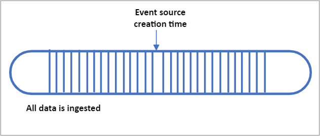
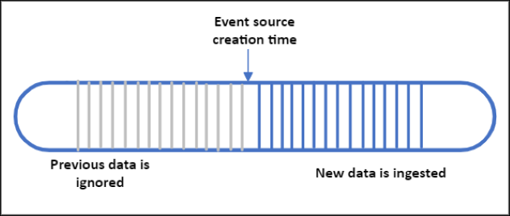
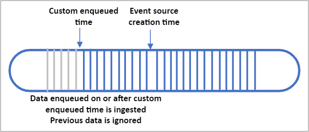

# Azure Time Series Insights Gen2 event sources

Your Azure Time Series Insights Gen2 environment can have up to two streaming event sources. Two types of Azure resources are supported as inputs:

- [Azure IoT Hub](../iot-hub/about-iot-hub.md)
- [Azure Event Hubs](../event-hubs/event-hubs-about.md)

Events must be sent as UTF-8 encoded JSON.

## Create or edit event sources

The event source is the link between your hub and your Azure Time Series Insights Gen2 environment, and a separate resource of type `Time Series Insights event source` is created in your resource group. The IoT Hub or Event Hub resource(s) can live in the same Azure subscription as your Azure Time Series Insights Gen2 environment or a different subscription. However, it is a best practice to house your Azure Time Series Insights environment and the IoT Hub or Event Hub within the same Azure region.

You can use the [Azure portal](./tutorials-set-up-tsi-environment.md#create-an-azure-time-series-insights-gen2-environment), [Azure CLI](/cli/azure/tsi/event-source), [Azure Resource Manager templates](time-series-insights-manage-resources-using-azure-resource-manager-template.md), and the [REST API](/rest/api/time-series-insights/management(gen1/gen2)/eventsources) to create, edit, or remove your environment's event sources.

> [!WARNING]
> Do not restrict Public Internet access to a hub or event source used by Time Series Insights or the necessary connection will be broken.

## Start options

When creating an event source, you can specify what pre-existing data should be collected. This setting is optional. The following options are available:

| Name   |  Description  |  Azure Resource Manager template example |
|----------|-------------|------|
| EarliestAvailable | Ingest all pre-existing data stored within the IoT or Event Hub | `"ingressStartAt": {"type": "EarliestAvailable"}` |
| EventSourceCreationTime |  Begin ingesting data that arrives after the event source is created. Any pre-existing data that was streamed prior to the creation of the event source will be ignored. This is the default setting in the Azure portal   |   `"ingressStartAt": {"type": "EventSourceCreationTime"}` |
| CustomEnqueuedTime | Your environment will ingest data from your custom enqueued time (UTC) forward. All events that were enqueued into your IoT or Event Hub at or after your custom enqueued time will be ingested and stored. All events that arrived prior to your custom enqueued time will be ignored. Note that "enqueued time" refers to the time (in UTC) that the event arrived in your IoT or Event Hub. This differs from a custom [timestamp property](./concepts-streaming-ingestion-event-sources.md#event-source-timestamp) that is within in the body of your event. |     `"ingressStartAt": {"type": "CustomEnqueuedTime", "time": "2021-03-01T17:00:00.20Z"}` |

> [!IMPORTANT]
>
> - If you select EarliestAvailable and have a lot of pre-existing data, you may experience high initial latency as your Azure Time Series Insights Gen2 environment processes all of your data.
> - This high latency should eventually subside as data is indexed. Submit a support ticket through the Azure portal if you experience ongoing high latency.

- EarliestAvailable

- EventSourceCreationTime

- CustomEnqueuedTime

## Streaming ingestion best practices

- Always create a unique consumer group for your Azure Time Series Insights Gen2 environment to consume data from your event source. Reusing consumer groups can cause random disconnects and may result in data loss.

- Configure your Azure Time Series Insights Gen2 environment and your IoT Hub and/or Event Hubs in the same Azure region. Although it is possible to configure an event source in a separate region, this scenario is not supported and we cannot guarantee high availability.

- Do not go beyond your environment's [throughput rate limit](./concepts-streaming-ingress-throughput-limits.md) or per partition limit.

- Configure a lag [alert](./time-series-insights-environment-mitigate-latency.md#monitor-latency-and-throttling-with-alerts) to be notified if your environment is experiencing issues processing data. See [Production workloads](./concepts-streaming-ingestion-event-sources.md#production-workloads) below for suggested alert conditions.

- Use streaming ingestion for near real-time and recent data only, streaming historical data is not supported.

- Understand how properties will be escaped and JSON [data flattened and stored.](./concepts-json-flattening-escaping-rules.md)

- Follow the principle of least privilege when providing event source connection strings. For Event Hubs, configure a shared access policy with the *send* claim only, and for IoT Hub use the *service connect* permission only.

> [!CAUTION]
> If you delete your IoT Hub or Event Hub and re-create a new resource with the same name, you need to create a new event source and attach the new IoT Hub or Event Hub. Data will not be ingested until you complete this step.

## Production workloads

In addition to the best practices above, we recommend that you implement the following for business critical workloads.

- Increase your IoT Hub or Event Hub data retention time to the maximum of seven days.

- Create environment alerts in the Azure portal. Alerts based on platform [metrics](./how-to-monitor-tsi-reference.md#metrics) allow you to validate end-to-end pipeline behavior. The instructions for creating and managing alerts are [here](./time-series-insights-environment-mitigate-latency.md#monitor-latency-and-throttling-with-alerts). Suggested alert conditions:

  - IngressReceivedMessagesTimeLag is greater than 5 minutes
  - IngressReceivedBytes is 0
- Keep your ingestion load balanced between your IoT Hub or Event Hub partitions.

### Historical Data Ingestion

Using the streaming pipeline to import historical data is not currently supported in Azure Time Series Insights Gen2. If you need to import past data into your environment, follow the guidelines below:

- Do not stream live and historical data in parallel. Ingesting out of order data will result in degraded query performance.
- Ingest historical data in time-ordered fashion for best performance.
- Stay within the ingestion throughput rate limits below.
- Disable Warm Store if the data is older than your Warm Store retention period.

## Event source timestamp

When configuring an event source, you'll be asked to provide a timestamp ID property. The timestamp property is used to track events over time, this is the time that will be used as the timestamp `$ts` in the [Query APIs](/rest/api/time-series-insights/dataaccessgen2/query/execute) and for plotting series in the Azure Time Series Insights Explorer. If no property is provided at creation time, or if the timestamp property is missing from an event, then the event's IoT Hub or Events Hubs enqueued time will be used as the default. Timestamp property values are stored in UTC.

In general, users will opt to customize the timestamp property and use the time when the sensor or tag generated the reading rather than using the default hub enqueued time. This is particularly necessary when devices have intermittent connectivity loss and a batch of delayed messages are forwarded to Azure Time Series Insights Gen2.

If your custom timestamp is within a nested JSON object or an array, you'll need to provide the correct property name following our [flattening and escaping naming conventions](concepts-json-flattening-escaping-rules.md). For example, the event source timestamp for the JSON payload shown [here](concepts-json-flattening-escaping-rules.md#example-a) should be entered as `"values.time"`.

### Time zone offsets

Timestamps must be sent in ISO 8601 format and will be stored in UTC. If a time zone offset is provided, the offset will be applied and then the time stored and returned in UTC format. If the offset is improperly formatted, it will be ignored. In situations where your solution might not have context of the original offset, you can send the offset data in an additional separate event property to ensure that it's preserved and that your application can reference in a query response.

The time zone offset should be formatted as one of the following:

±HHMMZ 
±HH:MM 
±HH:MMZ

## Next steps

- Read the [JSON Flattening and Escaping Rules](./concepts-json-flattening-escaping-rules.md) to understand how events will be stored.

- Understand your environment's [throughput limitations](./concepts-streaming-ingress-throughput-limits.md)
