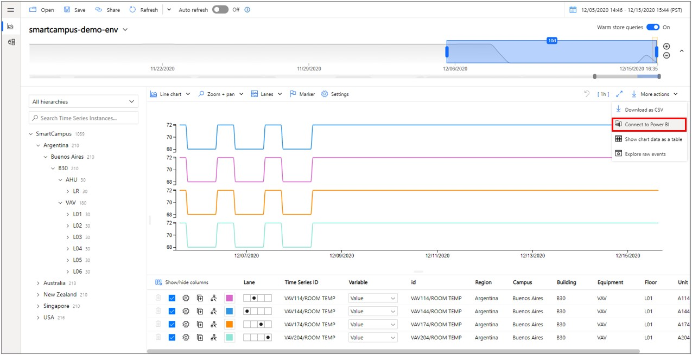
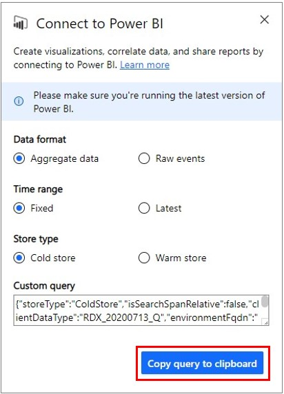
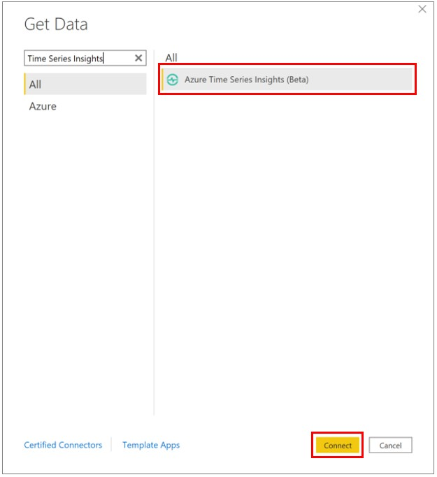

# Visualize data from Azure Time Series Insights in Power BI

[!INCLUDE [retirement](../../includes/tsi-retirement.md)]

Azure Time Series Insights is a platform for storing, managing, querying, and visualizing time-series data in the cloud. [Power BI](https://powerbi.microsoft.com) is a business analytics tool with rich visualization capabilities that allows you to share insights and results across your organization. Both services can now be integrated allowing you to augment the powerful analytics of Azure Time Series Insights with the strong data visualization and easy sharing capabilities of Power BI.

You'll learn how to:

* Connect Azure Time Series Insights to Power BI using the native Azure Time Series Insights connector
* Create visuals with your time-series data in Power BI
* Publish the report to Power BI and share with the rest of your organization

## Prerequisites

* Sign up for a [free Azure subscription](https://azure.microsoft.com/free/) if you don't already have one.
* Download and install the latest version of [Power BI Desktop](https://powerbi.microsoft.com/downloads/)
* Have or create an [Azure Time Series Insights Gen2 environment](./how-to-provision-manage.md)

Please review [environment access policies](./concepts-access-policies.md) and make sure you have either direct access or guest access to the Azure Time Series Insights Gen2 environment.

> [!IMPORTANT]
> Download and install the latest version of [Power BI Desktop](https://powerbi.microsoft.com/downloads/). To follow along with the steps in this article, please make sure you have at least the December 2020 (2.88.321.0) version of Power BI Desktop installed.

## Export data from Azure Time Series Insights into Power BI desktop

To get started:

1. Open the Azure Time Series Insights Gen2 Explorer and curate your data. This is the data that will be exported into Power BI.
1. Once you have created a view you are satisfied with, navigate to the **More actions** dropdown menu and select **Connect to Power BI**.

    

1. Set your parameters for export:

   * **Data format**: Choose whether you want to export **Aggregate data** or **Raw events** to Power BI.

       > [!NOTE]
       > If you export raw events, you can aggregate that data later in Power BI. However, if you export aggregate data, you cannot revert to raw data in Power BI. There is a 250,000 event count limit for Raw Event level data.

   * **Time Range**: Choose whether you'd like to see a **fixed** time range or the **latest** data in Power BI. Choosing the fixed time range means the data in the search span you've charted will be exported to Power BI. Choosing the latest time range means that Power BI will grab the latest data for the search span you've chosen (e.g. If you chart any 1 hour of data and choose the "latest" setting, Power BI Connector will always make queries for the latest 1 hour of data.)

   * **Store Type**: Choose whether you'd like to run your selected query against **Warm Store** or **Cold Store**. If you've selected a range that spans both Cold and Warm stores, your query will be routed to Cold Store by default since Warm store will contain only the latest data. Manually changing the storeType parameter is allowed, but not recommended for best experience.

    > [!TIP]
    > Azure Time Series Insights Explorer will automatically select the recommended parameters depending on the search span and view of data you've chosen to export.

1. Once you have configured your settings, select **Copy query to clipboard**.

    

1. Launch Power BI Desktop.

1. In Power BI Desktop on the **Home** tab, select **Get Data** in the upper left corner, then **More**.

    

1. Search for **Azure Time Series Insights**, select **Azure Time Series Insights (Beta)**, then **Connect**.

    

    Alternatively, navigate to the **Azure** tab, select **Azure Time Series Insights (Beta)**, then **Connect**.

1. Paste the query you copied from Azure Time Series Insights Explorer into the **Custom Query** field, then press **OK**.

    

1. The data table will now load. Press **Load** to load into Power BI. If you wish to make any transformations to the data, you can do so now by clicking **Transform Data**. You can also transform your data after it's loaded.

    

## Create a report with visuals

Now that you have imported the data into Power BI, it’s time to build a report with visuals.

1. On the left side of the window, make sure you have selected the **Report** view.

   

1. In the **Visualizations** column, select your visual of choice. For example, select **Line chart**. This will add a blank line chart to your canvas.

1. In the **Fields** list, select **_Timestamp** and drag it to the **Axis** field to display time along the X-axis. Make sure to switch to **_Timestamp** to as the value for the **Axis** (default is **Date Hierarchy**).

   

1. Again, in the **Fields** list, select the variable you wish to plot and drag it to the **Values** field to display values along the Y-axis. Select your Time Series ID value and drag it to the **Legend** field to create multiple lines in the chart, one per Time Series ID. This will render a view similar to what is provided by the Azure Time Series Insights Explorer!

   

1. To add another chart to your canvas, select anywhere on the canvas outside the line chart and repeat this process.

   

Once you have created your report, you can publish it to Power BI Reporting Services and share with others in your organization.

## Advanced editing

If you have already loaded a dataset in Power BI but would like to modify the query (such as the date/time or Environment ID parameters), you can do this via Power BI’s Advanced Editor functionality. Refer to the [Power BI documentation](/power-bi/desktop-query-overview) to learn more about how to make changes using the **Power Query Editor**.

## Next Steps

* Learn more about [Power BI desktop](/power-bi/desktop-query-overview).

* Learn about [querying data](concepts-query-overview.md) in Azure Time Series Insights Gen2.