# Visualize data from Time Series Insights in Power BI

Azure Time Series Insights is a platform for storing, managing, querying, and visualizing time-series data in the cloud. [Power BI](https://powerbi.microsoft.com) is a business analytics tool with rich visualization capabilities that allows you to share insights and results across your organization. Both services can now be integrated to get the best of both Time Series Insights' inherent visualization capabilities as well as Power BI's.

You'll learn how to:

* Connect Time Series Insights to Power BI using the cloud connector
* Create visuals with your data in Power BI
* Publish the report to Power BI and share with the rest of your organization

By the end, you'll learn how to visualize time-series data through Azure Time Series Insights and enhance it with the strong data visualization and easy sharing capabilities of Power BI.

Make sure to sign up for a [free Azure subscription](https://azure.microsoft.com/free/) if you don't already have one.

## Prerequisites

* Download and install the latest version of [Power BI Desktop](https://powerbi.microsoft.com/downloads/)
* Have or create an [Azure Time Series Insights Preview instance](time-series-insights-update-how-to-manage.md)

> [!IMPORTANT]
> The Power BI connector is presently supported in Time Series Insights Preview *pay-as-you-go* environments configured for **Warm Store**.

## Connect data from Time Series Insights to Power BI

To connect your Time Series Insights environment to Power BI, follow these steps:

1. Open Time Series Insights Explorer
1. Export data as a query or as raw data
1. Open Power BI Desktop
1. Load from Custom Query

### Export data into Power BI desktop

To get started:

1. Open the Time Series Insights Preview Explorer and curate your data.
1. Once you have created a view you are satisfied with, navigate to the **More actions** dropdown menu and select **Connect to Power BI**.

    [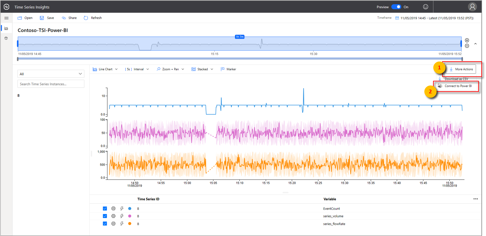](media/how-to-connect-power-bi/time-series-insights-export-option.png#lightbox)

1. Set your parameters inside this tab:

   1. Specify a relative timeframe to view. If you are happy with your existing view, leave this as **Existing timeframe**.
   
   1. Choose between **Aggregated** and **Raw Events**. 
   
       > [!NOTE]
       > You can always aggregate your data later in Power BI, but you cannot revert to raw data after aggregation. 
       
       > [!NOTE]
       > There is a 100-K event count limit for Raw Event level data.

       [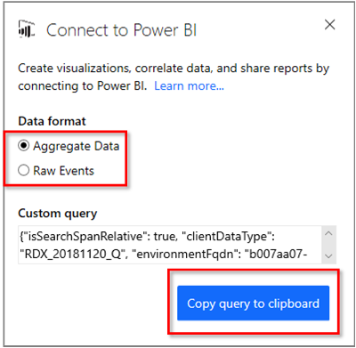](media/how-to-connect-power-bi/connect-to-power-bi.png#lightbox)

   1. If you have not configured your Time Series Insights instance for **Warm Store**, you will receive a warning.

       [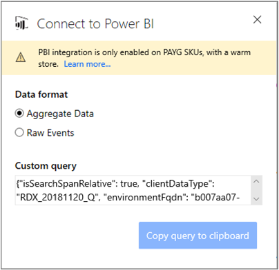](media/how-to-connect-power-bi/connect-to-power-bi-warning.png#lightbox)

       > [!TIP]
       > You may configure your existing instance for **Warm Store** in the Azure portal.

1. Select **Copy query to clipboard**.
1. Now, launch Power BI Desktop.
1. In Power BI Desktop on the **Home** tab, select **Get Data** in the upper left corner, then **More**.

    [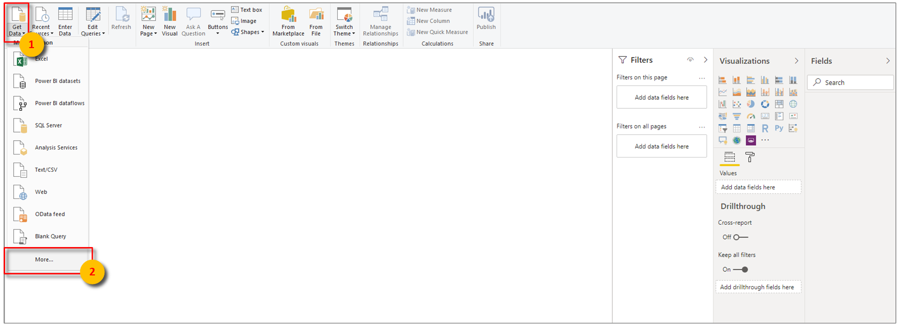](media/how-to-connect-power-bi/power-bi-home-drop-down.png#lightbox)

1. Search for **Time Series Insights**, select **Azure Time Series Insights (Beta)**, then **Connect**.

    [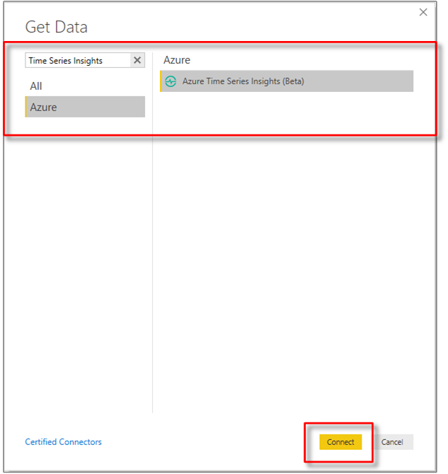](media/how-to-connect-power-bi/connect-to-time-series-insights.png#lightbox)

    Alternatively, navigate to the **Azure** tab, select **Azure Time Series Insights (Beta)**, then **Connect**.
    
1. A message dialogue box will display asking for permission to connect to third-party resources. Select **continue**.

    

1. In the dropdown menu under **Data Source**, choose **Create custom query**. Paste from your clipboard into the optional **Custom Query (optional)** field below, then press **OK**.

    [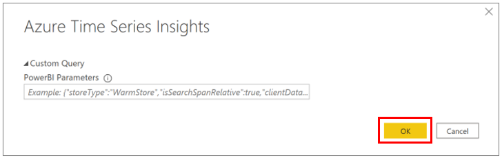](media/how-to-connect-power-bi/custom-query-load.png#lightbox)  

1. The data table will now load. Press **Load** to load into Power BI.

    [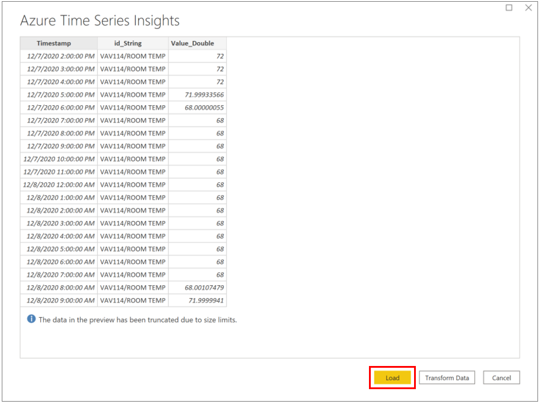](media/how-to-connect-power-bi/review-the-loaded-data-table.png#lightbox)  

If you have completed these steps, skip ahead to the next section.

## Create a report with visuals

Now that you have imported the data into Power BI, it’s time to build a report with visuals.

1. On the left side of the window, make sure you have selected the **Report** view.

    [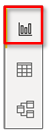](media/how-to-connect-power-bi/select-the-report-view.png#lightbox)

1.	In the **Visualizations** column, select your visual of choice. For example, select **Line chart**. This will add a blank line chart to your canvas.

1.	In the **Fields** list, select **_Timestamp** and drag it to the **Axis** field to display items along the X-axis. Make sure to switch to **_Timestamp** to as the value for the **Axis** (default is **Date Hierarchy**).

    [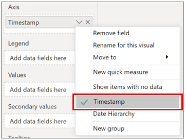](media/how-to-connect-power-bi/select-timestamp.png#lightbox)

1.	Again, in the **Fields** list, select **TimeSeriesId** and drag it to the **Values** field to display items along the Y-axis.

    [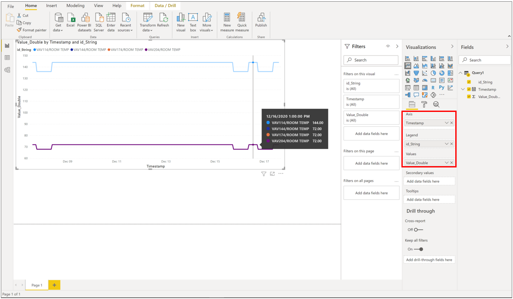](media/how-to-connect-power-bi/power-bi-line-chart.png#lightbox)

1.	To add another chart to your canvas, select anywhere on the canvas outside the line chart and repeat this process.

    [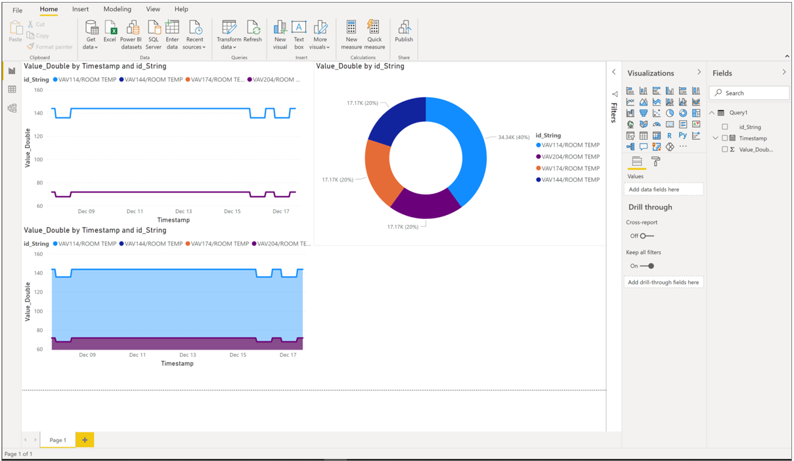](media/how-to-connect-power-bi/power-bi-additional-charts.png#lightbox)

Once you have created your report, you can publish it to Power BI Reporting Services.

## Advanced editing

If you have already loaded a dataset in Power BI but would like to modify the query (such as the date/time or Environment ID parameters), you can do this via Power BI’s Advanced Editor functionality. Refer to the [Power BI documentation](https://docs.microsoft.com/power-bi/desktop-query-overview) to learn more.

As an overview:

1. In Power BI Desktop, select **Edit Queries**.
1. Press **Advanced Editor**.

    [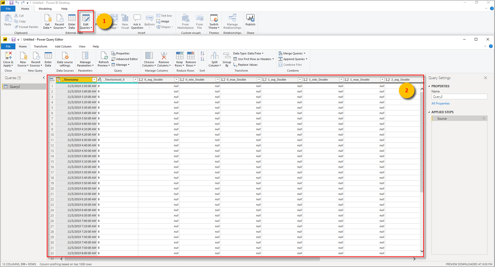](media/how-to-connect-power-bi/power-bi-advanced-query-editing.png#lightbox)

1. Modify the JSON payload as desired.
1. Select **Done** and then **Close & Apply** within the **Power Query Editor Window**.

The interface will now reflect the desired changes you applied.  

## Next Steps

* Read about [Power BI connector concepts](https://docs.microsoft.com/power-bi/desktop-query-overview) for Azure Time Series Insights.

* Learn more about [Power BI desktop](https://docs.microsoft.com/power-bi/desktop-query-overview).

* Read [Time Series Insights GA Explorer](https://docs.microsoft.com/azure/time-series-insights/time-series-quickstart) and [Time Series Insights Preview Explorer](https://docs.microsoft.com/azure/time-series-insights/time-series-insights-update-quickstart).
