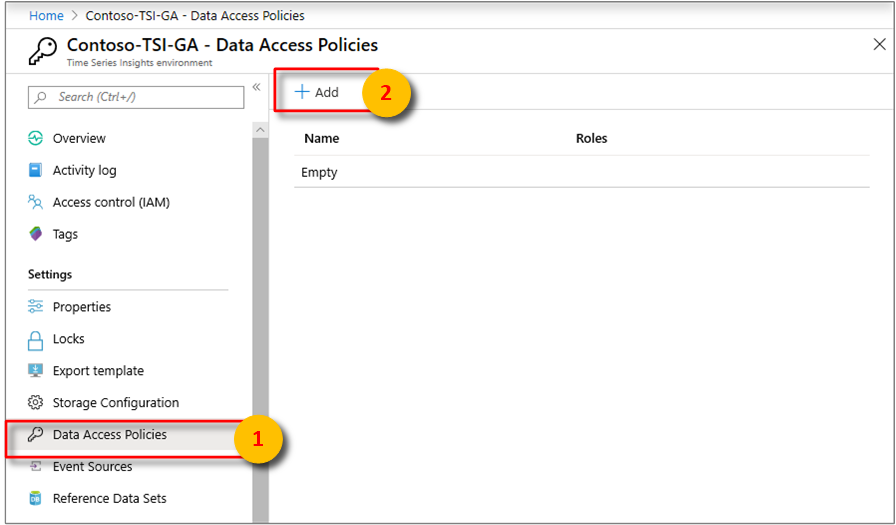
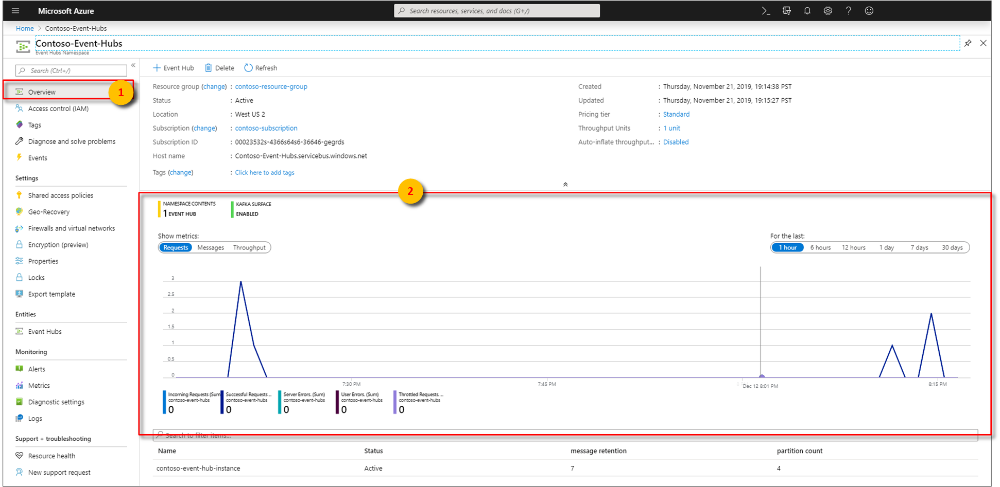
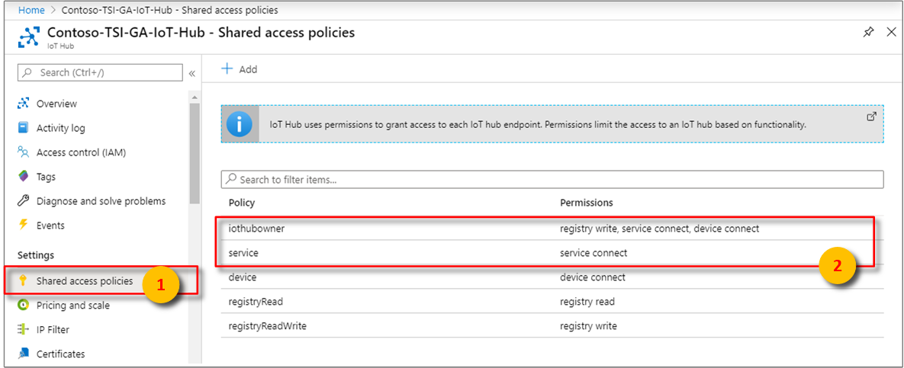
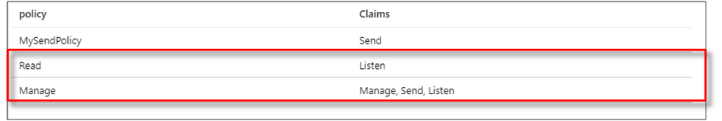
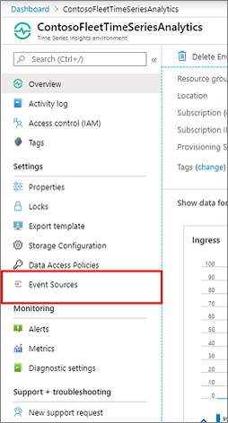
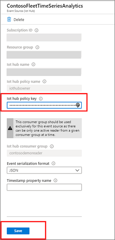
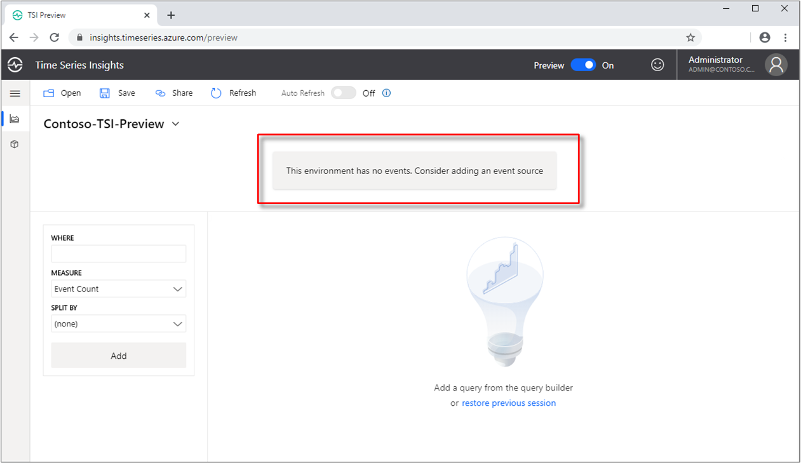
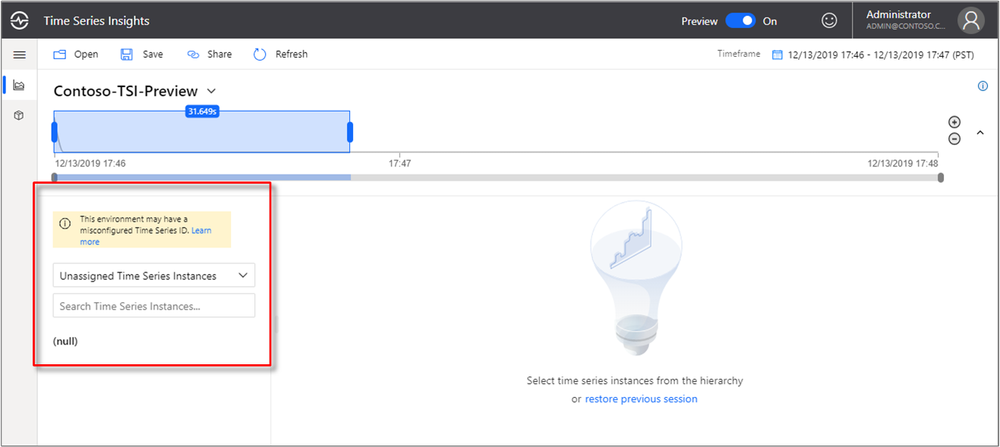

# Diagnose and troubleshoot an Azure Time Series Insights Gen2 environment

[!INCLUDE [retirement](../../includes/tsi-retirement.md)]

This article summarizes several common problems you might encounter when you work with your Azure Time Series Insights Gen2 environment. The article also describes potential causes and solutions for each problem.

## Problem: I can't find my environment in the Gen2 Explorer

This problem might occur if you don't have permissions to access the Time Series Insights environment. Users need a reader-level access role to view their Time Series Insights environment. To verify the current access levels and grant additional access, go to the **Data Access Policies** section on the Time Series Insights resource in the [Azure portal](https://portal.azure.com/).

  

## Problem: No data is seen in the Gen2 Explorer

There are several common reasons why your data might not appear in the [Azure Time Series Insights Gen2 Explorer](https://insights.timeseries.azure.com/preview).

- Your event source might not be receiving data.

    Verify that your event source, which is an event hub or an IoT hub, is receiving data from your tags or instances. To verify, go to the overview page of your resource in the Azure portal.

    

- Your event source data isn't in JSON format.

    Time Series Insights supports only JSON data. For JSON samples, read [Supported JSON shapes](./concepts-json-flattening-escaping-rules.md).

- Your event source key is missing a required permission.

  - For an IoT hub, you need to provide the key that has **service connect** permission.

    

    - Both the policies **iothubowner** and **service** work because they have **service connect** permission.

  - For an event hub, you need to provide the key that has **Listen** permission.

    

    - Both the **Read** and **Manage** policies work because they have **Listen** permission.

- Your consumer group provided isn't exclusive to Time Series Insights.

    During registration of an IoT hub or event hub, you specify the consumer group that's used to read the data. This consumer group must be unique per environment. If the consumer group is shared, the underlying event hub automatically disconnects one of the readers at random. Provide a unique consumer group for Time Series Insights to read from.

- Your Time Series ID property specified at the time of provisioning is incorrect, missing, or null.

    This problem might occur if the Time Series ID property is configured incorrectly at the time of provisioning the environment. For more information, read [Best practices for choosing a Time Series ID](./how-to-select-tsid.md). At this time, you can't update an existing Time Series Insights environment to use a different Time Series ID.

## Problem: Some data shows, but some is missing

You might be sending data without the Time Series ID.

- This problem might occur when you send events without the Time Series ID field in the payload. For more information, read [Supported JSON shapes](./concepts-json-flattening-escaping-rules.md).
- This problem might occur because your environment is being throttled.

    > [!NOTE]
    > At this time, Time Series Insights supports a maximum ingestion rate of 1 Mbps.

## Problem: Data was showing, but now ingestion has stopped

- Your event source key may have been regenerated and your Gen2 environment needs the new event source key.

This problem occurs when the key provided when creating your event source is no longer valid. You would see telemetry in your hub but no Ingress Received Messages in Time Series Insights. If you are unsure whether or not the key was regenerated, you can search your Event Hubs' Activity log for "Create or Update Namespace Authorization Rules" or search "Create or update IotHub Resource" for IoT hub.

To update your Time Series Insights Gen2 environment with the new key open your hub resource in the Azure portal and copy the new key. Navigate to your TSI resource and click on Event Sources.

   

Select the event source(s) that have from which ingestion has stopped, paste in the new key and click Save.

   

## Problem: My event source's Timestamp property name doesn't work

Ensure that the name and value conform to the following rules:

- The Timestamp property name is case sensitive.
- The Timestamp property value that comes from your event source as a JSON string has the format `yyyy-MM-ddTHH:mm:ss.FFFFFFFK`. An example of such a string is `"2008-04-12T12:53Z"`.

The easiest way to ensure that your Timestamp property name is captured and working properly is to use the Time Series Insights Gen2 Explorer. Within the Time Series Insights Gen2 Explorer, use the chart to select a period of time after you provided the Timestamp property name. Right-click the selection, and select the **explore events** option. The first column header is your Timestamp property name. It should have `($ts)` next to the word `Timestamp`, rather than:

- `(abc)`, which indicates that Time Series Insights reads the data values as strings.
- The **calendar** icon, which indicates that Time Series Insights reads the data value as datetime.
- `#`, which indicates that Time Series Insights reads the data values as an integer.

If the Timestamp property isn't explicitly specified, an event's IoT hub or event hub Enqueued Time is used as the default time stamp.

## Problem: I can't view data from my warm store in the Explorer

- You might have provisioned your warm store recently, and data is still flowing in.
- You might have deleted your warm store, in which case you would have lost data.

## Problem: I can't view or edit my Time Series Model

- You might be accessing a Time Series Insights S1 or S2 environment.

   Time Series Models are supported only in pay-as-you-go environments. For more information on how to access your S1 or S2 environment from the Time Series Insights Gen2 Explorer, read [Visualize data in the Explorer](./concepts-ux-panels.md).

   

- You might not have permissions to view and edit the model.

   Users need contributor-level access to edit and view their Time Series Model. To verify the current access levels and grant additional access, go to the **Data Access Policies** section on your Time Series Insights resource in the Azure portal.

## Problem: All my instances in the Gen2 Explorer lack a parent

This problem might occur if your environment doesn't have a Time Series Model hierarchy defined. For more information, read about how to [work with Time Series Models](./time-series-insights-overview.md).

  

## Next steps

- Read about how to [work with Time Series Models](./time-series-insights-overview.md).

- Learn about [supported JSON shapes](./concepts-json-flattening-escaping-rules.md).

- Review [planning and limits](./how-to-plan-your-environment.md) in Azure Time Series Insights Gen2.