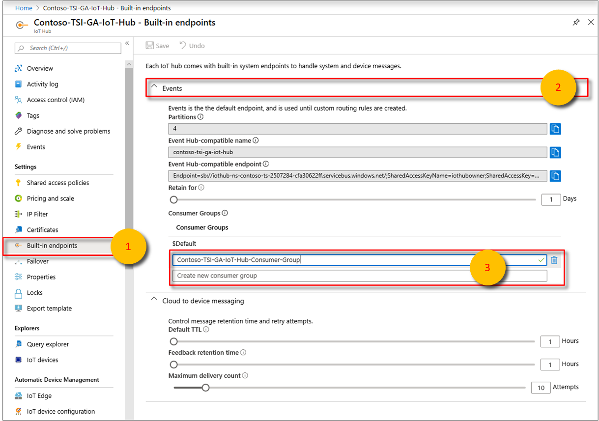
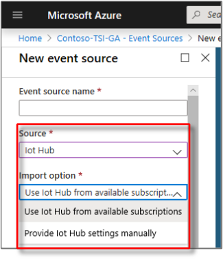
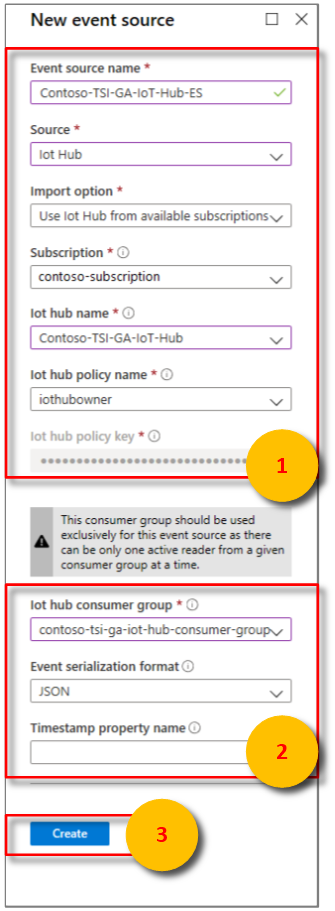

# Add an IoT hub event source to your Azure Time Series Insight environment

[!INCLUDE [retirement](../../includes/tsi-retirement.md)]

This article describes how to use the Azure portal to add an event source that reads data from Azure IoT Hub to your Azure Time Series Insights environment.

> [!NOTE]
> The instructions in this article apply both to Azure Time Series Insights Gen 1 and to Azure Time Series Insight Gen 2 environments.

## Prerequisites

* Create an [Azure Time Series Insights environment](./tutorial-set-up-environment.md).
* Create an [IoT hub by using the Azure portal](../iot-hub/iot-hub-create-through-portal.md).
* The IoT hub must have active message events being sent in.
* Create a dedicated consumer group in the IoT hub for the Azure Time Series Insight environment to consume from. Each Azure Time Series Insight event source must have its own dedicated consumer group that isn't shared with any other consumer. If multiple readers consume events from the same consumer group, all readers are likely to exhibit failures. For details, read the [Azure IoT Hub developer guide](../iot-hub/iot-hub-devguide.md).

### Add a consumer group to your IoT hub

Applications use consumer groups to pull data from Azure IoT Hub. To reliably read data from your IoT hub, provide a dedicated consumer group that's used only by this Azure Time Series Insight environment.

To add a new consumer group to your IoT hub:

1. In the [Azure portal](https://portal.azure.com), find and open your IoT hub.

1. Under **Settings**, select **Built-in Endpoints**, and then select the **Events** endpoint.

   

1. Under **Consumer groups**, enter a unique name for the consumer group. Use this same name in your Azure Time Series Insight environment when you create a new event source.

1. Select **Save**.

## Add a new event source

1. Sign in to the [Azure portal](https://portal.azure.com).

1. In the left menu, select **All resources**. Select your Azure Time Series Insight environment.

1. Under **Settings**, select **Event Sources**, and then select **Add**.

   

1. In the **New event source** pane, for **Event source name**, enter a name that's unique to this Azure Time Series Insight environment. For example, enter **event-stream**.

1. For **Source**, select **IoT Hub**.

1. Select a value for **Import option**:

   * If you already have an IoT hub in one of your subscriptions, select **Use IoT Hub from available subscriptions**. This option is the easiest approach.

     

   * The following table describes the properties that are required for the **Use IoT Hub from available subscriptions** option:

       

       | Property | Description |
       | --- | --- |
       | Subscription | The subscription the desired iot hub belongs to. |
       | IoT hub name | The name of the selected iot hub. |
       | IoT hub policy name | Select the shared access policy. You can find the shared access policy on the IoT hub settings tab. Each shared access policy has a name, permissions that you set, and access keys. The shared access policy for your event source *must* have **service connect** permissions. |
       | IoT hub policy key | The key is prepopulated. |

   * If the IoT hub is external to your subscriptions, or if you want to choose advanced options, select **Provide IoT Hub settings manually**.

      The following table describes the required properties for the **Provide IoT Hub settings manually**:

       | Property | Description |
       | --- | --- |
       | Subscription ID | The subscription the desired iot hub belongs to. |
       | Resource group | The resource group name in which the IoT hub was created. |
       | IoT hub name | The name of your IoT hub. When you created your IoT hub, you entered a name for the IoT hub. |
       | IoT hub policy name | The shared access policy. You can create the shared access policy on the IoT hub settings tab. Each shared access policy has a name, permissions that you set, and access keys. The shared access policy for your event source *must* have **service connect** permissions. |
       | IoT hub policy key | The shared access key that's used to authenticate access to the Azure Service Bus namespace. Enter the primary or secondary key here. |

   * Both options share the following configuration options:

       | Property | Description |
       | --- | --- |
       | IoT hub consumer group | The consumer group that reads events from the IoT hub. We highly recommend that you use a dedicated consumer group for your event source. |
       | Event serialization format | Currently, JSON is the only available serialization format. The event messages must be in this format or no data can be read. |
       | Timestamp property name | To determine this value, you need to understand the message format of the message data that's sent to the IoT hub. This value is the **name** of the specific event property in the message data that you want to use as the event timestamp. The value is case-sensitive. If left blank, the **event enqueue time** in the event source is used as the event timestamp. |

1. Add the dedicated Azure Time Series Insight consumer group name that you added to your IoT hub.

1. Select **Create**.

1. After you create the event source, Azure Time Series Insight automatically starts streaming data to your environment.

## Next steps

* [Define data access policies](./concepts-access-policies.md) to secure the data.

* [Send events](time-series-insights-send-events.md) to the event source.

* Access your environment in the [Azure Time Series Insight Explorer](https://insights.timeseries.azure.com).
