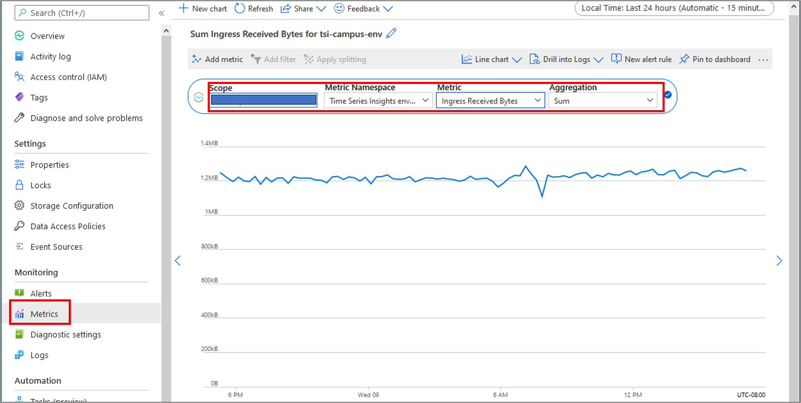

# Monitoring Time Series Insights

[!INCLUDE [retirement](../../includes/tsi-retirement.md)]

When you have critical applications and business processes relying on Azure resources, you want to monitor those resources for their availability, performance, and operation. This article describes the monitoring data generated by Time Series Insights and how you can use the features of Azure Monitor to analyze and alert on this data.

## Monitor overview

The **Overview** page in the Azure portal for each Time Series Insights environment includes a brief view of the resource usage, such as the number of messages received and the number of bytes stored. This information is helpful, however only a small amount of the monitoring data is available from this pane. Some of this data is collected automatically and is available for analysis as soon as you create the resource. You can enable additional types of data collection with some configuration.

## What is Azure Monitor

Time Series Insights creates monitoring data using [Azure Monitor](../azure-monitor/overview.md), which is a full stack monitoring service in Azure that provides a complete set of features to monitor your Azure resources in addition to resources in other clouds and on-premises.

Start with the article [Monitoring Azure resources with Azure Monitor](../azure-monitor/essentials/monitor-azure-resource.md), which describes the following concepts:

- What is Azure Monitor?
- Costs associated with monitoring
- Monitoring data collected in Azure
- Configuring data collection
- Standard tools in Azure for analyzing and alerting on monitoring data

The following sections build on this article by describing the specific data gathered for Azure Time Series Insights. These sections also provide examples for configuring data collection and analyzing this data with Azure tools.

> [!TIP]
> To understand costs associated with Azure Monitor, see [Usage and estimated costs](../azure-monitor//usage-estimated-costs.md). To understand the time it takes for your data to appear in Azure Monitor, see [Log data ingestion time](../azure-monitor/logs/data-ingestion-time.md).

## Monitoring data from Azure Time Series Insights

Azure Time Series Insights collects the same kinds of monitoring data as other Azure resources that are described in [Monitoring data from Azure resources](../azure-monitor/essentials/monitor-azure-resource.md#monitoring-data).

See [Azure Time Series Insights monitoring data reference](how-to-monitor-tsi-reference.md) for a detailed reference of the logs and metrics that you can collect.

## Collection and routing

Platform metrics are collected and stored automatically, but can be routed to other locations by using a diagnostic setting.

Resource Logs are not collected and stored until you create a diagnostic setting and route them to one or more locations.
See [Create diagnostic setting to collect platform logs and metrics in Azure](../azure-monitor/essentials/diagnostic-settings.md) for the detailed process for creating a diagnostic setting using the Azure portal, CLI, or PowerShell. When you create a diagnostic setting, you specify which categories of logs to collect.

You can collect logs from the following categories for Azure Time Series Insights:

   | Category | Description |
   |---|---|
   | Ingress  | The Ingress category tracks errors that occur in the ingress pipeline. This category includes errors that occur when receiving events (such as failures to connect to an Event Source) and processing events (such as errors when parsing an event payload). |

## Analyzing metrics

You can analyze metrics for Azure Time Series Insights, along with metrics from other Azure services, by opening Metrics from the Azure Monitor menu. See [Getting started with Azure Metrics Explorer](../azure-monitor/essentials/metrics-getting-started.md) for details on using this tool.

For a list of the platform metrics collected, see [Monitoring Azure Time Series Insights data reference](how-to-monitor-tsi-reference.md#metrics)

This example shows the count of bytes received from all event sources into your Azure Time Series Insights environment.

**Ingress received bytes** [](media/how-to-monitor-tsi/ingress-received-bytes.png#lightbox)

The example shows the count of bytes successfully processed and available for query in your Azure Time Series Insights environment.

**Ingress stored bytes** [](media/how-to-monitor-tsi/ingress-stored-bytes.png#lightbox)

## Analyzing logs
You can access resource logs either as a blob in a storage account, as event data, or through Log Analytic queries.

Data in Azure Monitor Logs is stored in tables which each table having its own set of unique properties.

All resource logs in Azure Monitor have the same fields followed by service-specific fields. The common schema is outlined in [Azure Monitor resource log schema](../azure-monitor/essentials/resource-logs-schema.md#top-level-common-schema). For a list of the types of resource logs collected for Azure Time Series Insights, see [Azure Time Series Insights monitoring data reference](how-to-monitor-tsi-reference.md#resource-logs).

Azure Time Series Insights stores data in the following tables.

| Table | Description |
|:---|:---|
| TSIIngress | The table that stores data from the Ingress category. The Ingress category tracks errors that occur in the ingress pipeline. This category includes errors that occur when receiving events (such as failures to connect to an Event Source) and processing events (such as errors when parsing an event payload).

To route data to Azure Monitor Logs, you must create a diagnostic setting to send resource logs or platform metrics to a Log Analytics workspace. To learn more, see [Collection and routing](../iot-hub/monitor-iot-hub.md#collection-and-routing).

## Sample Queries

Following are queries that you can use to help you monitor your Azure Time Series Insights environment:

+ Get details on event source connection failures in the last five days:

    ```Kusto
   TSIIngress
   | where OperationName == "Microsoft.TimeSeriesInsights/environments/eventsources/ingress/connect"
   | where _ResourceId contains "<your environment name, event source name, or the full event source resource URL>"
   | where TimeGenerated > ago(5d)

    ```
+ Get details on invalid messages received in the last five days:

    ```Kusto
   TSIIngress
   | where OperationName == "Microsoft.TimeSeriesInsights/environments/eventsources/ingress/deserialize"
   | where _ResourceId contains "<your environment name, event source name, or the full event source resource URL>"
   | where TimeGenerated > ago(5d)

    ```

## Alerts

Azure Monitor alerts proactively notify you when important conditions are found in your monitoring data. They allow you to identify and address issues in your system before your customers notice them. You can set alerts on [metrics](../azure-monitor/alerts/alerts-metric-overview.md), [logs](../azure-monitor/alerts/alerts-unified-log.md), and the [activity log](../azure-monitor/alerts/activity-log-alerts.md). Different types of alerts have benefits and drawbacks.

When creating an alert rule based on platform metrics, be aware that for Time Series Insights platform metrics that are collected in units of count, some aggregations may not be available or usable.

## Next Steps

* See [Azure Time Series Insights monitoring data reference](how-to-monitor-tsi-reference.md) for a reference of the logs and metrics created by Azure Time Series Insights.
* See [Monitoring Azure resources with Azure Monitor](../azure-monitor/essentials/monitor-azure-resource.md) for details on monitoring Azure resources.