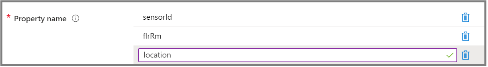

# Best practices for choosing a Time Series ID

[!INCLUDE [retirement](../../includes/tsi-retirement.md)]

This article summarizes the importance of the Time Series ID for your Azure Time Series Insights Gen2 environment, and best practices for choosing one.

## Choose a Time Series ID

Selecting an appropriate Time Series ID is critical. Choosing a Time Series ID is like choosing a partition key for a database. It's required when you create an Azure Time Series Insights Gen2 environment.

Watch the environment provisioning tutorial for a detailed explanation of the Time Series ID. You'll view two different JSON telemetry payload examples and the  correct Time Series ID selection for each.</br>

> [!VIDEO https://www.microsoft.com/en-us/videoplayer/embed/RWzk3P]


> [!IMPORTANT]
> Time Series IDs are:
>
> * A *case-sensitive string* property: letter and character casings are used in searches, comparisons, updates, and when partitioning.
> * An *immutable* property: once created it cannot be changed.

> [!TIP]
> If your event source is an IoT hub, your Time Series ID will likely be ***iothub-connection-device-id***.
> If you plan to use IoT Plug and Play device models or are using them without components, you should include ***dt-subject*** as a part of the composite key in case you need it in the future.

Key best practices to follow include:

* Pick a partition key with many distinct values (for example, hundreds or thousands). In many cases, this might be the device ID, sensor ID, or tag ID in your JSON.
* The Time Series ID should be unique at the leaf node level of your [Time Series Model](./concepts-model-overview.md).
* The character limit for the Time Series ID's property name string is 128. For the Time Series ID's property value, the character limit is 1,024.
* If a unique property value for the Time Series ID is missing, it's treated as a null value and follows the same rule of the uniqueness constraint.
* If your Time Series ID is nested within a complex JSON object be sure to follow the ingress [flattening rules](./concepts-json-flattening-escaping-rules.md) when providing your property name. Check out example [B](concepts-json-flattening-escaping-rules.md#example-b).
* You can also select up to *three* key properties as your Time Series ID. Their combination will be a composite key that represents the Time Series ID.  
  > [!NOTE]
  > Your three key properties must be strings.
  > You would have to query against this composite key instead of one property at a time.

## Select more than one key property

The following scenarios describe selecting more than one key property as your Time Series ID.  

### Example 1: Time Series ID with a unique key

* You have legacy fleets of assets. Each has a unique key.
* One fleet is uniquely identified by the property **deviceId**. For another fleet, the unique property is **objectId**. Neither fleet contains the other fleet's unique property. In this example, you would select two keys, **deviceId** and **objectId**, as unique keys.
* We accept null values, and the lack of a property's presence in the event payload counts as a null value. This is also the appropriate way to handle sending data to two event sources where the data in each event source has a unique Time Series ID.

### Example 2: Time Series ID with a composite key

* You require multiple properties to be unique within the same fleet of assets.
* You're a manufacturer of smart buildings and deploy sensors in every room. In each room, you typically have the same values for **sensorId**. Examples are **sensor1**, **sensor2**, and **sensor3**.
* Your building has overlapping floor and room numbers across sites in the property **flrRm**. These numbers have values such as **1a**, **2b**, and **3a**.
* You have a property, **location**, that contains values such as **Redmond**, **Barcelona**, and **Tokyo**. To create uniqueness, you designate the following three properties as your Time Series ID keys: **sensorId**, **flrRm**, and **location**.

Example raw event:

```JSON
{
  "sensorId": "sensor1",
  "flrRm": "1a",
  "location": "Redmond",
  "temperature": 78
}
```

In the Azure portal, you can then enter the composite key as follows:

[](media/v2-how-to-tsid/configure-environment-key.png#lightbox)

  > [!NOTE]
  > In Azure portal, don't enter comma-separated names of properties in one texbox, otherwise, it will be treated as a single property name that contains commas.
  > Enter each property name in its own texbox.

## Next steps

* Read the [JSON flattening and escaping rules](./concepts-json-flattening-escaping-rules.md) to understand how events will be stored.

* Plan your [Azure Time Series Insights Gen2 environment](./how-to-plan-your-environment.md).
