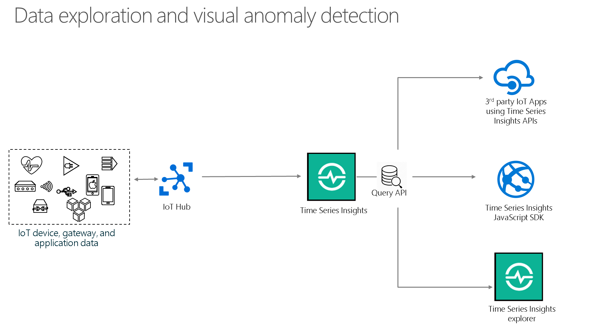
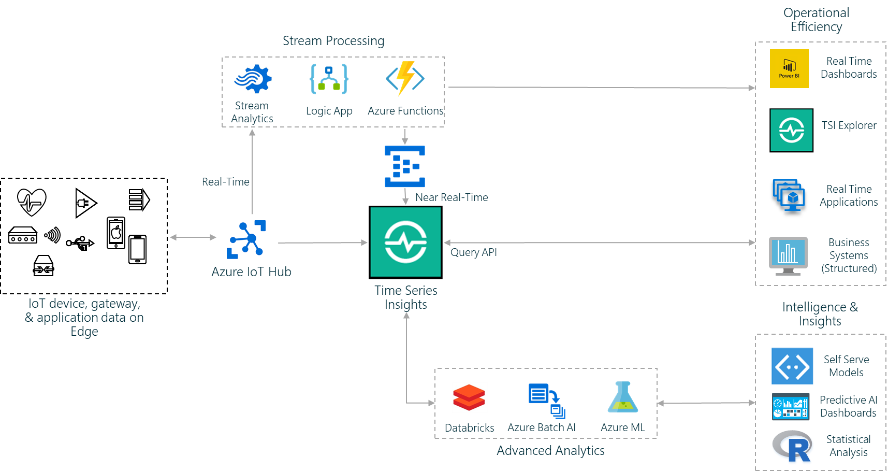
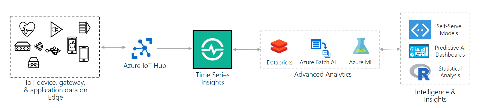

---
title: 'Gen2 use cases - Azure Time Series Insights Gen2 | Microsoft Docs'
description: Learn about Azure Time Series Insights Gen2 use cases.
author: tedvilutis
ms.author: tvilutis
manager: cnovak
ms.reviewer: orspodek
ms.workload: big-data
ms.service: time-series-insights
services: time-series-insights
ms.topic: conceptual
ms.date: 12/16/2020
ms.custom: seodec18
---

# Azure Time Series Insights Gen2 use cases

[!INCLUDE [retirement](../../includes/tsi-retirement.md)]

This article summarizes several common use cases for Azure Time Series Insights Gen2. The recommendations in this article serve as a starting point to develop your applications and solutions with Azure Time Series Insights Gen2.

Specifically, this article answers the following questions:

* What are the common use cases for Azure Time Series Insights Gen2?
* What are the benefits of using Azure Time Series Insights Gen2 for [data exploration and visual anomaly detection](#data-exploration-and-visual-anomaly-detection)?
* What are the benefits of using Azure Time Series Insights Gen2 for [operational analysis and process efficiency](#operational-analysis-and-driving-process-efficiency)?
* What are the benefits of using Azure Time Series Insights Gen2 for [advanced analytics](#advanced-analytics)?

An overview of these use scenarios is described in the following sections.

## Introduction

Azure Time Series Insights Gen2 is an end-to-end, platform-as-a-service offering. It's used to collect, process, store, analyze, and query highly contextualized, time-series-optimized IoT-scale data. It is ideal for ad-hoc data exploration and operational analysis. Azure Time Series Insights Gen2 is a uniquely extensible, customized service offering that meets the broad needs of industrial IoT deployments.

## Data exploration and visual anomaly detection

Instantly explore and analyze billions of events to spot anomalies and discover hidden trends in your data. Azure Time Series Insights Gen2 delivers near real-time performance for your IoT and DevOps analysis workloads.

Most customers agree that the minimal amount of time required to gain insight is one of the standout features of Azure Time Series Insights Gen2:

* Azure Time Series Insights Gen2 requires no upfront data preparation.
* It works fast to connect you to billions of events in your Azure IoT Hub or Azure Event Hubs instances in minutes.
* Once connected, you can visualize and analyze billions of events to spot anomalies and discover hidden trends in your data.

Azure Time Series Insights Gen2 is intuitive and simple to use. You can interact with your data without writing a single line of code. There's also no new language you're required to learn, although Azure Time Series Insights Gen2 provides a granular text-based querying language for advanced users who are familiar with SQL. It also provides select-and-click exploration for novices.

Customers can take advantage of the speed to diagnose asset-related issues quickly. They can perform DevOps analysis to get to the root cause of a bug in an IoT solution. They also can identify areas to flag for further investigation as part of their data science initiatives.

There are three primary ways to interact with data stored in Azure Time Series Insights Gen2:

* The first and easiest way to get started is with the Azure Time Series Insights Gen2 Explorer. You can use it to quickly visualize all of your IoT data in one place. It provides tools like the heat map to help you spot anomalies in your data. It also provides a perspective view. Use it to compare up to four views from one or more Azure Time Series Insights Gen2 environments in a single dashboard. The dashboard gives you a view of your time-series data across all your locations. Learn more about the [Azure Time Series Insights Gen2 Explorer](./concepts-ux-panels.md). To plan out your environment, read [Azure Time Series Insights Gen2 planning](./how-to-plan-your-environment.md).

* The second way to start is to use the JavaScript SDK to quickly embed powerful charts and graphs in your web application. With just a few lines of code, you can author powerful queries. Use them to populate line charts, pie charts, bar charts, heat maps, data grids, and more. All of these elements exist out-of-the-box by using the SDK. The SDK also abstracts Azure Time Series Insights Gen2 query APIs. You can use them to author SQL-like predicates to query the data you want to show on a dashboard. For hybrid presentation-layer solutions, Azure Time Series Insights Gen2 offers parameterized URLs. They provide seamless connection points with the Azure Time Series Insights Gen2 Explorer for deep dives into data.

  * Read about the [JS client library](https://github.com/microsoft/tsiclient/blob/master/docs/API.md) and the [Sample Client](https://github.com/Microsoft/tsiclient) documentation to learn more about the JavaScript SDK.

  * Learn more about sharing URLs and the new UI by reviewing [Visualize data in the Azure Time Series Insights Gen2 Explorer](./concepts-ux-panels.md).

* The third way to start is to use the powerful APIs to query data stored in Azure Time Series Insights Gen2. Azure Time Series Insights Gen2 has temporal operators such as `from`, `to`, `first`, and `last`. It has aggregations and transformations such as `average`, `sum`, `min`, `max`, `time-weighted average`, `time-weighted sum`, etc. It also allows filtering, arithmetic and boolean operators, scalar functions, etc. All these operators enable downstream applications to quickly find interesting trends and patterns in your data. Use them to populate homegrown visualizations to spot anomalies.

## Operational analysis and driving process efficiency

Use Azure Time Series Insights Gen2 to monitor the health, usage, and performance of equipment at scale and measure operational efficiency. Azure Time Series Insights Gen2 helps manage diverse and unpredictable IoT workloads without sacrificing ingestion or query performance.

Streaming and continuous processing of data coming from operational processes can successfully transform any business if it's combined with the right technology or solution. Often these solutions are a combination of multiple systems. They enable exploration and analysis of data that changes constantly, especially in the IoT realm, and share a common pattern.

These patterns often start with IoT-enabled platforms that ingest billions of events from devices and sensors that span various locales. These systems process and analyze streaming data to derive real-time insights and actions. Data is typically archived to warm and cold store for near real-time and batch analytics.

Data that's collected goes through a series of processing to cleanse and contextualize it for downstream querying and analytics scenarios. Azure offers rich services that can be applied to IoT scenarios such as asset maintenance and manufacturing. These services include Azure Time Series Insights Gen2, IoT Hub, Event Hubs, Azure Stream Analytics, Azure Functions, Azure Logic Apps, Azure Databricks, Azure Machine Learning, and Power BI.

Solution architecture can be achieved in the following manner:

* Ingest data via IoT Hub or Event Hubs for best-in-class security, throughput, and latency.
* Perform data processing and computations. Funnel ingested data through services such as Stream Analytics, Logic Apps, and Azure Functions. The service you use depends on the specific data-processing needs.
* Computed signals from the processing pipeline are pushed to Azure Time Series Insights Gen2 for storing and analytics.

Azure Time Series Insights Gen2 offers near real-time data exploration and asset-based insights over historical data. Depending on your business needs, MapReduce and Hive jobs can run on data stored in Azure Time Series Insights Gen2 by connecting Azure Time Series Insights Gen2 to Azure HDInsight. Data stored in Azure Time Series Insights Gen2 is available to Power BI and other customer applications via the Azure Time Series Insights Gen2 public surface query APIs. This data can be used for deep business and operational intelligence scenarios.

## Advanced analytics

Integrate with advanced analytics services such as Machine Learning and Azure Databricks. Azure Time Series Insights Gen2 ingresses raw data from millions of devices. It adds contextual data that can be consumed seamlessly by a suite of Azure analytics services.

Advanced analytics and machine learning consume and process large volumes of data. This data is used to make data-driven decisions and perform predictive analysis. In IoT use cases, advanced analytics algorithms learn from the data collected from millions of devices. These devices transmit data multiple times every second. The data collected from IoT devices is raw. It lacks contextual information such as the location of the device and the unit of the sensor reading. As a result, raw data is difficult to consume directly for advanced analytics.

Azure Time Series Insights Gen2 bridges the gap between IoT data and advanced analytics in two simple and cost-effective ways:

* First, Azure Time Series Insights Gen2 collects raw telemetry data from millions of devices by using IoT Hub. It enriches data with contextual information and transforms data into a parquet format. This format can easily integrate with other advanced analytics services, such as Machine Learning, Azure Databricks, and third-party applications.

    Azure Time Series Insights Gen2 can serve as the source of truth for all data across an organization. It creates a central repository for downstream analytics workloads to consume. Because Azure Time Series Insights Gen2 is a near real-time storage service, advanced analytics models can learn continuously from incoming IoT telemetry data. As a result, the models can make more accurate predictions.

* Second, the output of machine learning and prediction models can be fed into Azure Time Series Insights Gen2 to visualize and store their results. This procedure helps organizations to optimize and tweak their models. Azure Time Series Insights Gen2 makes it simple to visualize streaming telemetry data on the same plane as the trained model outputs. In this way, it helps data science teams spot anomalies and identify patterns.

## Next steps

* Learn more about the [Azure Time Series Insights Gen2 Explorer](./concepts-ux-panels.md).
* Read [Azure Time Series Insights Gen2 best practices](./how-to-plan-your-environment.md) to plan out your environment.
* Read the [Sample Client](https://github.com/Microsoft/tsiclient) documentation.
