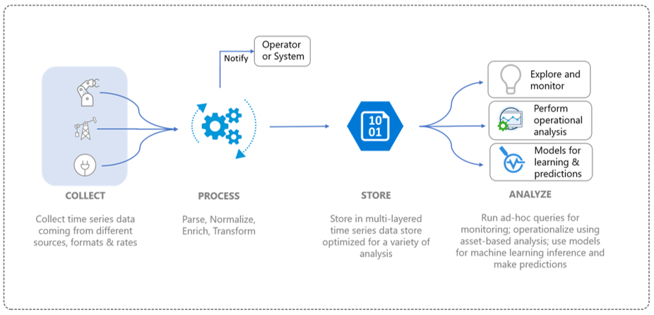
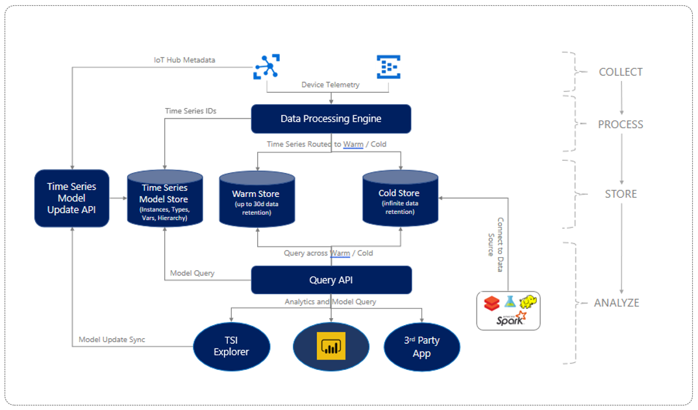

# What is Azure Time Series Insights Gen2

[!INCLUDE [retirement](../../includes/tsi-retirement.md)]

Azure Time Series Insights Gen2 is an open and scalable end-to-end IoT analytics service featuring best-in-class user experiences and rich APIs to integrate its powerful capabilities into your existing workflow or application.

You can use it to collect, process, store, query and visualize data at Internet of Things (IoT) scale--data that's highly contextualized and optimized for time series.

Azure Time Series Insights Gen2 is designed for ad hoc data exploration and operational analysis allowing you to uncover hidden trends, spotting anomalies, and conduct root-cause analysis. It's an open and flexible offering that meets the broad needs of industrial IoT deployments.

## Video

Learn more about Azure Time Series Insights Gen2.

> [!VIDEO https://learn.microsoft.com/Shows/Internet-of-Things-Show/Using-Azure-Time-Series-Insights-to-create-an-Industrial-IoT-analytics-platform/player]

## Definition of IoT data

Industrial IoT data in asset-intensive organizations often lacks structural consistency due to the varied nature of devices and sensors in an industrial setting. Data from these streams are characterized by significant gaps, and sometimes corrupted messages, and false readings. IoT data is often meaningful in the context of additional data inputs that come from first-party or third sources, such as CRM or ERP that add context for end-to-end workflows. Inputs from third-party data sources such as weather data can help augment telemetry streams in a given installation.

All this implies, only a fraction of the data gets used for operational and business purposes, and analysis requires contextualization. Industrial data is often historicized for in-depth analysis over longer time spans to understand and correlate trends. Turning collected IoT data into actionable insights requires:

* Data processing to clean, filter, interpolate, transform, and prepare data for analysis.
* A structure to navigate through and understand the data, that is, to normalize and contextualize the data.
* Cost-effective storage for long or infinite retention of processed (or derived) data and raw data.

Such data provides consistent, comprehensive, current, and correct information for business analysis and reporting.

The following image shows a typical IoT data flow.

## Azure Time Series Insights Gen2 for industrial IoT

The IoT landscape is diverse with customers spanning a variety of industry segments including manufacturing, automotive, energy, utilities, smart buildings, and consulting. Across this broad range of industrial IoT market, cloud-native solutions that provide comprehensive analytics targeted at large-scale IoT data are still evolving.

Azure Time Series Insights Gen2 addresses this market need by providing a turnkey, end-to-end IoT analytics solution with rich semantic modeling for contextualization of time series data, asset-based insights, and best-in-class user experience for discovery, trending, anomaly detection and operational intelligence.

A rich operational analytics platform combined with our interactive data exploration capabilities, you can use Azure Time Series Insights Gen2 to derive more value out of data collected from IoT assets. The Gen2 offering supports:

* Multi-layered storage solution with warm and cold analytics support providing customers the option to route data between warm and cold for interactive analytics over warm data as well as operational intelligence over decades of historical data.

  * A highly interactive warm analytics solution to perform frequent, and large number of queries over shorter time span data
  * A scalable, performant, and cost optimized time series data lake based on Azure Storage allowing customers to trend years' worth of time series data in seconds.

* Semantic model support that describes the domain and metadata associated with the derived and raw signals from assets and devices.

* Flexible analytics platform to store historical time series data in customer-owned Azure Storage account, thereby allowing customers to have ownership of their IoT data. Data is stored in open source Apache Parquet format that enables connectivity and interop across a variety of data scenarios including predictive analytics, machine learning, and other custom computations done using familiar technologies including Spark and Databricks.

* Rich analytics with enhanced query APIs and user experience that combines asset-based data insights with rich, ad hoc data analytics with support for interpolation, scalar and aggregate functions, categorical variables, scatter plots, and time shifting time series signals for in-depth analysis.

* Enterprise grade platform to support the scale, performance, security, and reliability needs of our enterprise IoT customers.

* Extensibility and integration support for end-to-end analytics. Azure Time Series Insights Gen2 provides an extensible analytics platform for a variety of data scenarios. Power BI connector enables customers to take the queries they do in Azure Time Series Insights Gen2 directly into Power BI to get unified view of their BI and time series analytics in a single pane of glass.

The following diagram shows the high-level data flow.

  

Azure Time Series Insights Gen2 provides a scalable pay-as-you-go pricing model for data processing, storage (data and metadata), and query, enabling customers to tune their usage to suit their business demands.

With the introduction of these key industrial IoT capabilities, Azure Time Series Insights Gen2 also provides the following key benefits:  

| Capability | Benefit |
| ---| ---|
| Multilayered storage for IoT-scale time series data | With a shared data processing pipeline for ingesting data, you can ingest data into both warm and cold stores. Use warm store for interactive queries and cold store for storing large volumes of data. To learn more about how to take advantage of high-performing asset-based queries, see [queries](./concepts-query-overview.md). |
| Time Series Model to contextualize raw telemetry and derive asset-based insights | You can use the time series model to create instances, hierarchies, types, and variables for your time series data. To learn more about Time Series Model, see [Time Series Model](./concepts-model-overview.md).  |
| Smooth and continuous integration with other data solutions | Data in Azure Time Series Insights Gen2 cold store is [stored](./concepts-storage.md) in open-source Apache Parquet files. This enables data integration with other data solutions, 1st or 3rd party, for scenarios that include business intelligence, advanced machine learning, and predictive analytics. |
| Near real-time data exploration | The [Azure Time Series Insights Gen2 Explorer](./concepts-ux-panels.md) user experience provides visualization for all data streaming through the ingestion pipeline. After you connect an event source, you can view, explore, and query event data. In this way, you can validate whether a device emits data as expected. You also can monitor an IoT asset for health, productivity, and overall effectiveness. |
| Extensibility and integration | The Power BI Connector integration is available directly in the Time Series Explorer user experience through the **Export** option, allowing customers to export the time series queries they create in our user experience directly into the Power BI desktop and view their time series charts alongside other BI analytics. This opens the door to a new class of scenarios for industrial IoT enterprises who have invested in Power BI by providing a single pane of glass over analytics from various data sources including IoT time series. |
| Custom applications built on the Azure Time Series Insights Gen2 platform | Azure Time Series Insights Gen2 supports the [JavaScript SDK](https://github.com/microsoft/tsiclient/blob/master/docs/API.md). The SDK provides rich controls and simplified access to queries. Use the SDK to build custom IoT applications on top of Azure Time Series Insights Gen2 to suit your business needs. You also can use the Azure Time Series Insights Gen2 [Query APIs](./concepts-query-overview.md) directly to drive data into custom IoT applications. |

## Region availability

Visit the [Azure Global Infrastructure products by region](https://azure.microsoft.com/global-infrastructure/services/?products=time-series-insights) page to learn where Azure Time Series Insights is available.

Azure Time Series Insights resides in a single region. However, it does store/process customer data outside the region the customer deploys the service instance in, except for the following regions where data is not replicated outside of the region:

* East Asia
* Southeast Asia
*	Australia Southeast
*	West Europe
*	UK South
*	West US
*	France Central
*	Canada Central

## Next steps

Get started with Azure Time Series Insights Gen2:

> [!div class="nextstepaction"]
> [Quickstart guide](./quickstart-explore-tsi.md)

Learn about use cases:

> [!div class="nextstepaction"]
> [Azure Time Series Insights Gen2 use cases](./overview-use-cases.md)
