# Quickstart: Explore the Azure Time Series Insights Gen2 demo environment

[!INCLUDE [retirement](../../includes/tsi-retirement.md)]

This quickstart gets you started with an Azure Time Series Insights Gen2 environment. In the free demo, you tour key features that have been added to Azure Time Series Insights Gen2.

The Azure Time Series Insights Gen2 demo environment contains a scenario company, Contoso, that operates two wind turbine farms. Each farm has 10 turbines. Each turbine has 20 sensors that report data every minute to Azure IoT Hub. The sensors gather information about weather conditions, blade pitch, and yaw position. Information about generator performance, gearbox behavior, and safety monitors also is recorded.

In this quickstart, you learn how to use Azure Time Series Insights Gen2 to find actionable insights in Contoso data. You also conduct a short root cause analysis to better predict critical failures and to perform maintenance.

> [!IMPORTANT]
> Create a [free Azure account](https://azure.microsoft.com/free/?ref=microsoft.com&utm_source=microsoft.com&utm_medium=docs&utm_campaign=visualstudio) if you don't have one.

## Explore the Azure Time Series Insights Gen2 Explorer in a demo environment

The Azure Time Series Insights Gen2 Explorer demonstrates historical data and root cause analysis. To get started:

1. Go to the [Contoso Wind Farm demo](https://insights.timeseries.azure.com/preview/samples) environment.

1. If you're prompted, sign in to the Azure Time Series Insights Gen2 Explorer by using your Azure account credentials.

## Work with historical data

1. Select **Contoso WindFarm Hierarchy**.

   [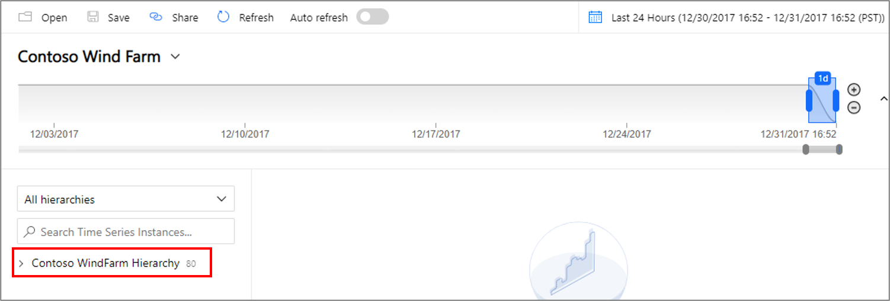](media/quickstart-explore/quick-start-contoso-1.png#lightbox)

1. In **Contoso Plant 1**, look at wind turbine **W7**.

   

   1. Change the view range to **1/1/17 20:00:00.00 to 3/10/17 20:00:00.00 (UTC)**.

      [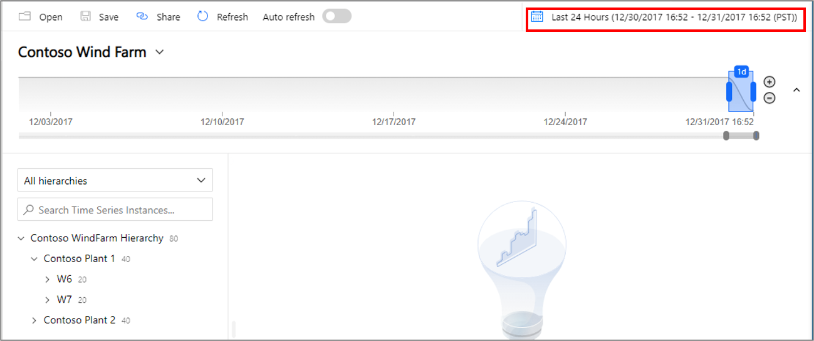](media/quickstart-explore/range-setting-1.png#lightbox)

      [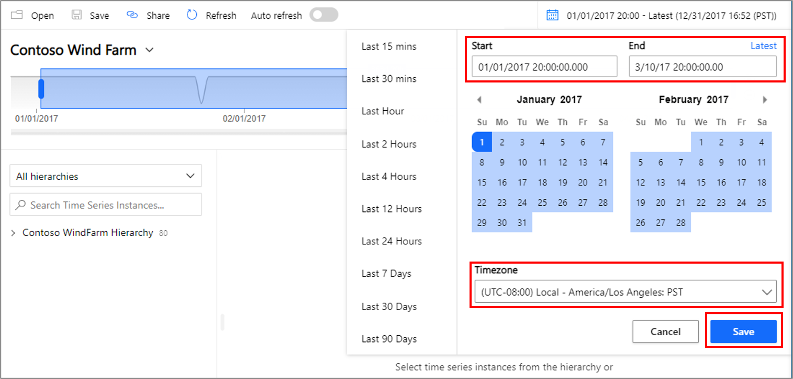](media/quickstart-explore/range-setting-2.png#lightbox)

   1. Adjust the range view using the zoom in **(+)** and out **(-)** and moving the slide bar.

      [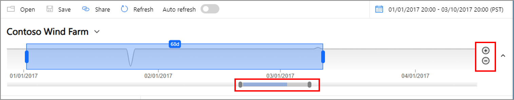](media/quickstart-explore/view-range-setting.png#lightbox)

   1. To select a sensor, select **Contoso Plant 1** > **W7** > **Generator System** > **GeneratorSpeed**. Then, review the values that are shown.

      [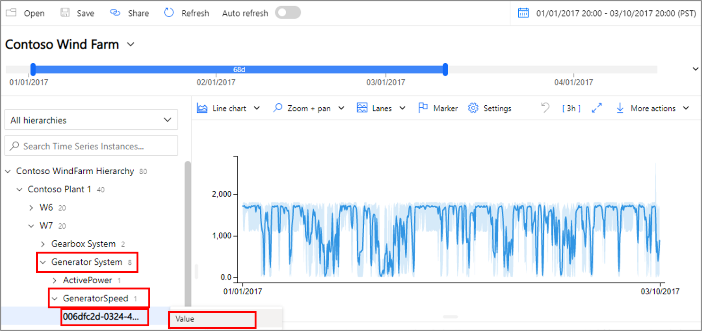](media/quickstart-explore/quick-start-generator-speed-1.png#lightbox)

1. Recently, Contoso found a fire in wind turbine **W7**. Opinions vary about what caused the fire. In Azure Time Series Insights Gen2, the fire alert sensor that was activated during the fire is displayed.

   1. Change the view range to **3/9/17 20:00:00.00 to 3/10/17 20:00:00.00 (UTC)**.
   1. Select **Safety System** > **FireAlert**.

      [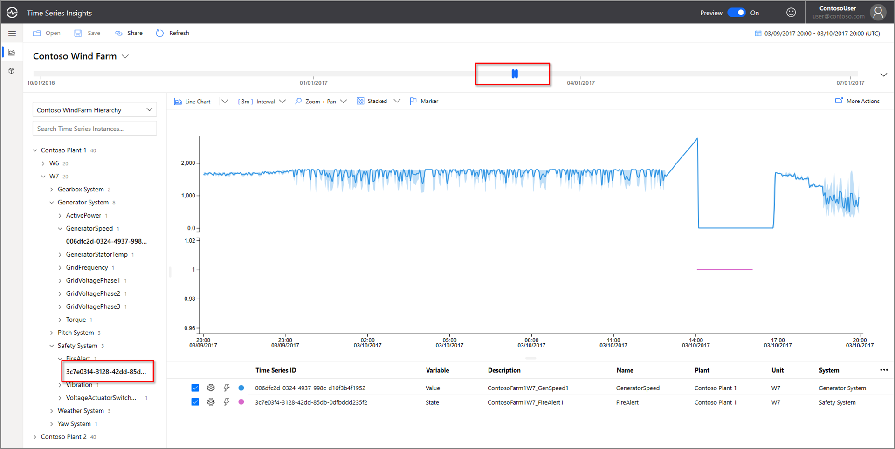](media/v2-update-quickstart/quick-start-fire-alert.png#lightbox)

1. Review other events around the time of the fire to understand what occurred. Oil pressure and active warnings spiked just before the fire.

   1. Select **Pitch System** > **HydraulicOilPressure**.
   1. Select **Pitch System** > **ActiveWarning**.

      

1. The oil pressure and active warning sensors spiked right before the fire. Expand the displayed time series to review other signs that were evident leading up to the fire. Both sensors fluctuated consistently over time. The fluctuations indicate a persistent and worrisome pattern.

    * Change the view range to **2/24/17 20:00:00.00 to 3/10/17 20:00:00.00 (UTC)**.

      

1. Examining two years of historical data reveals another fire event that had the same sensor fluctuations.

    * Change the view range to **1/1/16 to 12/31/17** (all data).

      [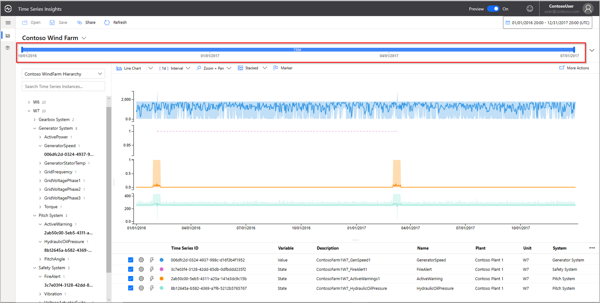](media/v2-update-quickstart/quick-start-expand-view-range.png#lightbox)

By using Azure Time Series Insights Gen2 and sensor telemetry, we've discovered a long-term trend hidden in the historical data. With these new insights, we can:

* Explain what actually occurred.
* Correct the problem.
* Put better alert notification systems in place.

## Root cause analysis

1. Some scenarios require sophisticated analysis to uncover clues in data. Select the windmill **W6** on date **6/25**.

    1. Change the view range to **6/1/17 20:00:00.00 to 7/1/17 20:00:00.00 (UTC)**.
    1. Select **Contoso Plant 1** > **W6** > **Safety System** > **VoltageActuatorSwitchWarning**.

       [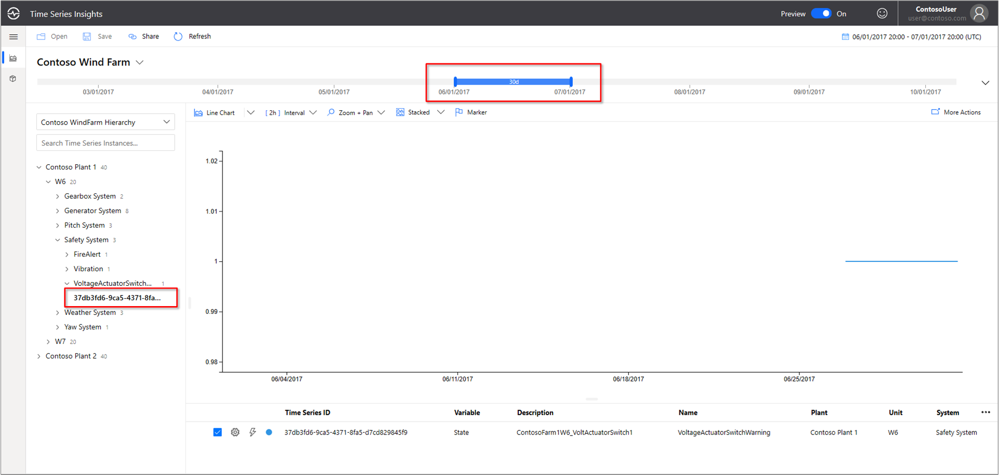](media/v2-update-quickstart/quick-start-voltage-switch-warning.png#lightbox)

1. The warning indicates an issue with the voltage from the generator. The overall power output of the generator is within normal parameters in the current interval. By increasing our interval, another pattern emerges. A drop-off is evident.

    1. Remove the **VoltageActuatorSwitchWarning** sensor.
    1. Select **Generator System** > **ActivePower**.
    1. Change the interval to **3d**.

       [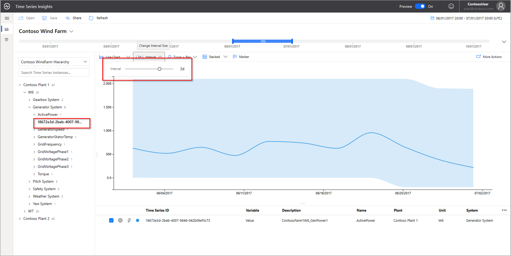](media/v2-update-quickstart/quick-start-interval-change.png#lightbox)

1. By expanding the time range, we can determine whether the issue has stopped or whether it continues.

    * Extend the time span to 60 days.

      

1. Other sensor data points can be added to provide greater context. The more sensors we view, the fuller our understanding of the problem is. Let's drop a marker to display the actual values.

    1. Select **Generator System**, and then select three sensors: **GridVoltagePhase1**, **GridVoltagePhase2**, and **GridVoltagePhase3**.
    1. Drop a marker on the last data point in the visible area.

       [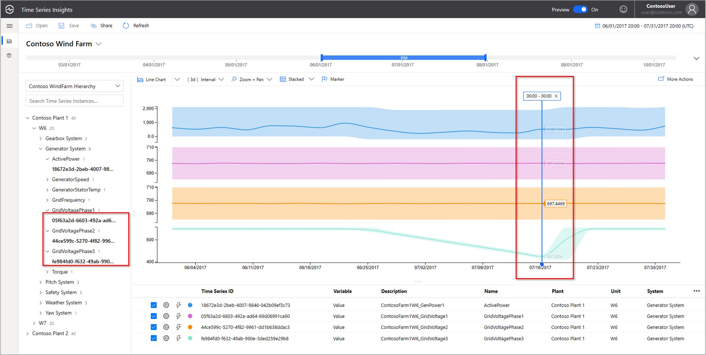](media/v2-update-quickstart/quick-start-drop-marker.png#lightbox)

    Two of the voltage sensors are operating comparably and within normal parameters. It looks like the **GridVoltagePhase3** sensor is the culprit.

1. With highly contextual data added, the phase 3 drop-off appears even more to be the problem. Now, we have a good lead on the cause of the warning. We're ready to refer the issue to our maintenance team.

    * Change the display to overlay all **Generator System** sensors on the same chart scale.

      [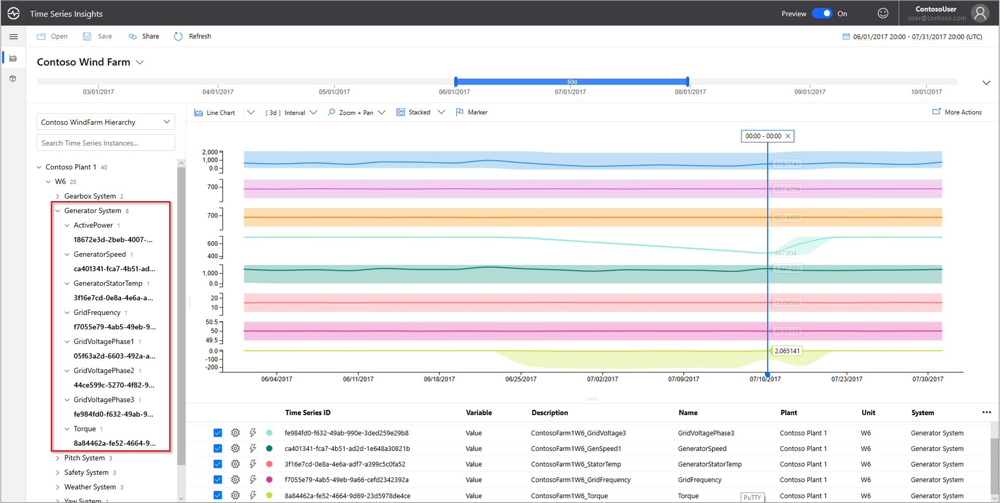](media/v2-update-quickstart/quick-start-generator-system.png#lightbox)

## Next steps

You're ready to create your own Azure Time Series Insights Gen2 environment. To start:

> [!div class="nextstepaction"]
> [Plan your Azure Time Series Insights Gen2 environment](./how-to-plan-your-environment.md)

Learn to use the demo and its features:

> [!div class="nextstepaction"]
> [The Azure Time Series Insights Gen2 Explorer](./concepts-ux-panels.md)
